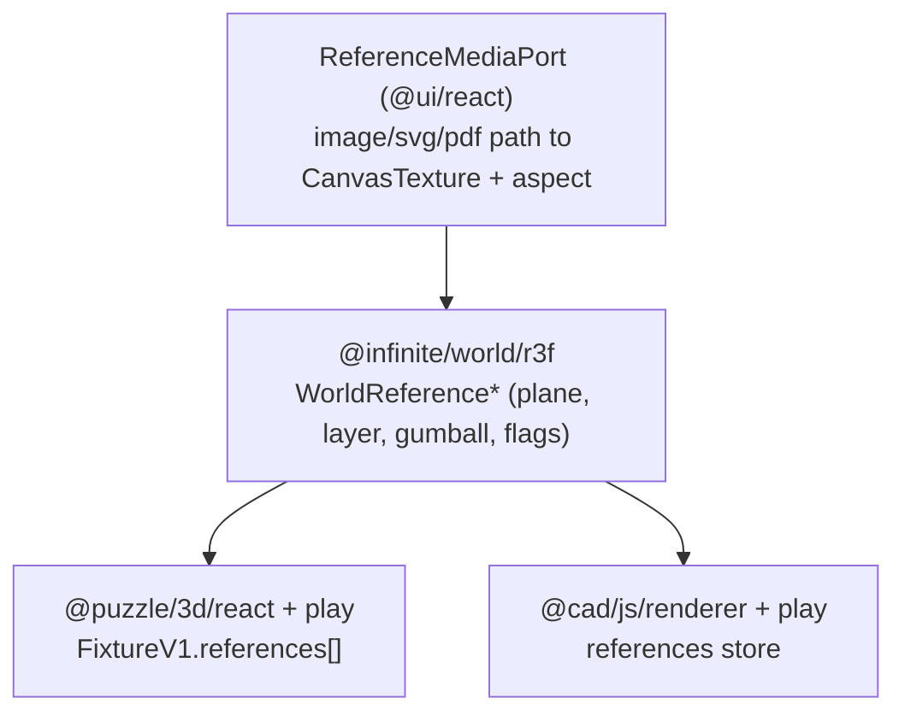

# Infinite World: 2D References on the Grid

## Goal

A reference is a flat, textured plane sitting on (and movable above) the world grid, sourced from a file **path** (png/jpg/webp, svg, pdf). It supports select, move, resize (scale with aspect lock), rotate, lock, hide — reusing the existing shared world primitives. Ship it as one shared `@infinite/world/r3f` feature consumed by both `@puzzle/3d/react` and `@cad/js/renderer`.

## Architecture

Key existing hooks to reuse (no reinvention):

- Shared transform: `UnifiedGumball` / `GumballConfig` in [ui/react/index.tsx](ui/react/index.tsx) (move/rotate/scale, snap).
- Hide/lock: `WorldEntityFlags`, `worldEntitySelectable`, `worldEntityRenderMode` in [infinite/world/r3f/index.tsx](infinite/world/r3f/index.tsx) (lines 66-113).
- Layering: `WorldLayer` / `WorldLayerStack` ([infinite/world/r3f/index.tsx](infinite/world/r3f/index.tsx) lines 990-1013).
- Grid-plane placement: `puzzle3dClientToGridPlaneCad` (puzzle) and `GroundPickPlane` (cad).
- All three.js access goes through `sceneHostPort` ([ui/react/index.tsx](ui/react/index.tsx) lines 134-214) — must not import three directly.

## 1. Media loading port (external libs behind interface)

Per repo rule "external libraries behind an interface", add a `ReferenceMediaPort` in [ui/react/index.tsx](ui/react/index.tsx) (new `#region 🖼️ReferenceMedia` near `sceneHostPort`):

- `loadReferenceTexture(source): Promise<{ texture: Texture; width: number; height: number }>` where `source = { url: string; mediaKind: "image" | "svg" | "pdf"; page?: number }`.
- Wiring (default `referenceMediaPort`):
  - `image`: `new THREE.TextureLoader()` (from `sceneHostPort.three`), read `image.naturalWidth/Height` for aspect.
  - `svg`: load via `Image` + draw to an offscreen `<canvas>` at a target raster size, wrap in `THREE.CanvasTexture` (vector rasterized; keeps it simple and uniform with pdf).
  - `pdf`: add `pdfjs-dist` dependency to `@ui/react` only, render the requested page to a canvas, wrap in `THREE.CanvasTexture`. pdf.js worker configured once behind the port.
- Mime/kind inference helper `referenceMediaKindFromUrl(url)` (extension based).

## 2. Shared world primitive (`@infinite/world/r3f`)

New `#region 🖼️Reference` in [infinite/world/r3f/index.tsx](infinite/world/r3f/index.tsx):

- Types: `WorldReferenceSource`, `WorldReferenceProps extends WorldEntityFlags` = `{ id; source; origin: Vec3; orientation?: Quat; scale?: number | Vec3; widthWorld?: number; opacity?; relocate?; relocateActive?; selected?; hovered?; revealed? }`.
- `WorldReferencePlane`: a `<group>` at CAD pose containing a plane `Mesh` whose geometry aspect = intrinsic width/height from the port; `MeshBasicMaterial` (unlit, `transparent`, `depthWrite=false`, double-sided) with the loaded texture; default size derived from `widthWorld`. Lays flat on the grid (XY plane, Z-up) by default. Renders through `worldEntityRenderMode` (hidden → not drawn unless revealed; locked → dimmed via `WORLD_LOCKED_OPACITY_SCALE`).
- Pointer pick handlers calling injected `onSelect(id)`; suppressed when not `worldEntitySelectable`.
- `WorldReferenceGumball`: thin wrapper over `UnifiedGumball` targeting the plane group; emits `onTransform(id, pose)`; mounts only when selected + selectable + relocate active (mirrors puzzle's `ObjectTransformControls`). Resize = gumball scale (uniform default for aspect lock).
- `WorldReferenceLayer`: maps `WorldReferenceProps[]` → planes, optionally wrapped with chunk streaming for far placement.
- Export pure pose helper `applyWorldReferenceTransform(ref, pose)` for hosts to persist results.

## 3. Puzzle 3d integration

In [puzzle/3d/react/index.tsx](puzzle/3d/react/index.tsx):

- Extend `FixtureV1` (line ~1228) with `references: WorldReferenceProps[]` (default `[]`); update `parseFixtureV1` / encode, plus `updatePuzzle3dReferenceInFixture`, `applyReferenceRelocateToFixture`, `addReferenceToFixture`.
- Add a `WorldLayer` (e.g. `order` below objects) in the `Inner` scene core rendering `WorldReferenceLayer`, wired to registry selection/hover and `onRelocate`.
- Reference picking + marquee participate via the existing registry; flags toggles reuse `updatePuzzle3dObjectInFixture`-style path.

In [puzzle/3d/play/index.ts](puzzle/3d/play/index.ts):

- Add an "Import reference" command (file path/picker) + drop support that places at grid-plane hit using `puzzle3dClientToGridPlaneCad`.
- Hierarchy tree: a "References" group with per-item hidden/locked toggles (reuse `toggleEntityFlag` path) and select.
- Register toolbar entries in `launch.json`-driven play UI following existing grouping.

In [framework/product/playground/renderer/react/index.tsx](framework/product/playground/renderer/react/index.tsx): extend the puzzle3d drop handler to also resolve reference-file drops to `addReferenceToFixture`.

## 4. CAD integration

In [cad/js/renderer/index.tsx](cad/js/renderer/index.tsx):

- Add `cad.references` `WorldLayer` (order between grid and ground-pick, ~5) inside `InteractionSpatialView` rendering `WorldReferenceLayer`.
- References stored in a renderer-host references collection (CAD model is geometry-only); persisted in the CAD play shell state and `.model.json` fixture sidecar `references[]`. Per-entity hide/lock reuse `worldEntitySelectable` filtering already used for pick targets ([cad/js/renderer/index.tsx](cad/js/renderer/index.tsx) lines 680-687).
- Selection + gumball: reference picks feed the host selection; `WorldReferenceGumball` commits pose back to the references store.

In [cad/js/renderer/play/index.tsx](cad/js/renderer/play/index.tsx): add import-reference command, hierarchy "References" group with hidden/locked toggles (mirror `toggleHierarchyEntityFlag`), and toolbar registration.

## 5. Asset serving + fixtures (for testing)

- The test files are [infinite/fixture/sketch.png](infinite/fixture/sketch.png) and [infinite/fixture/site.pdf](infinite/fixture/site.pdf). Add a Vite static alias (mirroring [ui/styling/vite-elements-assets.ts](ui/styling/vite-elements-assets.ts)) so `infinite/fixture/*` is served to the puzzle/cad play dev servers, and reference them by served URL + `page` for the pdf.
- Add a reference entry to one puzzle 3d fixture (e.g. [puzzle/3d/fixture/concrete-forest.3d.json](puzzle/3d/fixture/concrete-forest.3d.json)) and one CAD play fixture pointing at the png and pdf so both render on load.

## 6. Verification

- `bun nx run @ui/react:test`, `@infinite/world/r3f:test`, `@puzzle/3d/react:test`, `@cad/js/renderer:test` (extend existing test files only — no new test files: parse/encode round-trip of `references`, `worldEntitySelectable`/render-mode for references, `applyWorldReferenceTransform`, `referenceMediaKindFromUrl`).
- Run puzzle 3d and CAD play; confirm at runtime (with temporary `[DEBUG]` logs) that png + pdf render on the grid, and move/resize/rotate/lock/hide all work, including grid snap.

## Notes / conventions

- Work inside a new repo ticket (`ticket_open`, slug e.g. `INFINITE-WORLD-2D-REFERENCES`), associated with the most appropriate goal from `repo://goals`; temp files/logs live in the ticket folder.
- Structure all new code with `#region`/subregions; concise code, emoji-prefixed docstrings; no comments inside definitions; no direct external-lib imports (pdf.js only behind the port).

