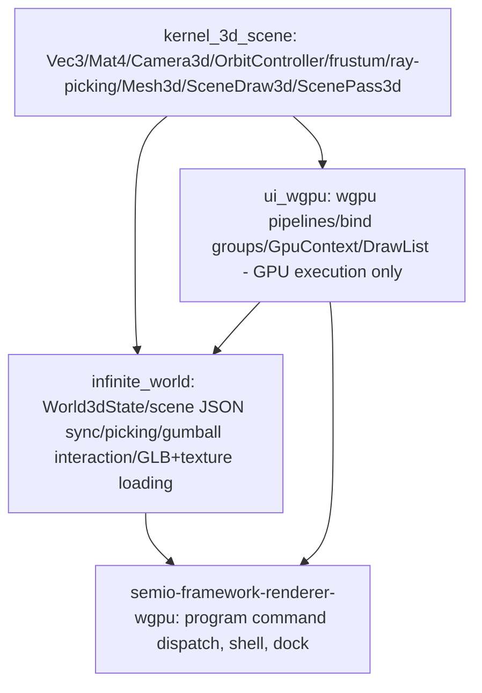

## 1. Fix the two WebGPU validation errors

These are pre-existing bugs, not caused by the gumball work, but block "works end to end":

- `**engine_canvas_target` missing `STORAGE_BINDING**`: [framework/renderer/wgpu/rs/engine_canvas.rs](framework/renderer/wgpu/rs/engine_canvas.rs) `create_target_texture()` (~~line 174-191) and the post-render replacement texture in `render_vello_scene()` (~~216-228) create the texture with `RENDER_ATTACHMENT | TEXTURE_BINDING` only. Vello's `render_to_texture` requires `STORAGE_BINDING` (per `vello::Renderer::render_to_texture` docs). Add `wgpu::TextureUsages::STORAGE_BINDING` to both texture descriptors. This is hit by any program embedding a node-graph or text-editor via Vello (e.g. `dag`), not by world3d.
- `**ui_pipeline` depth mismatch on `ui_raster_pass**`: [ui/wgpu/rs/draw.rs](ui/wgpu/rs/draw.rs) `ui_pipeline` is created (~~1039-1083) with `depth_stencil: overlay_depth_state` (Depth24Plus), but the `ui_raster_pass` render pass (~~1887-1912) is opened with `depth_stencil_attachment: None`. Fix by giving `ui_raster_pass` a depth-stencil attachment referencing the existing `depth_view` with `LoadOperation::Load` (matching the always-true/no-write `overlay_depth_state`), so its attachment state matches `ui_pipeline`. Triggered whenever `push_raster_quad` is used (dag/text-editor embeds, `"raster"` scenes) - unrelated to gumball.

## 2. Extract `kernel/3d/scene` - generic 3D math + draw descriptors

Create a new sibling kernel crate next to `kernel_3d_mesh`/`kernel_3d_brepkit`, following the exact `kernel/3d/mesh` layout convention:

- `kernel/3d/scene/AGENTS.md` - one-line purpose doc.
- `kernel/3d/scene/script.ts` + `kernel/3d/scene/project.json` (nx target `@kernel/3d-scene`, `cargo test -p kernel_3d_scene`), copied from [kernel/3d/mesh/script.ts](kernel/3d/mesh/script.ts) / [kernel/3d/mesh/project.json](kernel/3d/mesh/project.json).
- `kernel/3d/scene/rs/Cargo.toml` (crate `kernel_3d_scene`, deps: none beyond std - it's pure math/data, same as `kernel_3d_mesh`).
- `kernel/3d/scene/rs/lib.rs` - move the **entire current contents** of [ui/wgpu/rs/scene3d.rs](ui/wgpu/rs/scene3d.rs) verbatim (including its unit tests, e.g. the `concrete_forest_`\* frustum regression tests): `Vec3`, `Mat4`, `Camera3d`, `OrbitController`, `FrustumPlane`/`frustum_planes`/`aabb_intersects_frustum`, `ray_aabb_slab`, `ray_pick_instance` (+private `ray_triangle`), `transform_aabb`, `project_point`, `point_in_polygon`, `rect_contains`, `projected_aabb_bounds`, `screen_select_instances`, `Mesh3d`, `Instance3d`, `SceneDraw3d`, `ScenePass3d`, `LineVertex3d`, `LineDraw3d`, `TexturedInstance3d`, `TexturedDraw3d`.
- Also fold in the pure 3D-math gumball helpers currently in [framework/renderer/wgpu/rs/world3d.rs](framework/renderer/wgpu/rs/world3d.rs) since they are generic math with no scene-state dependency: `ray_plane_point`, `gumball_axis_drag_plane_normal`, `gumball_project_ray_onto_axis`, `ray_segment_distance`, `quat_from_basis`, `rotate_vector`, `axis_rotate_angle`, `gumball_eye`, `gumball_extent`, `vec3_from_f64`.
- Register `"kernel/3d/scene/rs"` as a workspace member in root [Cargo.toml](Cargo.toml).
- Delete `ui/wgpu/rs/scene3d.rs`; remove `pub mod scene3d;` from [ui/wgpu/rs/lib.rs](ui/wgpu/rs/lib.rs); add `kernel_3d_scene = { path = "../../../kernel/3d/scene/rs" }` to [ui/wgpu/rs/Cargo.toml](ui/wgpu/rs/Cargo.toml); change the `pub use scene3d::{...}` block (lines 24-29) to `pub use kernel_3d_scene::{...}` (explicit re-export per the "reexport explicitly if the client needs it" rule, so `ui_wgpu::Mesh3d` etc. keep working for `draw.rs`/`gpu.rs` without deep import churn).
- Update the GPU-side consumers inside `ui/wgpu/rs/draw.rs` and `ui/wgpu/rs/gpu.rs` (mesh upload, `push_scene_pass`, world/line/translucent/textured pipelines) to import scene types from `kernel_3d_scene` (via the crate's own re-export or directly) - these stay GPU/wgpu-specific and remain in `ui_wgpu`.

## 3. Extract `infinite/world/rs` - the 3D canvas/world engine

Create a new Rust crate under `infinite/world/`, mirroring `infinite/cavas/rs` (which has no separate script.ts/project.json of its own - it's a pure path-dependency consumed by `framework/renderer/wgpu`):

- `infinite/world/rs/Cargo.toml` (crate `infinite_world`), deps: `kernel_3d_scene = { path = "../../../kernel/3d/scene/rs" }`, `ui_wgpu = { path = "../../../ui/wgpu/rs" }`, `semio-framework-core = { path = "../../../framework/core/rs" }`, `serde`, `serde_json`, plus the wasm32 `web-sys`/`wasm-bindgen`/`js-sys` fetch deps that the GLB/reference-image loading code needs (mirroring current `framework/renderer/wgpu/rs/Cargo.toml` wasm32 deps).
- `infinite/world/rs/lib.rs` - move the **entire current contents** of [framework/renderer/wgpu/rs/world3d.rs](framework/renderer/wgpu/rs/world3d.rs) except the pure-math gumball helpers moved to step 2: `World3dState` + impl, all `World*Record` JSON structs, `GumballHandle`, `sync_world3d_state`, `store_mesh`, `parse_color`, `preview_scale`, `mesh_id_from_url`, `ingest_glb_mesh`, `apply_glb_bytes`, `apply_reference_image_bytes`, `collect_pending_glb_fetches`, `fetch_pending_glb_meshes`, `fetch_pending_reference_images`, `fetch_url_bytes`, all picking/selection/gumball-interaction functions (`pick_gumball_handle_at`, `pick_instance_at`, `pick_vortex_at`, `pick_hover_command`, `pick_select_command`, `marquee_select_command`, `ground_plane_pick`, `object_world_position`, `update_dragged_instance_position`, `selection_centroid`, `start_gumball_drag`, `gumball_drag_update`, `apply_gumball_preview`, `reset_gumball_preview`), `handle_world3d_pointer_move/button/drag`, `handle_world3d_wheel`, `world3d_hit_target`, `render_world_3d`, `append_gumball_geometry`, `append_box_wireframe`, `orbit_camera_command`, `gumball_commit_command`, `PendingGlbFetch`.
- Update its `use` block to pull math/draw types from `kernel_3d_scene` (`Vec3`, `Mat4`, `Camera3d`, `OrbitController`, `Mesh3d`, `Instance3d`, `SceneDraw3d`, `ScenePass3d`, `LineDraw3d`, `LineVertex3d`, `TexturedDraw3d`, `TexturedInstance3d`, `frustum_planes`, `aabb_intersects_frustum`, `ray_aabb_slab`, `ray_pick_instance`, `screen_select_instances`, `transform_aabb`, plus the gumball math fns) and GPU/UI types from `ui_wgpu` (`draw_text`, `mesh_content_version`, `HitKind`, `HitTarget`, `PointerModifiers`, `Rect`, `Rgba`, `GpuContext`).
- Register `"infinite/world/rs"` as a workspace member in root [Cargo.toml](Cargo.toml).
- Delete `framework/renderer/wgpu/rs/world3d.rs`.

## 4. Rewire `framework/renderer/wgpu` to consume `infinite_world`

- [framework/renderer/wgpu/rs/Cargo.toml](framework/renderer/wgpu/rs/Cargo.toml): remove nothing from `ui_wgpu`/`infinite_cavas` (still used elsewhere), add `infinite_world = { path = "../../../../infinite/world/rs" }`.
- [framework/renderer/wgpu/rs/lib.rs](framework/renderer/wgpu/rs/lib.rs): remove `pub mod world3d;` (line 9); update all `world3d::...` call sites (pointer wheel/button/drag/move handling, `collect_pending_glb_fetches`, `fetch_url_bytes`, `apply_glb_bytes`) to `infinite_world::...`.
- [framework/renderer/wgpu/rs/shell.rs](framework/renderer/wgpu/rs/shell.rs): change `use crate::world3d::{...}` to `use infinite_world::{...}`.
- [framework/renderer/wgpu/rs/scenes.rs](framework/renderer/wgpu/rs/scenes.rs): change `use crate::world3d::{render_world_3d, World3dState};` to `use infinite_world::{render_world_3d, World3dState};`.
- [framework/renderer/wgpu/rs/interpreter.rs](framework/renderer/wgpu/rs/interpreter.rs): change `crate::world3d::World3dState` reference to `infinite_world::World3dState`.

## 5. Verify end to end

- `cargo test -p kernel_3d_scene`, `cargo test -p infinite_world`, `cargo test -p ui_wgpu`, `cargo test -p semio-framework-renderer-wgpu` (or workspace-wide) - confirm all moved tests (including the `concrete_forest_*` frustum regression tests) still pass from their new locations.
- Rebuild WASM (`bun ./framework/renderer/wgpu/script.ts wasm`).
- Re-run `bun ./.repo/🎫/26/07/04/WGPU-PLAYGROUND-E2E/verify-wgpu-playgrounds-e2e.ts --programs puzzle3d,puzzle5d,lowpoly,procedural3d,cad,shooting` and confirm all six pass (including re-investigating the earlier `procedural3d` screenshot timeout).
- Manually load a program that triggers the Vello/raster path (e.g. `dag`) in the dev browser and confirm the two WebGPU validation errors no longer appear in the console.

## Architecture after this change

[{"id":"fix-webgpu-errors","content":"Fix engine_canvas_target STORAGE_BINDING usage and ui_raster_pass depth-attachment mismatch"},{"id":"create-kernel-3d-scene","content":"Create kernel/3d/scene crate (AGENTS.md, script.ts, project.json, Cargo.toml) and move scene3d.rs math/draw-descriptor content plus gumball math helpers into it"},{"id":"rewire-ui-wgpu","content":"Delete ui/wgpu/rs/scene3d.rs, depend on kernel_3d_scene, update lib.rs re-exports and draw.rs/gpu.rs imports"},{"id":"create-infinite-world","content":"Create infinite/world/rs crate and move World3dState/sync/picking/gumball-interaction/render orchestration out of framework world3d.rs"},{"id":"rewire-framework-renderer","content":"Delete framework/renderer/wgpu/rs/world3d.rs, add infinite_world dependency, update lib.rs/shell.rs/scenes.rs/interpreter.rs call sites"},{"id":"update-workspace-cargo","content":"Register kernel/3d/scene/rs and infinite/world/rs as workspace members in root Cargo.toml"},{"id":"verify-e2e","content":"Run cargo tests for all touched crates, rebuild wasm, rerun 6-program e2e suite, manually confirm WebGPU console errors are gone"}]
