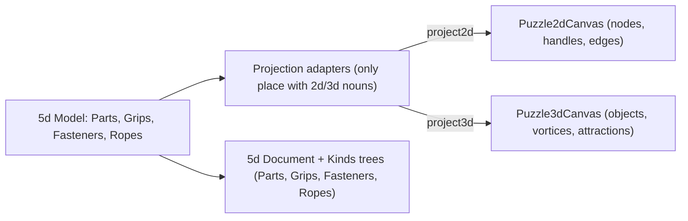

# 5d Terminology Decoupling

## Naming (from `puzzle/AGENTS.md` and `puzzle/5d/AGENTS.md`)

- Instances: `Part`, `Grip`, `Fastener`, `Rope` — kinds: `PartKind`, `GripKind`, `FastenerKind`, `RopeKind` (kind catalogs already use these).
- `2d`/`3d` remain only as dimension labels (like the existing `camera2d`/`camera3d` and `PresentationMode = "2d" | "3d"`), never as borrowed nouns (no node/handle/edge/wire/object/vortex/attraction/cable in 5d).

## Ticket

Reopen `2026/05/30/PUZZLE-BUNDLE-TERMINOLOGY-CLEANUP` (same task; it already holds `migrate-5d-keys.ts`) after listing `repo://goals`.

## 1. Model rename — [puzzle/5d/react/index.tsx](puzzle/5d/react/index.tsx)

- `AnchorV1` -> `GripV1`, `PartV1.anchors` -> `grips`, `anchorKind` -> `gripKind`; `TieV1` -> `FastenerV1`, `V1.ties` -> `fasteners`, `tieKind` -> `fastenerKind`.
- Aspect keys `puzzle2d`/`puzzle3d` -> `"2d"`/`"3d"`; aspect types `NodeAspect` -> `Part2dAspect`, `Puzzle3dPartAspect` -> `Part3dAspect`, `Puzzle2dAnchorAspect` -> `Grip2dAspect`, `Puzzle3dAnchorAspect` -> `Grip3dAspect`.
- Ids: `anchorFullId`/`parseAnchorFullId`/`PUZZLE_5D_ANCHOR_ID_SEPARATOR` -> `gripFullId`/`parseGripFullId`/`PUZZLE_5D_GRIP_ID_SEPARATOR`.
- Hover: `Puzzle5dKindHoverDomain` and `Puzzle5dHoverInstance` become `"part" | "grip" | "fastener"`; the `From2d/To2d/From3d/To3d` mappers stay as the translation boundary.
- Selection/connect: `SelectionSnapshot.anchorIds` -> `gripIds`; `ConnectSession.sourceAnchor` -> `sourceGrip`, `ringAnchorIds` -> `ringGripIds`.
- Store: `applyTie` -> `applyFastener`; `applyNodeMove(s)` -> `applyPart2dMove(s)`; `applyFlatNodeCenters` -> `applyPart2dCenters`; `apply3dRelocate` -> `applyPart3dRelocate`.
- `KindCompatEntry.specificity` restricted to `"general" | "part" | "grip" | "fastener" | "rope"`; 2d/3d words translated in the adapters (greenfield: `parseV1` reads only the new keys, no fallbacks).
- `compose5d`, `project2d`, `project3d`, `project2dKindCatalogs`, `project3dKindCatalogs`, `normalizeKindCatalogBundle` stay in the Adapters/KindMeta regions as the only code speaking 2d/3d nouns.
- Update the in-file vitest blocks (`compose5d`, `Store applyTie`, `project2d`, …).

## 2. Native trees — [puzzle/5d/play/index.ts](puzzle/5d/play/index.ts)

- Replace the stitched document (currently delegates to `buildPuzzle2dPlayDocumentSections` + `buildPuzzle3dPlayDocumentTree`, producing "2d · Nodes"/"3d · Objects" sections) with a native build from the 5d model: sections **Parts** (part rows with nested grip rows) and **Fasteners**, ids `puzzle-5d-play-document.part.`_ / `.grip._`/`.fastener.\*`.
- Handlers `Puzzle5dPlayDocumentSelectHandlers` -> `onSelectPart` / `onSelectGrip` / `onSelectFastener` (driving the unified store selection, which already syncs both canvases).
- Replace `buildPuzzle5dPlayKindsTree` 2d+3d duplication with native sections **Parts, Grips, Fasteners, Ropes** from the 5d `KindCatalogBundle`; part rows carry both 2d and 3d drag payloads (built via the projections) so one row drags onto either canvas — `puzzle5dFixturePaletteTreeDragController` keeps routing by payload schema.
- `Puzzle5dPlaySnapshot` exposes the 5d `model` + unified selection for tree building; `fixture2d`/`fixture3d` remain internal canvas projections.
- Update in-file tests ("puzzle 5d play document", fixtures).

## 3. Consumers

- [framework/product/playground/renderer/react/index.tsx](framework/product/playground/renderer/react/index.tsx) `Puzzle5dPlayHost` region: new document handlers (~~line 2870) and `store.setSelection({ partIds: [], gripIds: [] })` (~~line 2520).
- [framework/product/platform/renderer/react/index.tsx](framework/product/platform/renderer/react/index.tsx): `compose5d` call site unaffected; verify compile.

## 4. Fixtures — [puzzle/5d/fixture](puzzle/5d/fixture)

- One-off transform script inside the ticket folder rewrites both `.5d.json` files in place: `anchors` -> `grips`, `anchorKind` -> `gripKind`, `ties` -> `fasteners`, `tieKind` -> `fastenerKind`, `puzzle2d` -> `2d`, `puzzle3d` -> `3d`, `specificity` `handle`/`vortex` -> `grip`. Script stays in the ticket folder.

## 5. Verify

- Run vitest for `@semio-tech/puzzle-5d-react`, `@semio-tech/puzzle-5d-play`, and the two framework renderer packages via nx.
- Boot the 5d play app (`@semio-tech/puzzle-5d-play:dev`) and confirm via `[DEBUG]` console logs that document/kinds trees, selection, hover, connect, and palette drag work on both canvases; remove the debug logs after confirmation.
