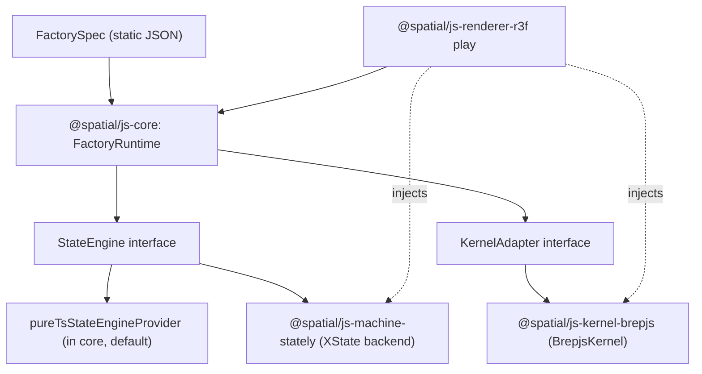

# Abstract State Engine

The architecture in [.repo/✍️/spatial.md](.repo/✍️/spatial.md) requires both the BREP kernel and the state engine to live behind interfaces. The kernel side is correct (`KernelAdapter` in core + `BrepjsKernel` in `kernel-brepjs`). The state engine side is not: core's `FactoryRuntime` is hard-wired to an inline `StatechartRuntime`, and [spatial/js/machine-stately/index.ts](spatial/js/machine-stately/index.ts) is empty.

## Architecture target



Both `Stately` and `Brepjs` must be replaceable; core depends on neither.

## 1. Add `StateEngine` abstraction in [spatial/js/core/index.ts](spatial/js/core/index.ts)

In a new `🎭StateEngine` region, just before `🏭Factory`:

- Export `StateEngineSendResult = { ok: boolean; transient?: boolean }`.
- Export interface `StateEngine` mirroring the public surface of the current inline runner: `getState(): string`, `getContext(): Record<string, unknown>`, `reset(): void`, `restore(state, context): void`, `send(event: FactoryEvent, kernel?: KernelAdapter): Promise<StateEngineSendResult>`.
- Export interface `StateEngineProvider { create(spec: FactorySpec): StateEngine; readonly id: string }`.
- Export the existing private helpers `applyActionAsync`, `expandMachineTransitions`, `evalGuard` (already exported), and a new `applyTransition(spec, state, context, event, kernel?)` so external backends share guard/action semantics without duplicating box-geometry operations.
- Rename the existing class `StatechartRuntime` → keep name but make it `implements StateEngine`, and ship `pureTsStateEngineProvider: StateEngineProvider` (id `"pure-ts"`) that returns `new StatechartRuntime(spec)`. This preserves zero-dep default behaviour.

## 2. Make `FactoryRuntime` engine-agnostic

In the `🏭Factory` region of [spatial/js/core/index.ts](spatial/js/core/index.ts):

- Extend `FactoryRuntimeOptions` with `readonly stateEngine?: StateEngineProvider`.
- In `FactoryRuntime`'s constructor, replace `this.sm = new StatechartRuntime(spec)` with `this.sm = (opts.stateEngine ?? pureTsStateEngineProvider).create(spec)` typed as `StateEngine`.
- Replace internal `StatechartRuntime` field type with `StateEngine`. All call sites (`send`, `undo`, `cancel`, `commit`, `getSnapshot`) already use the public methods, so no behaviour change.

## 3. Implement [spatial/js/machine-stately/index.ts](spatial/js/machine-stately/index.ts) (currently empty)

- Add `package.json` mirroring [spatial/js/kernel-brepjs/package.json](spatial/js/kernel-brepjs/package.json): name `@spatial/js-machine-stately`, deps `@spatial/js-core: workspace:*` and `xstate: ^5`. Add `project.json`, `tsconfig.json`, `vitest.config.ts`, `script.ts` mirroring the kernel package layout.
- Implement `StatelyStateEngine implements StateEngine`:
  - In its constructor, build an XState 5 machine config from `FactorySpec.machine` by walking states + transitions. Each transition becomes an XState transition with `target`, `guard` (a single named XState guard `"factoryGuard:<name>"` whose implementation calls core's `evalGuard`), and an `actions` entry that delegates to a single XState action `"factoryActions"` carrying the `ActionSpec[]` payload.
  - Use `setup({ guards, actions }).createMachine(config)` then `createActor` (XState 5 API). Run actor synchronously: `actor.start()`.
  - The single `factoryActions` implementation calls core's exported `applyActionAsync` for each action sequentially, mutating an internal `context: Record<string, unknown>` object (XState's context is just a thin pointer to it; we keep the source of truth in JS like the pure-TS engine to keep snapshot semantics identical and to support `restore`).
  - `send(event, kernel)` resolves transitions by re-using core's `expandMachineTransitions`+`evalGuard`+`applyActionAsync` pipeline _before_ forwarding `actor.send` (so we control async ordering identical to pure-TS), then advances the actor to the resolved target via `actor.send({ type: event.kind, ...payload })`. Returning `{ ok, transient }` matches the contract.
  - `getState()` reads the actor snapshot's `value`. `getContext()` returns the JS-owned context. `restore(state, context)` rebuilds a fresh actor seeded with `{ snapshot: <state-with-context> }` (XState 5 supports `createActor(machine, { snapshot })`).
- Export `statelyStateEngineProvider: StateEngineProvider` (id `"xstate-stately"`).
- Tests in the same file (per workspace rule: no extra test files): run the box fixture against both `pureTsStateEngineProvider` and `statelyStateEngineProvider`; assert identical state/context/snapshot trajectory and identical kernel `createBoxFromCorners` call.

## 4. Wire both concrete implementations in [spatial/js/renderer-r3f/play/main.tsx](spatial/js/renderer-r3f/play/main.tsx)

In `PlaySession`:

- Import `statelyStateEngineProvider` from `@spatial/js-machine-stately`.
- Pass it to `createFactoryRuntime`:

```tsx
const rt = useMemo<FactoryRuntime>(
 () =>
  createFactoryRuntime(spec, {
   kernel,
   document: documentModel,
   stateEngine: statelyStateEngineProvider,
  }),
 [spec, kernel, documentModel],
);
```

This guarantees the play app exercises `BrepjsKernel` + `StatelyStateEngine` end-to-end. Add `@spatial/js-machine-stately` to [spatial/js/renderer-r3f/package.json](spatial/js/renderer-r3f/package.json) deps.

## 5. Cross-cutting

- Add `@spatial/js-machine-stately` to the workspace package list / root [spatial/js/package.json](spatial/js/package.json).
- Update the core's `🧪Tests` region with a parity test (`pure-ts` vs `stately` providers produce identical `FactorySnapshot.state` and `context` after the canonical box sequence). Per workspace rules this goes into the existing test region — no new test files.
- Run `bun nx run-many -t test` for `@spatial/js-core`, `@spatial/js-kernel-brepjs`, `@spatial/js-machine-stately`, then load the play app to confirm runtime behaviour with `[DEBUG]` logs (already present on `snapshot`).

## What stays unchanged

- All factory JSON specs ([spatial/fixture/\*.factory.json](spatial/fixtures)).
- `KernelAdapter`, `BrepjsKernel`, `DerivedViewService`, document/history APIs.
- `FactoryRuntime` public surface (only options gain an optional field).
