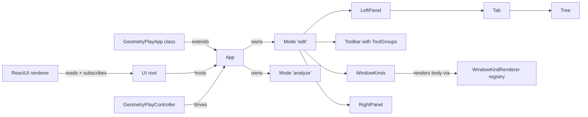

## Goals

- A single framework-free `UI` class hierarchy with **no DOM and no react/lucide/golden-layout imports** (purely TS classes + types + a tiny observer base).
- One renderer `ReactUI` that knows how to render any `UI` instance.
- All user interactions flow through controller classes (no inline closures in config). Controllers expose imperative methods; the UI subscribes to controller state changes.
- Bundles (geometry play, etc.) become pure classes that extend `App`, register `Mode`s, `WindowKind`s, `Panel`s, `Tab`s, `Toolbar`s — no React in the bundle source.
- Icons are string ids (e.g. `"move-3d"`) resolved by the renderer's icon registry.
- Old `AppConfig` / `AppModeConfig` / `PureAppDefinition` / `AppSource` / `resolveAppConfig` are removed; nothing in the repo references them after this ticket.

## Architecture




### New module: `elements/client/lib/ui/`

One file per layer, all framework-free. Re-exported from `elements/client/lib/ui/index.ts`.

- `Observable<T>` — minimal subscribe/emit base (no rxjs).
- `class UI` — root. Holds `apps: App[]`, `activeAppId`, `panelVisibility`, `history`, `theme`. Methods: `addApp`, `activateApp`, `navigate`, `goBack/Forward/Up`.
- `class App` — id, label, iconId, modes, defaultModeId, activeMode, windowKinds, panels (left/right), footerItems, findItems, searchItems. Methods: `addMode`, `activateMode`, `addWindowKind`. `resolveActive(): ResolvedAppState` returns the merged snapshot (replacing `resolveAppConfig`).
- `class Mode` — id, label, iconId, `toolbar: Toolbar`, `windowKinds`, `defaultLayout: WindowLayout`, `leftTabs`, `rightTabs`, `footerItems`, `findItems`, selection/hover/options bags.
- `class Toolbar` — ordered `ToolGroup`s keyed by category (`history|hand|selection|lasso|filter|open|create|view|actions|settings`). `ToolItem` is `{ id, kind: "button"|"toggle"|"separator", iconId?, label?, text?, order?, pressed?, disabled?, controllerId, command, args? }` — no callbacks; activation routes via controller registry (see below).
- `class Panel` — id, label, iconId, `tabs: Tab[]`, `activeTabId`, `visible`.
- `class Tab` — id, label, iconId, `body: TabBody` (one of `TreeBody | CustomBody`).
- `class Tree` — sections + items, selection model. Tree drag-and-drop wired through a `TreeController`.
- `class WindowKind` — id, label, iconId, `bodyKey: string` (renderer looks up the React component via a kind-renderer registry registered by the bundle's `ReactUI` adapter file, keeping the class itself React-free).
- `WindowLayout` — plain data tree of `axis|stack|window` nodes (same shape as today's `UIWindowLayout`).
- `class Controller` — base. Holds an `Observable` of its own state, exposes a stable `id`, a `commands: Record<string, (args?) => void>` map. Specific controllers (e.g. `GeometryPlayController`) extend it.
- `class CommandBus` — UI owns one; toolbar items dispatch `{ controllerId, command, args }` to it. This is how "all interactions go through controllers".

### New module: `elements/client/lib/react/` (existing `@elements/ui` package, renamed surface)

The file remains the React primitives library, but we add:

- `class ReactUI` with `static mount(ui: UI, rootId?: string)` and `static unmount()`. Replaces today's `mountReactApp` / `mountAsyncReactApp` and the `App` React component. Internally builds the same Navbar/Window/Panel/Footer tree using the existing primitives.
- `IconRegistry` — maps `iconId` strings to React nodes (lucide icons registered once at the renderer level). Bundles can register custom icons.
- `WindowKindRenderer` registry — bundles register `(bodyKey, React.FC<{ controller, app, mode }>)` pairs in their `*-react.ts` adapter. The abstract `WindowKind` only stores `bodyKey`.
- Delete: `AppConfig`, `AppModeConfig`, `AppDefinition`, `AppSource`, `PureAppDefinition`, `ResolvedAppConfig`, `resolveAppConfig`, the React `App` component's config-prop pathway, `mountReactApp`/`mountAsyncReactApp` (replaced by `ReactUI.mount`).
- Keep: all primitives (Tree, Panel, Toolbar, Window, Navbar, Footer, Find, Search, etc.) and refactor them to take props directly from a `UI`/`App`/`Mode` instance instead of `AppConfig`.

### Demo: geometry play migration

[elements/client/lib/geometry/play/index.tsx](elements/client/lib/geometry/play/index.tsx) becomes the pure class home:

- New `class GeometryPlayApp extends App` declaring its modes/windowKinds/toolbars using ids only (no React, no lucide).
- New `class GeometryPlayController extends Controller` (framework-free) owns fixture loading, kind toggles, selection, transform mode. Exposes `commands`: `toggleSelectableKind`, `toggleVisibleKind`, `toggleAnalyzeSelectableKind`, `toggleAnalyzeVisibleKind`, `setAnalyzeSelectableGroup`, `setAnalyzeVisibleGroup`, `setSelectedId`, `setTransformMode`, `commitTransform`. Async fixture load runs in constructor; emits state via `Observable`.
- Existing `TopologicPlaySession` and pure helpers stay.
- Mount entry becomes:

```ts
const ui = new UI();
ui.addApp(new GeometryPlayApp(new GeometryPlayController()));
ReactUI.mount(ui);
```

[elements/client/lib/geometry/play/react.tsx](elements/client/lib/geometry/play/react.tsx) shrinks to a tiny adapter that:

- Imports `ReactUI`, registers the `geometry-topologic-window` body component (the existing `GeometryPlayWindow` body, slightly refactored to read from `GeometryPlayController` state via a `useController(controller)` hook in `@elements/ui` (react)).
- Registers the lucide icons (`move-3d`, `rotate-3d`, `scaling`, `box-select`) into `IconRegistry`.
- Re-runs the React tests against the new flow (no `AppContext`; mode is read from `controller.app.activeMode`).

### Other consumers migrated in the same ticket

Same pattern (pure `App` + `Controller` class + thin `*-react.ts` registering window bodies + icons):

- [elements/client/lib/board/play/react.tsx](elements/client/lib/board/play/react.tsx) + [elements/client/lib/board/play/index.tsx](elements/client/lib/board/play/index.tsx)
- [elements/client/lib/scene/play/react.tsx](elements/client/lib/scene/play/react.tsx) + [elements/client/lib/scene/play/index.tsx](elements/client/lib/scene/play/index.tsx)
- [elements/client/lib/topology/play/react.tsx](elements/client/lib/topology/play/react.tsx) + [elements/client/lib/topology/play/index.tsx](elements/client/lib/topology/play/index.tsx)
- [semio/client/lib/sketchpad/react/index.tsx](semio/client/lib/sketchpad/react/index.tsx) — sketchpad becomes `class SketchpadApp extends App` with `class SketchpadController`. (Sketchpad has many panels/tabs; this is the largest single migration.)
- [semio/client/lib/react/rendering/index.tsx](semio/client/lib/react/rendering/index.tsx) — update wrapper to construct `UI` + mount via `ReactUI`.
- [.storybook/stories/elements/ui/UI.stories.tsx](.storybook/stories/elements/ui/UI.stories.tsx) — rewrite stories to instantiate `UI`/`App` classes.

### Tests

Per repo rules, extend existing test files; no new test files:

- `elements/client/lib/react/index.tsx` `#region 🧪Tests` — add: `UI` activates apps; `App.resolveActive()` merges mode tools over app tools; `CommandBus` dispatches to the right controller; `IconRegistry` resolves by id; `WindowKindRenderer` registry returns registered components; `ReactUI.mount` renders Navbar+Toolbar+Window.
- `elements/client/lib/geometry/play/index.tsx` tests — keep existing behavior tests; add class-level tests for `GeometryPlayController` toggle/select/transform state transitions (no React).
- `elements/client/lib/geometry/play/react.tsx` tests — keep the "renders through wasm fixture load" smoke; assert no hook-order errors with `ReactUI.mount`.
- Equivalent additions in board/scene/topology/sketchpad test sections.

### Ticket bookkeeping

- Read `repo://goals`, choose closest goal (likely an elements UI architecture goal).
- Open ticket `ELEMENTS-UI-CLASS-ABSTRACTION` via `ticket_open` (or reopen if it already exists).
- Stage temp/scratch in the ticket folder only.
- Close ticket via `ticket_close` with full file list at the end.

## Out of scope (explicit)

- No backwards compatibility shims for `AppConfig` / `PureAppDefinition` — they are deleted.
- No new test files; no new example files; no folder creation outside the ticket.
- Storybook visuals stay the same; only the construction path changes.

