# Accurate Flow Channel Naming

## Philosophy

- Neural trees stay dictionary-in / dictionary-out. Flow exposes every key of the input dictionary as an input channel and every key of the output dictionary as an output channel.
- Operations return channel-keyed dictionaries: extrude returns `{"solid": {handle, kind}}`, add returns `{"sum": {value}}`. Sources emit `{"number": {value: 3.1}}`.
- No magic ports: `from_port: ""` passes the whole dict, a named `from_port` indexes a key (error if missing); `to_port: ""` merges the whole dict into the target input (replaces `"in"`).
- Every channel has four naming levels, e.g. `S`, `Srf`, `Surface`, `EvaluatedSurface`:
  - `name` (lowercase camelCase, e.g. `surface`) is the canonical key: dictionary key, synapse port id, ChannelSpec id.
  - `code` (1-2 chars) rendered on node ports, `abbreviation` (~3 chars) for compact labels, `fullName` (PascalCase, most specific) for tooltips/docs.
- Inputs are named after the most general type actually accepted; the output `fullName` carries the most specific meaning.

```mermaid
flowchart LR
  slider["Slider"] -->|"number (N/Num/Number)"| rect["Rectangle"]
  rect -->|"wire (W/Wre/Wire/RectangleWire)"| face["PlanarFace"]
  face -->|"face (F/Fce/Face/PlanarFace)"| extrude["Extrude"]
  extrude -->|"solid (S/Sld/Solid/ExtrudedSolid)"| volume["Volume"]
  volume -->|"volume (V/Vol/Volume/MeasuredVolume)"| preview["Preview"]
```

## 1. neural/engine ([neural/engine/lib.rs](neural/engine/lib.rs))

- `ChannelSpec`: rename `id` to `name`, add `code`, `abbreviation`, `fullName`. New constructor `ChannelSpec::named(code, abbr, name, full)` plus builder helpers for `operators`/`default`; update `provides`/`any` callers.
- `default_from_port()` / `default_to_port()` return `""`.
- `synapse_source_value`: drop the `== "out"` branch; `""` returns the whole dict, named port returns the key or an explicit missing-channel error value.
- `collect_neuron_input`: whole-dict merge on `to_port == ""` (remove `"in"`).
- Cluster contract channels (`cluster_operator_info`, `contract_channel`) propagate the four levels.
- Update all engine tests and built-in operator fixtures to keyed outputs and named ports.

## 2. Flow modules (all under [flow/modules](flow/modules))

Each module wraps its payload under the output channel name and declares four-level ChannelSpecs. Dictionary payload helpers (`number_dictionary`, `geometry_dict`, ...) stay; the op macros wrap them under the channel key.

- core: `core.number` -> `number` (N/Num/Number), `core.text` -> `text` (T/Txt/Text), `core.boolean` -> `boolean` (B/Bool/Boolean), `core.image` -> `image`.
- math: `sum`, `difference`, `product`, `quotient`, `negated`, `absolute`, `floor`, `ceiling`, `rounded`, `sine`, `cosine`, `tangent`, `remapped`, `random`, `vector`, `point`; transforms output `geometry` (most general true statement) with fullName `TranslatedGeometry` etc.
- text: `text` outputs with fullNames `JoinedText`, `UppercasedText`, ...
- logic: `boolean` outputs with fullNames `Greater`, `Negated`, ...
- list: `list`, `value`, `count`, `range`, `reversed`.
- dictionary: `dictionary`, `value`, `exists`, `keys`.
- bim: schema-named outputs `material`, `wall`, `slab`, `column`, `window`, `story`, `building`, `space`; measures `floorArea`, `grossVolume`.
- brep ([flow/modules/brep/lib.rs](flow/modules/brep/lib.rs)): replace `out_geometry()`/`out_number()` with specific channels keyed by kernel return kind:
  - prim3d, sweeps, booleans, features, healSolid: `solid` (S/Sld/Solid, fullName e.g. `ExtrudedSolid`, `FusedSolid`, `FilletedSolid`)
  - curves: `curve` or `wire` per kernel kind (rectangle/polygon/polyline -> `wire`)
  - surfaces: `surface` / `face`; thicken -> `solid`
  - transforms/convert/import: `geometry` (G/Geo/Geometry); patterns -> `compound`
  - evaluate: `point`, `tangent`, `normal`, `span`, `curvature`
  - measure: `volume`, `area`, `length`, `center`, `box`, `distance`, `classification`, `report`
  - utilities/io: `vertex`, `face`, `shell`, `step`, `stl`, `obj`
- Inputs keep general-type names (`geometry`, `solid`, `face`, `wire`, `number`, `a`/`b`) and gain four-level metadata.
- Update [flow/modules/wasm/lib.rs](flow/modules/wasm/lib.rs) wrapper and every module test.

## 3. flow GUI core ([flow/core/lib.rs](flow/core/lib.rs))

- `tree_from_fixture`: slider/note/image neurons stay `core.number`/`core.text`/`core.image`; their evaluation now yields `{"number": {...}}` so source ports become `number`/`text`/`image`.
- `widget_to_dag_node` / `widget_io_ports`: input widgets expose output port `number`/`text`/`image` instead of `IoPortSpec::simple("out", "out")`; ports carry code/abbreviation/fullName for rendering.
- `output_ports_json`: iterate all keys of the evaluated dict instead of inserting under `"out"`.
- `build_channel_eval_json`, `build_seeds`, `apply_preview_outputs`, geometry-handle collection: follow keyed outputs.
- Default fixture, connect-default logic, builtin test `OperatorInfo`s (`math.add` -> `sum`, etc.), cluster boundary IO.
- `IoPortSpec` in the dag crate ([mathematical/graph/port/directed/dag/lib.rs](mathematical/graph/port/directed/dag/lib.rs)): add the naming levels; render `code` on the port, `fullName` in tooltip; update dag fixtures.

## 4. flow react/play ([flow/react/index.tsx](flow/react/index.tsx), [flow/play/index.ts](flow/play/index.ts))

- Default fixtures and tests: `fromPort: "number"`, `toPort: ""` for previews; remove `?? "out"` / `?? "in"` fallbacks in favor of `""`.
- Channel compatibility tests use new ChannelSpec shape.

## 5. procedural ([procedural/react/index.tsx](procedural/react/index.tsx), [procedural/play/index.ts](procedural/play/index.ts), [procedural/fixture](procedural/fixture))

- React/play: replace hardcoded `"out"`/`"in"` in fixtures, preview extraction (`extractChannelPreviewItems`, `previewItemsFromChannelValue`), geometry target resolution, and connect ops with named ports.
- Hand-fix all three fixtures with named ports, e.g. rectangle-extrude-volume: `width:number->rect.width`, `rect:wire->face.wire`, `face:face->extrude.face`, `extrude:solid->volume.geometry`, `volume:volume->preview` (`toPort: ""`).
- Fix hexagonal-mushroom-column: polygon wire currently wired straight into extrude `face`; insert `brep.surf.planarFaceWire` between them.

## 6. Verification

- `cargo test` across neural/engine, flow/modules/*, flow/core, dag.
- Vitest for flow/react, flow/play, procedural/react, procedural/play via nx.
- Load procedural plays headlessly and confirm evaluated previews (volume value present) via `[DEBUG]` logs, then remove the logs.
- Close ticket `2026/06/11/ACCURATEFLOWCHANNELNAMING` with summary and file list.