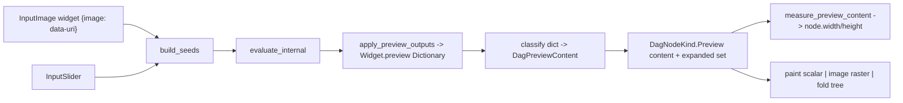

## Adaptive Flow Preview

### Problem

The preview is flattened to one string by `format_dictionary_preview` ([flow/core/lib.rs](flow/core/lib.rs) lines 339-348), painted as a single centered line in a fixed 72x14 rectangle (`DagNodeKind::Preview { text }` painted at [mathematical/graph/port/directed/dag/lib.rs](mathematical/graph/port/directed/dag/lib.rs) line 2745). The full evaluated `Dictionary` is already on `Widget::OutputPreview { preview }` but is discarded.

### Target behavior

- number/text -> small rectangle sized to the value
- image (`{"image": "data:..."}`) -> rectangle sized to the image, rendered as real pixels on the Vello canvas (no DOM overlay)
- anything else -> interactive, recursively foldable JSON tree of the whole dictionary, every key collapsed by default, click to expand/collapse natively on the canvas
- new image input widget feeds `{"image": data-uri}` into the flow

### Data flow

### Design decisions

- "Image data type" = the dictionary-key convention `{"image": "<data-uri>"}`, consistent with existing `number`/`text`/`geometry`/`brep` conventions. No change to `neural/engine` `Atom`.
- Only `data:` URIs are supported (decoded synchronously in WASM); remote URLs are out of scope. Raster decode reuses `icon_codec::decode_raster_icon_bytes`; SVG reuses the usvg/`vello_svg` path already used for icons.
- The DAG `Preview` node carries structured content instead of a pre-flattened string, so the canvas layer owns sizing, painting, and fold interaction.
- Fold state stored as `expanded: BTreeSet<String>` of dotted key paths on the Preview node (empty = all folded), serialized in the fixture like `Select.selected`.
- Preview/image nodes are content-sized, overriding the label-based `fit_node_size`/`widget_node_size`.

### Key changes

1. DAG core ([mathematical/graph/port/directed/dag/lib.rs](mathematical/graph/port/directed/dag/lib.rs))
  - New `DagPreviewContent` enum (in a `//#region`): `Empty`, `Scalar { text }`, `Image { src }`, `Tree { json: serde_json::Value }`.
  - Refactor `DagNodeKind::Preview { text, input }` -> `Preview { content: DagPreviewContent, #[serde(default)] expanded: BTreeSet<String>, input }`.
  - Add `DagNodeKind::Image { src: String, output: IoPortSpec }` for the new image input node (shares image paint/measure with Preview).
  - Image decode cache on `DagHost` (reuse `cavas::raster` `ImageData`/`RasterImageCache`); record natural width/height per `src`.
  - `measure_preview_content(content, expanded)`: scalar -> text width; image -> natural size clamped to a max box (aspect preserved); tree -> visible-rows x row-height and max visible row width. Call it where Preview/Image nodes are sized (replace label sizing in `fit_node_size` and the Preview/Image arms).
  - Painting: extend the `Preview` arm (line 2745) to dispatch on content - scalar line, `cavas::raster::draw_image` for images (affine fit, `push_clip_layer` to node bounds), and a row-by-row fold tree (indent by depth, fold triangle glyph + `key: value`/`{...}` summary). Add an `Image` arm mirroring the image path.
  - Layout/hit helpers: `preview_tree_rows(node)` -> ordered visible `(path, depth, has_children, row_rect, toggle_rect)`; extend `widget_hit_at`/`try_widget_pointer_down` (lines 1869-1909) with a Preview branch that toggles a path in `expanded` (Select-style click + early return), then re-measures size.
  - Update demo fixture node (line 4117) and round-trip/interaction tests in the existing test module (`Preview` content, fold toggle, image sizing, `Image` node).
2. DAG React types ([mathematical/graph/port/directed/dag/react/index.tsx](mathematical/graph/port/directed/dag/react/index.tsx))
  - Update `DagPreviewNodeV1` to the new `content` + `expanded` shape; add `DagImageNodeV1`. Update the demo fixture (lines 165-198) accordingly.
3. Flow core ([flow/core/lib.rs](flow/core/lib.rs))
  - Add `Widget::InputImage { id, src }`; wire into `widget_label`, `widget_display_meta` (emoji image), `widget_io_ports` (output-only), `widget_node_size`, `widget_to_dag_node` (-> `DagNodeKind::Image`), `WidgetDescriptor::InputImage`, the catalogue list (line 416 area), and `build_seeds` (line 952) producing `{"image": Atom::String(src)}`.
  - Replace `format_dictionary_preview` with `dag_preview_content_from_dict(&Dictionary) -> DagPreviewContent` (classify `number`/`text`/`image` else `Tree(serde_json)`). Use it in `widget_to_dag_node` Preview arm (line 289) and `sync_dag_display_from_widgets` (line 996) instead of writing `text`.
  - Add WASM `setImageSrc(widget_id, src)` mirroring `set_note_text` (line 1179/1416).
  - Update the existing flow tests (`format_dictionary_preview` tests at lines 1754, preview round-trip) to the new content model + image input + tree fold.
4. Flow React ([flow/react/index.tsx](flow/react/index.tsx))
  - On double-click of an image input node, open a hidden `<input type=file>`, read via `FileReader` to a data-uri, call `session.setImageSrc(id, dataUri)`, then `evaluate()` + `persistFixture()` + `renderFrame()`. Preview itself needs no React work (auto-sized/painted in Rust); fold clicks flow through existing pointer handlers, with `evaluate`/`persist` on pointer up.
5. Playground ([flow/play/index.ts](flow/play/index.ts))
  - Add the image input to the palette/catalogue used by the play harness and adjust the mock host preview expectations/tests as needed.

### Validation

- `nx test` the Rust crates (dag, flow/core) and the TS vitest suites via launch.json tasks; extend existing test files only (no new test files).
- Build/run the flow playground; confirm at runtime with `[DEBUG]` logs: number preview is small, an embedded data-uri image renders pixels at image size, and an unrecognized dictionary renders a folded tree that expands/collapses on click. Remove `[DEBUG]` logs after.

### Repo workflow

- Before editing: read `repo://goals`, then open a ticket (e.g. `FLOW-ADAPTIVE-PREVIEW`) via the repo MCP; keep any temp files inside the ticket folder; close it with a summary when done.

