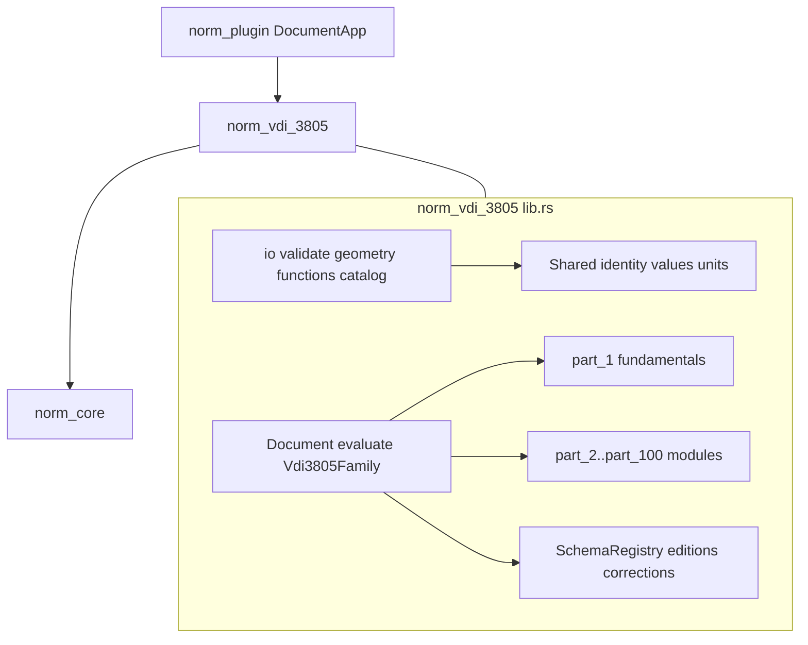

# Add VDI 3805 to Norm

## Locked decisions

- **Technology home:** extend existing [`norm/`](norm/) under goal **Norm** (`NORM`). Do **not** create a top-level `vdi3805` multi-crate workspace.
- **Layout:** one family crate at [`norm/vdi/3805/`](norm/vdi/3805/) named `norm_vdi_3805`, matching `norm/iso/16757` → `norm_iso_16757` and `norm/din/v/18599` → `norm_din_v_18599`.
- **Parts as modules, not crates:** map every proposed `vdi3805-*` crate onto regions/modules inside a single [`norm/vdi/3805/rs/lib.rs`](norm/vdi/3805/rs/lib.rs).
- **No Cargo feature forest:** no `part-*`, `all-current`, domain, or platform features. Every non-reserved sheet module is always compiled (same as all existing norm families). Sheet/edition selection is **runtime** via `SheetId` / `EditionId` / `SchemaStatus` / `SchemaRegistry`.
- **Surface:** headless Rust API + `NormFamily` session + plugin DocumentApp. **No** `vdi3805-cli` crate; repo uses `launch.json` + `script.ts test`.
- **Copyright:** hand-implement public architecture, record-family seed, sheet scope metadata, and correction overlay **structure** only. Exact licensed field tables, enum codes, formulas and limits stay as **extensible registries** with public-known entries plus explicit unknown/unsupported diagnostics. Do not embed copyrighted prose or proprietary tables.
- **National annex:** all checks report `AnnexChoice::De` (German VDI series).
- **Independence:** no dependency on `norm_iso_16757` (parallel catalogue family; keep boundaries clean).
- **Status model:** operative published/checked editions are first-class; drafts, projects, historical proposals (Parts 12, 13, 25) and correction overlays are separate `SchemaStatus` / overlay entries — never merged into one ambiguous schema. Reserved numbers (15, 30–31, 39, 46–49, 56–59, 67–98) register as reserved stubs only (no empty normative schemas).

## Architecture



### Proposed crates → repo modules

| Proposed crate | Location in `norm_vdi_3805` |
| --- | --- |
| `vdi3805-core` | `#region Shared` — identifiers, values, units, relationships, diagnostics, security limits |
| `vdi3805-schema` | `#region Schema` — `SheetId`, `EditionId`, `SchemaStatus`, property/record/enum descriptors, correction overlays, domain filters (`heating`, `ventilation`, …) as registry queries |
| `vdi3805-io` | `#region Io` — native VDI 3805 lexer/parser/serializer, lossless syntax tree, typed lowering |
| `vdi3805-validate` | `#region Validate` + per-part `check_*` → `CheckReport` |
| `vdi3805-geometry` | `#region Geometry` — parametric geometry, connections, spaces, evaluation |
| `vdi3805-functions` | `#region Functions` — curves, maps, interpolation, selection/sizing API |
| `vdi3805-catalog` | `#region Catalog` — index/merge/search/filter/diff/stats |
| `vdi3805-part-XX` | `pub mod part_XX` (or `part_08` with edition profiles inside) |
| `vdi3805` façade / CLI / testkit / codegen | crate root re-exports + `evaluate`; tests in `#[cfg(test)]`; **no** codegen crate (handcrafted registries as `const` data); **no** CLI |

### Session contract

```rust
pub struct Document { /* manufacturer file / catalog, edition profile, correction_as_of, mode */ }
pub type Op = SetDocumentOp<Document>;
pub fn evaluate(document: &Document) -> CheckReport;
pub struct Vdi3805Family;
impl NormFamily for Vdi3805Family { /* family_id: Vdi3805 */ }
```

`evaluate()` completeness gate:

1. Part 1 structural/semantic checks (hierarchy, record families, units, geometry refs, media refs, functions)
2. Schema registry integrity (every non-reserved sheet has metadata; reserved sheets are reserved-only)
3. One sheet-specific check path per operative domain representative **and** a loop that reaches every non-reserved `part_*` module (metadata/edition/scope at minimum; fuller rules where public)
4. Correction-overlay applicability for a dated profile
5. Catalog op smoke (load/index/filter) + parse/serialize round-trip of a minimal synthetic manufacturer file
6. Unsupported edition / mixed-edition diagnostics

### Edition / correction runtime keys (not Cargo features)

- `SheetId(u16)` — 1…100
- `EditionId { year, month }`
- `SchemaStatus` — Published | Checked | Draft | Project | Withdrawn | Superseded | HistoricalProposal | Reserved
- `CorrectionOverlay { sheet, base_edition, effective_year_month, … }`
- `SchemaRegistry::current()` — operative set used by default `Document`
- `SchemaRegistry::with_status(SchemaStatus)` — drafts/projects/legacy opt-in at runtime
- Domain helpers: `registry.sheets_in_domain(Domain::Heating)` etc.

Default `Document` uses operative published/checked editions **plus** applicable corrections as of a configurable date; drafts/projects/legacy never implicit.

## Integration touchpoints

1. **Scaffold:** `norm/vdi/3805/{project.json,script.ts,rs/Cargo.toml,rs/lib.rs}` mirroring [`norm/iso/16757/`](norm/iso/16757/).
2. **Workspace:** add `"norm/vdi/3805/rs"` to root [`Cargo.toml`](Cargo.toml) members.
3. **`norm_core`:** add `NormFamilyId::Vdi3805` + label `"VDI 3805"` in [`norm/core/rs/lib.rs`](norm/core/rs/lib.rs).
4. **Plugin:** register `vdi3805` DocumentApp in [`norm/plugin/rs/lib.rs`](norm/plugin/rs/lib.rs) + dep in [`norm/plugin/rs/Cargo.toml`](norm/plugin/rs/Cargo.toml); bump registration test `14` → `15`.
5. **Launch:** extend `🧪test📏norm` in [`.vscode/launch.json`](.vscode/launch.json) (and `.claude/launch.json` if it mirrors) with `-p norm_vdi_3805`.
6. **Docs:** update [`norm/AGENTS.md`](norm/AGENTS.md) with the VDI family path.
7. **Ticket:** `ticket_open` under goal `NORM` (title **Add VDI 3805**, emoji `📏`); temps/checklists only under `.repo/🎫/.../`. Bind plan id on open for archival.

## Implementation order

### 1. Scaffold + session shell

Crate, workspace member, `Document` / `evaluate` / `Vdi3805Family`, `NormFamilyId`, nx `script.ts test`, plugin + launch wiring, default document for empty-catalog / Part-1-header path.

### 2. Shared + Schema registry

Identity, manufacturer-file header, localization, value types, units (incl. absolute vs delta temperature/pressure), property model, relationships, security limits, lossless `ExtensionBag`. Full sheet catalog 1–100 with status, titles, Part-1 compatibility, correction overlay descriptors (all listed corr-YYYY-MM entries). Domain query helpers replace Cargo domain bundles.

### 3. Part 1 — fundamentals engine

Provisional record-family tree (`010`…`970.41`) as typed + unknown-preserving model; product hierarchy; building-system number parse/render/validate; configuration; systems; article/packaging. Streaming parse + canonical/lossless write. Structural/semantic validation with severity + spans. Geometry, functions, media, catalog engines as first-class APIs used by Part 1 and specialized sheets.

### 4. Product-sheet modules (`part_2`…`part_100`)

For each sheet in the feature tree:

- `metadata` (DE/EN titles, edition, status, Part-1 edition, corrections, superseded)
- `product_classes` / `properties` / `enums` registries (public-known + unknown preservation)
- `performance` / `geometry` / `configuration` hooks (API surface; formulas only where public)
- `validation` sheet rules + `migration` edition/correction overlays
- reserved sheets: `SchemaStatus::Reserved` only
- multi-profile sheets (`part_08`, `part_10`, `part_14`, `part_18`, `part_33`, `part_36`, `part_37`, `part_40`, `part_42`, `part_53`, `part_100`, …): separate edition profiles inside the module, never collapsed

Organize with `#region PartXX` / `pub mod part_XX` and subregions; keep related logic together in the single `lib.rs`.

### 5. Validate + IO + tests

- Clause-cited `CheckResult`s (`ClauseId::new("VDI 3805", "1", "…")` / sheet part numbers)
- Positive + negative fixtures per engine and per sheet module (synthetic manufacturer fragments — not licensed dumps)
- Round-trip: document JSON serde; native text round-trip for minimal valid file; correction dated profile golden diagnostics
- Completeness test: `evaluate(&Document::default())` reaches every non-reserved part module (collect `clause.family` / diagnostic codes into a `BTreeSet`)
- Ticket checklist mapping public sheet scopes → module / API / validator / tests

## Completeness gate

A sheet module is done only when:

1. Real behaviour (not an empty `part_*` shell) — reserved modules intentionally reserved-only
2. Clause/sheet-cited identifiers
3. At least one positive and one negative check path exercised by `evaluate` or a unit test that `evaluate` aggregates
4. Edition/status never conflated; unsupported editions report precisely
5. No foreign technology leaks (`compose`, `puzzle`, `mit-bestand`, `draw`, …)

## Out of scope

- Pasting licensed VDI text, full normative field dumps, or claiming bit-exact manufacturer-catalog conformance without licensed manifests
- Standalone CLI binary or separate `vdi3805-*` crates / Cargo feature matrix
- Codegen from proprietary PDFs
- Updating the Norm goal description (no goal open/close without explicit instruction)
- Cross-wiring to ISO 16757

## Verification

```bash
CARGO_TARGET_DIR=/tmp/semio-norm-vdi3805 \
  cargo test -p norm_core -p norm_vdi_3805 -p norm-plugin
```

Then full family pack via `🧪test📏norm`.
