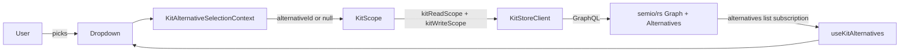

## Model recap

- `semio/rs` already owns `Graph { the_kit, alternatives, ... }` with `Alternative { id, name, start, checkpoints, kit, draft, transaction }` ([semio/rs/lib.rs](semio/rs/lib.rs) lines 3455–3528, 3538–3596).
- `semio/js` already has `KitReadScope` and `KitWriteScope` with `theKit | checkpoint | alternative | draft | transaction` branches ([semio/js/index.ts](semio/js/index.ts) lines 269–295). No JS changes needed beyond using those existing types — kit authority remains in rs.
- `semio/react` `KitScope` already wires `kitReadScope` / `kitWriteScope` into the `KitStoreClient` and exposes `SemioKitScopedView` ([semio/react/index.tsx](semio/react/index.tsx) lines 1421–1448, 2336–2587).
- Footer items are pluggable per-app via `useAddFooterItem` and rendered sorted by `order` (left = lowest); `content` accepts arbitrary `ReactNode` so a `Select` fits cleanly ([elements/ui/index.tsx](elements/ui/index.tsx) lines 10981–10998, [semio/sketchpad/index.tsx](semio/sketchpad/index.tsx) lines 2192–2201, 23470–23482).




## semio/react ([semio/react/index.tsx](semio/react/index.tsx))

New region `🌱KitAlternativeSelection` placed just above the existing `⚛️Context` region:

- `type KitAlternativeSummary = { id: string; name: string }` — minimal projection used by the dropdown.
- `KitAlternativeSelectionContext = createContext<{ selectedAlternativeId: string | null; setSelectedAlternativeId: (id: string | null) => void; alternatives: ReadonlyArray<KitAlternativeSummary> }>` with a frozen default `{ selectedAlternativeId: null, setSelectedAlternativeId: noop, alternatives: [] }`.
- `KitAlternativeSelectionProvider({ children })` — internal `useState<string | null>(null)`. Reads alternatives from the active `KitStoreClient` via `useSyncExternalStore` on a small subscription helper (`graph.alternatives { id name }` using the existing `kitClient.execute` GraphQL surface — same pattern as `useKitName`). When the currently-selected id disappears from the rs list, falls back to `null` (the kit) automatically.
- `useKitAlternativeSelection()` → `[selectedAlternativeId, setSelectedAlternativeId]`.
- `useKitAlternatives()` → `ReadonlyArray<KitAlternativeSummary>` from the same context.

Hook `KitScope` into the selection (in the existing `KitScope` body, [semio/react/index.tsx](semio/react/index.tsx) line 2349):

- When the caller does **not** pass `kitReadScope`, derive it from the context: `null → theKitReadScope`, `id → { alternative: { alternativeId: id } }`. Caller-supplied `kitReadScope` still wins (storybook / explicit cases).
- When the caller does **not** pass `kitWriteScope`, leave the existing auto-bootstrap path untouched but call `kitClient.setKitWriteScope(null)` whenever the selection changes, so the next gesture re-bootstraps on the new alternative head (rs picks the draft on its last checkpoint per the spec — JS does not pick checkpoint/draft ids).
- Add `selectedAlternativeId` into `SemioKitScopedView` for downstream UI debugging only (does not change existing consumers).

No new exports from `semio/js` are needed; the read/write scope branches already exist there.

## semio/sketchpad ([semio/sketchpad/index.tsx](semio/sketchpad/index.tsx))

New region `🌱AlternativeSelector` (near the existing `🎮Footer` region around line 16495):

- `KitAlternativeFooterSelector: FC` — uses `useKitAlternativeSelection()` + `useKitAlternatives()` from `@semio/react`, renders a `Select` (already imported from `@semio/elements`) with options `[{ id: null, label: "the kit" }, ...alternatives]`. Registers a single footer item:

```ts
addFooterItem({
  id: "semio.sketchpad.footer.alternative",
  order: -1000,
  content: <Select .../>,
});
```

  Cleanup on unmount via `removeFooterItem("semio.sketchpad.footer.alternative")`.

Mount the selector inside the three kit-editing app footers only:

- `KitAppFooter` ([line 16502](semio/sketchpad/index.tsx))
- `DesignAppFooter` ([line 29005](semio/sketchpad/index.tsx))
- `TypeAppFooter` ([line 40460](semio/sketchpad/index.tsx))

Each footer simply renders `<KitAlternativeFooterSelector />` once; the inner add/remove effect is keyed on `appType` already (kit/design/type) so it auto-deregisters when the user navigates to home/docs/feedback.

Wrap `KitScope` with `KitAlternativeSelectionProvider` at the single tab-shell wrapper ([semio/sketchpad/index.tsx](semio/sketchpad/index.tsx) lines 7307–7327):

```tsx
return React.createElement(
  KitAlternativeSelectionProvider,
  null,
  React.createElement(KitScope, { kitId, store: entry.store, kitClient: entry.kitClient, children })
);
```

That places the provider above `KitScope` so `KitScope`'s effect can read the current selection, and so the selector renders inside the same provider tree.

## Out of scope (rs-side, separate ticket if needed)

- Auto-creating / promoting a draft on the alternative's last checkpoint when the user's first edit lands. Per `semio/rs` spec, "all kit state is only inside semio/rs" — the JS write-scope auto-bootstrap path already triggers a rs-side `newDraft` call; if rs needs a tweak to honor the new `alternativeId`, that's an rs ticket.
- Rendering checkpoints/drafts inside an alternative (this plan only adds the alternative selector; deeper VCS UI stays where it is today).

