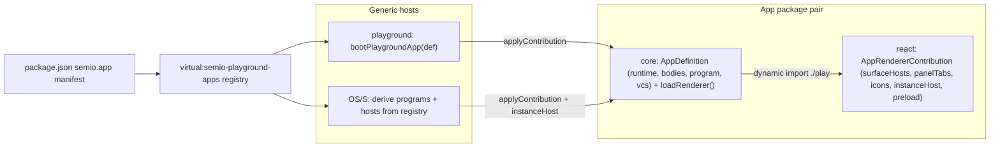

# App-Defined Apps, Fully Derived Shells

## Problem (current state)

The shells own app logic in four places:

- Framework renderer ([framework/product/playground/renderer/react/index.tsx](framework/product/playground/renderer/react/index.tsx)) exports 19 per-technology `registerUiXxxSurfaceHost` functions with typed host maps, and `UiRenderer` switches on per-technology node types (`UiFlowHostSurfaceNode`, ... declared in [framework/product/platform/core/js/index.ts](framework/product/platform/core/js/index.ts)).
- Each app's `play-host.tsx` ships bespoke shell logic: `bootXxxPlay`, `mountXxxPlayChrome`, a custom `XxxPlayChrome`/`XxxPlayInner` component whose only job is computing `augmentPanelTabs` — playground chrome living in the app but wired as imperative boot code instead of data.
- The OS shell (S) hardcodes every technology three times: `TECHNOLOGY_APP_RESOURCE_BY_PROGRAM` in [s/core/internal.ts](s/core/internal.ts), explicit dynamic imports in [s/core/program-extensions.ts](s/core/program-extensions.ts) + `bootstrapSPlayExtensions`, and `s/react/play-host.tsx` with the `registerSPlaySurfaceHosts()` fan-out (17 cross-app calls) plus the `SAppHostRouter` component-kind switch.
- Per-format VCS handler factories (`createFlowDocumentAppVcsHandler`, ...) live in [framework/product/os/core/js/index.ts](framework/product/os/core/js/index.ts) — the generic OS layer knows technologies by name.

## Target architecture

One contract, two generic hosts:



## Phase 1 — App contract

In [framework/product/platform/core/js/index.ts](framework/product/platform/core/js/index.ts) (type-only React imports):

```ts
export interface AppRendererContribution {
 readonly surfaceHosts: Readonly<Record<string, SurfaceHostComponent>>;
 readonly panelTabs?: readonly SidePanelTabContribution[]; // group + definition
 readonly tabIcons?: Readonly<Record<string, IconRef>>;
 readonly instanceHost?: AppInstanceHostComponent; // OS drill-in render
 readonly preload?: () => Promise<void>; // wasm init etc.
}
```

- `AppDefinition` gains `loadRenderer: () => Promise<AppRendererContribution>` and optional `program?: OsProgramContribution` (registration + source formats + VCS handler factory).
- `PlaygroundAppDefinition.bootRenderer` and `PlaygroundChromeBoot` are deleted; `createPlaygroundApp` consumes `loadRenderer`.
- Collapse the per-technology `UiXxxHostSurfaceNode` types into one generic `UiSurfaceHostNode` (`surfaceId` + app-owned payload); update app cores that construct these nodes.

## Phase 2 — Apps export contributions (23 packages)

Each `*/react/play-host.tsx` replaces `registerXxxPlaySurfaceHosts` / `mountXxxPlayChrome` / `bootXxxPlay` / `XxxPlayChrome` with one data export:

```ts
export const flowAppRenderer: AppRendererContribution = {
  surfaceHosts: { [FLOW_PLAY_SURFACE_ID]: FlowPlayPaneSurfaceHost, ... },
  panelTabs: [ { group: "workbench", definition: flowDocumentPanel }, ... ],
  preload: ensureFlowWasm,        // where applicable (layout, flow, puzzle 2d, ...)
  instanceHost: FlowInstanceHost, // apps that appear in the OS studio
};
```

Each app core's definition points at it: `loadRenderer: async () => (await import("@semio-tech/flow-react/play")).flowAppRenderer`. Apps with OS presence also export their `OsProgramContribution` from core (registration rows moved out of `TECHNOLOGY_APP_RESOURCE_BY_PROGRAM`, VCS handlers moved out of os/core).

## Phase 3 — Playground fully derived

- New generic `bootPlaygroundApp(definition, rootId)` in the playground renderer: `await loadRenderer()` → `preload()` → register every `surfaceHosts` entry via the existing generic `registerSurfaceBinding` → `registerBodies()` → mount one generic `PlaygroundView` fed `panelTabs` from the contribution (replaces every per-app `Inner`/`augmentPanelTabs` component).
- Delete all 19 `registerUiXxxSurfaceHost` functions, their typed maps, and the `UiRenderer` per-technology switch — resolution is purely `surfaceId → registerSurfaceBinding`.
- Playground dev entry ([framework/product/playground/dev/js/index.ts](framework/product/playground/dev/js/index.ts)): `loadPlaygroundApp(kind)` → `bootPlaygroundApp(def)`. App-registry and virtual module stay as-is.

## Phase 4 — OS derived from the same registry

- `registerSPlaySurfaceHosts` cross-app fan-out deleted. OS boot (`bootstrapSPlayExtensions`) iterates the manifest registry and applies each app's contribution lazily — on program first-use (spawn/openInstance), load definition → `applyContribution`.
- `SAppHostRouter` switch replaced by lookup: resolve instance → app definition → `contribution.instanceHost`; render generically.
- Delete `TECHNOLOGY_APP_RESOURCE_BY_PROGRAM` and [s/core/program-extensions.ts](s/core/program-extensions.ts) explicit import list; program registration is derived by iterating manifests (extend the virtual module to also expose each app's program export).
- Move per-format `create*AppVcsHandler` factories from [framework/product/os/core/js/index.ts](framework/product/os/core/js/index.ts) into the owning app cores, registered via the definition's `program` contribution.
- S keeps exactly one declared library dependency (`@semio-tech/flow-react` for its own media-graph canvas) — a deliberate library use, not app aggregation.

## Phase 5 — Manifest + enforcement + verification

- Extend the `semio.playgroundApp` manifest (rename to `semio.app`) with `programExport` where relevant; update scanner in [repo/lib/js/index.ts](repo/lib/js/index.ts) and the virtual-module plugin in [ui/styling/vite-elements-assets.ts](ui/styling/vite-elements-assets.ts).
- Tighten [.dependency-cruiser.cjs](.dependency-cruiser.cjs): forbid `framework/**` → app packages and `s/**` → app packages (except the flow-react media-graph exemption); extend guards in [repo/lib/js/index.test.ts](repo/lib/js/index.test.ts) to fail on any `registerUiXxxSurfaceHost`-style per-technology API reappearing in framework.
- Verify: boot flow/layout/2d/note playground dev servers, boot OS dev (S studio, spawn + open an instance of at least two technologies), run affected package tests, run lint.

## Execution notes

- Work inside the existing repo MCP ticket (reopen `APP-ISOLATION-ENFORCED-BOUNDARIES` or open a follow-up after reading `repo://goals`); no modifying git commands.
- The `play-host.tsx` files remain the home for each contribution — content changes from imperative boot code to a declarative export.
