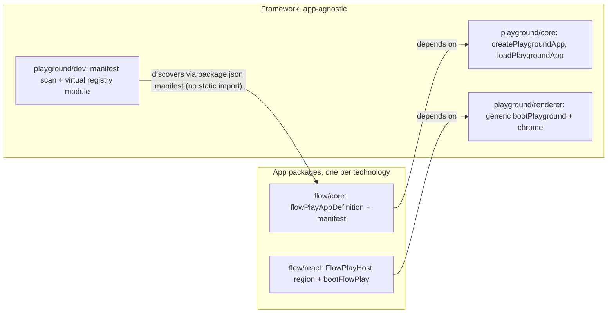

# App Isolation and Enforced Boundaries

## Problem

Apps are cross-wired at three levels:

- `ui/styling/vite-elements-assets.ts` exports `playgroundRendererResolveAliases` (~100 entries) mapping every package name to raw source paths; consumed by playground dev, OS dev, Storybook, and ~30 vitest configs. Compose/coda/vscode/mit-bestand configs carry their own manual alias lists (e.g. `@semio-tech/puzzle-2d-react` → `../../../../../puzzle/2d/react/index.tsx` in [compose/client/ui/desktop/js/vite.renderer.config.ts](compose/client/ui/desktop/js/vite.renderer.config.ts)).
- `framework/product/playground/renderer/react/index.tsx` (~13k lines) statically imports all ~24 apps into per-app `🔖XxxPlayHost` regions; `playgroundRendererShellEntryPlugin` slices it per app. Adding/breaking one app affects all.
- Adding an app requires editing three registries: `resolvePlaygroundDevApp` in [script.ts](script.ts), `PACKAGE_ROOT_BY_ENTRY` in [framework/product/playground/dev/script.ts](framework/product/playground/dev/script.ts), `importPlaygroundAppDefinition` in [framework/product/playground/core/js/app-registry.ts](framework/product/playground/core/js/app-registry.ts).
- No enforcement: `script.ts lint` and `nx.json` reference a root `.dependency-cruiser.cjs` that does not exist.

Packages already declare `workspace:*` deps and source-level `exports` (e.g. `"." : "./index.tsx"`), so bun workspace symlinks can carry resolution — the aliases bypass an existing mechanism.

## Target architecture

Dependency direction inverts: apps depend on framework; framework never names a concrete app. Adding an app = changes inside the app's own folders only.

## Phase 1 — Canonical package identities and complete manifests

- One canonical name per package. Remove alias names `@compose/ui`, `@ui/react`, `@elements/*` from all source imports and configs; use `@semio-tech/ui-react` (and friends) everywhere.
- Complete every workspace package.json: all imported `@semio-tech/*` packages declared as `workspace:*` dependencies; `exports` covers all consumed subpaths (`./internal`, `./globals.css`, `./boot`, wasm subpaths like `"./pkg/*": "./rs/pkg/*"` on `flow/core`, `lowpoly/core`, `sequence/core`, `imperative/core`, etc.).
- Fix direct cross-technology relative imports at the root: `kernel/3d/brep/js/tessellate.worker.ts` imports `../../../flow/module/brep/pkg/...` → declare and import `@semio-tech/flow-module-brep`.

## Phase 2 — Delete cross-package aliases, resolve through the workspace

- Remove `playgroundRendererResolveAliases` from [ui/styling/vite-elements-assets.ts](ui/styling/vite-elements-assets.ts). Replace with a small generic base config helper (same file): `resolve.dedupe` for `react`, `react-dom`, `three`, `@react-three/fiber`; `server.fs.allow: [repoRoot]`; `optimizeDeps.exclude` for linked workspace packages (derived generically, not hand-listed).
- Strip foreign-package `resolve.alias` entries from all configs, keeping only intra-package aliases where a package aliases its own files:
  - playground/OS dev vite configs ([framework/product/playground/dev/js/vite.config.ts](framework/product/playground/dev/js/vite.config.ts), `framework/product/os/dev/js/vite.config.ts`)
  - [.storybook/main.ts](.storybook/main.ts)
  - compose sketchpad/play/doc/desktop/vscode/3dm configs, coda desktop/assistant, repo vscode, mit-bestand
  - all ~30 per-package vitest configs (e.g. [layout/react/vitest.config.ts](layout/react/vitest.config.ts), [puzzle/2d/react/vitest.config.ts](puzzle/2d/react/vitest.config.ts))
- Remove cross-package tsconfig `paths` (compose/client/lib/js, sketchpad, puzzle/3d/react, repo/client/vscode, compose/dev/algorithm); rely on package resolution.

## Phase 3 — Open-closed playground registration (renderer split)

- Move each `🔖XxxPlayHost` region out of `framework/product/playground/renderer/react/index.tsx` into the owning app's `react/index.tsx` (existing files, region-structured). Each app core's `bootRenderer` dynamic-imports its own react package instead of `@semio-tech/framework-playground-renderer-react/<kind>`.
- The framework renderer keeps only generic primitives (`bootPlayground`, chrome, panels). Delete `playgroundRendererShellEntryPlugin` and `stripPlaygroundRendererForPuzzleKind` from `vite-elements-assets.ts`; drop all app core/react deps from `framework/product/playground/renderer/react/package.json` and `framework/product/playground/core/package.json`.
- Replace the three registries with a manifest mechanism:
  - Each app's core package.json declares itself, e.g. `"semio": { "playgroundApp": { "kind": "flow", "aliases": ["flow"], "packageRoot": "flow", "port": 6016 } }` (ports move here from `PLAYGROUND_PORTS` in `repo/lib/js/index.ts`).
  - [framework/product/playground/dev/script.ts](framework/product/playground/dev/script.ts) and `resolvePlaygroundDevApp` in root [script.ts](script.ts) derive their app maps by scanning workspace package manifests (generic code in `repo/lib/js/index.ts`).
  - `app-registry.ts` keeps its `loadPlaygroundApp(kind)` API but is backed by a virtual module (`virtual:semio-playground-apps`) emitted by a generic Vite plugin in the dev harness that reads the manifests and generates `kind → () => import("<core package name>")`. No shared file lists concrete apps.

## Phase 4 — Enforcement

- Create root `.dependency-cruiser.cjs` (already wired into `nx.json` sharedGlobals and `script.ts` lint) with rules:
  - forbid relative imports escaping the owning workspace package root
  - forbid imports of packages not declared in the nearest package.json
  - forbid app-tree → app-tree imports (technology isolation) and `framework/**` → app package imports
- Extend `LintScript.run` in [script.ts](script.ts) to run dependency-cruiser repo-wide (currently compose-only), keeping the `lint` entry in `launch.json` working.
- Extend the existing `repo/lib/js/index.test.ts` with guards that fail when any `vite*.config.ts` / `vitest.config.ts` / `tsconfig.json` contains a resolve alias or `paths` replacement escaping its package directory, and when a package imports an undeclared `@semio-tech/*` package.

## Phase 5 — Verification

- Run per-app dev servers (`bun ./script.ts dev flow|layout|note|2d|3d|5d|cad|s|...`) and confirm boot via console output; run `bun ./script.ts test` for affected packages; build Storybook and one static play site; run the new lint.

## Execution notes

- Work happens inside a repo MCP ticket (open at execution start after reading `repo://goals`); no new files outside the ticket folder except the root `.dependency-cruiser.cjs`, which is already referenced by existing config.
- No git-modifying commands; edits only.
