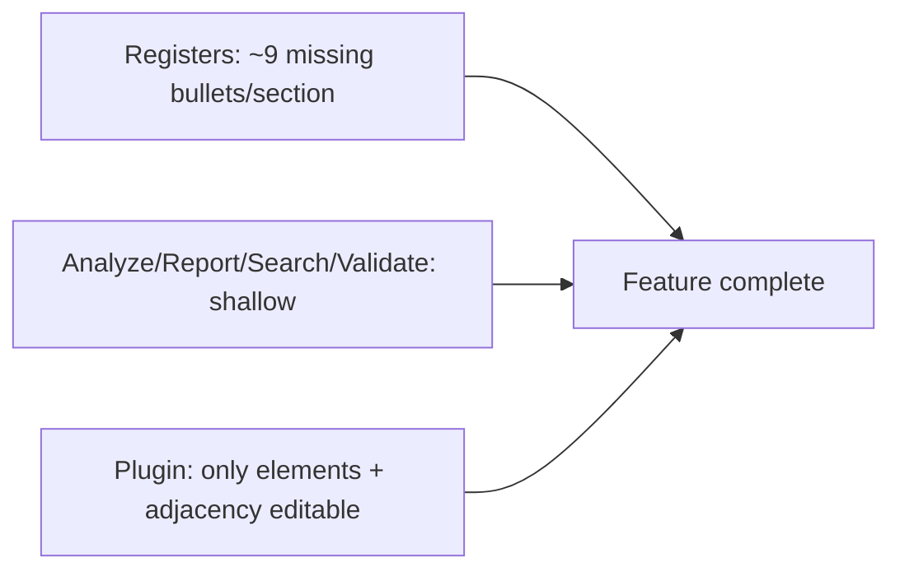

# Architect Absolute Feature Completeness

## Locked decisions

- Reopen ticket `26/07/18/ARCHITECT-PROGRAM-AND-PLUGIN` (same task); bind goal `architect`.
- No cargo lock waits: always use `CARGO_TARGET_DIR=/tmp/semio-architect-target` for compile/test.
- Strict 1:1 bullet coverage: every listed bullet becomes a typed field, enum variant, or dedicated API — not `String`/`Vec<String>` stand-ins where classification is required.
- Plugin exposes **all** `Program` registers for CRUD (not just elements/adjacency).

## Current gaps (from audit)

## Phase 1 — Typed domain fields (all 65 sections)

Edit primarily `[architect/program/rs/src/registers.rs](architect/program/rs/src/registers.rs)`, `[kernel.rs](architect/program/rs/src/kernel.rs)`, `[program.rs](architect/program/rs/src/program.rs)`.

**P0 spine (§1–§9, §56):**

- `ProjectDefinition`: add `problem_statement`, `project_priorities`, `completion_criteria`, `decision_criteria`, `development_context`, `operational_context`
- `Function`: replace `category: String` with `FunctionKind` enum (Primary, Secondary, Support, Administrative, Service, Technical, Public, Private, Shared, Restricted, Temporary, Future) + `hierarchy_parent_id`, `conflict_ids`
- `RelationshipKind`: expand to cover all §8 relationship types; add `proximity`, `compatibility`, `incompatibility`, `separation_requirements`
- `Adjacency`: add `internal_external_access` field; keep undirected normalize
- `Governance`: add review/policy/requirement/risk ownership, reporting frequency, accountability rules, exception management, governance performance

**P1 remaining registers (§2–§65):** For every missing bullet from the audit gap list, add a dedicated typed field or enum. Key enums to introduce: `FlowKind`, `PrivacyKind`, `SafetyDomain`, `SecurityControlKind`, `StorageClass`, `EnvironmentalParameter`, `HumanFactorAspect`, `AccessMode`, `TraceKind` (expand to all 19 §54 chains), `OutputKind` (§65).

**P1 structural registers still missing as first-class collections:**

- Assumption register, Constraint register, Compliance register, Approval record, Meeting record (§48) — add to `Program` + `ProgramOp` CollectionOp variants

Update patches (`*Patch`), `Identified`/`Patchable` macros, `empty_program`/`sample_program` factories, and `ops.rs` for any new collections.

## Phase 2 — Real behavioral APIs (no stubs)

| Module                                                            | Make complete                                                                                                                                                                |
| ----------------------------------------------------------------- | ---------------------------------------------------------------------------------------------------------------------------------------------------------------------------- |
| `[validate.rs](architect/program/rs/src/validate.rs)`             | Cross-ref all entity ids; relationship targets; duplicate ids; adjacency separation/distance/level; requirement orphan checks                                                |
| `[analyze.rs](architect/program/rs/src/analyze.rs)`               | Real logic per `AnalysisKind`; add missing kinds (RequirementComparison, Clustering, Filtering, Sorting, Scoring, Weighting, RelationshipAnalysis); persist `AnalysisRecord` |
| `[report.rs](architect/program/rs/src/report.rs)`                 | All 20 §52 summaries; true matrices (requirement×element, adjacency cells); persist `ReportRecord`                                                                           |
| `[search.rs](architect/program/rs/src/search.rs)`                 | Search **all** registers; apply categories/date/source/approval/dependency filters; search history                                                                           |
| `[trace.rs](architect/program/rs/src/trace.rs)`                   | Kind-specific chains for all §54 links; reverse impact; sorted audit trail                                                                                                   |
| `[exchange.rs](architect/program/rs/src/exchange.rs)`             | CSV/TSV for all registers; quoted CSV; duplicate detection; merge strategies; adjacency/relationship preservation                                                            |
| `[template.rs](architect/program/rs/src/template.rs)`             | All entity kinds + adjacency bundles + sector packages                                                                                                                       |
| `[status_summary.rs](architect/program/rs/src/status_summary.rs)` | Aggregate **all** registers + `status_records`                                                                                                                               |
| `[adjacency.rs](architect/program/rs/src/adjacency.rs)`           | Separation/distance/level conflict detection                                                                                                                                 |
| New `[outputs.rs](architect/program/rs/src/outputs.rs)`           | §65 abstract outputs: hierarchies, taxonomies, matrices, networks, journeys, schedules — typed builders                                                                      |

## Phase 3 — Full plugin CRUD

Rewrite/extend `[architect/plugin/rs/lib.rs](architect/plugin/rs/lib.rs)`:

- `REGISTER_IDS` = every `Program` vec register + meta/project/governance
- Generic register CRUD actions: `addRegisterItem`, `removeRegisterItem`, `patchRegisterItem`, `selectRegister`
- Inspector: editable fields for selected entity (not read-only), including adjacency weight/separations/connection
- Catalogue: templates apply, import JSON/CSV, all analysis kinds, all report kinds, search UI, trace viewer
- Document tree: all register counts from full `status_summary`
- Report body: formatted sections (not raw JSON dump)
- Analysis/report pickers: every kind; persist records into document ops

## Phase 4 — Tests and verify

- Co-located tests per module: every analysis/report kind has a non-empty finding; search hits every register class; CSV round-trips all registers; validate catches broken refs; §65 outputs build from `sample_program`
- Plugin tests: CRUD for representative registers; adjacency field edit; import/export; search UI path
- Always: `CARGO_TARGET_DIR=/tmp/semio-architect-target cargo test -p architect_program --lib` and `cargo test -p architect-plugin --lib` (never wait on default target lock)
- Update ticket `feature-checklist.md` only after verified; `ticket_close`

## Execution order

1. Reopen ticket
2. Phase 1 field/enum/collection gaps (registers + ops + sample)
3. Phase 2 behavioral modules + outputs
4. Phase 3 plugin full CRUD
5. Phase 4 tests with isolated target dir → ticket_close

## Out of scope

- Geometry / CAD / 3D
- Coda ACC validators
- Waiting on other agents' cargo processes (use isolated `CARGO_TARGET_DIR`)

