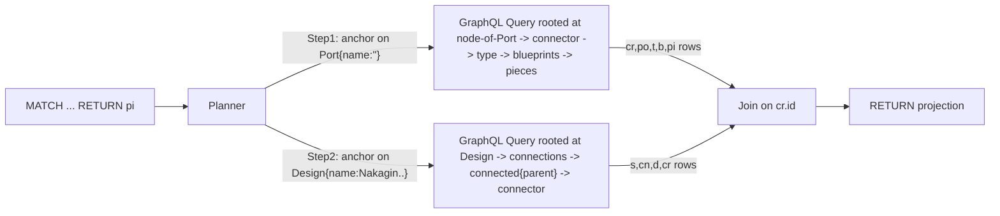

# Architect — Cypher-inspired query language for semio

## 1. What "architect" is

A small Cypher-flavoured surface compiled and executed by a Rust crate. The grammar is a strict subset of the spatial `construct` language (see [spatial/js/query/index.ts](spatial/js/query/index.ts)) plus first-class `CALL` for every semio mutation/subscription.

Supported clauses (one statement = sequence of clauses, evaluated top-to-bottom):

- `MATCH` pattern-list `[WHERE expr]` — traversal over the semio graph
- `WITH` projection-list `[WHERE expr]` — re-bind variables, filter
- `UNWIND` expr `AS` ident — fan out a list
- `CALL` qualified.ident `(` object-literal `)` `[YIELD ...]` — mutation or subscription
- `RETURN` projection-list `[ORDER BY expr] [LIMIT n]`

Patterns use a tiny fixed predicate vocabulary that mirrors the semio entity graph:

- `HAS` — ownership/containment (e.g. `Type -[:HAS]-> Connector`, `Design -[:HAS]-> Connection`)
- `IS` — identity / blueprint resolution (`Blueprint -[:IS]-> Type`, `Connector -[:IS]-> Port`)
- `REFERENCES` — side reference (`Side -[:REFERENCES]-> Connector`)
- `OWNS` — generic `owner`/`owns` edge from the GraphQL `Entity` interface
- Directionality `->` / `<-` / `--` is respected; relation prop-maps (e.g. `{parent: true}`) act as edge-side filters

Node labels are exactly the semio GraphQL types: `Kit`, `Design`, `Piece`, `Blueprint`, `Type`, `Port`, `Connector`, `Connection`, `Side`, `Quality`, `Author`, `Tag`, `Concept`, `Prop`, `Attribute`, `Representation`, `Layer`, `Group`, etc.

## 2. Where it lives

- New crate root: [semio/client/lib/query/lib.rs](semio/client/lib/query/lib.rs) (currently empty file).
- New sibling files (kept in the same `query/` directory, organised with `mod` blocks inside a single `lib.rs` per repo rules; only `lib.rs` is the source-of-truth Rust file):
  - `Cargo.toml`
  - `project.json` (calls into a new top-level `script.ts` `query <subcommand>` to mirror the rs bundle pattern, see [semio/client/lib/rs/project.json](semio/client/lib/rs/project.json))
  - `package.json` (so it shows up as an nx project)
  - `README.md`
- Internal layout uses `mod` regions inside `lib.rs` per the repo's "regions in a single file" rule (mirrors how [semio/client/lib/rs/lib.rs](semio/client/lib/rs/lib.rs) is structured):

```rust
//#region 🔖Lexer
//#region 🔖Parser
//#region 🔖Ast
//#region 🔖Schema      // hand-crafted typesafe mirror of GraphQL surface
//#region 🔖Planner    // architect AST -> GraphQL op plan
//#region 🔖Executor   // drives multi-roundtrip Transport
//#region 🔖Transport  // async callback trait + wasm/native bridges
//#region 🔖Api        // public Rust + wasm_bindgen entry points
//#region 🔖Errors
```

## 3. Crate setup

`Cargo.toml` mirrors [semio/client/lib/rs/Cargo.toml](semio/client/lib/rs/Cargo.toml) (cdylib + rlib, wasm-bindgen target deps). Dependencies (lean):

- `serde`, `serde_json`, `thiserror`, `futures-util`, `async-trait` (or hand-rolled `Future`-returning trait for wasm-safe object safety)
- `nom` for the lexer/parser (single, small, wasm-clean)
- wasm-target only: `wasm-bindgen`, `wasm-bindgen-futures`, `js-sys`, `serde-wasm-bindgen`, `console_error_panic_hook`

No GraphQL client crate — we emit GraphQL document strings ourselves and delegate IO to the host via `Transport`.

## 4. Hand-crafted typesafe schema mirror

A `schema` module with one Rust enum per GraphQL object type and one enum per outgoing field, plus a single `traversal_field` table:

```rust
enum Label { Kit, Design, Piece, Blueprint, Type, Port, Connector,
             Connection, Side, Quality, /* ... */ }

enum Predicate { Has, Is, References, Owns }

struct Edge { from: Label, pred: Predicate, dir: Dir, to: Label,
              graphql_field: &'static str,
              cardinality: Card,            // One | Many(ConnectionShape)
              edge_props: &'static [(&'static str, EdgeProp)] }

const EDGES: &[Edge] = &[
    Edge { from: Piece,      pred: Has, dir: Out, to: Blueprint,
           graphql_field: "blueprint",   cardinality: One,    edge_props: &[] },
    Edge { from: Blueprint,  pred: Is,  dir: Out, to: Type,
           graphql_field: "type",        cardinality: One,    edge_props: &[] },
    Edge { from: Type,       pred: Has, dir: Out, to: Connector,
           graphql_field: "connectors",  cardinality: Many,   edge_props: &[] },
    Edge { from: Connector,  pred: Is,  dir: Out, to: Port,
           graphql_field: "port",        cardinality: One,    edge_props: &[] },
    Edge { from: Side,       pred: References, dir: Out, to: Connector,
           graphql_field: "connector",   cardinality: One,    edge_props: &[] },
    Edge { from: Connection, pred: Has, dir: Out, to: Side,
           graphql_field: "connected",   cardinality: One,
           edge_props: &[("parent", EdgeProp::ParentFlag(true))] },
    Edge { from: Connection, pred: Has, dir: Out, to: Side,
           graphql_field: "connecting",  cardinality: One,
           edge_props: &[("parent", EdgeProp::ParentFlag(false))] },
    Edge { from: Design,     pred: Has, dir: Out, to: Connection,
           graphql_field: "connections", cardinality: Many,   edge_props: &[] },
    // ...generated by hand from semio/client/schema/graphql/schema.graphql Query/Mutation/Subscription roots
];
```

The planner asks the table for `(from_label, predicate, edge_props, direction, to_label)` and gets back exactly one `Edge`, or a deterministic ambiguity error. This is the entire "type system" — no runtime introspection.

`CALL` targets get their own typed mirror of `Mutation.session.*` and `Subscription.*` per [schema.graphql lines 3233 and 5007](semio/client/schema/graphql/schema.graphql), e.g. `CALL session.attribute.added({...})` resolves to the matching nested mutation field with statically-known input shape.

## 5. Parser

Single recursive-descent parser using `nom`. Grammar is a Rust port of the chevrotain parser in [spatial/js/query/index.ts](spatial/js/query/index.ts) (clauses, patterns, rel-bracket with optional prop-map, expressions with `=`, `==`, `!=`, `<`, `<=`, `>`, `>=`, `AND`, `OR`, dotted access). AST node types live in `mod ast`.

## 6. Planner

The planner walks the AST and emits an `OpPlan`:

```rust
struct OpPlan { steps: Vec<Step> }

enum Step {
    GraphQl { kind: OpKind, doc: String,
              variables: serde_json::Value,
              bind: BindSpec },   // how to lift JSON rows into binding env
    Filter  { expr: ast::Expr },
    Unwind  { source: BindRef, alias: String },
    Project { items: Vec<ProjectionItem> },
    Order   { expr: ast::Expr },
    Limit   { n: usize },
}

enum OpKind { Query, Mutation, Subscription }
```

Per `MATCH` pattern, the planner picks a **root anchor** node (the one with the most selective `WHERE`/prop-map filter, typically the `Design{name:..}` or a `Kit{...}` in the example), generates a rooted GraphQL document that selects the relay connection edges needed for the rest of the pattern (`edges { node { ...subselection } }`), and records a `BindSpec` describing how to extract each pattern variable from the response JSON.

A pattern that crosses naturally rooted siblings (e.g. the example's two patterns sharing `cr`) becomes 1..N GraphQL `Query` steps plus a small in-memory **join** step on the shared variable.

`CALL` is always its own step (`Mutation` or `Subscription`) with the object-literal compiled to GraphQL input variables.

Multi-roundtrip is the default: the executor keeps a typed `BindEnv` of variable -> rows; later steps reference earlier rows by id/hash, which the planner inserts as variables of the next document.

## 7. Executor + Transport

```rust
#[async_trait::async_trait(?Send)]
pub trait Transport {
    async fn execute(&self, op: OpKind, doc: &str, vars: serde_json::Value)
        -> Result<serde_json::Value, TransportError>;
    fn subscribe(&self, doc: &str, vars: serde_json::Value)
        -> Pin<Box<dyn futures_util::Stream<Item = Result<serde_json::Value, TransportError>>>>;
}
```

The native side ships a no-op stub `HttpTransport` behind a feature flag (only for tests). The WASM side ships a `JsTransport` that takes a `js_sys::Function` callback and a subscription factory — the host (the existing `KitStoreHandle` / `rs-wasm-transport` in [semio/client/lib/js/rs-wasm-transport.ts](semio/client/lib/js/rs-wasm-transport.ts)) provides them.

`Executor::run(plan, transport)` returns `Result<QueryResult, ArchitectError>` for queries/mutations, and `Result<impl Stream<Item=QueryResult>, _>` for subscriptions.

## 8. Public API

```rust
// native rust
pub async fn run(query: &str, transport: &dyn Transport)
    -> Result<QueryResult, ArchitectError>;

pub fn parse(query: &str) -> Result<ast::Query, ArchitectError>;
pub fn plan(ast: &ast::Query)  -> Result<OpPlan,  ArchitectError>;

// wasm_bindgen
#[wasm_bindgen]
pub async fn architect_run(query: &str, transport: JsValue)
    -> Result<JsValue, JsValue>;
#[wasm_bindgen]
pub fn architect_compile(query: &str) -> Result<JsValue, JsValue>; // returns OpPlan JSON
```

`QueryResult` is `{ columns: Vec<String>, rows: Vec<serde_json::Value> }`.

## 9. Example end-to-end

Given the user's query, the planner produces (roughly) two GraphQL `Query` steps + one in-memory join:



`CALL session.kit.design.piece.added({...}) YIELD added` produces one `Mutation` step whose result rows are exposed under the yielded names.

## 10. Wiring (no infra changes outside the new dir)

- `project.json` for the new crate registers an `nx` target that calls `script.ts query build|test|wasm`.
- Extend the root [script.ts](script.ts) with a `query` command block (build/test/wasm-pack), grouped next to the existing `rs` block.
- Extend the root [package.json](package.json) scripts to call `nx run query:*` next to the existing rs entries.
- Register `launch.json` entries (build, test, wasm-build) grouped with the existing rs entries.

## 11. Out of scope (explicit)

- No introspection, no schema-fetch, no codegen of the schema mirror — the mirror is a single hand-curated table that lives next to the planner and is kept consistent with [semio/client/schema/graphql/schema.graphql](semio/client/schema/graphql/schema.graphql) by the developer touching either file.
- No execution caching, no kit-graph awareness in this crate — that lives in [semio/client/lib/rs/lib.rs](semio/client/lib/rs/lib.rs). Architect only emits and runs GraphQL.
- No JS-side mirror of the parser; the JS host calls `architect_run` via wasm.
