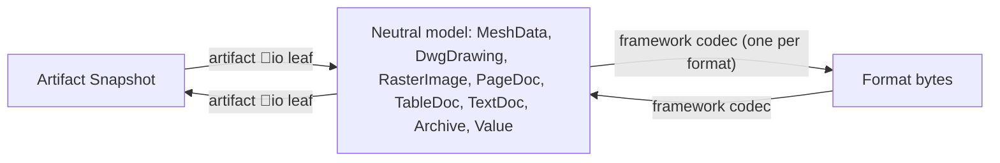

# Artifact IO Facet

Every artifact becomes importable and exportable to the repo's file-type catalog through a new required taxonomy facet, replacing today's scattered `register_2d_export_handlers` / `register_mesh_*` / `register_solid_*` / `register_dwg_*` calls buried in each `⚙️engine/🦀️.rs`.

## Target shape

```
✏️s/🔌️plugins/<plugin>/🗿️artifacts/<artifact>/
  🚪️io/
    🦀️.rs          ArtifactIo impl: declared format table + register()
    🟦️.ts
    🧊️glb/
      📥️import/{🦀️.rs, 🟦️.ts}
      📤️export/{🦀️.rs, 🟦️.ts}
    🎨️svg/  📷️png/  📄️pdf/  📊️csv/  …
```

Format dirs are plain grouping folders; `📥️import` and `📤️export` are the leaf parents. The `🚪️io` root holds the facet component, exactly as `🧬️mutations` does today.

## Why this does not become 54 x 26 codecs

Byte-level encoding lives once in the framework. Each artifact leaf only maps its snapshot to and from a neutral model:




`MeshData` and `DwgDrawing` already exist in [🧰️framework/🔨️modules/🔺️mesh/🦀️.rs](🧰️framework/🔨️modules/🔺️mesh/🦀️.rs). The other five are new.

## Closed format catalog

[📋️mimes.csv](🧰️framework/🔨️modules/🖼️assets/📃️list/📋️mimes.csv) becomes the single source of truth, trimmed to open/documented formats and extended with open formats already referenced in code.

- Remove: `.blend`, `.rvt`, `.3dm`, `.speckle`, `.doc`, `.xls`, `.ppt`, `.mp4`, `.mp3`
- Add: `.step`, `.ply`, `.las`, `.md`
- Result, 26 entries by neutral model:
  - MeshData: `glb`, `gltf`, `obj`, `stl`, `ply`, `las`
  - Brep (via `SolidExporter`): `step`, `ifc`
  - DwgDrawing: `dwg`, `dxf`, `svg`
  - RasterImage: `png`, `jpg`, `gif`, `bmp`, `tiff`
  - PageDoc: `pdf`, `docx`, `pptx`
  - TableDoc: `csv`, `xlsx`
  - TextDoc: `md`, `txt`
  - Archive: `zip`, `bcf`
  - Value: `json`

`MediaFormat` in [🧰️framework/🔨️modules/🔺️mesh/🦀️.rs](🧰️framework/🔨️modules/🔺️mesh/🦀️.rs) is renamed `MediaFormat` and grows to all 26 variants. A policy rule asserts CSV-to-enum parity, following the taxonomy-twin pattern.

## Coverage derivation

`required_os_media_export_formats(dimension, capability)` today only handles `2d`/`3d`/`5d` and silently returns nothing for `text`, `graph`, `data`, `computation`. It is replaced by

```rust
pub fn required_media_formats(media_type: MediaType, direction: MediaDirection) -> Vec<MediaFormat>
```

keyed on the full `MediaClass x MediaForm` lattice, so coverage is provable for all 8 classes. Five artifacts currently ship empty `dimension` / `media_type` and must be filled in: architect `🏛️program`, the 15 norm artifacts, energy `🔋️model`, trinity `♻️rewrite`, space `🏠️home`.

## Governance changes

Adding a required facet means updating the vocabulary plus its four twins:

- [🔣️taxonomy.json](🧰️framework/🛍️products/🦑️repo/🔨️modules/📚️library/🔣️taxonomy.json): `🚪️io` into `artifactChildDirs` and `artifactComponentDirs`; new `ioFormatChildDirs: ["📥️import","📤️export"]`; new `mediaFormatDirs` map from catalog name to emoji folder; `📥️import` and `📤️export` into `taxonomyLeafParentDirs`
- `artifactFacetChildDirs()` and `validateTaxonomy()` in [🔍️discovery/🟦️.ts](🧰️framework/🛍️products/🦑️repo/🔨️modules/📚️library/🔍️discovery/🟦️.ts) — needs a wildcard level for the format dir
- `validateTaxonomyTree` in [📇️registry/📜️script.ts](🧰️framework/🛍️products/💻️os/🔨️modules/🔌️plugin/📦️packages/🟦️typescript/📇️registry/📜️script.ts)
- `assert_taxonomy_components` in the plugin SDK `🦀️.rs`
- Root [📜️script.ts](📜️script.ts): `policyTaxonomyDirsBreaches` learns `🚪️io`, plus a new `policyArtifactIoBreaches` registered in `export const policy` with rule kinds `artifact-io/facet-completeness`, `format-coverage`, `leaf-parity`, `registration`, `no-engine-io`, `catalog-parity`, `roundtrip-test`

`.vscode/launch.json` is generated by `generateLaunchJson` in the registry script — new gate commands are added there, never by hand-editing the file.

## SDK and runtime

New traits in the plugin SDK, replacing the four ad-hoc registration families:

```rust
pub trait ArtifactImport { type Snapshot; const FORMAT: MediaFormat; fn import(bytes: &[u8]) -> Result<Self::Snapshot, IoError>; }
pub trait ArtifactExport { type Snapshot; const FORMAT: MediaFormat; fn export(snapshot: &Self::Snapshot) -> Result<Vec<u8>, IoError>; }
pub trait ArtifactIo { fn formats() -> &'static [IoFormatSpec]; fn register(); }
```

`⚙️engine::register()` reduces to calling `io::register()`. `ArtifactKindSpec.export_formats` / `import_formats` are derived from the facet rather than hand-listed, killing the current drift where note registers SVG/PNG/DWG handlers while its spec declares empty vectors. The OS keeps one handler map keyed `"{artifact_kind}:{format}"`, replacing the separate mesh, solid, 2D and DWG registries.

UI is already wired: `HostEffect::DownloadMediaExport` and `RequestFileOpen` plus the Space Studio `exportMedia` / `importMedia` actions. They gain their `accept` filter and format menu from the declared facet.

## Wave plan

Waves run sequentially; agents inside a wave run in parallel. Models: Cursor Grok 4.5 for design and governance waves, Composer 2.5 for mechanical fan-out.

- W0 — 1 agent. Read `repo://goals`, open the ticket via repo MCP `ticket_open`, write `📜️normative-spec.md`, `📋️fanout-brief.md`, `🧪owner-table.json` (54 artifacts with their derived format matrix). Note: the repo MCP server is configured in `.cursor/mcp.json` but is not currently loaded in this session and needs a reload first.
- W1 — 1 agent. Catalog: trim and extend `📋️mimes.csv`, rename and grow `MediaFormat`, add the parity policy rule.
- W2 — 7 agents in parallel, one per neutral model. Define the model and hand-roll every codec for its formats, each with a round-trip test.
- W3 — 1 agent. Taxonomy JSON plus all four twins plus `policyArtifactIoBreaches` plus launch.json generator entries.
- W4 — 1 agent. SDK traits, `required_media_formats` lattice, unified OS handler registry, coverage assertions, fill the five missing `media_type` declarations.
- W5 — 2 agents. Pilots: `🗒️note` (2D vector path) and `📐️cad` (3D brep path) end to end; their leaves become the verbatim reference in normative spec section 13.
- W6 — 32 agents in parallel, one per plugin. Write `🚪️io` leaves for every artifact in that plugin, wire `📦️glue.rs` and the TS barrel, delete the old registration calls from `⚙️engine`, run the scoped gate.
- W7 — 1 agent. TS/WASM bridge so the `🟦️.ts` leaves stop being throwing stubs, plus file-picker `accept` and export-menu wiring.
- W8 — 1 agent. Aggregate gate and `ticket_close`.

## Gates

Per-agent scoped gate, never the full `bun ./📜️script.ts policy`:

```bash
bun -e 'const m = await import("./📜️script.ts");
const b = m.policyArtifactIoBreaches(process.cwd()).filter(x => x.scope.includes("PLUGIN_DIR_FRAGMENT"));
console.log(b.length); for (const x of b) console.log(x.kind, "|", x.summary);'
```

Plus `cargo check -p CRATE` then `cargo test -p CRATE --lib` (macOS: `DEVELOPER_DIR=/Library/Developer/CommandLineTools`).

Final gate: `policyArtifactIoBreaches` 0, `policyTaxonomyDirsBreaches` 0, `validateTaxonomy` 0 problems, `assert_media_export_coverage` and `assert_media_import_coverage` green over all 54 artifacts, every declared format has a passing round-trip test, and `bun nx run @semio-tech/plugin-registry:generate` passes.

All temporary logs, scripts and reports live inside the ticket folder.