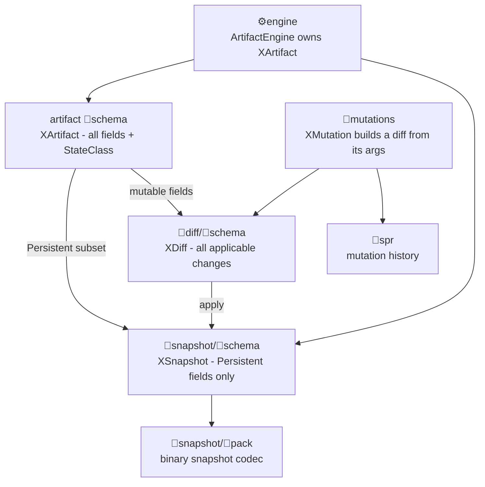

## Target shape

Per artifact (54 of them, under `✏️s/🔌️plugins/<plugin>/🗿️artifacts/<artifact>/`):

```
<artifact>/
  🧬️schema/                     NEW  — every field of the artifact, whatever its state class
    🦀️component.rs  🟦️component.ts  🔗️component.graphql  🔣️component.json  🛰️component.proto
  📸️snapshot/                   NEW facet
    🧬️schema/                   NEW  — only the persisted fields, no version history
      🦀️component.rs  🟦️component.ts  🔗️component.graphql  🔣️component.json  🛰️component.proto
    🎒️pack/                     MOVED here from the artifact root (it encodes exactly the snapshot)
  🔺️diff/                       KEPT (grammar + DiffCodec stay at its root)
    🧬️schema/                   NEW  — every change applicable to the artifact
      🦀️component.rs  🟦️component.ts  🔗️component.graphql  🔣️component.json  🛰️component.proto
  🧬️mutations/ 🔧️op/ 🗣️dsl/ 📡️spr/ ⚙️engine/ 📚️examples/   unchanged
```

Type naming per artifact `X`: `XArtifact` (full), `XSnapshot` (persisted), `XDiff` (delta). `XSnapshot` replaces today's `XProjection`.

Nothing is generated. All 810 leaves (54 × 3 × 5) are handcrafted; consistency is a **policy + runtime-test** property, not a codegen property. Within each facet the **JSON Schema leaf `🔣️component.json` is normative** and the other four are mirrors — the same spirit as the existing `artifactSpecFilenames` convention where `🗣️dsl`/`🔧️op`/`🔺️diff` carry `📖️component.grammar.semio` and `🎒️pack`/`📡️spr` carry `📡️component.protocol.semio`. It cannot literally reuse that map, though: `validateTaxonomy` asserts every `artifactSpecFilenames` value ends in `.semio`, so the schema leaves need their own key.

## Field state classes

The artifact schema is the union of what is today spread across three places — the persisted projection, `DocumentApp::Config`, `DocumentApp::Draft` — plus engine-derived values. Each field carries the kernel's existing `StateClass` (`Persistent`, `SharedUi`, `LocalUi`, `Preview`, `Effect`, defined at [🧰️framework/🛍️products/💻️os/🔨️modules/📡️spr/🧾️wire/🦀️component.rs](🧰️framework/🛍️products/💻️os/🔨️modules/📡️spr/🧾️wire/🦀️component.rs) lines 166-198), expressed per format:

- JSON Schema (normative): `"x-semio-state": "persistent"` on each property.
- Rust: new derive `schema::ArtifactSchema` (in the framework schema module's Rust package) accepting `#[state(persistent)]` field attributes and emitting `field_states()`.
- TypeScript: `/** @state persistent */` JSDoc per property.
- GraphQL: `@state(class: PERSISTENT)` directive, declared once in a shared SDL preamble owned by the framework schema module.
- Protobuf: `// @state persistent` leading comment per field.

Lowpoly is the concrete illustration: [✏️s/🔌️plugins/💠️lowpoly/🗿️artifacts/💠️lowpoly/🦀️component.rs](✏️s/🔌️plugins/💠️lowpoly/🗿️artifacts/💠️lowpoly/🦀️component.rs) documents that "active object, selection, utilities, camera, brush live in the plugin's app config, never here" — those become `SharedUi`/`LocalUi` fields of `LowpolyArtifact`, while `objects` stays `Persistent` and appears in `LowpolySnapshot`.

## Mechanisms to change

**Taxonomy** — [🧰️framework/🛍️products/🦑️repo/🔨️modules/📚️library/🔣️taxonomy.json](🧰️framework/🛍️products/🦑️repo/🔨️modules/📚️library/🔣️taxonomy.json):

- New `schemaFormats` registry (the extension point for the "…" in the request): format id to leaf filename, for `🦀️rust`, `🟦️typescript`, `🔗️graphql`, `🔣️jsonschema`, `🛰️protobuf`. This must be its own key, **not** entries in `taxonomyLeafFilenames` or `ecosystems` — `validateTaxonomy` cross-asserts `taxonomyLeafFilenames[lang] === ecosystems[lang].leafFilename`, and GraphQL/JSON Schema/Protobuf are formats, not package ecosystems. Adding a sixth format later is one JSON entry plus one scanner extractor.
- `artifactComponentDirs`: add `🧬️schema` and `📸️snapshot`, remove `🎒️pack` (now nested).
- `artifactChildDirs`: same plus `📚️examples`.
- New `snapshotChildDirs: ["🧬️schema", "🎒️pack"]` and `diffChildDirs: ["🧬️schema"]`, following the `mutationChildDirs` precedent.
- `taxonomyLeafParentDirs`: add `🧬️schema`.
- `artifactSpecFilenames`: rekey `🎒️pack` to `📸️snapshot/🎒️pack`. The `🧬️schema` normative leaf goes in a new `artifactSchemaSpecFilenames` key instead, because of the `.semio` invariant noted above.
- New `validateTaxonomy` clauses for `schemaFormats`, `snapshotChildDirs`, `diffChildDirs` and the new spec map, mirroring the existing `mutationChildDirs` clause.
- Emoji check (verified against every tracked path segment): `🛰` is unused repo-wide, so `🛰️component.proto` is free. `🔗` already means GraphQL (`🔗️schema.graphql`, `🔗️graphql`) and `🔣` already means JSON (`🔣️taxonomy.json`, `🔣️json`), so those two leaf names extend existing conventions. `🧬` and `📸` are each already in use elsewhere (`🧬️mutations` and the framework `🧬️schema` module; the `📸️remodel` plugin), but at different namespace levels — the taxonomy already tolerates that, exactly as `🔺️` serves both the `🔺️diff` facet and the diff example-asset prefix.

**Taxonomy consumers** (three twins must move together): `validateTaxonomy` (line ~163) in the discovery library `🟦️component.ts`, `validateTaxonomyTree` (line ~944) in [🧰️framework/🛍️products/💻️os/🔨️modules/🔌️plugin/📦️packages/🟦️typescript/📇️registry/📜️script.ts](🧰️framework/🛍️products/💻️os/🔨️modules/🔌️plugin/📦️packages/🟦️typescript/📇️registry/📜️script.ts), and `assert_taxonomy_components` (line ~1594) in [🧰️framework/🛍️products/💻️os/🔨️modules/🔌️plugin/🦀️component.rs](🧰️framework/🛍️products/💻️os/🔨️modules/🔌️plugin/🦀️component.rs). The Rust twin hardcodes its facet list and is **already stale** — its `EXAMPLE_KINDS` still names the plural dirs (`🗣️dsls`, `🎒️packs`, …) that `forbiddenExamplePluralDirs` now bans — so W1 makes it read the taxonomy JSON rather than adding a seventh hardcoded entry.

Both `validateTaxonomyTree` and `policyTaxonomyDirsBreaches` (line 3948) walk artifact children **flat** today. `📸️snapshot/🎒️pack` and the three `🧬️schema` dirs are the first nested facets outside `🧬️mutations`, so both walkers need one more level, driven by `snapshotChildDirs`/`diffChildDirs`.

**Policy** — new region `//#region 🔧️PolicyRuleArtifactSchemas` in [📜️script.ts](📜️script.ts), placed after `🔧️PolicyRuleMutationArtifactEngines` (line 5129) and modelled on it exactly: `policy*Breaches` functions (there are no `PolicyRule` classes) returning `BreachRecord[]` with `id`/`summary`/`kind`/`scope`/`priority`/`reason`/`solution`, aggregated by one `policyArtifactSchemaBreaches(repoRoot)`, registered in `export const policy` (line 5374) and added to `VerifyScript.runGate()` next to `policyHandcraftedSpecP3Breaches`. There is deliberately **no new nx target or launch entry**: `policy` is not a root `📋️project.json` target, it is the synthetic `breach-script_ts:lint` project that `🟨️nx-plugin.mjs` derives from `export const policy`, and `.vscode/launch.json` carries zero verification entries by design. Rules covered:

- facet completeness: all three `🧬️schema` dirs exist, each with all five format leaves.
- **field parity**: a per-format field extractor (Rust struct fields, TS interface members, GraphQL type fields, JSON Schema `properties`, proto message fields) normalising case per format (Rust/proto snake, TS/GraphQL/JSON camel) and asserting all five leaves declare the identical field set with identical optionality and cardinality. This is the scanner that replaces a compiler.
- state-class parity: the snapshot schema field set equals exactly the `Persistent` fields of the artifact schema.
- diff coverage: every mutable artifact-schema field has a corresponding diff-schema entry.
- type-name parity: `XArtifact`/`XSnapshot`/`XDiff` named identically across all five leaves.
- pack relocation: no `🎒️pack` directly under an artifact root.

**Framework schema module** — [🧰️framework/🔨️modules/🧬️schema/🦀️component.rs](🧰️framework/🔨️modules/🧬️schema/🦀️component.rs) already owns a `SchemaCatalog` over `schemars` + `jsonschema`. Extend it with an `ArtifactSchemaDescriptor` (artifact id plus `include_str!` handles for all five leaves at all three levels), a registry, the `ArtifactSchema` derive, the shared GraphQL `@state` directive preamble, and a TypeScript twin. Its existing test file gains one table-driven test that, for every registered artifact, serialises a default `XSnapshot`, validates it against the handcrafted `🔣️component.json`, and asserts `field_states()` matches `x-semio-state` — runtime proof rather than a static claim, and no new test file.

**Kernel** — rename the document-state noun from `Projection` to `Snapshot` (544 files mention `Projection` today; the `🛢️db/📽️projection` read-model module keeps the word, so the rename actually disambiguates two concepts). Touches `DocumentApp::Projection`, `ArtifactEngine::Projection`, `DocumentStore<P, Mutation>`, `DocumentVcs.initial_projection`, `Mutation<P>`/`MutationDiff<P>` docs. `ArtifactEngine` additionally gains `type Artifact` plus `fn artifact(&self) -> &Self::Artifact`, so the engine owns the full artifact state and `snapshot()` is its persisted projection.

**Per-plugin wiring** — each plugin's `📦️glue.rs` re-`#[path]`s `artifacts::<a>::pack` to `artifacts::<a>::snapshot::pack` and mounts `schema`, `snapshot::schema`, `diff::schema`; the TS glue mirrors it. Because each agent owns exactly one plugin's glue file, this is conflict-free.

## Flow after the change



## Waves and workforce

Models: `cursor-grok-4.5-high` for contract, kernel and heavy artifacts; `composer-2.5` for mechanical fan-out. File-ownership rule: only W1/W2/W3/W8 agents touch taxonomy, root `📜️script.ts`, kernel or framework modules; fan-out agents are scoped to exactly one plugin crate each.

- **W0** (1 Grok, serial): open the ticket under goal `AI-OPTIMIZED-REPO` (the same goal the mutations refactor used; nothing in the goal tree fits better), with `client: cursor-chat` and `llm: cursor-grok-4.5-high`. The repo MCP was unavailable for several waves of the last refactor, so if `ticket_open` fails, write `🎫️ticket.json` directly with the fields that ticket carries (`id`, `title`, `status`, `goal`, `due`, `client`, `llm`, `description`) and record the outage in the folder. Then write the normative spec into the ticket folder — facet layout, `schemaFormats` registry, type naming, the five per-format state-class annotation conventions, per-format casing rules, the exact parity rules, and the finished lowpoly leaves quoted verbatim. Every later agent reads only this document.
- **W1** (1 Grok, serial): `🔣️taxonomy.json` plus its three twins (discovery `validateTaxonomy`, registry `validateTaxonomyTree` with the nested walk, Rust `assert_taxonomy_components` converted from hardcoded to taxonomy-driven). Gate: `bun nx run @semio-tech/plugin-registry:check`.
- **W2** (1 Grok, **serial after W1**): the `🔧️PolicyRuleArtifactSchemas` region in root `📜️script.ts`, the five per-format field extractors, the nested-facet fix in `policyTaxonomyDirsBreaches`, and the `verify gate` hook. Gate: `bun ./📜️script.ts policy` reports 54 unmigrated artifacts and nothing else new. W1 and W2 are deliberately serial rather than parallel: the last refactor ran this exact pair concurrently and wave 2a could not run its own tests because wave 2b had root `📜️script.ts` in a temporarily broken state, and root `📜️script.ts` imports `loadTaxonomy` from the file W1 edits.
- **W3** (1 Grok, serial): kernel `Projection` to `Snapshot` rename inside the kernel crate, `ArtifactEngine::Artifact`, and the framework `🧬️schema` module extension (descriptor, registry, `ArtifactSchema` derive, GraphQL preamble, TS twin, parity test). Gate: `cargo check -p semio-framework-os-kernel` and `cargo test -p semio-framework-schema`.
- **W4** (1 Grok, serial): lowpoly pilot end to end — 15 leaves, `🎒️pack` moved under `📸️snapshot`, glue rewired, `LowpolySnapshot`, `LowpolyArtifact`, `LowpolyDiff` normalised from its current mutation-list form to a field-delta form, descriptor registered, policy green for lowpoly. Gate: `cargo test -p semio-s-plugin-lowpoly --lib`. This is the reference every fan-out agent diffs against.
- **W5** (fan-out, about 10 concurrent, one plugin crate per agent, 31 plugins): Grok for architect (also carries the pre-existing `🗄️registers`/`🧱️kernel` taxonomy breach), cad (also `🎬️interaction-spec`), shooting, remodel, process, draw, procedural, flow, gis, puzzle, block, fem, trinity. Composer for norm (15 artifacts, split across 3 agents by artifact group), note, forms, layout, playbook, imperative, sequence, raster, vcs, dag, reasoning, space, sourcing, writer, mathematical, animate, and the two currently incomplete artifacts `🎪️demonstrator/🎪️playground` and `🔋️energy/🔋️model`. Gate per agent: `cargo check -p <crate>` then its `:test` target then `bun ./📜️script.ts policy` scoped to its plugin. Where a crate is split across agents, a designated glue integrator makes the single `📦️glue.rs` edit at the end of the wave.
- **W5-fixup** (1 Grok, serial, budgeted in advance rather than discovered): the previous fan-out finished 22 of 32 crates green, and every one of the 10 failures was a *shared* surface rather than the agent's own plugin folder — the `semio_framework_core` alias, `infinite`/`dag` re-exports, `store_sync` under `os-host-full`, trinity `lex`, animate engine paths. This wave owns exactly those cross-plugin surfaces and drives all 32 crates to green.
- **W6** (2 agents parallel): 6a Grok completes the `Projection` to `Snapshot` sweep across framework/os non-kernel, renderer, hub and os apps; 6b Composer does the TypeScript side — renderer elements, backbone worker, react target re-exports, vitest suites. Run vitest directly (`bunx vitest run` in the package) as the last refactor had to — the nx wrappers hit budget limits.
- **W7** (1 Composer, serial): register every artifact's GraphQL and JSON Schema leaf with the hub/OS schema catalog so the schemas are load-bearing rather than decorative, and confirm at runtime with a console-logged catalog dump.
- **W8** (1 Grok, serial): full gate — `bun nx run workspace:verify-gate`, `bun ./📜️script.ts policy`, `cargo check`/`test` across plugin crates, `bun nx run @semio-tech/framework-renderer-react:test`, registry `generate` to refresh `.vscode/launch.json`, a zero-legacy `Projection` sweep excluding the db read-model, then `ticket_close`.

Lessons carried over from the mutations refactor, which used this exact wave shape and left its per-wave reports in the ticket folder: ownership must be disjoint **by tree** (kernel vs taxonomy vs root script vs one plugin), never by feature across trees; two agents must never share a file even transiently; each wave needs a scoped gate rather than a monorepo-wide one; and a fixup wave for shared crates and re-exports is a certainty, not a risk. There is no repo-enforced file lock — ownership is convention plus wave reports — so W4 ends by quoting the pilot's finished leaves into the normative spec and W5 agents are instructed to diff against them rather than improvise.

## Verification

- `bun ./📜️script.ts policy`
- `bun nx run workspace:verify-gate`
- `bun nx run @semio-tech/plugin-registry:check`
- `cargo check -p semio-framework-os-kernel`, `cargo test -p semio-framework-schema`, `cargo check -p semio-s-plugin-<name>` per plugin
- `bun nx run @semio-tech/framework-renderer-react:test`
- On macOS, Rust link steps need `DEVELOPER_DIR=/Library/Developer/CommandLineTools`.

## Out of scope

- compose's `schema.golden.graphql` and its `async-graphql` code-first pipeline — a separate technology, not to be mixed.
- Adding python/go/dotnet schema formats; the `schemaFormats` registry makes them a later one-entry addition.
- Editing any `AGENTS.md` glossary that still defines `Projection`; that needs your own change or an explicit exception.
