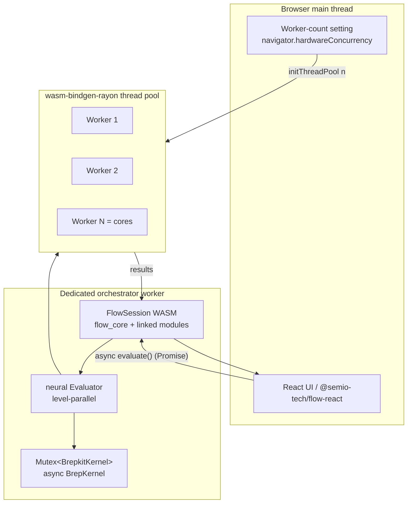

# Async BREP + Parallel Neural + Threaded Flow

## Goal

- `geometry/brep` Rust kernel becomes a fully **async** trait + impl.
- `neural/engine` evaluates the DAG **in parallel** (independent neurons run concurrently).
- `flow` runs heavy compute (booleans, fillet, tessellate) on **WASM shared-memory threads** (`wasm-bindgen-rayon`), off the main thread.
- The **UI never blocks**: the flow session runs on a dedicated worker; the main thread `await`s results.
- Thread pool sized to **`navigator.hardwareConcurrency`**, with a **configurable** worker-count setting.

## Chosen architecture (per your answers)

- Parallelism = WASM shared-memory threads via `wasm-bindgen-rayon` (one shared linear memory / `SharedArrayBuffer`, requires cross-origin isolation).
- `BrepKernel` trait + `BrepkitKernel` impl become genuinely async (`async-trait`), plus an async TS API.

## Key constraints discovered

- Rayon worker threads (Web Workers) cannot synchronously call the main-thread JS `EvalBridge`. So flow module `Operation` impls must be **linked into `flow_core` as `rlib`s** (in-WASM registry) instead of the per-module-cdylib + JS bridge path in [flow/core/lib.rs](flow/core/lib.rs) (`evaluate_internal`, `EvalBridge`) and [flow/react/index.tsx](flow/react/index.tsx) (`createFlowEvalBridge`, `FLOW_MODULE_LOADERS`).
- `brep` kernel is `thread_local!` with opaque string handles in [flow/module/brep/lib.rs](flow/module/brep/lib.rs) (`with_kernel`). Must become a shared `Mutex<BrepkitKernel>` so handles stay valid across threads.
- `wasm-bindgen-rayon` requires **nightly Rust + `-Z build-std`** with `+atomics,+bulk-memory`, and **cross-origin isolation** (COOP/COEP). Existing iframe embedding uses `frame-ancestors *` in [ui/styling/vite-elements-assets.ts](ui/styling/vite-elements-assets.ts) (`playgroundIframeEmbedHeadersPlugin`); use `COEP: credentialless` + a single-thread fallback when `crossOriginIsolated` is false.

## Phase 1 - Threaded WASM build + cross-origin isolation (foundation)

- Add `rust-toolchain.toml` at repo root: nightly channel, components `rust-src`, target `wasm32-unknown-unknown` (none exists today).
- Extend `runWasmPackWebBuild` in [repo/lib/js/index.ts](repo/lib/js/index.ts) with a `threads?: boolean` option that, when set, runs wasm-pack with `RUSTFLAGS="-C target-feature=+atomics,+bulk-memory,+mutable-globals"` and `-Z build-std=panic_abort,std`. Add generated `snippets/**` (wasm-bindgen-rayon worker helper) to each pkg `files` whitelist.
- Add COOP/COEP to dev + preview + build hosting: extend `playgroundIframeEmbedHeadersPlugin` in [ui/styling/vite-elements-assets.ts](ui/styling/vite-elements-assets.ts) to also set `Cross-Origin-Opener-Policy: same-origin` and `Cross-Origin-Embedder-Policy: credentialless`; mirror in [compose/client/lib/sketchpad/play/vite.config.ts](compose/client/lib/sketchpad/play/vite.config.ts). Document Electron/static-host header requirement.

## Phase 2 - Async geometry BREP kernel

- [geometry/brep/engine/lib.rs](geometry/brep/engine/lib.rs): convert `BrepKernel` to an object-safe async trait via `async-trait` (all 18 methods `async fn`: `box_prim`, `fuse`, `cut`, `intersect`, `fillet`, `chamfer`, `tessellate`, `volume`, ...). Add `async-trait` to [geometry/brep/engine/Cargo.toml](geometry/brep/engine/Cargo.toml).
- [geometry/brep/brepkit/lib.rs](geometry/brep/brepkit/lib.rs): implement the async trait. Heavy `brepkit_operations` calls (boolean/fillet/tessellate) run inside `rayon` so the kernel keeps using multiple cores; the async layer makes callers `await`-able. Add `rayon` + `wasm-bindgen-rayon` (wasm target) and `async-trait`/`futures` to [geometry/brep/brepkit/Cargo.toml](geometry/brep/brepkit/Cargo.toml).
- Async TS bridge: make `tessellateGeometry` and friends in [geometry/brep/js/index.ts](geometry/brep/js/index.ts) truly offload (resolve via worker) rather than blocking on a sync WASM export.

## Phase 3 - Parallel neural evaluator

- [neural/engine/lib.rs](neural/engine/lib.rs): in `Evaluator::evaluate_channels_with`, replace the sequential `for neuron_id in topo_order` loop with **level (antichain) batching**: group nodes with no inter-dependencies and run each level via `rayon` parallel iteration. `Operation: Send + Sync` already holds.
- Change the dispatch hook from `&mut dyn FnMut(&str, &Dictionary)` to a `Sync` callable (`&(dyn Fn(...) + Sync)`) so it is callable from rayon threads; thread per-level outputs back into the shared `outputs` map.
- Gate behind a `parallel` cargo feature (rayon) with a serial fallback for non-threaded targets. Add `rayon`/`wasm-bindgen-rayon` to [neural/engine/Cargo.toml](neural/engine/Cargo.toml).

## Phase 4 - In-WASM flow registry + threaded session

- Make each `flow/module/*` crate dual: keep `cdylib`, add `rlib` exporting a `register(&mut Registry)`; link all modules into `flow_core`. Build a real in-process `Registry` in [flow/core/lib.rs](flow/core/lib.rs) `evaluate_internal` instead of the empty registry + JS `EvalBridge`.
- Convert brep state to shared, thread-safe storage: replace `thread_local! KERNEL` / `with_kernel` in [flow/module/brep/lib.rs](flow/module/brep/lib.rs) with `static KERNEL: Mutex<BrepkitKernel>` (handles valid across rayon threads; booleans serialize on the mutex, everything else parallel).
- Initialize the rayon pool: expose `#[wasm_bindgen] init_thread_pool(n)` (re-export `wasm_bindgen_rayon::init_thread_pool`) from `flow_core`; call once before first evaluate.
- Make `FlowSession.evaluate()` async at the JS boundary (returns a Promise) in [flow/core/lib.rs](flow/core/lib.rs) and the React caller.

## Phase 5 - UI never blocked + worker config

- Move `FlowSession` into a dedicated orchestrator worker in [flow/react/index.tsx](flow/react/index.tsx) (new `flow.worker.ts`, message/Comlink RPC). `evaluate` in `useFlowSession` becomes `async`; main thread `await`s. Add debounce/coalescing for rapid edits (sliders today re-run the whole graph with no throttle).
- Worker-count setting: extend `SettingsHostApi` + `buildFrameworkSettingsGeneralTree` in [framework/product/platform/renderer/react/index.tsx](framework/product/platform/renderer/react/index.tsx) with a "Performance / Workers" control; persist via new `readStoredComputeWorkerCount` / `writeStoredComputeWorkerCount` (key `ui.compute.workerCount`) in [ui/react/index.tsx](ui/react/index.tsx), default `navigator.hardwareConcurrency`. Feed the value into `init_thread_pool(n)`.
- Runtime guard: if `crossOriginIsolated` is false or threads unavailable, fall back to a 1-thread pool (kept off the UI thread via the orchestrator worker) and surface a notice.

## Risks / call-outs

- Nightly toolchain + `build-std` increases build time and CI complexity (new requirement repo-wide for threaded wasm crates).
- COOP/COEP cross-origin isolation can restrict third-party iframe/script loading; `credentialless` mitigates but verify embeds and external assets.
- Linking modules into `flow_core` changes the runtime-loadable-module model (see `.repo/.../FLOW-RUNTIME-LOADABLE-MODULES`); standalone module cdylibs stay for non-threaded contexts.
- Native (Electron/Node/tests) keeps native rayon and `tokio`-style awaiting; the async trait benefits native callers too.

## Validation

- `cargo test -p geometry_brep_engine -p geometry_brep_brepkit -p neural_engine -p flow_core` (serial-feature path).
- Build threaded wasm for `flow_core`; confirm `crossOriginIsolated === true` and `init_thread_pool(navigator.hardwareConcurrency)` spawns N workers.
- Manual: drag a slider feeding a boolean-on-solids graph; confirm UI stays responsive and worker count tracks the setting.
