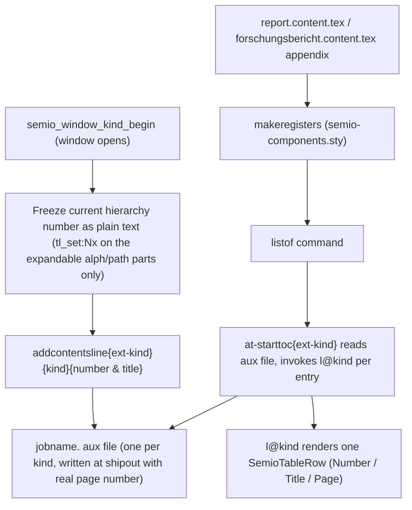

# Automatic Figure/Table Registers for Print Reports

## Goal

Every `Image`/`Photo`/`Figure`/`Table`/... window occurrence should automatically register itself, so reports can render a "Verzeichnisse" (registers) section listing all figures, tables, listings, theorems, etc. — separated by kind, in appendix/back matter, without any manual bookkeeping in the `.content.tex` files.

## Current state (from investigation)

- [print/tex/semio-window.sty](print/tex/semio-window.sty) defines 14 window kinds across 3 tiers via `\semio_window_kind_define:nnnn` (line 113-126), each with its own counter (e.g. `semiofigure`, `semiotable`) and a `Kind: number` chip header rendered in `\semio_window_kind_begin:nnn` (line 83-100).
- [print/tex/semio-core.sty](print/tex/semio-core.sty) already anticipates this feature: `\semio@hierarchy@hooks@install` (line 311) wires chip-suppression hooks for `tableofcontents`, `listoffigures`, `listoftables` — but no code ever writes entries or calls those commands.
- No `\caption`, no LaTeX floats, no `tocloft`/`etoc`/`caption` package anywhere — figures/tables are custom `tcolorbox` "windows", not floats, so the native `\listoffigures`/`\listoftables` (which read `.lof`/`.lot` populated by `\caption`) are currently inert.
- [print/tex/semio-table.sty](print/tex/semio-table.sty) already provides `SemioTableBegin`/`SemioTableHeaderRow`/`SemioTableRow`/`SemioTableEnd` — the OS-chrome-styled row primitives every data table in the project uses.
- Both long-form templates ([print/template/report/report.content.tex](print/template/report/report.content.tex), [print/template/zukunftbau/forschungsbericht.content.tex](print/template/zukunftbau/forschungsbericht.content.tex)) already call `\tableofcontents` up front; `forschungsbericht.content.tex` already has an **empty placeholder** appendix chapter `\chapter{Verzeichnisse und Anlagen}` (line 46) — the natural home for the new registers.

## Decisions (confirmed)

- Build a **generic** mechanism covering all 14 window kinds (not just figure/table).
- Each kind gets its **own separate list** (List of Images, List of Photos, List of Figures, List of Tables, List of Listings, ... — no aggregation).
- `\tableofcontents` stays exactly where it is today (front matter); **all** the new lists render together in the appendix/back matter.

## Design

### 1. `print/tex/semio-core.sty` — plural kind-label maps

Add a plural counterpart to the existing `semio_kind_label_de:n` / `_en:n` machinery (region `Kinds`, near line 99-159 and the registration block at line 211-254): `\semio@kind@label@plural@de@<kind>` / `@en@<kind>` for all 14 window kinds (e.g. `figure` → `Abbildungen`/`Figures`, `table` → `Tabellen`/`Tables`, `abbreviations` → `Abkürzungen`/`Abbreviations`, etc.), plus lookup helpers mirroring `\semio@kind@label`. These feed the list titles ("Verzeichnis der Abbildungen" / "List of Figures") and column headers ("Nr." / "Titel" / "Seite" vs "No." / "Title" / "Page", added once, language-driven like the rest of the doc).

### 2. `print/tex/semio-window.sty` — generic registration + list rendering

- Extend `\semio_window_kind_define:nnnn` → `:nnnnn` (5th arg = plural key) for all 14 `\semio_window_kind_define` calls (line 113-126).
- Inside `\semio_window_kind_begin:nnn` (line 83-100), right after the header is rendered (so the hierarchy-path/slot counters hold their final, just-displayed values), capture the number as **plain, already-expanded text** via `\tl_set:Nx` on only the expandable parts (`\alph{semio@window@slot}` + `\g_semio_hierarchy_path_tl`), and call `\addcontentsline{<kind>}{<kind>}{<frozen-number> & <title>}` using the kind's own machine name as the aux extension. This reuses LaTeX's battle-tested `\protected@write` mechanism so the page number is correctly resolved at shipout — no custom two-pass bookkeeping needed. The kind-label word itself is deferred (invariant, language-only), everything position-dependent is frozen immediately.
- Define one `\l@<kind>` macro per kind (or a single parametrized generator) that renders an entry as `\SemioTableRow{<number> & <title> & <page>}`.
- Add `\listof<Plural>` for all 14 kinds (`\listoffigures`, `\listofimages`, `\listofphotos`, `\listoftables`, `\listoflistings`, `\listofpseudocodes`, `\listoftheorems`, `\listoflemmas`, `\listofproofs`, `\listofequations`, `\listofglossaries`, `\listofabbreviations`, `\listofblockquotes`, `\listofepigraphs`). Each:
  - Skips entirely if `\value{<kindcounter>}=0` (no empty headers for unused kinds).
  - Renders a muted chip heading (reusing `\semio@heading@title@end@muted`, matching the existing chip-suppressed-TOC look) with the localized list title.
  - Wraps `\@starttoc{<kind>}` in `\SemioTableBegin{...}\SemioTableHeaderRow{...} ... \SemioTableEnd` (custom 3-column spec: narrow number / wide title / narrow right-aligned page, via the existing raw-colspec fallback path in `\semio_table_begin_cols:n`).
- Generalize `\semio@hierarchy@hooks@install` (currently only wired for `tableofcontents`/`listoffigures`/`listoftables`) to install the chip-disable/enable hook for all 14 new `\listof<Plural>` commands.

### 3. `print/tex/semio-components.sty` — `\makeregisters`

Add a new component macro, following the existing naming convention of `\makecoverpages`/`\makefundingacknowledgement`/`\makeworkpackages`, that calls all 14 `\listof<Plural>` commands in tier order (visual, then logical, then structural). Each call already self-skips when empty, so a report using only `Figure`+`Table` only prints those two registers.

### 4. Templates

- [print/template/report/report.content.tex](print/template/report/report.content.tex): add `\appendix` + `\chapter{Verzeichnisse}` + `\makeregisters` before `\end{document}` (currently has no appendix at all).
- [print/template/zukunftbau/forschungsbericht.content.tex](print/template/zukunftbau/forschungsbericht.content.tex): fill the existing empty `\chapter{Verzeichnisse und Anlagen}` (line 46) with `\makeregisters` (leaving room below for future "Anlagen"/attachments content).
- `\tableofcontents` position is untouched in both.

## Verification

- Build via `bun ./📜️script.ts build report forschungsbericht` (Tectonic) for both light/dark variants and confirm no compile errors (multi-pass aux resolution).
- Rasterize/screenshot the appendix pages of both PDFs (matching the repo's existing rasterize-verify convention used in `PRINT-HEADING-COLOR-SCHEME`) to visually confirm: correct localized titles, correct per-kind numbering matching the in-body chip numbers, correct page numbers, and that unused kinds (e.g. `Photo`, `Theorem`) don't render empty sections.

## Process

- Open a repo ticket (goal `🎯️r2602`, matching the sibling `PRINT-HEADING-COLOR-SCHEME`/`PRINT-GLASS-PANELS`/`PRINT-WINDOW-ELEMENT-TAXONOMY` tickets) before implementing, per repo workflow rules.

[{"id":"ticket","content":"Open repo ticket under goal r2602 for this feature"},{"id":"plural-labels","content":"Add plural DE/EN kind-label maps to semio-core.sty"},{"id":"registration","content":"Extend semio_window_kind_define to 5 args (plural key) and update all 14 call sites"},{"id":"aux-write","content":"Add frozen-number addcontentsline write inside semio_window_kind_begin"},{"id":"list-render","content":"Add per-kind l@ entry macro + 14 listof commands using SemioTable styling"},{"id":"hooks","content":"Generalize chip-suppression hook installer to all 14 list commands"},{"id":"makeregisters","content":"Add makeregisters to semio-components.sty"},{"id":"templates","content":"Wire appendix + makeregisters into report.content.tex and forschungsbericht.content.tex"},{"id":"verify","content":"Build report+forschungsbericht (light/dark) and visually verify rasterized appendix pages"},{"id":"ticket-close","content":"Close the ticket with summary and touched files"}]
