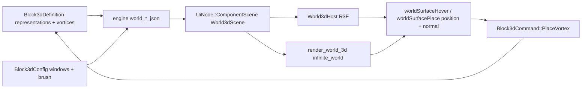

# Block 3D as the Type Editor: Representation Window and Vortex Brush

## Context

`block3d` already is the conceptual successor of the compose `type` app: one `ObjectKind` with `representations` (meshes at LOD/tags) and rim `vortices`. What is missing is the editor itself. Today [the world body](✏️s/🔌️plugins/🧱️block/🎛️apps/🧊️3d/🔨️modules/🖱️ui/⚡️implementations/🦀️rust/📦️lib.rs) renders three lines of text:

```163:174:✏️s/🔌️plugins/🧱️block/🎛️apps/🧊️3d/🔨️modules/🖱️ui/⚡️implementations/🦀️rust/📦️lib.rs
fn render_world(definition: &Block3dDefinition, active_representation_id: Option<&str>, labels: &Block3dLabels) -> UiNode {
    let mesh_url = active_representation_id
        // ...
    ui_stack_vertical(vec![
        ui_text(Label::data(format!("{}: {}", labels.summary.as_str(), ...))),
        ui_text(Label::data(format!("mesh: {mesh_url}"))),
        ui_text(Label::data(format!("{} {}", definition.vortices.len(), labels.vortices.as_str()))),
    ])
}
```

Everything needed downstream already exists: the `/mesh` GLB route is registered for `block3d-play` in the [plugin manifest Cargo.toml](✏️s/🔌️plugins/🧱️block/🛂️manifest/🗿️artifact/⚡️implementations/🦀️rust/Cargo.toml), and the [nakagin-capsule example](✏️s/🔌️plugins/🧱️block/🎛️apps/🧊️3d/⚡️implementations/🦀️rust/📚️examples/🧱️nakagin-capsule.block3d) already carries two representations with real mesh urls and one vortex.

The reference implementation for a World3d app is [puzzle3d's ui crate](✏️s/🔌️plugins/🧩️puzzle/🎛️apps/🧊️3d/🔨️modules/🖱️ui/⚡️implementations/🦀️rust/📦️lib.rs) (`build_world_3d_scene`, `world_instances_geometry_json`, `world_vortices_json`, `UtilityDefinition`, `window_measures`).

## Step 0: repair the broken UI crate

[block_3d_ui](✏️s/🔌️plugins/🧱️block/🎛️apps/🧊️3d/🔨️modules/🖱️ui/⚡️implementations/🦀️rust/📦️lib.rs) does not currently compile: `handle`'s arms are missing closing parens (lines 261-297) and a test sits after `mod tests`' closing brace (lines 511-515). Fix in place, then `cargo test -p semio-s-app-block-3d-ui` as the baseline before any feature work.

## Step 1: framework — report mesh surface hits (point + normal)

Neither renderer reports a mesh hit point with its normal today; picks carry only identity (`granularity` + index/id). Normals exist only on React's `worldFaceDragEnd`. Add one symmetric capability, keyed on the active utility id `surfaceBrush`.

- [kernel 3d scene](✏️s/🔨️modules/🧊️3d/🎬️scene/⚡️implementations/🦀️rust/📦️lib.rs): extend `RayMeshHit` with world-space `point: Vec3` and `normal: Vec3` (geometric triangle normal from the world-transformed vertices). Existing callers (`face` pick, `pick_paint_hit`) ignore the new fields.
- [infinite world](🧰️framework/🛍️products/💻️os/🔨️modules/♾️infinite/⚡️implementations/🦀️rust/🌍️world/📦️lib.rs): in `handle_world3d_pointer_move` / `handle_world3d_pointer_button`, when `interaction_mode == "surfaceBrush"`, ray-pick the instance meshes via `ray_pick_mesh_detail` and dispatch the new actions instead of hover/select.
- [react renderer](🧰️framework/🛍️products/💻️os/🔨️modules/📺️renderer/🧑️‍🎨️engine/⚛️react/⚡️implementations/🟦️typescript/📦️index.tsx): in the instance pointer handlers of both branches (embedded `mesh.data` and the GLB `<group>`), when `surfaceBrush` is active, derive `event.point` and `event.face.normal.clone().transformDirection(event.object.matrixWorld).normalize()` and dispatch. Add `"surfaceBrush"` to `worldInstancePickBlocked`.

New shared view-action contract:

- `worldSurfaceHover` with `{ pane, objectId, position: [x,y,z], normal: [x,y,z] }`
- `worldSurfacePlace` with the same args (pointer-up / click)
- `worldSurfaceLeave` with `{ pane }` when the ray misses

The brush ghost needs no renderer work: block3d emits the preview as an extra row in `vortices_json` with a dimmed color, which both renderers already draw.

## Step 2: block3d config, ops, protocol

[engine](✏️s/🔌️plugins/🧱️block/🎛️apps/🧊️3d/🔨️modules/⚙️engine/⚡️implementations/🦀️rust/📦️lib.rs) — extend `Block3dConfig` (keep the DSL-table style, no maps):

- `windows: Vec<Block3dWindowView>` with `window_id`, `representation_ids` (empty means all), `arrangement` (`overlap` / `x` / `y` / `z`), `spacing`, `active_utility` — per window instance, keyed the way [puzzle2d keys `active_utility_by_window_id](✏️s/🔌️plugins/🧩️puzzle/🎛️apps/◻2d/🔨️modules/🖱️ui/⚡️implementations/🦀️rust/📦️lib.rs)`
- `brush_vortex_kind_id: Option<String>`, `brush_radius: f64`, `brush_flip: bool`
- `brush_preview: Option<Block3dBrushPreview>` (`position`, `normal`)
- `camera: Option<BlockCamera3d>` so orbiting does not dirty the document; falls back to the document's `camera3d`

[op](✏️s/🔌️plugins/🧱️block/🎛️apps/🧊️3d/🔨️modules/🔧️op/⚡️implementations/🦀️rust/📦️lib.rs) — one `Block3dConfigOperation` variant per new config field (`Snapshot` already gives every variant its inverse). No new document operations: `SetVortexKind` / `SetVortex` / `SetRepresentation` already cover the brush.

[protocol](✏️s/🔌️plugins/🧱️block/🎛️apps/🧊️3d/🔨️modules/📡️protocol/⚡️implementations/🦀️rust/📦️lib.rs) — new `Block3dCommand` variants: `SetWindowRepresentations`, `ToggleWindowRepresentation`, `SetWindowArrangement`, `SetWindowSpacing`, `SetActiveUtility`, `SetBrushVortexKind`, `SetBrushRadius`, `SetBrushFlip`, `HoverSurface`, `LeaveSurface`, `PlaceVortex`, `SetCamera`, `SelectVortex`, `HoverVortex`, `PatchRepresentation`.

`PlaceVortex { position, normal }` is the only new document-mutating command: it appends a `Block3dVortexTemplate` with `position` = hit point, `direction` = normal (negated when `brush_flip`), `radius` = `brush_radius`, and auto-creates a default `Block3dVortexKind` in the same emit when the document has none.

## Step 3: block3d engine — world scene builders

Pure JSON builders next to `puzzle3d_catalog_fragment`, in a new `//#region 🔖️World` (headless and unit-testable, unlike puzzle3d which keeps them in ui):

- `world_meshes_json(&definition, &visible)` — one `{id, url}` per visible representation
- `world_instances_json(&definition, &visible, arrangement, spacing)` — one instance per visible representation, offset along the arrangement axis
- `world_vortices_json(&definition, &config)` — the vortex templates colored by their kind, plus the brush preview row
- `world_camera_json(&definition, &config)` and `world_selection_json(&config)`
- `visible_representations(&definition, &window_view)` — empty selection means all
- `brush_vortex(&definition, &config, position, normal)` — the template the brush places

## Step 4: block3d ui — window, options, brush

[ui](✏️s/🔌️plugins/🧱️block/🎛️apps/🧊️3d/🔨️modules/🖱️ui/⚡️implementations/🦀️rust/📦️lib.rs):

- `render_world` returns `build_world_3d_scene(surface_id, BLOCK3D_PLAY_APP_ID, World3dScene { .. })` instead of the text stack, resolving the window instance from the `body_key:window_id` suffix the wrapper injects.
- `window_measures` keyed per window instance: a `Representations` group of one `Toggle` per representation plus an all-toggle, a quick `Select` (All plus each representation), an `Arrangement` `Select` (Overlap / X / Y / Z) and a `Spacing` `Slider`, and a `Group { active_utility_id: Some("surfaceBrush"), .. }` holding the vortex-kind `Select`, radius `Slider` and flip-normal `Toggle`.
- Manifest: `.utility(UtilityDefinition::new("select"))` and `("surfaceBrush")`, `.window_kind_utilities(BLOCK3D_WINDOW_WORLD, ..)`, plus `.operation` / `.view_action` declarations for every new command (`worldSurfacePlace` is an operation, the rest are view actions — the registry enforces that View-kind actions emit no document operations).
- `command_id` and `command_from_action` arms for all new commands, including the framework-reserved `setActiveUtility`.
- Extend `app_labels!` with the new en/de strings (representations, arrangement, spacing, brush, vortex kind, radius, flip).
- Inspector/document panels gain representation field editing (`PatchRepresentation`) and world-to-tree selection sync via `SelectVortex` / `HoverVortex`.




## Step 5: verification

- `cargo test` for `semio-s-app-block-3d{,-engine,-op,-protocol,-ui}`, the kernel scene crate and the framework plugin crate. Tests go into the existing `mod tests` regions, no new files: arrangement offsets, visible-representation resolution, brush vortex from a hit, per-instance window measures, `PlaceVortex` auto-creating a vortex kind, undo/redo round trip, ray hit normal.
- Runtime, both stacks, using the existing launch entries (`block3d-react-dev` on 6025 and native `block3d` on 6125 — no new `launch.json` commands needed): load the nakagin-capsule example, confirm via `[DEBUG]` logs that toggling representations changes the instance count, that arrangement/spacing move the meshes, and that a brush click logs a hit point and normal and appends a vortex sitting on the surface.

## Ticket

The repo MCP server is not connected in this session. On execution, connect it and open a ticket (or reopen a matching one) associated with goal `R26-02/RUNNING-SKETCHPAD/RUNNING-SKETCHPAD-APPS`, keeping every scratch log inside the ticket folder, and close it with the file list when done.