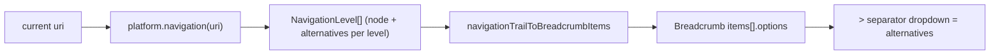

# Breadcrumb Navigation Mechanism

## Concept

Replace the URL-derived `Platform.breadcrumb` hook with a navigation-tree model in `framework/core`. Each breadcrumb level carries the chosen node plus the **alternatives** reachable from it; the `@ui/react` `Breadcrumb` already renders these alternatives as a dropdown on each `>` separator (`ui/react/index.tsx` lines 10271-10277, 10360-10424). The tree is its own model, independent of the URL path and the virtual file system, so sketchpad can show `Typologies > {Typology}` levels even though the URL is `/kits/{kit}/designs/{design}`.

## 1. Framework core model — [framework/core/index.ts](framework/core/index.ts)

Replace the `🔖PlatformBreadcrumb` region (lines 742-750) and the `breadcrumb` hook (line 770):

- Add `NavigationDestination` (`id`, `label: unknown`, `uri: string`) and `NavigationLevel` (`node: NavigationDestination`, `alternatives: readonly NavigationDestination[]`).
- Replace `Platform.breadcrumb?: (uri) => readonly PlatformBreadcrumbItem[]` with `Platform.navigation?: (uri: string) => readonly NavigationLevel[]`.
- Remove `PlatformBreadcrumbItem` (no backwards compat per repo rules).

## 2. Platform React renderer — [framework/product/platform/renderer/react/index.tsx](framework/product/platform/renderer/react/index.tsx)

- Update the type import (line 64) to `NavigationLevel` / `NavigationDestination`.
- Replace `platformBreadcrumbToUiItems` (lines 2740-2747) with `navigationTrailToBreadcrumbItems(trail, onNavigate)`: map each level to a `BreadcrumbItemData` where `content = level.node.label`, `onNavigate -> level.node.uri`, and `options = level.alternatives.map(a => ({ id: a.id, label: a.label, href: a.uri }))`. The separator after each item then lists that node's alternatives.
- Update the breadcrumb `useMemo` (lines 3344-3348): prefer `platform.navigation?.(uriProp)`; fall back to `uriToBreadcrumbItems` (lines 2725-2738) for products that supply no navigation (default keeps no alternatives).

## 3. Sketchpad navigation tree — [semio/client/lib/sketchpad/js/index.ts](semio/client/lib/sketchpad/js/index.ts)

- Update import (line 61) to the new framework types.
- Replace `sketchpadBreadcrumb` (lines 14392-14426) with `sketchpadNavigation(platform, uri): NavigationLevel[]` and rewire line 14449 to `platform.navigation = (uri) => sketchpadNavigation(platform, uri)`.
- Build the trail using `parseSketchpadRouteScopeFromPath`, the shell controller's `listOpenKitIds()` / `getKitStore()` (lines 13593-13615), and `sketchpadKitTypologyRows(kit)` (line 12615):
  - **Home** (`/` / unknown): level Home with alternatives `[Kits -> "/", Documentation -> "/docs", Feedback -> "/feedback"]`.
  - **Kit/design/type routes** produce levels:
    - `Home` (alternatives as above), `Kits` (alternatives = every open kit -> `/kits/{kitId}`), `{Kit}` (alternatives = `[Typologies]`).
    - `Typologies` (alternatives = each typology), `{Typology}` (alternatives = `[Designs, Types]` for the non-empty groupings). Typology-level nodes have no URL route, so their `uri` points at `/kits/{kitId}` (kit view) — this is where breadcrumb intentionally diverges from the URL.
    - For a design route: `Designs` (alternatives = sibling designs in the typology -> `/kits/{kitId}/designs/{designId}`), `{Design}`. For a type route: `Types` / `{Type}` analogously.
  - **Docs** (`/docs/...`): `Home`, `Documentation` (alternatives = doc sections via `sketchpadBuildDocsRegistry`), then section/page from `docsPath`.
  - **Feedback** (`/feedback`): `Home`, `Feedback`.
- Add small helpers near `🔖KitHelpers` (line 11216): resolve a design's/type's owning typology by scanning `sketchpadKitTypologyRows`, and list designs/types within a typology.

## 4. Tests (extend existing inline `import.meta.vitest` regions; no new files)

- Renderer (`framework/product/platform/renderer/react/index.tsx`, region near line 3516): test `navigationTrailToBreadcrumbItems` maps `alternatives` onto `options` and `node.uri` onto `onNavigate`.
- Sketchpad (`semio/client/lib/sketchpad/js/index.ts`, `describe` blocks around line 14534): test `sketchpadNavigation` for a design route yields `Home > Kits > {Kit} > Typologies > {Typology} > Designs > {Design}`, that the Home level's alternatives include Documentation/Feedback, and that the Designs level's alternatives list sibling designs.

## Ticket workflow

Per repo rules: read `repo://goals`, `ticket_open` a ticket (e.g. "Breadcrumb Navigation Mechanism") under the best-fitting goal, keep any temp files in the ticket folder, and `ticket_close` with a summary + touched files when done.

## Verification

- Typecheck + run the framework platform and sketchpad vitest suites via `nx`/`bun`.
- Run sketchpad dev and confirm at runtime: opening a design shows the full breadcrumb, and each `>` separator dropdown lists the correct alternatives (Documentation after Home, sibling kits after Kits, typologies, sibling designs). Remove any `[DEBUG]` logs before closing.

## Out of scope

- Playground and presentation products (no navigation chrome there, per your decision).
- Adding a typology segment to the URL (breadcrumb stays decoupled from URL).

