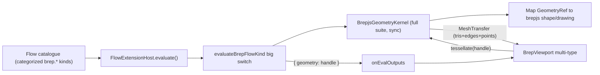

# Full BREP Suite for Procedural

Work happens inside the already-open ticket `2026/06/07/PROCEDURAL-BREP-PLAYGROUND` (reopen via repo MCP `ticket_reopen` if closed). No new source files — extend existing files using `//#region` sub-regions per the repo rules.

## Architecture

Geometry flows through flow ports as **self-describing handle strings** (`solid-3`, `edge-7`, `wire-2`, `face-5`, `vertex-1`, `drawing-4`). The kernel registry maps each handle to its brepjs shape and `GeometryKind`. Every geometry-producing node outputs `{ geometry: <handle> }`; scalar/evaluation nodes output `{ point: [x,y,z] }`, `{ number: n }`, `{ vector: [...] }`. The viewport collects all `geometry` handles from outputs and renders each by kind.

## 1. Kernel contracts — `[geometry/brep/js/contracts.ts](geometry/brep/js/contracts.ts)`

- Add `GeometryKind = "vertex" | "edge" | "wire" | "face" | "shell" | "solid" | "compound" | "drawing"` and a branded `GeometryRef = string & { __brand: "GeometryRef" }` with `geometryRef(id)` helper.
- Add optional `points?: Float32Array` to `MeshTransfer` (additive, keeps `cad/js` construction sites valid) and update `emptyMeshTransfer()` to include it.
- Replace the small `BrepKernel` interface with an exhaustive `BrepKernel extends BrepPreviewKernel` declaring the full suite below (sync `…Sync` signatures + async wrappers + generic `tessellateGeometry(ref, tolerance)` and `disposeGeometry(ref)`). `BrepPreviewKernel` stays unchanged. Keep existing `SolidRef` re-exports.

## 2. Kernel implementation — `[geometry/brep/js/kernel.ts](geometry/brep/js/kernel.ts)`

Replace the solid-only `Map<SolidRef, ValidSolid>` with a unified registry `Map<GeometryRef, { kind: GeometryKind; shape: AnyShape | Drawing }>` (keep a typed `getSolid`/`registerShape` helper). Import the relevant brepjs exports (see `[node_modules/brepjs/dist/index.d.ts](node_modules/brepjs/dist/index.d.ts)`). Implement, each in its own sub-region:

- **Primitives 3D**: `box, sphere, cylinder, cone, torus, ellipsoid, polyhedron, polygon`.
- **Primitives 2D / draw**: `drawRectangle, drawRoundedRectangle, drawCircle, drawEllipse, drawPolysides, drawText, drawParametricFunction, drawPointsInterpolation`, `sketchCircle/Rectangle/RoundedRectangle/Polysides/Ellipse` → drawing/face handles.
- **Curves**: `line, circle, ellipse, helix, threePointArc, tangentArc, ellipseArc, bezier, bsplineApprox, interpolateCurve, approximateCurve, wire, wireLoop`.
- **Surfaces / faces**: `face, filledFace, fill, subFace, offsetFace, surfaceFromGrid, surfaceFromImage`.
- **Solid tools**: `extrude, revolve, loft, sweep` (+`supportExtrude, complexExtrude, twistExtrude, multiSectionSweep, guidedSweep, loftAll`), `fillet, chamfer, shell, offset, thicken, draft, hull, minkowski, convexHull, roof`.
- **Booleans**: `fuse, cut, intersect, fuseAll, cutAll`, 2D `fuse2D, cut2D, intersect2D`.
- **Transforms**: `translate, rotate, mirror, scale, applyMatrix, clone, linearPattern, circularPattern, rectangularPattern`.
- **Intersections / section**: `section, sectionToFace, split, slice, checkInterference, checkAllInterferences`.
- **Evaluate**: `curvePointAt, curveTangentAt, curveStartPoint, curveEndPoint, curveLength, curveIsClosed, curveIsPeriodic`, `pointOnSurface, normalAt, uvBounds, faceCenter, measureCurvatureAt`, `vertexPosition, getBounds`.
- **Measure**: `measureVolume, measureArea, measureLength, measureDistance, measureVolumeProps, measureSurfaceProps`.
- **Query/topology**: `getEdges, getFaces, getWires, getVertices, facesOfEdge, edgesOfFace, adjacentFaces` (return handle lists).
- **Repair**: `healSolid, healFace, autoHeal, fixShape, sewShells, solidFromShell`.
- **IO**: `importSTEP/STL/IGES/SVG/DXF/OBJ/GLB`, `exportSTEP/STL/IGES/OBJ/GLB/DXF/3MF/gltf`.
- **Gears**: `makeExternalGear, makeInternalGear, makePlanetaryGear`.
- **Generalized tessellation**: `tessellateGeometry(ref, tol)` dispatches on kind — 3D (solid/shell/face) → `mesh`+`meshEdges`; 1D (edge/wire) → `meshEdges` → `edges` buffer; vertex → `points` buffer via `vertexPosition`; 2D drawing → sketch on XY plane then `meshEdges`. Reuse `toGroupedBufferGeometryData`/`toLineGeometryData`.

## 3. Mesh helpers — `[geometry/brep/js/mesh.ts](geometry/brep/js/mesh.ts)`

Add `points` to `MeshGeometryData` + `meshTransferToGeometryData`; relax `isRenderableMeshTransfer` to also accept edge-only / point-only transfers (a transfer is renderable if any of tris/edges/points are present and finite).

## 4. Kernel barrel + tests — `[geometry/brep/js/index.ts](geometry/brep/js/index.ts)`

Export new symbols. Extend the `import.meta.vitest` block with one test per category (primitive, curve, surface, boolean, transform, intersection, evaluate, measure, tessellate-by-kind) asserting handles resolve and `tessellateGeometry` is renderable.

## 5. Flow nodes + viewport — `[procedural/react/index.tsx](procedural/react/index.tsx)`

- Replace the 6-entry `BREP_FLOW_KINDS` with the full categorized set (one `FlowModuleNeuronKind` per kernel operation, grouped by `module: "brep"` with category-prefixed ids like `brep.prim3d.box`, `brep.curve.line`, `brep.surface.fill`, `brep.solid.fillet`, `brep.bool.fuse`, `brep.xform.rotate`, `brep.intersect.section`, `brep.eval.pointOnCurve`, `brep.measure.volume`, `brep.io.exportStep`). Add helper constructor nodes `brep.point` and `brep.vector` (x,y,z numeric ports → `point`/`vector`) so vectors are wireable from `inputSlider`s. Give every node sensible default `params` so it renders immediately on drop.
- Rewrite `evaluateBrepFlowKind` as a category-dispatched switch (sub-regions per category) returning `{ geometry }` / `{ point }` / `{ number }` / `{ vector }`. Add `parseHandle`, `parseVec3`, `parseNumber` helpers.
- `catalogueSections()` returns multiple sections (`Brep · Primitives 3D`, `Brep · Curves`, …). Update `kindInfosJson`/`listEntries`/manifest accordingly.
- Generalize the viewport: `extractGeometryHandles(outputsJson): string[]` (all `geometry` values), and `BrepViewport`/`BrepScene` renders an array of handles — `tessellateGeometry` per handle → mesh (`meshStandardMaterial`) for tris, `THREE.LineSegments` for `edges`, `THREE.Points` for `points`. `ProceduralEditor` tracks `string[]` handles instead of a single id.
- Update `PROCEDURAL_DEFAULT_FIXTURE` to a small showcase (e.g. point→line→extrude) and extend the test region with eval tests for representative nodes across categories.

## 6. Play harness — `[procedural/play/index.ts](procedural/play/index.ts)`

Catalogue/extensions trees are already generic. Update the default fixture reference if needed and extend tests to assert multiple brep sections appear. No `launch.json`/scripts changes (procedural already registered).

## Notes / decisions

- Input ergonomics: bounded to `inputSlider`(0–10)/`inputNote` by the Rust flow core; handled via node defaults + `brep.point`/`brep.vector` rather than expanding `flow/core`. Adding typed `inputVec3`/`inputNumber` widgets would be a separate flow-core ticket.
- `MeshTransfer.points` is optional to avoid touching `cad/js` MeshTransfer construction (different technology).
- Validate at runtime with `[DEBUG]` logs and run the three vitest suites (`@semio-tech/geometry-brep-js`, `@semio-tech/procedural-react`, `@semio-tech/procedural-play`) before closing the ticket with the file list and summary.
