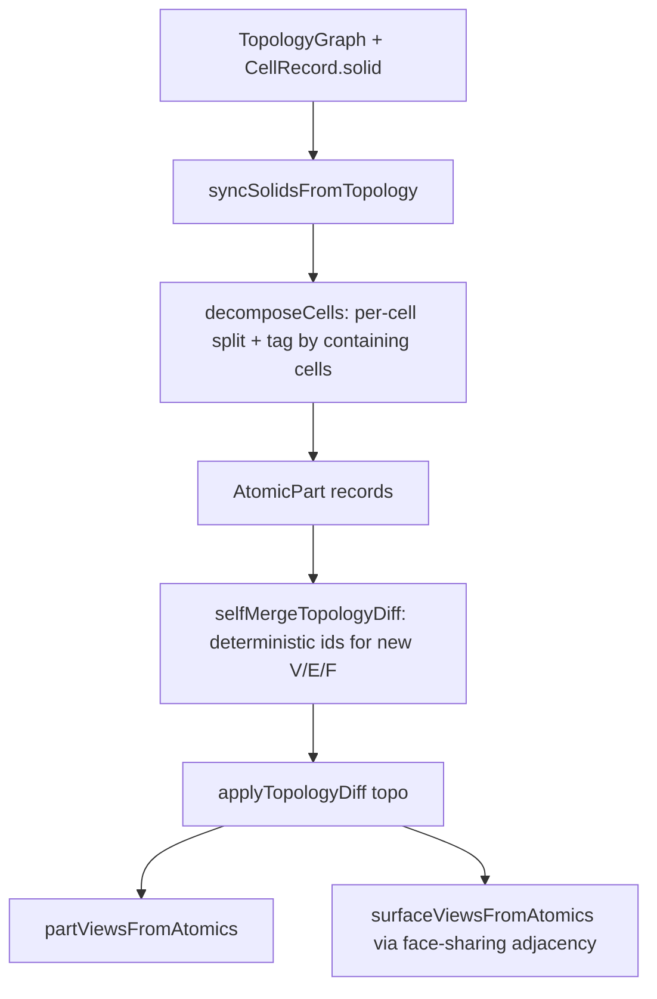

## Background

`temp/topologic` builds a non-manifold `CellComplex` via OCCT's `BOPAlgo_MakerVolume` on the input cells. The resulting compound contains:

- atomic solids (one per "part"), each tagged by which source cells contain it (cardinality = 1 → difference/none, ≥ 2 → intersection),
- atomic faces shared between 1 or 2 atomic solids (1 → external, 2 → internal),
- a SelfMerge that injects intersection vertices/edges into the graph so every face vertex is a real topology vertex.

`brepjs` exposes the BRep primitives needed to mimic this without `BOPAlgo_MakerVolume`: `split`, `cut`, `cutAll`, `intersect`, `fuseAll`, `getFaces`/`getVertices`/`facesOfEdge`/`vertexPosition`, plus existing `checkInterference`.

## Current flaws to fix (`spatial/js/kernel-brepjs/index.ts`)

- `computeBooleanPartRecordsFromSolids` only computes one global N-way `intersect` plus per-cell `cutAll(cell, others)`. Pairwise intersections among 3+ cells are lost.
- `computeSurfaceViewsFromPartRecords` requires every BRep face vertex to snap to a pre-existing `topo.vertices` entry; intersection vertices created by BRep don't exist in topology, so faces silently drop and the code falls back to `computeSurfaceViewsFromTopologyFacesOnly` / `…WithParts` (AABB slicing of topology faces).
- Exposure is decided by point-in-other-solid probes around a face centroid, which is fragile near grazing contact and on coplanar shared faces.

## New pipeline

### 1. Atomic decomposition (mirrors `BOPAlgo_MakerVolume`)

In a new `#region 🧊AtomicDecomposition`:

- `function decomposeCells(cells: Map<CellRef, ValidSolid>): AtomicDecomposition` where
  - For each cell `Ci`, run `split(Ci, otherCellsAsCompound)` (brepjs `split` from `topology/booleanFns`). This returns Ci cut into atomic non-overlapping pieces along every interface with other cells. Iterate the resulting compound's solids via `shape(result).solids()` / `getFaces`.
  - For each atomic piece `Pij`, sample a robust interior point (centroid of bounding box clamped to the solid via `checkInterference` with a tiny probe sphere; or vertex average) and test `pointInOrOnSolid(Ck, p)` for every other cell. The set `S` of containing source cells is the piece's tag.
  - Deduplicate pieces across cells: each atomic region is produced once per containing cell; canonicalize by the sorted tag `S` and a quantized centroid key, keeping a single representative solid.

Atomic record shape:

```ts
type AtomicPart = {
  readonly id: PartRef;
  readonly sourceCellIds: readonly CellRef[]; // = S, sorted
  readonly overlap: "none" | "difference" | "intersection";
  readonly solid: ValidSolid;
  readonly volume: number;
};
```

`overlap = "none"` if `|S| === 1` and that cell has no interferers; `"difference"` if `|S| === 1` but cell has interferers; `"intersection"` if `|S| >= 2`.

### 2. SelfMerge: topology augmentation

In a new `#region 🪡SelfMergeDiff`:

- `function selfMergeTopologyDiff(topo, atomics, snapTol): TopologyDiff`
  - Walk every atomic part's faces; for each `Face` collect ordered loop vertices via `getVertices`/`vertexPosition`.
  - Snap each BRep vertex to an existing `topo.vertices` (quantized bucket map). If no snap, mint a new `VertexRecord` with a deterministic id `merge-v-<quantizedKey>`.
  - Build deterministic `EdgeRecord`/`WireRecord`/`FaceRecord` ids from sorted endpoint vertex ids and orientation (`merge-e-<va>-<vb>`, `merge-w-<faceHash>`, `merge-f-<faceHash>`). Determinism makes the diff idempotent across reruns.
  - Emit a single `TopologyDiff` containing only the *added* entities not yet present (existing topology entities are kept).

`BrepjsKernel.computePartViews` / `computeSurfaceViews` apply this diff via `applyTopologyDiff(topo, diff)` before deriving views. Idempotent: a second refresh on the same `topo` finds all merge ids already present and produces an empty diff.

### 3. Part views

In `partViewsFromAtomics(topo, atomics)`:

- One `PartView` per `AtomicPart`. `regionPoints` = the merged `VertexRef` positions of the atomic solid's vertices (now all in topology after SelfMerge).
- Cells with no atomic coverage (e.g. degenerate boolean failures) still receive a fallback `"none"` part keyed off the cell's own vertices (preserved from current behavior).

### 4. Surface views (face adjacency, replaces probe-based exposure)

In `surfaceViewsFromAtomics(topo, atomics)`:

- Build a multimap `faceKey → AtomicPart[]` keyed by a canonicalized face signature (sorted snapped vertex ids + plane key from `derivedCanonicalPlaneKey`). Coplanar faces of separate atomic solids that share the same vertex set hash to the same key.
- For each unique atomic face:
  - `exposure = "internal"` if the face is shared by ≥ 2 atomic parts, else `"external"`. (This is the topologic invariant; replaces fragile centroid probing.)
  - `stance = "horizontal"` if `|nz| >= SQRT1_2`, else `"vertical"`.
  - Merge coplanar same-exposure / same-stance faces by 2D rect union on the face plane (reusing `derivedFacePlaneFrame`, `derivedFaceRectOnPlane`, `derivedUnionRects` already in the file).
  - `sourceFaceIds` = the merged `FaceRef` ids from the augmented topology (every merge face has a deterministic id from step 2).

### 5. Wiring into `BrepjsKernel`

In the existing `#region 🔌BrepjsKernel`:

- Replace `computeSurfaceViews` body:

```ts
async computeSurfaceViews(topo: TopologyGraph): Promise<SurfaceView[]> {
  await this.ensureInit();
  await this.syncSolidsFromTopology(topo);
  if (this.solids.size === 0) return computeSurfaceViewsFromTopology(topo); // pure-fallback
  const atomics = decomposeCells(this.solids);
  applyTopologyDiff(topo, selfMergeTopologyDiff(topo, atomics, this.tol));
  return surfaceViewsFromAtomics(topo, atomics);
}
```

- Mirror for `computePartViews` (same `decomposeCells` + `applyTopologyDiff`, then `partViewsFromAtomics`).
- Keep `computeBooleanPartRecordsFromAabbs` and `computeSurfaceViewsFromTopology{FacesOnly,FacesWithParts}` purely as **no-solid fallbacks** when `syncSolidsFromTopology` fails to produce any `ValidSolid`. Delete `computeBooleanPartRecordsFromSolids`, `computeSurfaceViewsFromPartRecords`, `partRegionPoints`, `topologyVerticesOnPart`, `brepFaceSnapPoints`, `topoFacesForSnapPoints`, `faceExposureFromParts`, `pointInsideOtherPart`, `intersectAllSolids` — superseded by the new pipeline.

### 6. Idempotent merge keys

In `#region 🪡SelfMergeDiff`:

- Quantize positions by `derivedModelScale(topo) * 1e-5` (same tolerance used elsewhere) and hash to a stable base36 key. Vertex/edge/face ids embed this key so reruns of `decomposeCells` on the same input produce the same ids and `applyTopologyDiff` is a no-op.

### 7. Ticket bookkeeping

- Open a new ticket via repo mcp `ticket_open` titled e.g. "Brepjs CellComplex Parts and Surfaces" under goal `🎯r2602/🎯runningsketchpad` (or the most appropriate goal returned by `repo://goals`). All scratch/log files go inside that ticket folder.

### 8. Tests

- Extend the existing `spatial/js/kernel-brepjs` vitest spec (no new test files) to cover:
  - 2 disjoint boxes → 2 `"none"` parts, no internal surfaces.
  - 2 boxes overlapping on a face → 1 `"intersection"` part + 2 `"difference"` parts; the shared face → 1 `"internal"` surface; remaining faces → `"external"`.
  - 3 boxes forming a pairwise overlap but no triple overlap → expect 3 pairwise `"intersection"` parts (validates `split`-based decomposition vs. old global-only intersection).
  - Augmented topology has the expected number of merge vertices and the diff is empty on a second run (idempotency).

## Files touched

- [spatial/js/kernel-brepjs/index.ts](spatial/js/kernel-brepjs/index.ts): new regions `🧊AtomicDecomposition`, `🪡SelfMergeDiff`, replace `🪞DerivedBooleanViews` and the surface-view fallbacks; rewire `BrepjsKernel.computeSurfaceViews` / `computePartViews`; extend existing tests in `#region 🧪Tests`.
- `.repo/🎫/26/05/25/<new-slug>/ticket.json`: new ticket file created by `ticket_open`; close with `ticket_close` when done.

## Mermaid: pipeline


