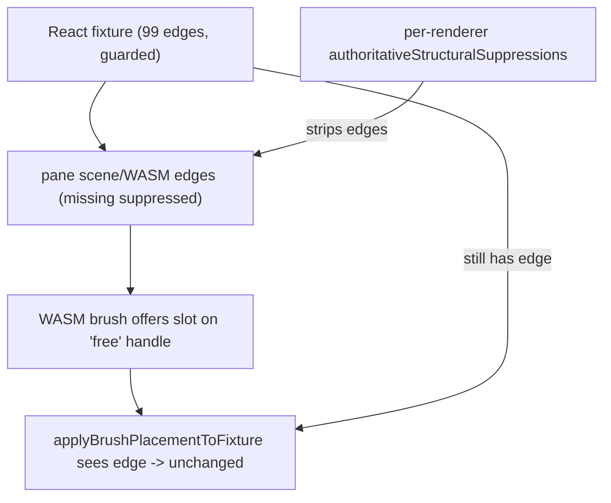

## Root cause (confirmed)

Console showed `applyBrushPlacementToFixture unchanged` for handles `7bca27d8:sl2_d1`, `:t`, `:sl2_d0`, `:sl1_d1`, `:sl1_d0`. All of these have edges in [puzzle/2d/fixture/nakagin-capsule-tower.2d.json](puzzle/2d/fixture/nakagin-capsule-tower.2d.json) (lines 701, 811, 181, 816, 346), so the rejection at [puzzle/2d/react/index.tsx](puzzle/2d/react/index.tsx) line 1828 is correct.

The bug is upstream: the brush offered slots on handles that are occupied in the fixture. WASM brush slot detection (`brush_nearest_slot_source` skips `handle_has_incident_edge`, [puzzle/2d/rs/lib.rs](puzzle/2d/rs/lib.rs) ~3874) only sees the edges in its own scene. Those scenes are built from `descriptorWithoutAuthoritativeRemovals` ([puzzle/2d/react/index.tsx](puzzle/2d/react/index.tsx) line 3067), which permanently strips any edge id recorded in `authoritativeStructuralSuppressions`. A transient WASM `edgeDelete` (LOD/resync) suppresses an edge in the per-pane scene while the fixture keeps it (guarded by `puzzle2dPlayRehydrateFixtureEdgesIfMissing`). Result: brush thinks the handle is free, commit knows it is occupied -> every placement is rejected, and panes drift so previews do not mirror reliably.

## Step 1 - Confirm at runtime (required before fixing)

Add temporary `[DEBUG]` logs (prefix per repo rule), reload, hover a slot, leave:

- In `applyBrushPlacementToFixture` ([puzzle/2d/react/index.tsx](puzzle/2d/react/index.tsx) ~1817): log which branch returns `unchanged` and `fixture.edges.length`.
- In the driving renderer at brush-preview emit ([puzzle/2d/react/index.tsx](puzzle/2d/react/index.tsx) ~5182): log `this.scene.edges.size`, `this.authoritativeStructuralSuppressions.size`, and whether the previewed `sourceHandleId` is in the suppression set.

Confirm: scene edge count < fixture edge count and the brushed handle's edge id is suppressed.

## Step 2 - Fix edge suppression vs fixture (core)

- Add `Puzzle2dRenderer.clearAuthoritativeStructuralSuppressionsFor(ids: Iterable<string>)` to delete `edge:`/`node:` keys for ids the authoritative fixture still contains.
- In `puzzle2dSyncFixtureDescriptorToAllAuthoringPeers` ([puzzle/2d/react/index.tsx](puzzle/2d/react/index.tsx) line 10061): before `syncPuzzle2dScene`, clear suppressions for every node id and edge id in the incoming fixture descriptor so `descriptorWithoutAuthoritativeRemovals` stops stripping them, then reconcile edges. This makes each pane's scene/WASM match the fixture.
- Call `puzzle2dSyncFixtureDescriptorToAllAuthoringPeers(fixture)` from the brush-activation effect in `Puzzle2dPlayInner` ([framework/product/playground/renderer/react/index.tsx](framework/product/playground/renderer/react/index.tsx) ~3617) when `puzzle2dActiveTool === "brush"`, and when `fixture` changes while brush is active, so the brush always works against the current fixture graph.

## Step 3 - Verify finalize end-to-end

Reload, brush a genuinely free slot, leave it. Expect no `unchanged` log, node+edge added to the fixture, and the new node/edge visible in all three panes via the existing `puzzle2dSyncFixtureDescriptorToAllAuthoringPeers` path after commit.

## Step 4 - Repair mirror preview on other panes

With edges correct, verify the mirror path. If the preview still does not show on Overview/Zoom/Selection, address the two known gates surfaced during research:

- Re-entry/dedup ordering in `setBrushSession` ([puzzle/2d/react/index.tsx](puzzle/2d/react/index.tsx) ~3678): it sets `lastBrushSessionJsonForWasm` before the `wasmSessionCallBlockedForReentry()` early-return, so a blocked first sync caches the JSON and the identical retry is deduped away (mirror stays blank). Only update the cache after a successful WASM call, and queue a pending flush on re-entry.
- Overview LOD: `append_brush_preview_paint` returns on `Minimap` ([puzzle/2d/rs/lib.rs](puzzle/2d/rs/lib.rs) line 4461). If the Overview camera sits below `lod_minimap_max_zoom`, the preview is intentionally skipped; confirm with logs and decide whether to allow brush preview at Minimap.

## Step 5 - Tests and cleanup

- Extend the existing vitest block in [puzzle/2d/react/index.tsx](puzzle/2d/react/index.tsx): a regression test where an edge id is suppressed, the fixture still has it, and after `puzzle2dSyncFixtureDescriptorToAllAuthoringPeers` the scene regains the edge and the brush no longer offers that handle.
- Add/extend a Rust test in [puzzle/2d/rs/lib.rs](puzzle/2d/rs/lib.rs) if the LOD/preview behavior changes.
- Remove all `[DEBUG]` logs once confirmed. Run `bun ./script.ts test` in `puzzle/2d/react` and the Rust tests; rebuild WASM (`bun ./script.ts wasm` in `puzzle/2d/rs`).

## Notes

- Work continues under ticket `26/06/02/BRUSH-ENGAGEMENT-NO-SUGGESTIONS` (currently open).
- Do not claim success without console-log confirmation per repo rules.
