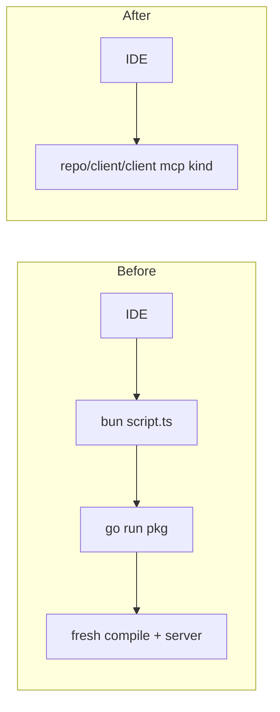

# Budgeted Repo Binary and Total Test Deadlines

## Problem

Two independent gaps, both reachable from "a test hangs forever".

**Tool calls do not go over the repo binary.** Every MCP server config and every agent-hook entry launches `bun script.ts dev mcp stdio <profile>`, which lands on a raw `spawnSync` that bypasses `runCmd` entirely and recompiles the 46k-line godfile through `go run` on every single invocation:

```506:511:script.ts
    const r = spawnSync("go", ["run", pkg, ...extra], {
      cwd: this.root,
      stdio: "inherit",
      env: { ...process.env, GOWORK: join(this.root, "go.work") },
    });
    process.exit(r.status ?? 1);
```

The prebuilt binary at `repo/client/client` already exists and is resolved by `resolveCliBin()` in [repo/lib/js/index.ts](repo/lib/js/index.ts), but nothing except `runCliGraphql` uses it. The five per-IDE packages under `repo/client/mcp/{cursor,copilot,claude,codex,kiro}/go` are never even built as executables — [script.ts:670](script.ts) only compile-checks them with `go build <pkg>` and no `-o`.

**Budgeting is outer-only and has holes.** `runTestBudgeted` / `runCmd` in [repo/lib/js/index.ts](repo/lib/js/index.ts) SIGKILL a process tree on a wall clock, but: 52 raw `spawn`/`spawnSync`/`execSync`/`execFileSync`/`Bun.spawn` sites across `script.ts` files never enter that path; 24 sites pass `budgetMs: null`, including the root test orchestrator `nx run-many -t test --all` ([script.ts:686](script.ts)); and no toolchain gets an *inner* per-test deadline, so a single hanging test burns the whole level budget and the run dies with `[budget] … killed` naming nothing. Rust (250 crates) has no per-test timeout at all, `runTestBudgeted("go", …)` never passes `-timeout`, and only 1 of 29 vitest configs sets `testTimeout`.

## Ticket

Open under goal `🎯aioptimizedrepo🎯repoclient🎯repobinary` (Repo Binary, issue 356). All scratch output goes in the ticket folder.

## A. One repo binary, every tool call over it

Collapse six Go main packages into one.

- Delete `repo/client/mcp/{cursor,copilot,claude,codex,kiro}/go` (5 `main.go`, 5 `go.mod`, 5 `project.json`), drop their `use` lines from [go.work](go.work), and drop the six stale root binary entries from [.gitignore](.gitignore) lines 42-52.
- In [repo/client/cli/go/main.go](repo/client/cli/go/main.go): the `mcp` subcommand takes an optional kind argument (`repo mcp cursor`), and `hook` already takes `<event> <client>`. Delete the now-unused `RunMCP`/`RunMCPFor`/`RunHookFor` wrappers (`main.go` 758-760, 46012-46061) and fix `serveMcp`, which currently throws away both its context and engine:

```892:896:repo/client/cli/go/main.go
func serveMcp(ctx context.Context, engine *Engine) error {
	_ = ctx
	_ = engine
	return runMcpServer(nil, nil)
}
```

- `repo/client/mcp/go/main.go` becomes the sole entry, built to `repo/client/client` (extension-less on every platform, so one static command string works in every config; Windows `CreateProcess` accepts an explicit path to a PE without `.exe`).
- Rewrite all six configs to exec the binary: [.cursor/mcp.json](.cursor/mcp.json), [.mcp.json](.mcp.json), [.vscode/mcp.json](.vscode/mcp.json), [.windsurf/mcp.json](.windsurf/mcp.json), [.kiro/settings/mcp.json](.kiro/settings/mcp.json), [.codex/config.toml](.codex/config.toml) — `command: "repo/client/client"`, `args: ["mcp", "<kind>"]`. Same for the commented hook blocks in [.claude/settings.json](.claude/settings.json), [.windsurf/hooks.json](.windsurf/hooks.json), [.factory/hooks.json](.factory/hooks.json) → `repo/client/client hook <event> <client>`.
- Point the git hooks in `repo/hook/*` and `repo/hooks/*` at `repo/client/client micro-commit …` instead of `bun ./script.ts micro-commit …`, and move that verb into the Go CLI.
- Zero-touch: `repo/native/bootstrap/script.sh` and `script.ps1` currently never build the binary — add it there and to `.devcontainer` post-create, alongside the existing build in `SetupScript.runFull` ([script.ts:245](script.ts)).
- `DevScript.runMcpStdioRepo` and `repo/client/cli/script.ts` `DevScript` stop using `go run`; they resolve the binary, build it if missing, and exec it.



## B. Make budgeting total in `repo/lib/js/index.ts`

In the `⏱️Budget` region (lines 878-1125):

- Remove `budgetMs: null` as a free-form escape. Replace with two named classes so nothing is ever unbounded: `ORCHESTRATOR_BUDGET_MS` (nx `run-many` fan-outs, default ~4h, `SEMIO_ORCHESTRATOR_BUDGET_MS`) and `DAEMON_BUDGET_MS` (dev servers / MCP stdio, default 24h, `SEMIO_DAEMON_BUDGET_MS`). Update all 24 exemption sites.
- Add `runProbe(cmd, args)` — the budgeted replacement for the ~15 `spawnSync(tool, ["--version"])` capability probes that currently bypass `runCmd` because they need captured output rather than inherited stdio.
- Migrate all 52 raw spawn sites onto `runCmd` / `runCmdStatus` / `runProbe`, notably [script.ts:764](script.ts) (storybook server for Playwright) and [script.ts:506](script.ts).

## C. Inner per-test deadlines, per toolchain

Derive each from the active level budget and expose them next to the existing `goLevelTestArgs` / `pytestLevelArgs` / `dotnetLevelArgs` helpers, so a hang names the offending test instead of killing the run anonymously.

- **Rust (250 crates, 2 workspaces)** — switch `runCargoTestBudgeted` to `cargo nextest run`, with a checked-in `nextest.toml` carrying one profile per level (`slow-timeout = { period, terminate-after }`). nextest kills and *reports* the individual hanging test and keeps going; coverage becomes `cargo llvm-cov nextest`. Safe here: the workspace has no compilable doctests (one ` ```ignore ` block in `framework/plugin/rs/lib.rs`). Install via `cargo install cargo-nextest --locked` in setup, bootstrap and devcontainer.
- **Go (12 modules)** — pass `-timeout <levelBudget>` in `goLevelTestArgs`; Go dumps every goroutine on expiry, which pinpoints the hang.
- **Vitest (29 configs)** — `runVitest` passes `--testTimeout` / `--hookTimeout` / `--teardownTimeout` on the command line so all 29 configs inherit without touching each one.
- **bun test** — `--timeout`. **pytest** — add `pytest-timeout` to [pyproject.toml](pyproject.toml), pass `--timeout --timeout-method=thread`. **dotnet** — `--blame-hang --blame-hang-timeout`. **ctest** — `--timeout`. **Playwright** — align `.storybook/playwright.config.ts` to the level budget.

## D. Fix the in-test unbounded waits

Bounded-wait helpers replacing the loops that can spin forever even under a per-test deadline:

- `store/sync/rs/lib.rs` — persisted-edit poll loop (~2107-2115) and seed-snapshot wait (~2476-2481).
- `framework/product/os/hub/rs/bin.rs` — `next_server_frame` (~720-730) awaits a WebSocket frame with no deadline.
- `compose/server/hub/rs/bin.rs` — bare `recv().await.unwrap()` (~4825-4827).
- Go: `exec.Command` → `exec.CommandContext` in `repo/client/cli/go/main_test.go`, especially the two `bash .devcontainer/post-attach.sh` subtests (329, 454).

## E. Per-tool-call and per-hook deadlines in the Go client

None of the six MCP tool handlers currently look at `ctx`, and `--timeout` defaults to `0`.

- Give `--timeout` a non-zero default and wrap every handler registered in `CreateMcpServer` (`main.go` ~45950-46007) in `context.WithTimeout`, returning a structured timeout result rather than hanging the agent.
- Apply the same deadline to `runHookExecution` — hooks fire on every agent tool use, so a stuck hook stalls the whole session.
- Route the client's own `exec.Command` calls through `exec.CommandContext`.

## F. Keep it true: policy, tests, launch.json

- New statutes appended to the repo-wide policy in [script.ts:2562](script.ts) (alongside `policyJsonFixtureBreaches`, `policyOpsGrammarBreaches`, …): no raw spawn in any `script.ts`; no `budgetMs: null`; every MCP/hook/git-hook config must reference `repo/client/client`.
- Extend the existing test files only: `repo/lib/js/index.test.ts` (new budget classes, `runProbe`, level→deadline derivation) and `repo/client/cli/go/main_test.go` (single-binary `mcp <kind>` dispatch, tool-call timeout, hook timeout). A `fundamental` test spawns the command from each MCP config and asserts an `initialize` handshake completes inside budget — this is what would catch a Windows regression on the extension-less binary name.
- Register the new executable commands in [.vscode/launch.json](.vscode/launch.json) following the existing `3_dev` / `4_build` grouping and ordering.

## Out of scope

Pre-existing unrelated failures found while probing, to be reported but not fixed: 23 failures in `go test ./repo/client/cli/go -short` (removed `fix` mutation, `👤`/`🏘` technology-emoji drift, `TestMcpToolsSchemas` expecting 7 tools where 6 are registered) and 2 in `cargo test -p store_sync` (`fixtures_replay_matches_expected_events`, `folder_external_edit_delivers_remote_operations`) which sit in files currently dirty in the working tree.

## Verification

`cargo nextest run` across both workspaces, `go test` across all 12 modules, `bun ./script.ts test` at `fundamental` and `quick`, each MCP config handshake-tested, and a deliberate never-terminating test injected temporarily per toolchain to prove the deadline fires and names the test.