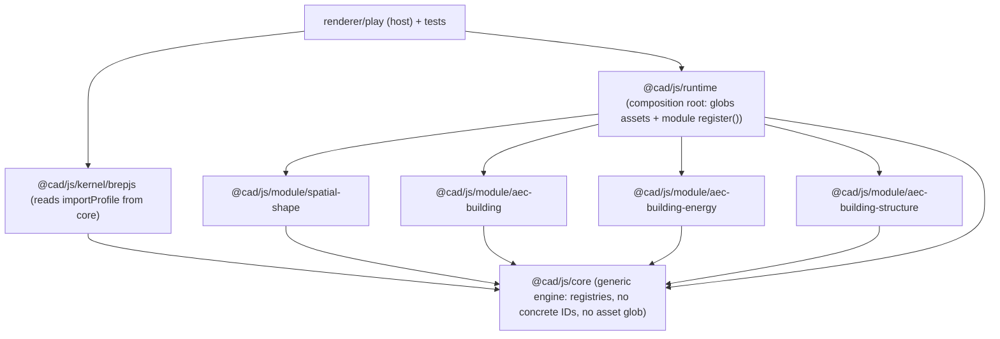

## Goal

The generic layers (`@cad/js/core`, `@cad/js/kernel/brepjs`, `@cad/js/renderer`) must contain zero concrete model-definition IDs. All domain knowledge moves into per-domain **cad modules** that self-register against generic core registries, mirroring `flow/core` + `flow/modules/`* (each module depends only on the engine; the host composes them).

## Current leaks (production code only)

- `cad/js/core/index.ts`: eager `import.meta.glob("../../assets/modelDefinition/**")` ([lines 97-160](cad/js/core/index.ts)); property derivation branch on `spatial.shape.volume`/`energy.heatedvolume` (lines 2528-2534); `registerStatComputer("spatial.shape.geometry"|"energy.demand"|"structure.stability", ...)` (lines 2886-2888) with `computeShapeGeometryStat`/`computeEnergyDemandStat`/`computeStructureStabilityStat`; `BUILDING_TO_STRUCTURE_TYPOLOGY` + `applyBuildingToStructureTransformation` + `registerTransformationApplier(... "aec.building.structure","from_building" ...)` (lines 3757-3792); default typology `"spatial.shape.object"` (line 1333).
- `cad/js/kernel/brepjs/index.ts`: `BUILDING_BIM_MODEL_DEFINITION_ID`/`ENERGY_MODEL_DEFINITION_ID`/`STRUCTURE_CLASSIC_MODEL_DEFINITION_ID` (2102-2108); `BIM_LAYER_TYPOLOGY`/`ENERGY_LAYER_TYPOLOGY`/`STRUCTURE_LAYER_TYPOLOGY` + `typologyFromStepLayer` (2110-2424); defaults `"spatial.shape.kernel.solid"` (2580), `"building.building.slab"` (3307).
- `cad/js/renderer/play/index.tsx`: `CAD_PLAY_*` pane constants (103-105) — acceptable host config, but `transformationSourceScore` special-cases building→structure (1329-1330) and `ensureCadPlayQuadModels` hardcodes `"aec.building.structure"` (1369).
- `cad/js/renderer/index.tsx`: only doc-comment references to `spatial.shape` (lines 4, 3449, 4244) — production is already generic.

## Target architecture

Split rule: executable domain compute (stat formulas, volume property, transformation appliers) lives in module TS code self-registered via core registries; pure-data mappings (STEP layer→typology, fallback/base typologies) live in module `register()` code that populates generic core registries. Declarative JSON assets stay under `cad/assets/modelDefinition/` (consumed generically), so `cad/assets/AGENTS.md` stays accurate.

## Steps

### 1. Generalize core registries (`cad/js/core/index.ts`)

- Delete the `import.meta.glob` block (97-160); keep `registerModelDefinitionAssets` but make it **additive/merge** (accumulate modules from multiple callers, reset caches each call).
- Remove `computeShapeGeometryStat`/`computeEnergyDemandStat`/`computeStructureStabilityStat` and their `registerStatComputer` calls; keep generic `registerStatComputer`/`computeStat`.
- Add a generic `registerPropertyComputer(propertyId, computer)` + lookup; replace the `defn.id === ...` branch in `derivePropertyValue` (2528-2534) with a registry lookup.
- Remove `BUILDING_TO_STRUCTURE_TYPOLOGY`/`applyBuildingToStructureTransformation` and its `registerTransformationApplier` call; keep generic applier registry.
- Add a generic `registerImportProfile(modelDefinitionId, { layerTypology, fallbackTypology })` + `importProfileFor(id)` registry (data only, no concrete IDs) for the kernel to consume.
- Drive default object typology (1333) from the default manifest (add `baseObjectTypology` to the default manifest, read via existing manifest lookup).
- `export` the helpers module computers need: `bboxSizesFromPositions`, `collectVertexPositionsForObjects`, `cloneModelGeometryShell`, `transformationObjectId`, `STRUCTURE_CONCRETE_DENSITY_KG_M3` (move to module), `TransformationApplier` type, plus already-exported `StatComputer`/`StatComputeContext`/`TransformationSpec`/`Model`/`solidRef`/`qualifiedTransformationId`/`objectPrimaryPrimitiveRef`/`resolvePrimitiveRefKind`.

### 2-5. Create four cad module packages

Each is a new Nx/Bun package (`project.json` calls `script.ts test`, `package.json` calls nx, `tsconfig.json` aliases `@cad/js/core`, single `index.ts` with `register()` exported, region-structured) depending only on `@cad/js/core`:

- `@cad/js/module/spatial-shape`: registers `spatial.shape.geometry` stat computer and `spatial.shape.volume` property computer; the base/default module.
- `@cad/js/module/aec-building`: registers building STEP import profile (BIM layer map + `building.building.slab` fallback) for `aec.building`.
- `@cad/js/module/aec-building-energy`: registers `energy.demand` stat, `energy.heatedvolume` property computer, energy import profile.
- `@cad/js/module/aec-building-structure`: registers `structure.stability` stat, `aec.building.structure/from_building` transformation applier (+ building→structure typology map), structure import profiles (classic + fem variants).

### 6. Generalize kernel STEP import (`cad/js/kernel/brepjs/index.ts`)

- Remove the three `*_MODEL_DEFINITION_ID` constants and the three layer-typology maps; rewrite `typologyFromStepLayer` and the import path to read `importProfileFor(modelDefinitionId)` from core. Take target `modelDefinitionId` from options (no concrete default; default to `defaultModelDefinitionId()`); resolve the kernel solid typology (2580) and fallback typology from the manifest/import profile.

### 7. Create `@cad/js/runtime` composition root

- New package depending on core + all four modules; does the single generic `import.meta.glob("../../assets/modelDefinition/**")` and calls `registerModelDefinitionAssets`, then calls each module's `register()` (shape first). Export `bootstrapCadModules()`.
- Add Vite/Vitest aliases for the new packages in `cad/js/renderer/play/vite.config.ts` and `vitest.config.ts`; add packages to `cad/js/package.json` workspaces; register new `test` targets in `.vscode/launch.json` following existing grouping/order.

### 8. Wire host + generalize play (`cad/js/renderer/play/index.tsx`)

- Call `bootstrapCadModules()` at startup before mount. Keep `CAD_PLAY_`* pane constants as host config but source them from module-exported IDs; generalize `transformationSourceScore` to score by transformation source/target graph generically (drop the building→structure literal) and replace the `"aec.building.structure"` literal in `ensureCadPlayQuadModels` with the structure module's exported id. Fix the user-facing `spatial.shape` copy (2363) to use the active definition label.

### 9. Migrate domain tests and validate

- Because core no longer self-registers (and cannot import modules), move the domain-specific inline tests out of `core/index.ts` (stat/property/transformation assertions for `spatial.shape.*`, `energy.*`, `structure.*`, building→structure) into the matching module packages' inline tests; core retains only generic-mechanism tests using synthetic registered fixtures, and `@cad/js/runtime` hosts the cross-module integration test. Kernel STEP-import tests stay in kernel but bootstrap via the runtime/registered profiles.
- Fix the stale `SHAPE_MODEL_DEFINITION_ID` import in `cad/js/machine/stately/script.ts` to use `defaultModelDefinitionId()`.
- Run all suites (`@cad/js/core`, `@cad/js/kernel/brepjs`, `@cad/js/query`, `@cad/js/machine/stately`, `@cad/js/renderer`, new modules + runtime) green; run play dev/build to confirm runtime bootstrap (with `[DEBUG]`-prefixed logs to confirm module registration order).

## Notes / decisions

- Work under a single repo ticket; add temp logs/scripts inside the ticket folder only.
- Module granularity: four sibling modules (shape, building, energy, structure); structure module covers classic + fem variants since they share `structure.*` and the same transformation/import lineage.
- Assets are not physically moved (keeps `cad/assets/AGENTS.md` accurate); modules own only code + registrations.

