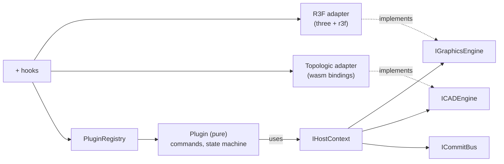

## Decisions taken (no clarifications needed)

- **Single file, organized by regions** — per `AGENTS.md` "edit existing files / regions". Use `.tsx` (not `.ts`) because R3F + JSX is required. Path: `elements/client/lib/geometry/cad/index.tsx`.
- **Adapters live in the same file but in isolated regions** — the pure core in regions `🔖Core` / `🔖Registry` / `🔖Commands` does NOT import `three`, `@react-three/fiber`, or `../wasm/`\*. Adapters in separate regions DO. Enforced by import discipline and an inline vitest assertion.
- **Use existing infrastructure**: Topologic adapter calls the existing wasm bindings from `[elements/client/lib/geometry/wasm/index.ts](elements/client/lib/geometry/wasm/index.ts)` (via `ensureTopologicWasmLoaded`) — no new wasm work. Honors `[elements/client/lib/geometry/react/AGENTS.md](elements/client/lib/geometry/react/AGENTS.md)`: topologic for all geometry, three.js only for rendering.
- **Tests extend the existing inline `import.meta.vitest` block** in the new file (no new test file), per repo rule.
- **Ticket**: open a new ticket via repo mcp `ticket_open` (slug `cad-engine-plugins`) before any non-readonly work; close on finish.

## File layout inside `elements/client/lib/geometry/cad/index.tsx`



### Regions (top-to-bottom)

- `🧲Header` — file purpose docstring.
- `🔖Core` — pure types: `Point3D`, `Vec3`, `Ray`, `PointerEvent`, `IPreviewMesh`, `IGraphicsEngine`, `ICADEngine`, `ICommitBus`, `IHostContext`, `CadEvent`. Zero external imports.
- `🔖Commands` — `ICommand` interface + `BaseCommand` abstract class with `activate/deactivate/onPointerMove/onPointerClick/onKey`. Pure math helpers (`distance`, `subtract`, `add`).
- `🔖Plugins` — `ICadPlugin { id; commands: ICommand[]; activate?(host) }`. Built-in `primitivesPlugin` exporting `CylinderCommand`, `BoxCommand`, `SphereCommand` (pure, mirrors the user's `CylinderCommand` example).
- `🔖Registry` — `CadEngine` class:
  - `registerPlugin(plugin)`, `unregisterPlugin(id)`, `listCommands()`
  - `activateCommand(id)`, current-command pointer routing
  - emits `commandActivated`/`geometryCommitted` events via a tiny typed emitter
  - exposes `setHostContext(host)` so adapters can attach at mount time
- `🔖TopologicAdapter` — `class TopologicCadEngine implements ICADEngine`: builds primitives by composing existing wasm helpers; returns the same fixture-entity shape used by `TopologicViewport` so committed geometry can be re-rendered with the existing pipeline. Lazy-loads via `ensureTopologicWasmLoaded()`.
- `🔖R3FAdapter` — three.js classes implementing `IGraphicsEngine`/`IPreviewMesh` operating on a `THREE.Group` preview layer.
- `🔖CanvasUI` — `<CadCanvas engine={...} plugins={...} children=?/>`: wraps `@react-three/fiber`'s `Canvas`, mounts a preview-layer group, wires raycasting to `engine.onPointer*`, and exports hooks:
  - `useCadEngine(): CadEngine` (context)
  - `useActiveCommand(): string | null`
  - `useCadCommit(handler)` — subscribe to commits
  - `useRegisterPlugin(plugin)` — convenience effect
- `🧪Tests` — extend with vitest cases covering: pure-core has no three/wasm/r3f imports; registry register/unregister; cylinder state machine commits geometry; adapters are swappable (mock `IGraphicsEngine` + `ICADEngine`).

## Wiring example added to file's exports (no new files)

```ts
export { CadEngine, type ICadPlugin, type ICommand, type IHostContext, primitivesPlugin, TopologicCadEngine, ThreeGraphicsEngine, CadCanvas, useCadEngine, useActiveCommand, useCadCommit, useRegisterPlugin };
```

## Dependencies

All already in `[elements/client/lib/geometry/package.json](elements/client/lib/geometry/package.json)`: `three`, `@react-three/fiber`, `@react-three/drei`, `react`. No package.json changes needed. No new files outside the ticket folder.

## Validation

- `nx test @elements/geometry` (vitest inline block) runs new tests and confirms (a) pure-core import set is empty of `three|wasm|@react-three`, (b) program lifecycle works against mocks, (c) Topologic adapter returns a renderable entity for `createCylinder` after `ensureTopologicWasmLoaded()`.
- Close ticket with `ticket_close` including the updated file path.
