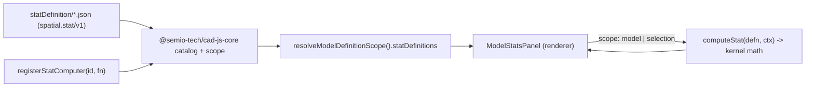

# CAD Live Model Stats

## Goal

Introduce a general extension point so every model definition can declare "live stats" (KPIs) computed live from the model. Mirror the existing per-object `PropertyDefinitionSpec` / `derivePropertyValue` pattern, but at the model-definition level with both whole-model and current-selection scopes. Decisions confirmed: whole-model AND per-selection scope, TypeScript computers registered per stat id, real shape geometry KPIs + simplified-but-meaningful energy/structure formulas.

## Mechanism overview

## 1. Schema: new `spatial.stat/v1`

New file `cad/schema/json/stat.json` (sibling of `cad/schema/json/attribute.json`). Shape:

- `schema` const `spatial.stat/v1`, `id`, `version`, `label`, `description?`
- `scopes`: array subset of `["model","selection"]` (default both)
- `sources?.typologies`: optional typology-id filter (same convention as `propertyDefinition.sources.typologies` in `cad/asset/modelDefinition/aec.building.energy/propertyDefinition/heatedvolume.json`)
- `outputs`: array of `{ key, label, unit?, format? }` (multi-KPI per stat, unlike single-value property `output`)

## 2. Core: definitions, catalog, scope, compute registry

All edits in `[cad/js/core/index.ts](cad/js/core/index.ts)`, added to existing files via regions/subregions (no new core files).

- `📥ModelDefinitionRegistry` region: add `statDefinitions` to `ModelDefinitionAssetModules` (interface + `emptyModelDefinitionAssetModules` + `registerModelDefinitionAssets`), and a `modelDefinitionStatCatalog()` accessor (mirrors `modelDefinitionPropertyCatalog` at line 77).
- `📥ModelDefinitionAssets` region: add `import.meta.glob("../../asset/modelDefinition/**/statDefinition/*.json", ...)` and include it in the `registerModelDefinitionAssets({...})` call (mirrors `__modelDefinitionPropertyDefinitionModules` at line 112).
- New subregion near the property-definition code (~line 2088-2320):
  - `StatDefinitionSpec` interface + `parseStatDefinitionSpec(raw)` (mirrors `parsePropertyDefinitionSpec`).
  - `shippedStatDefinitionCatalog()`, `loadStatDefinition(id)`, `listModelDefinitionStatDefinitions()`.
  - `statOwnerById()` + `listStatDefinitionsForModelDefinition(modelDefinitionId)` (mirrors `propertyOwnerById` / `listPropertyDefinitionsForModelDefinition` at line 2802-2830).
  - `statDefinitionAppliesToScope(defn, scope)` and typology filtering for selection objects.
  - Compute registry:
    - `interface StatComputeContext { model: Model; kernel: SpatialKernel; modelDefinitionId: string; scope: "model" | "selection"; objects: readonly SpatialObjectRecord[] }`
    - `type StatComputer = (ctx) => Promise<Record<string, number>>`
    - `registerStatComputer(id, fn)` + `computeStat(defn, ctx)` (returns zeroed `outputs` map when no computer / empty scope, like `derivePropertyValue` fallback at line 2308).
- `ModelDefinitionScope` interface + `resolveModelDefinitionScope` (line 2950-2973): add `statDefinitions: readonly StatDefinitionSpec[]`.

### Built-in computers (registered at module load, real kernel math)

- `spatial.shape.geometry` — over solids/faces/vertices in scope: `objectCount`, `solidCount`, `totalVolume` (`kernel.syncSolidsFromModel` + `kernel.solidVolume`), `totalSurfaceArea` (`kernel.faceArea`), bounding-box `sizeX/sizeY/sizeZ` from vertex/anchor positions.
- `energy.demand` — over `energy.*` typology objects: `heatedVolume` (sum solid volume, reuse heatedvolume logic), `envelopeArea` (sum external face areas), `annualHeatingDemand` = `envelopeArea * uValue * HDD_K_H + heatedVolume * ventFactor` (constants for default U-value + heating-degree-hours), `specificDemand` = demand / heatedVolume.
- `structure.stability` — over `aec.building.structure*` typology objects: `elementCount`, `structuralVolume` (sum solid volume), `estimatedMass` (volume × reinforced-concrete density 2500 kg/m³, in t), `stabilityIndex` (simplified 0..1 from footprint-vs-height slenderness of the structure bbox).

## 3. Stat definition assets

- `cad/asset/modelDefinition/spatial.shape/statDefinition/geometry.json`
- `cad/asset/modelDefinition/aec.building.energy/statDefinition/energydemand.json`
- `cad/asset/modelDefinition/aec.building.structure/statDefinition/stability.json`

Add `"stat"` to the `kinds` array of each `modelDefinition.json` (`[cad/asset/modelDefinition/spatial.shape/modelDefinition.json](cad/asset/modelDefinition/spatial.shape/modelDefinition.json)`, `aec.building.energy/modelDefinition.json`, `[cad/asset/modelDefinition/aec.building.structure/modelDefinition.json](cad/asset/modelDefinition/aec.building.structure/modelDefinition.json)`).

## 4. Renderer: `ModelStatsPanel`

In `[cad/js/renderer/index.tsx](cad/js/renderer/index.tsx)`, add and export `ModelStatsPanel` next to `SelectionPropertiesPanel` (line 5568+), importing `listStatDefinitionsForModelDefinition` / `computeStat` (add to the `@semio-tech/cad-js-core` import block at line ~65). It:

- Resolves scoped stat definitions for `activeModelDefinitionId`.
- For each scope a definition supports, computes values in a cancellable `useEffect` (same async pattern as `SelectionPropertiesPanel` lines 5584-5600); selection scope passes selected objects, model scope passes all objects.
- Renders a "Stats" block: per definition, a labeled grid of `outputs` (label + formatted value + unit). Model block always shown; selection block only when an object is selected.
- Add the model-definition stat count to the scope summary line (`[cad/js/renderer/index.tsx](cad/js/renderer/index.tsx)` line 5221-5229).

## 5. Wire into play UI

In `[cad/js/renderer/play/index.tsx](cad/js/renderer/play/index.tsx)`, import `ModelStatsPanel` (import block line ~889) and mount it in `CadPlayDetailsAside` (line 2094). Restructure so the model-scope stats render even with no selection (move the early-return prompt below the always-on `ModelStatsPanel`), and pass `selection` so the selection-scope block appears when something is selected.

## 6. Tests (extend existing inline suites only)

- `[cad/js/core/index.ts](cad/js/core/index.ts)` `🧪Tests`: `parseStatDefinitionSpec` round-trip; `listModelDefinitionStatDefinitions`/`loadStatDefinition` find the three shipped stats; `listStatDefinitionsForModelDefinition` scoping; `resolveModelDefinitionScope(...).statDefinitions`; `computeStat` for `spatial.shape.geometry` on a box model returns correct `solidCount`/`totalVolume`; energy + structure computers return finite outputs on their fixtures.
- `[cad/js/renderer/index.tsx](cad/js/renderer/index.tsx)` `🧪Tests`: a smoke test that `ModelStatsPanel` renders stat labels for the shape model definition.

## Notes

- Execution starts by opening/reopening a repo-mcp ticket (per repo rules) and reading `repo://goals` to associate it.
- No migrations/adapters; assets handcrafted. External kernel access stays behind the `SpatialKernel` interface.
- Run the core + renderer vitest suites to confirm before closing the ticket.
