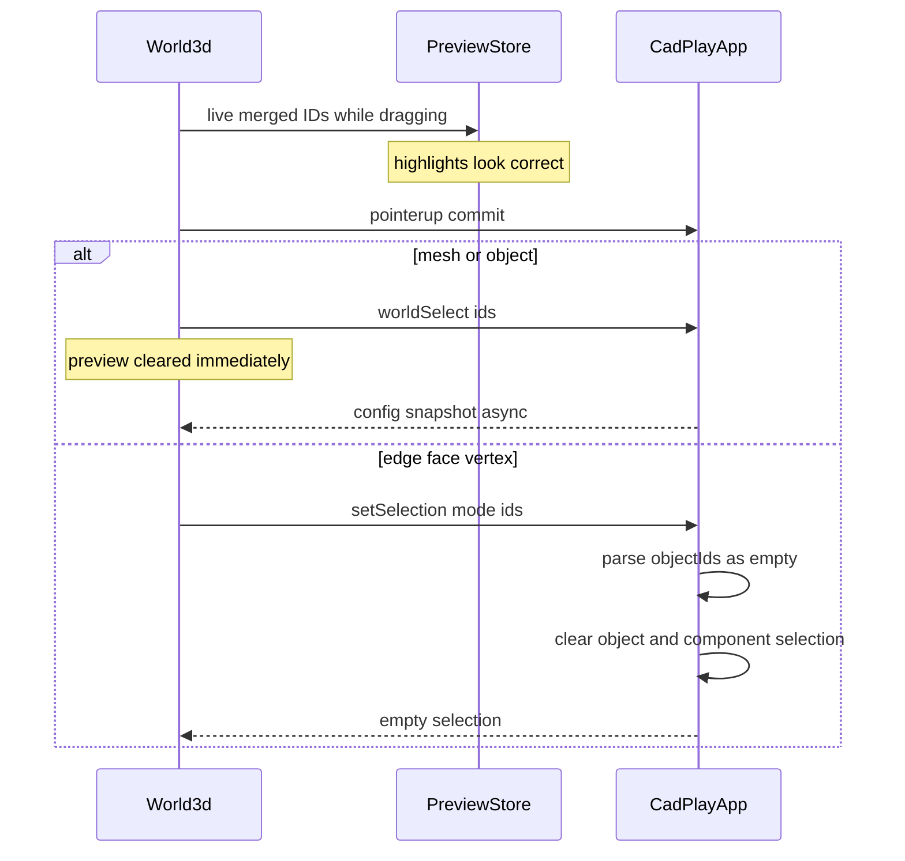

# Fix CAD Selection Finalize

## Root cause

Live marquee highlighting is renderer-only (`setWorldSelectionPreview`). Commit happens on pointer-up in World3d:

```16533:16538:🧰️framework/🛍️products/💻️os/🔨️modules/📺️renderer/🧑️‍🎨️engine/⚛️react/⚡️implementations/🟦️typescript/📦️index.tsx
if (marqueePreview.mergedInstanceIds) {
  dispatch("worldSelect", { ids: marqueePreview.mergedInstanceIds, merge: "replace" });
} else if (marqueePreview.mergedComponentIds) {
  dispatch("setSelection", { mode: selectionMode, ids: marqueePreview.mergedComponentIds });
}
```



Two concrete failures:

1. **Component finalize is a contract mismatch (hard bug).** Lowpoly/`World3d` expect `{ mode, ids }`. CAD protocol only has `SetSelection { object_ids }` and parses `objectIds` only ([`protocol/.../lib.rs`](✏️s/🔌️plugins/📐️cad/🎛️apps/📐️cad/🔨️modules/📡️protocol/⚡️implementations/🦀️rust/📦️lib.rs) L85, [`ui/.../lib.rs`](✏️s/🔌️plugins/📐️cad/🎛️apps/📐️cad/🔨️modules/🖱️ui/⚡️implementations/🦀️rust/📦️lib.rs) L3264). Missing `objectIds` becomes `[]`, then the handler clears both object and component selection (L2444–2453). Matches “live works, release leaves nothing.”

2. **Object finalize clears preview before commit lands (slow / empty look).** `setMarqueePath([])` runs immediately after a non-awaited `dispatch`, so preview dies before WASM config refresh. World3d marquee also lacks pointer capture / window `pointerup`, so releases outside the pane can skip finalize entirely.

Click/`worldPick` component selection already works via `apply_component_selection` — only marquee finalize is incomplete.

## Chosen approach

Unify CAD selection commands with the World3d/lowpoly split (no dual-meaning blob):

- **Object selection** stays on `worldSelect` (already correct). Migrate CAD document-tree object clicks from `setSelection({ objectIds })` to `worldSelect({ ids, merge: "replace" })`.
- **Component selection** makes `setSelection` match lowpoly: `{ mode, ids, objectId?, merge? }`, handled through existing `apply_component_selection`.
- **React finalize** sends a complete component payload (`mode`, `ids`, `objectId: selection.activeObjectId`, `merge` from marquee modifiers), retains preview until the dispatch settles (or until committed selection JSON matches), and uses pointer capture + cancel cleanup like other World3d gestures.

## Files to change

- [`✏️s/🔌️plugins/📐️cad/🎛️apps/📐️cad/🔨️modules/📡️protocol/⚡️implementations/🦀️rust/📦️lib.rs`](✏️s/🔌️plugins/📐️cad/🎛️apps/📐️cad/🔨️modules/📡️protocol/⚡️implementations/🦀️rust/📦️lib.rs) — reshape `CadCommand::SetSelection` to `{ mode, ids, object_id, merge }` (drop `object_ids`).
- [`✏️s/🔌️plugins/📐️cad/🎛️apps/📐️cad/🔨️modules/🖱️ui/⚡️implementations/🦀️rust/📦️lib.rs`](✏️s/🔌️plugins/📐️cad/🎛️apps/📐️cad/🔨️modules/🖱️ui/⚡️implementations/🦀️rust/📦️lib.rs) — parse/handle new `setSelection`; migrate tree `objectIds` callers to `worldSelect`; extend existing selection tests with marquee-shaped `setSelection` + keep object `worldSelect` coverage.
- [`