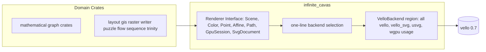

# Canvas Renderer Interface Around Vello

## Current State

- `infinite_cavas` ([infinite/cavas/rs/lib.rs](infinite/cavas/rs/lib.rs)) already owns the GPU session (`RenderContext`/`Renderer`/wgpu) but re-exports vello wholesale:

```4:6:infinite/cavas/rs/lib.rs
pub use vello_svg;
pub use vello_svg::usvg;
pub use vello_svg::vello;
```

- 5 more crates declare `vello` in their own `Cargo.toml` (`layout/rs`, `puzzle/2d/rs` (+`vello_svg`), `gis/2d/rs`, `raster/rs`, `writer/rs`) and ~10 more consume `cavas::vello::*` transitively (`flow/core`, `sequence/core`, `trinity/rewrite/engine`, `mathematical/graph/*`).
- Vello naming leaks into domain APIs: `VelloThemePalette`, `set_vello_theme_json` / `setVelloThemeJson`, `svg_icon_vello09`, and on the TS side `serializeGraphVelloThemePaletteJson`, `VelloThemeSession`, `syncSessionVelloTheme` ([ui/styling/js/index.ts](ui/styling/js/index.ts)), `useVelloThemeSync` ([ui/react/index.tsx](ui/react/index.tsx)) used by all canvas react hosts.
- No crate uses `kurbo`/`peniko` standalone — only via `vello::` re-exports.

## Target Architecture

`infinite_cavas` becomes the single wrapper. It exposes a repo-owned interface; the vello binding lives in one backend subregion, selected by a single line. Replacing vello means writing a new backend region and flipping that one line (plus the one dep line in [infinite/cavas/rs/Cargo.toml](infinite/cavas/rs/Cargo.toml)) — no other crate changes.



## Step 1: Renderer interface in `infinite_cavas`

Add a `// #region 🔖Renderer` to [infinite/cavas/rs/lib.rs](infinite/cavas/rs/lib.rs) with repo-owned types (thin `#[repr(transparent)]` newtypes delegating to the backend, zero-cost):

- Geometry: `Point`, `Vec2`, `Affine`, `Rect`, `RoundedRect`, `Circle`, `Line`, `Arc`, `CubicBez` (with `eval`), `BezPath` (`move_to`/`line_to`/`quad_to`/`curve_to`/`close_path`/`push`), `PathEl`, `Stroke` (width, caps, dash pattern), `Cap` — covering the exact surface inventoried across consumers. Operators (`Affine * Affine`, `Point - Point`, `Affine::translate/scale/rotate`, `Vec2::hypot`) delegated.
- Paint: `Color` (`new`, `from_rgba8`, `to_rgba8`, `components`, `multiply_alpha`), `FillRule` (NonZero/EvenOdd), `BlendMode` (all 16 Mix variants used by raster), `RasterImage` (replaces `Blob`/`ImageData`/`ImageFormat`/`ImageAlphaType`/`ImageBrush`).
- `Scene`: `new`, `fill`, `stroke`, `draw_image`, `append`, `push_layer`, `pop_layer`, `push_clip_layer`, plus test hooks `is_empty()` / `path_count()` (replacing `scene.encoding()` peeking). `fill`/`stroke` take a repo-owned shape parameter (enum or sealed trait over the geometry types above).
- SVG: `SvgDocument` wrapping `usvg::Tree` (`parse`, `content_bounds`, icon parse options) and scene append (plain + themed), replacing the `svg_icon_vello09` module name (rename to `svg_icon`) and `vello_svg::append_tree` call sites in the directed-port icon cache.
- `CanvasGpuSession`: keep the existing API but ensure no vello type appears in its public signatures (it takes `&Scene` + `Color`).
- Existing `CanvasContent`, `text`, `raster`, `render`, `camera`, `theme` modules switch to the new types.

All vello/vello_svg/usvg imports move into a `// #region 🏷️VelloBackend` subregion; the interface binds to it via one line (`use vello_backend as backend;`). Delete `pub use vello_svg; pub use vello_svg::usvg; pub use vello_svg::vello;`.

## Step 2: Migrate all consumer crates

Remove `vello`/`vello_svg` from [layout/rs/Cargo.toml](layout/rs/Cargo.toml), [puzzle/2d/rs/Cargo.toml](puzzle/2d/rs/Cargo.toml), [gis/2d/rs/Cargo.toml](gis/2d/rs/Cargo.toml), [raster/rs/Cargo.toml](raster/rs/Cargo.toml), [writer/rs/Cargo.toml](writer/rs/Cargo.toml) and rewrite every `*::vello::*` / `usvg` call site onto the interface, per crate:

- [mathematical/graph/rs/lib.rs](mathematical/graph/rs/lib.rs) — geometry module.
- [mathematical/graph/port/rs/lib.rs](mathematical/graph/port/rs/lib.rs) — handle-kind colors.
- [mathematical/graph/port/directed/rs/lib.rs](mathematical/graph/port/directed/rs/lib.rs) — theme palette + `IconPaintCache`.
- [mathematical/graph/port/directed/normal/rs/lib.rs](mathematical/graph/port/directed/normal/rs/lib.rs) — `BoardHost`, the largest paint surface.
- [mathematical/graph/port/directed/dag/rs/lib.rs](mathematical/graph/port/directed/dag/rs/lib.rs) — `DagHost` (dashed strokes, minimap, widgets).
- [layout/rs](layout/rs/lib.rs) (`engine.rs`, `wasm_session.rs`; drop `pub use vello;`), [gis/2d/rs/lib.rs](gis/2d/rs/lib.rs), [raster/rs/lib.rs](raster/rs/lib.rs) (blend modes, layers), [writer/rs/lib.rs](writer/rs/lib.rs), [puzzle/2d/rs/lib.rs](puzzle/2d/rs/lib.rs) (drop `pub use vello_svg::*`; re-export `cavas` geometry instead), [flow/core/rs/lib.rs](flow/core/rs/lib.rs), [sequence/core/rs/lib.rs](sequence/core/rs/lib.rs), [trinity/rewrite/engine/rs/lib.rs](trinity/rewrite/engine/rs/lib.rs).

Crates re-exporting geometry for their own consumers (`gis_2d`, `raster`, `puzzle_2d`) re-export the `cavas` interface types explicitly instead.

## Step 3: Purge vello naming from APIs (Rust + wasm-bindgen)

- `VelloThemePalette` → `CanvasThemePalette`; `vello_theme` fields → `canvas_theme`; `set_vello_theme_from_json` → `set_canvas_theme_from_json`.
- wasm-bindgen method `setVelloThemeJson` → `setCanvasThemeJson` on every session (`BoardSession`, `LayoutSession`, `FlowSession`, `SequenceSession`, `DagSession`, `TrinitySession`, `MapSession`, `RasterSession`, `WriterSession`).
- Test names like `board_host_vello_theme_*`, `svg_icon_vello09_append_smoke` updated in place.

## Step 4: TypeScript side

- [ui/styling/js/index.ts](ui/styling/js/index.ts): `serializeGraphVelloThemePaletteJson` → `serializeGraphCanvasThemePaletteJson`, `VelloThemeSession` → `CanvasThemeSession` (`setCanvasThemeJson`), `syncSessionVelloTheme` → `syncSessionCanvasTheme`; update inline tests ([ui/styling/js/index.test.ts](ui/styling/js/index.test.ts)).
- [ui/react/index.tsx](ui/react/index.tsx): `useVelloThemeSync` → `useCanvasThemeSync`.
- Update all consumers: [flow/react/index.tsx](flow/react/index.tsx), [writer/react/index.tsx](writer/react/index.tsx), [raster/react/index.tsx](raster/react/index.tsx), [trinity/react/index.tsx](trinity/react/index.tsx), [sequence/react/index.tsx](sequence/react/index.tsx), [gis/2d/react/index.tsx](gis/2d/react/index.tsx), [puzzle/2d/react/index.tsx](puzzle/2d/react/index.tsx), [mathematical/graph/port/directed/dag/react/index.tsx](mathematical/graph/port/directed/dag/react/index.tsx).

## Step 5: Verify

- `cargo check --workspace` and `cargo test --workspace` (native), plus the wasm build tasks via `nx` for the session crates.
- `bun`/`nx` test for `ui/styling/js` and affected react packages.
- Grep gate: after migration, `vello|peniko|kurbo|usvg` must only match inside the `VelloBackend` region of [infinite/cavas/rs/lib.rs](infinite/cavas/rs/lib.rs) and [infinite/cavas/rs/Cargo.toml](infinite/cavas/rs/Cargo.toml) (ignoring `.repo/`, `.cursor/`, `Cargo.lock`).

Work happens inside a repo MCP ticket (reading `repo://goals` first), with no new files outside it — the interface lives in the existing `infinite/cavas/rs/lib.rs` using regions.