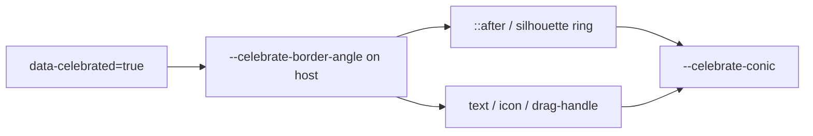

# Celebrate Conic Content Paint

## Problem

`[data-celebrated="true"]` only drives a spinning conic ring on `::after` (and the dock silhouette). Label text, icons (`stroke="currentColor"`), and drag handles keep solid `--border-emphasized-color` / `text-element` / `text-muted-foreground`, so celebrate looks like a border-only effect.

## Approach

Keep one shared spinning conic grammar and apply it to both the ring and the control’s emphasized chrome. Scope paint to the celebrated **leaf control** (buttons, toggles, tabs, tree rows, checklist labels, etc.), not every descendant of a celebrated window/panel (same containment idea as the existing dock `::after` suppression).

## Changes

### 1. Shared celebrate tokens in `[ui/styling/js/ui.css](ui/styling/js/ui.css)`

- Set `@property --celebrate-border-angle` to `inherits: true`.
- On `[data-celebrated="true"]`:
  - Define `--celebrate-conic` as the existing primary/secondary/tertiary `conic-gradient(from var(--celebrate-border-angle), …)`.
  - Run `celebrate-border-spin` on the **host** so angle is shared by ring + content.
- On `::after`: use `background: var(--celebrate-conic)`; keep only `celebrate-border-burst` there (spin lives on host).
- Point `.window-silhouette-border-celebrated-fill` at `var(--celebrate-conic)` so silhouette stays DRY with buttons.

### 2. Emphasized chrome paint (same file, next to celebrate / drag-handle regions)

For a celebrated leaf control’s own chrome:

- **Text** (label spans, tree labels, checklist label when the span itself is stamped): `background-image: var(--celebrate-conic)`; `background-clip: text`; `color: transparent`.
- **Icons + drag handles** (catalog/svg icon wrappers, `[data-slot="tree-icon"]`, `[data-slot="drag-handle"]`): same conic as background + `isolation: isolate`; SVG uses opaque `currentColor` with `mix-blend-mode: destination-in` so stroke icons pick up the gradient (background-clip does not paint SVG strokes).
- Override the existing `[data-hover-scope]:hover [data-slot="drag-handle"] { color: var(--border-emphasized-color) }` while celebrating so the grip stays on the conic recipe.
- **Containment**: do not apply content paint when the stamp is on window/dock shell targets (reuse the same selectors already used to suppress window `::after`). Apply via celebrated leaf slots (`button-group-item`, `toggle-group-item`, `action-group-item`, panel/pane/mode-dock chrome, tree rows, and bare stamped labels).

### 3. Tests

Extend existing celebrate / shell CSS tests in `[ui/js/react/index.tsx](ui/js/react/index.tsx)` (no new test files):

- Celebrated button exposes shared `--celebrate-conic` / host spin and content paint hooks (text/icon/handle).
- Celebrated window shell still does **not** conic-paint nested body text/icons.
- Drag-handle under a celebrated hover-scope uses celebrate paint rather than solid emphasized.

### 4. Ticket

On implementation: reopen or open a ticket under `🎯r2602/🎯runningsketchpad` (same goal as [FIX-WINDOW-CELEBRATE-CONIC-GRADIENT](.repo/🎫/26/07/24/FIX-WINDOW-CELEBRATE-CONIC-GRADIENT/ticket.json)), keep temp notes in the ticket folder, close with summary + touched files.

## Out of scope

- 3D `CelebratingConicMaterial` / wgpu (already have their own celebrate paths).
- Changing non-celebrate emphasized hover/selected solid foreground behavior.

