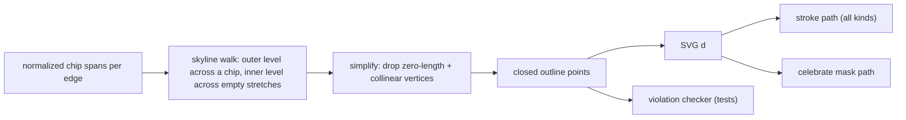

# Clean and Consistent Window Silhouette Borders

## Root cause

The border is a single SVG path built by `windowSilhouettePath()` in [ui/js/react/index.tsx](ui/js/react/index.tsx). Two places emit retraced, dead-end segments when a chip slot is absent:

- Bottom edge: `appendWindowSilhouetteBottomPath` unconditionally walks down to the bottom-right corner (`V${y1}`) before stepping back up around the last chip. With a left + center chip and no right chip this yields `... H200 V100 V76 H50 ...` — the `V100 V76` retrace is the dangling stub that looks like a border wrapped around an invisible chip. The current tests bake it in at [ui/js/react/index.tsx:30852](ui/js/react/index.tsx) and [:30887](ui/js/react/index.tsx).
- Top edge: when a window has no enlarge/close controls (`Panel`, `Pane`, `ContextMenuChrome`, dialog chrome) `gapEnd` collapses to `x1`, so the path emits `H{x1} V{y0} H{x1}` — a mirrored tick sticking up above the cap.

Every effect (`celebrated`, `introduced`, `loading`, `waiting`, `active`, `normal`) reuses this one `d`, so all of them inherit the artifact; dashed and thick strokes make it worse.

## Target geometry: one skyline per edge




Screenshot case (title + skip on top; Back + step chip, no Next on the bottom), 200x100, caps 24:

- now: `M0,0 H60 V24 H160 V0 H200 V100 V76 H120 V100 H80 V76 H50 V100 H0 V76 H0 Z`
- after: `M0,0 H60 V24 H160 V0 H200 V76 H120 V100 H80 V76 H50 V100 H0 Z`

No-controls panel: `M0,0 H60 V24 H200 V100 H0 Z` instead of the `V0 H200` tick.

## 1. Unified edge model (replaces the asymmetric metrics)

In [ui/js/react/index.tsx](ui/js/react/index.tsx), delete `WindowSilhouetteBottomChip`, `tabsWidth`, `controlsWidth`, `capHeight`, `bottomLeftWidth`, `bottomRightWidth`, `bottomCapHeight`, `resolveWindowSilhouetteBottomChips` and `appendWindowSilhouetteBottomPath`. New model:

```ts
export interface WindowSilhouetteChip { readonly left: number; readonly right: number }
export interface WindowSilhouetteEdge { readonly depth: number; readonly chips: readonly WindowSilhouetteChip[] }
export interface WindowSilhouetteMetrics { readonly width: number; readonly height: number; readonly top: WindowSilhouetteEdge; readonly bottom: WindowSilhouetteEdge }
export interface WindowSilhouettePoint { readonly x: number; readonly y: number }
```

New pure functions, all inside the existing `#region WindowChrome` (new subregion for the silhouette):

- `normalizeWindowSilhouetteChips(chips, x0, x1)` - clamp into the box, drop sub-epsilon spans, sort, merge touching/overlapping spans.
- `windowSilhouetteEdgePoints(edge, x0, x1, outer, inner)` - the skyline walk; emits a corner only where the level changes, so an absent slot is structurally a skipped line rather than a notch.
- `windowSilhouetteOutline(metrics, inset)` - top skyline left-to-right, right connector, bottom skyline right-to-left, left connector, closed.
- `simplifyWindowSilhouetteOutline(points)` - removes zero-length segments and collinear vertices around the closed loop, so no 180-degree reversal, miter spike, doubled dash or double-painted celebrate mask can survive.
- `windowSilhouetteOutlineViolations(points)` - returns the list of broken invariants (non-axis-aligned, zero-length, collinear, reversal, outside box, unclosed); the enforcement hook used by tests.
- `windowSilhouettePath(metrics, inset = WINDOW_SILHOUETTE_PATH_INSET)` - serializes the outline to `M/H/V/Z`; the only geometry entry point.

Depth 0 collapses an edge to a flat side automatically, so "no footer" and "no cap" need no special cases.

## 2. Measurement

Rewrite `measureWindowSilhouetteMetrics` to build both edges from rects instead of width arithmetic:

- top chips: `[x0, gapRect.left]` when wider than epsilon, plus `[controlsRect.left, width]` when the controls cell exists; depth from the tabbar/cap height.
- bottom chips: one span per present footer chip (`window-chrome-footer-left|-center-chip|-right`); depth from the tallest present chip.

Selector constants at [ui/js/react/index.tsx:8600](ui/js/react/index.tsx) stay, retargeted at the new marker attributes below.

## 3. One paint table for all border effects

Replace the nested ternaries at [ui/js/react/index.tsx:8828](ui/js/react/index.tsx) with:

```ts
export const WINDOW_SILHOUETTE_BORDER_KINDS = ["celebrated", "introduced", "loading", "waiting", "active", "normal"] as const;
export type WindowSilhouetteBorderKind = (typeof WINDOW_SILHOUETTE_BORDER_KINDS)[number];
export function windowSilhouetteBorderPaint(kind: WindowSilhouetteBorderKind): { readonly className: string; readonly stroke: string }
```

`WindowChromeSilhouetteBorder` computes `path` once and feeds both the stroked `<path>` and the celebrate mask `<path>`, so a kind can never diverge geometrically.

## 4. Silhouette as the single owner of the outer stroke

Marker attributes stamped from one place each, replacing today's enumerated slot lists:

- `data-window-silhouette` on every stack that renders a silhouette (`WindowChrome` stack, `ModeDockStack`).
- `data-window-silhouette-border` on the SVG (keeps `data-slot` for tests).
- `data-window-silhouette-chip` + `data-dock="top|bottom"` on chip cluster cells (`window-chrome-chip-cap`, `window-chrome-controls`, `mode-dock-tab-cap`, `mode-dock-controls-cap`, footer chip wrappers).
- `data-window-silhouette-gap` on every gap cell.

Chip class constants drop all border utilities so nothing double-strokes the silhouette: `windowChromeTitleChipClass` ([:8739](ui/js/react/index.tsx)), `modeDockInactiveTabClass` / `modeDockInactiveTabBeforeGapClass` ([:8692](ui/js/react/index.tsx)), `windowControlsCapClass` ([:8719](ui/js/react/index.tsx)), and the footer chip class in `WindowChrome`. The inner separator (bottom line for top-docked chips, top line for bottom-docked chips) and the dividers between sibling tabs come from a single CSS block keyed on `data-window-silhouette-chip[data-dock]`.

In [ui/styling/js/ui.css](ui/styling/js/ui.css), rekey these onto the markers so any new window type is covered automatically:

- rectangular ring suppression currently scoped to `[data-slot="mode-dock-stack"]` (lines 1252-1256, 1280-1289, and the reduced-motion copy at 1357-1360) becomes `[data-window-silhouette] ...`, so panels, panes, introduction boxes, context menus and dialogs also stop painting a chip-ignoring rectangle under `introduced` / `celebrated` / `loading` / `waiting`.
- the two hover-emphasis blocks at 6805-6815 collapse into one rule on `[data-window-silhouette-border][data-kind="normal"] path`.
- the gap punch-through list at 6825-6835 becomes `[data-window-silhouette-gap]`.

## 5. Tests (inline in `index.tsx`, per repo convention)

Extend the existing `windowSilhouettePath` suite around [ui/js/react/index.tsx:30846](ui/js/react/index.tsx):

- rewrite the path expectations for the new model, adding the absent-slot cases: no controls, no title chips, no footer, left only, center only, right only, left + center (the reported bug), center + right, all three.
- exhaustive matrix over presence of {title, controls} x subsets of {footer left, center, right} asserting `windowSilhouetteOutlineViolations` is empty and the serialized path contains no consecutive same-axis commands.
- loop `WINDOW_SILHOUETTE_BORDER_KINDS` and assert every kind renders the identical `d` (celebrate mask included).
- update the mounted-measurement assertions at [:28069](ui/js/react/index.tsx) and the dock/introduction render tests to the new metrics shape.
- introduction regression: render the step with Back + step chip and no Next, assert the exact clean `d`.
- CSS contract asserts (same style as the existing ui.css reads near [:27721](ui/js/react/index.tsx)): ring suppression, hover emphasis and gap transparency are keyed on the marker attributes and no `mode-dock-stack`-only variant remains.

## Verification

- `nx test @semio-tech/ui-react` (full run, not quick)
- `nx typecheck @semio-tech/ui-react` and `nx lint @semio-tech/ui-react`
- Storybook: step through the introduction (first step without Back, middle step without Next, last step) and a `Panel` / `Pane` to confirm the top-right tick and bottom-right stub are gone under each effect.

## Ticket

Open a new ticket (no existing ticket covers the silhouette geometry) associated with the goal used by the sibling window-border tickets, `r2602/runningsketchpad`, and keep all scratch output inside the ticket folder.