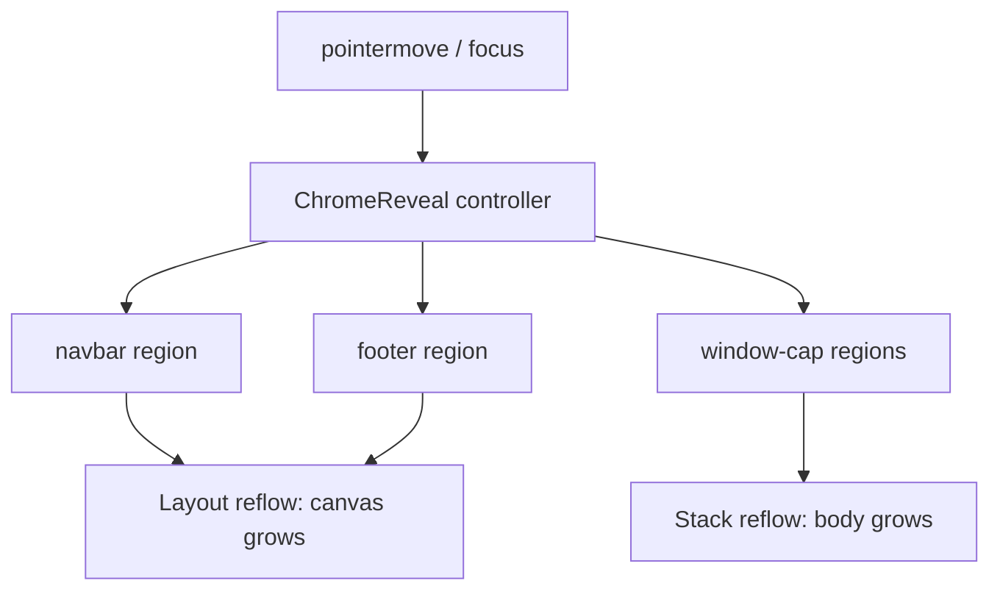

# Compact Driver Space-On-Hover Chrome

## Problem

With `[COMPACT_UI_DRIVER](ui/js/react/index.tsx)` (`chrome: "hover"`), navbar/footer already fade via `[globals-ui.css](ui/js/react/globals-ui.css)` `ChromeReveal`, but the comment is explicit: **opacity-only so the canvas never reflows**. Bars keep `h-large`. Window top chips (`window-chrome-cap` / `mode-dock-tabbar`) are not in the reveal system at all and always reserve `min-h-medium`.

Desired compact behavior: content uses the full viewport/window; chrome **only occupies layout height while revealed** (pointer near / focus).

## Approach

Keep the existing driver axis and pointer/focus controller. Change reveal from **fade-in-place** to **collapse-then-expand**, and register window top caps as reveal regions.

### 1. Collapse shell chrome height when hidden

In `[ui/js/react/globals-ui.css](ui/js/react/globals-ui.css)` `ChromeReveal` region:

- When `html[data-ui-chrome-reveal="hover"]` and a `[data-ui-reveal-region]` is **not** `[data-ui-revealed="true"]` and not `:focus-within`:
  - Force `height: 0`, `min-height: 0`, `overflow: hidden`, `opacity: 0`, `pointer-events: none`
  - Zero borders/padding that would leave a residual strip
- When revealed / focus-within: restore normal height (navbar/footer keep `h-large` from classes)
- Drop the “opacity-only / never reflows” comment; document intentional reflow
- Prefer **instant height** + short opacity transition (avoid janky height animation)

Activation already works with height 0 for shell bars: `[chromeRevealRegionRevealed](ui/js/react/index.tsx)` uses screen edge bands (`CHROME_REVEAL_EDGE_BAND_PX` at top/bottom) independent of region height.

### 2. Register window top chips as reveal regions

In `[WindowChrome](ui/js/react/index.tsx)` (~8456 and chipOnly ~8434):

- Add `data-ui-reveal-region="window-cap"` on the top cap / chip-only root

In `[ModeDockTabBar](ui/js/react/index.tsx)` (~26224 / ~26259):

- Same attribute on `mode-dock-tabbar` (same family as `WINDOW_CHROME_CAP_SELECTOR`)

**Out of scope:** `window-chrome-footer` (introduction only), absolute window-body overlays (measures/search/etc.), `PanelChromeTabBar` in navbar/footer (already covered by shell reveal).

### 3. Window-cap activation when collapsed

Extend `chromeRevealRegionRevealed` for `window-cap`:

- Keep the existing rect + activation-band check (collapsed height-0 rect still has a top edge)
- Add stack-relative top edge: pointer inside the parent stack’s horizontal bounds and within `CHROME_REVEAL_EDGE_BAND_PX` of the stack’s top (so the cap is reachable even when its own height is 0)

CSS for collapsed window caps must also defeat child `min-h-medium` (overflow hidden on the region is enough if region height is forced to 0).

### 4. Silhouette / layout side effects

- Cap collapse changes live metrics from `[measureWindowSilhouetteMetrics](ui/js/react/index.tsx)`; existing stack `ResizeObserver` already bumps silhouette epoch — verify U-cutout flattens when cap height is 0 and restores on reveal
- Mode-dock `grid-rows-[auto_minmax(0,1fr)]` body absorbs freed space automatically
- Content-hugging side panels may shorten when the cap collapses (more canvas visible) — correct for “as large as possible”

### 5. Tests

Extend existing vitest in `[ui/js/react/index.tsx](ui/js/react/index.tsx)` (~34539):

- Navbar/footer: hidden → no layout height; edge-band reveal restores height
- `window-cap`: stack top-edge band reveals; leaving stack top collapses again
- Focus-within still forces reveal

Store run logs under the ticket folder.

## Files

- `[ui/js/react/globals-ui.css](ui/js/react/globals-ui.css)` — height-collapse reveal CSS
- `[ui/js/react/index.tsx](ui/js/react/index.tsx)` — `WindowChrome` / `ModeDockTabBar` attrs, `window-cap` activation, tests

## Ticket / goal

- New ticket under goal `R26-02` (same as driver merge [#2326](https://github.com/usalu/semio/issues/2326)); prior ticket intentionally shipped opacity-only
- No reopen of the closed merge ticket — this is a behavior change on top of it

