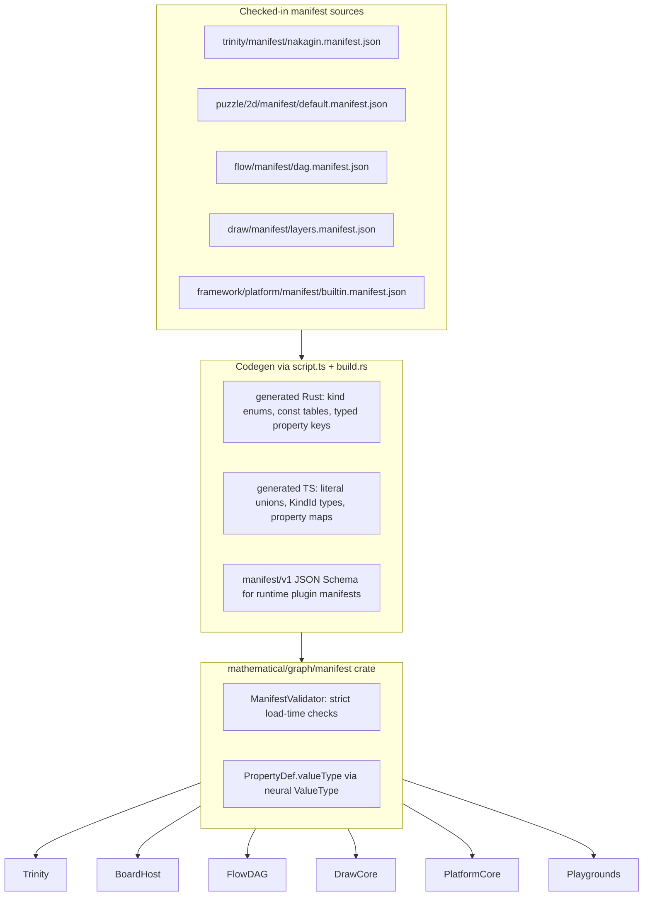

# Compile-Time Graph Manifest Refactor

## Problem

Today kind definitions are fragmented and mostly **runtime string IDs**:


| Stack                                                                                            | Kind source                                               | Property typing                | TS/Rust parity                    |
| ------------------------------------------------------------------------------------------------ | --------------------------------------------------------- | ------------------------------ | --------------------------------- |
| [trinity/ram/lib.rs](trinity/ram/lib.rs)                                                         | `Manifest` in fixture JSON                                | `valueType: String` ("any")    | N/A (Rust only)                   |
| [puzzle/2d/react/index.tsx](puzzle/2d/react/index.tsx)                                           | `KindCatalogBundle` + `DEFAULT_KIND_CATALOG_BUNDLE` in TS | none (`user_data: unknown`)    | Manual; pushed to WASM at runtime |
| [mathematical/graph/port/directed/normal/lib.rs](mathematical/graph/port/directed/normal/lib.rs) | `BoardHost` runtime catalogs                              | none                           | Duplicated from TS                |
| [mathematical/graph/port/directed/dag/lib.rs](mathematical/graph/port/directed/dag/lib.rs)       | `DagNodeKind` Rust enum                                   | per-variant fields only        | Partial TS mirror in flow/react   |
| [draw/core/index.ts](draw/core/index.ts)                                                         | `as const` arrays (`DRAW_SHAPE_KINDS`)                    | inline on layer types          | No Rust                           |
| [writer/core/index.ts](writer/core/index.ts)                                                     | free `languageId: string`                                 | none                           | No Rust                           |
| [framework/product/platform/core/index.ts](framework/product/platform/core/index.ts)             | ad-hoc `VirtualFileSystemSchemaModel`, `PluginManifest`   | descriptor presentation unions | No shared kernel                  |


Trinity [AGENTS.md](trinity/AGENTS.md) already states the target: *"A graph has a manifest at compile time and nodes and edges at runtime"* — but manifests are deserialized JSON with unchecked `kind: String` instances ([trinity/ram/lib.rs](trinity/ram/lib.rs) lines 174–199). Puzzle duplicates Nakagin semantics across [nakagin-capsule-tower.trinity.json](trinity/fixture/nakagin-capsule-tower.trinity.json) (property manifest) and [nakagin-capsule-tower.2d.json](puzzle/2d/fixture/nakagin-capsule-tower.2d.json) (`meta.kindCatalogs` visual catalog only).

## Target architecture




### Unified manifest format (`manifest/v1`)

One schema, multiple **kind families** (only declare what the domain uses):

- **Graph families**: `nodeKinds`, `edgeKinds`, `portKinds` (handle/vortex/grip), `wireKinds` (wire/cable/rope)
- **Document families**: `layerKinds` (draw), `languageKinds` (writer)
- **Platform families**: `windowKinds`, `surfaceKinds`, `fileNodeKinds`, `descriptorKinds`

Each kind entry:

```json
{
  "id": "Piece",
  "name": "Piece",
  "properties": [
    { "name": "position", "kind": "data", "valueType": { "schema": "point" } },
    { "name": "flatPosition", "kind": "derived", "valueType": { "schema": "point" }, "expr": "flatFromConnections" }
  ],
  "ports": ["Connector"],
  "presentation": { "color": "...", "icon": "emoji:...", "handles": [...] }
}
```

- Reuse [neural/engine ValueType + FieldSpec](neural/engine/lib.rs) for property typing (no second `valueType: String` system).
- Graph axes declared once per manifest: `portModel: normal|ported`, `directedness: directed|undirected`.
- Fixtures reference manifest by id: `"manifestId": "nakagin"`; embedded inline manifests removed after migration.

### Codegen pipeline (repo conventions)

New crate + package at `mathematical/graph/manifest/`:

- [mathematical/graph/manifest/lib.rs](mathematical/graph/manifest/lib.rs) — kernel types, `Manifest`, `PropertyDef`, `ManifestValidator`
- [mathematical/graph/manifest/build.rs](mathematical/graph/manifest/build.rs) — `include!` generated Rust from manifest sources (same pattern as [infinite/cavas/rs/build.rs](infinite/cavas/rs/build.rs))
- [mathematical/graph/manifest/script.ts](mathematical/graph/manifest/script.ts) — `generate` command: read all `**/*.manifest.json`, emit Rust + TS + JSON Schema; register in `project.json`, `package.json`, [launch.json](.vscode/launch.json)

Per-manifest codegen output (example `nakagin`):

**Rust**: `NakaginNodeKind` enum, `NakaginEdgeKind`, `NakaginPortKind`, `NakaginWireKind`, `NAKAGIN_MANIFEST: Manifest`, typed property key constants.

**TypeScript**: `type NakaginNodeKindId = "Piece" | ...`, `NakaginNodeProperties["Piece"]`, `NakaginKindCatalogBundle` replacing hand-written interfaces.

### Strict validation (load-time, not optional)

Extend kernel with `ManifestValidator`:

1. Instance `kind` must be in manifest family
2. Port/handle kind on node must be declared on node kind + exist in `portKinds`
3. Property keys must match `PropertyDef`; values validated via neural `ValueType`
4. Wire → edge promotion chain must reference valid wire/edge kinds
5. `kindCompatibility` rules validated at link time (puzzle brush)
6. **Fail hard** on unknown kinds (remove silent fallbacks in `BoardHost` catalog lookups)

Jack LSP ([trinity/jack/core/lib.rs](trinity/jack/core/lib.rs)) upgrades from warnings to errors where manifest is known at compile time.

---

## Migration phases

### Phase 1 — Kernel + codegen + Nakagin reference (highest leverage)

**Goal**: One manifest unifies Trinity + Puzzle for Nakagin.

1. Create `mathematical/graph/manifest` crate + `@semio-tech/graph-manifest` TS re-export.
2. Author [trinity/manifest/nakagin.manifest.json](trinity/manifest/nakagin.manifest.json) merging:
  - Trinity property defs from [nakagin-capsule-tower.trinity.json](trinity/fixture/nakagin-capsule-tower.trinity.json)
  - Puzzle visual catalog from fixture `meta.kindCatalogs` (handles, wires, nodes, edges, edgeTips)
3. Run codegen; wire `build.rs` into `trinity_ram`, `mathematical_graph_port_directed`, `puzzle_2d` WASM builds.
4. Replace [trinity/ram/lib.rs](trinity/ram/lib.rs) hand-rolled `Manifest` / `Manifest::nakagin_default()` with generated `NAKAGIN_MANIFEST`.
5. Replace [puzzle/2d/react/index.tsx](puzzle/2d/react/index.tsx) `KindCatalogBundle`, `DEFAULT_KIND_CATALOG_BUNDLE`, and loose parsers with generated types + `nakaginManifestCatalogBundle()`.
6. Refactor [BoardHost::set_board_kind_catalogs_from_json](mathematical/graph/port/directed/normal/lib.rs) to accept generated manifest id or typed catalog; reject unknown kind ids.
7. Update both Nakagin fixtures to `"manifestId": "nakagin"`; delete duplicated inline manifest/catalog blocks.
8. Add in-file tests: fixture load fails on unknown kind; property type mismatch fails.

### Phase 2 — Puzzle 2d/3d/5d generalization

1. Manifests: `puzzle/2d/manifest/default.manifest.json`, `puzzle/3d/manifest/default.manifest.json` (map ObjectKind/VortexKind/AttractionKind/CableKind naming via manifest metadata, not separate TS interfaces).
2. [puzzle/5d/react/index.tsx](puzzle/5d/react/index.tsx): merge manifests at compile time (generated merge helper), not runtime projection.
3. Remove duplicate kind interfaces in [puzzle/3d/react/index.tsx](puzzle/3d/react/index.tsx).
4. Framework playground renderer ([framework/product/playground/renderer/react/index.tsx](framework/product/playground/renderer/react/index.tsx)): inspector kind `<select>` options from generated manifest, not manual catalog merge.

### Phase 3 — Trinity + Jack + rewrite engine

1. [trinity/ram/lib.rs](trinity/ram/lib.rs): `Graph::from_fixture` calls `ManifestValidator` before accepting nodes/edges/ports.
2. [trinity/jack/core/lib.rs](trinity/jack/core/lib.rs): completions/diagnostics use generated kind + property key sets.
3. [trinity/rewrite/engine/lib.rs](trinity/rewrite/engine/lib.rs): host loads manifest by id.

### Phase 4 — Flow DAG

1. Author [flow/manifest/dag.manifest.json](flow/manifest/dag.manifest.json) describing all [DagNodeKind](mathematical/graph/port/directed/dag/lib.rs) variants, channel kinds (`IoPortSpec`), and neural schema refs for port payloads.
2. Codegen replaces hand-maintained `DagNodeKind` enum + flow/react operator port types.
3. [flow/core/index.ts](flow/core/index.ts) + [flow/react](flow/react): tree nodes typed by generated `FlowDagNodeKindId`; module operators reference manifest channel defs.

### Phase 5 — Mindmap / WIRES

1. [reasoning/mindmap/wires/lib.rs](reasoning/mindmap/wires/lib.rs): `WireRelationship` becomes generated edge kind ids in `wires.manifest.json`.
2. [reasoning/mindmap/wires/react/index.ts](reasoning/mindmap/wires/react/index.ts): drop `wiresKindCatalogsToPuzzle2d` adapter; consume shared manifest projection.

### Phase 6 — Draw document manifest

1. Author [draw/manifest/layers.manifest.json](draw/manifest/layers.manifest.json) from [DRAW_SHAPE_KINDS](draw/core/index.ts), layer discriminant kinds, tool ids, boolean ops.
2. Replace [draw/play/index.ts](draw/play/index.ts) hardcoded `DrawCatalogueLayerKind` union with generated types.
3. [draw/core/index.ts](draw/core/index.ts): `parseDrawDocument` validates each layer against manifest (no whole-object cast).

### Phase 7 — Writer document manifest

1. Author [writer/manifest/languages.manifest.json](writer/manifest/languages.manifest.json) for supported `languageId` values + grammar properties.
2. [writer/core/index.ts](writer/core/index.ts): `parseWriterDocumentJson` rejects unknown `languageId`.
3. Jack/LSP worker uses generated language kind registry.

### Phase 8 — Platform + framework surfaces

1. Author [framework/product/platform/manifest/builtin.manifest.json](framework/product/platform/manifest/builtin.manifest.json):
  - `surfaceKinds`: draw, writer, puzzle2d/3d/5d, virtualFileSystem, …
  - `windowKinds` + engagement options schema
  - VFS `fileNodeKinds` + `descriptorKinds` (replace [VirtualFileSystemSchemaModel](framework/product/platform/core/index.ts) hand types)
2. Codegen produces `BuiltinSurfaceKindId`, `BuiltinFileNodeKindId`, etc.
3. [framework/product/platform/core/index.ts](framework/product/platform/core/index.ts): host surface nodes typed against generated surface kinds; VFS controller validates `fileNodeKindId`.
4. **Plugin manifests** ([PluginManifest](framework/product/platform/core/index.ts)): remain runtime JSON but validated against generated JSON Schema (`platform.plugin-manifest/v1`); builtin contribution kinds are compile-time, third-party plugins are schema-validated only.
5. [framework/product/playground/core/index.ts](framework/product/playground/core/index.ts): `WindowKindRuntime` ids constrained to generated union for built-in apps.

### Phase 9 — Cleanup and enforcement

- Delete legacy types: `KindCatalogBundle` hand interfaces, `Manifest::nakagin_default()`, runtime-only catalog JSON push as primary source.
- Add workspace `nx` target `graph-manifest:generate` as dependency of affected wasm/ts builds.
- Extend existing runtime checks in ticket folders (puzzle/trinity/draw/writer browser checks) to assert manifest validation errors.
- Update [Cargo.toml](Cargo.toml) workspace members + [launch.json](.vscode/launch.json) test/generate entries.

---

## Key design decisions


| Decision                 | Choice                                              | Rationale                                                                              |
| ------------------------ | --------------------------------------------------- | -------------------------------------------------------------------------------------- |
| Source of truth          | Checked-in `*.manifest.json` per domain             | Enables true compile-time enums/unions in Rust + TS                                    |
| Property types           | neural `ValueType` / `Schema` refs                  | Already validated in Flow; avoid third type system                                     |
| Per-domain vs monolithic | Per-domain manifests referenced by id               | Nakagin, Flow DAG, Draw layers stay decoupled; playgrounds compose by manifest id      |
| Plugin manifests         | Schema-validated at runtime, not codegen per plugin | Third-party plugins are dynamic; builtin kinds are codegen'd                           |
| Normal vs ported graphs  | Manifest `axes.portModel`                           | Reuses [mathematical/core](mathematical/core/lib.rs) axis model from GENERALIZE-GRAPHS |
| Backwards compatibility  | None (greenfield rule)                              | Inline manifests and stringly kinds removed, fixtures updated in same pass             |


---

## Files touched (representative)

**New**: `mathematical/graph/manifest/{Cargo.toml,lib.rs,build.rs,script.ts,project.json}`, domain `*/manifest/*.manifest.json`, generated outputs under each consumer's `generated/` (gitignored or committed — prefer committed for zero-touch devcontainer).

**Major edits**: [trinity/ram/lib.rs](trinity/ram/lib.rs), [mathematical/graph/port/directed/normal/lib.rs](mathematical/graph/port/directed/normal/lib.rs), [puzzle/2d/react/index.tsx](puzzle/2d/react/index.tsx), [mathematical/graph/port/directed/dag/lib.rs](mathematical/graph/port/directed/dag/lib.rs), [draw/core/index.ts](draw/core/index.ts), [writer/core/index.ts](writer/core/index.ts), [framework/product/platform/core/index.ts](framework/product/platform/core/index.ts), [framework/product/playground/renderer/react/index.tsx](framework/product/playground/renderer/react/index.tsx), all Nakagin + default fixtures.

**Ticket**: Open `GRAPH-MANIFEST-COMPILE-TIME` via repo MCP (goals resource was unavailable in planning session; bind to graph/mathematical goal at execution).

---

## Risks and mitigations

- **Scope size**: Ship Phase 1 (Nakagin end-to-end) before parallelizing Phases 2–8; each phase independently testable.
- **WASM build order**: Codegen must run before `wasm-pack`; wire into existing [puzzle/2d/rs](puzzle/2d/rs/lib.rs) and [mathematical/graph/port/directed/dag/script.ts](mathematical/graph/port/directed/dag/script.ts) wasm scripts.
- **5d naming drift**: 3d kind family names differ (Object/Vortex); manifest uses canonical ids with `presentation.aliases` rather than maintaining parallel type hierarchies.
- **Derived properties**: Keep hardcoded derivations (`flatFromConnections`) in Rust initially; manifest `expr` field is declarative metadata until a generic evaluator exists.

