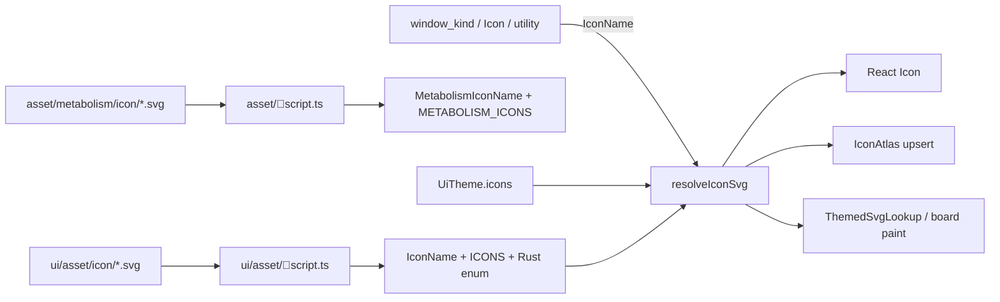

# Compile-Time Icon Ids With Theme Overrides

## Goal

Close every repo-provided icon id at compile time (UI catalog + metabolism), while keeping **appearance** swappable at runtime through the active `UiTheme`. Call sites pass semantic ids; renderers resolve markup via a theme-aware lookup.

Goal association when opening the ticket: `R26-02/RUNNING-SKETCHPAD`.

## Design



**Ids are typed; assets are resolved.**

- `IconName` — closed set from `ui/asset/icon/*.svg` (already in TS; add Rust enum).
- `MetabolismIconName` — closed set from `asset/metabolism/icon/*.svg` (new TS + Rust).
- Wire `Icon` splits catalog vs themed:
  - `{ kind: "catalog"; key: IconName }`
  - `{ kind: "themed"; key: MetabolismIconName }`
- Runtime theme overrides live on `UiTheme` (not in call sites):

```ts
readonly icons?: {
  readonly aliases?: Partial<Record<IconName, IconName>>;
  readonly variants?: Partial<Record<IconName, string>>; // SVG markup
  readonly themedAliases?: Partial<Record<MetabolismIconName, MetabolismIconName>>;
  readonly themedVariants?: Partial<Record<MetabolismIconName, string>>;
};
```

Resolution order for a catalog id: `theme.icons.variants[name]` → `ICONS[theme.icons.aliases[name] ?? name]`. Same pattern for themed. Recolor stays as today (`currentColor` in React; `render_themed` on boards).

## 1. Codegen — single source of truth

Extend [`ui/asset/script.ts`](ui/asset/script.ts) `generate`:

- Keep TS/C#/Python.
- Emit Rust `IconName` enum (kebab serde rename, `as_str`, `from_str`, `ALL`) into e.g. [`ui/asset/icon/generated/icon_name.rs`](ui/asset/icon/generated/icon_name.rs).
- Crates that need it `include!` or depend on a thin `ui-asset` Rust path (prefer include from generated file to avoid a new crate unless one already fits).

Extend [`asset/script.ts`](asset/script.ts) (or ui/asset if metabolism generation already belongs there) to emit:

- `MetabolismIconName` + SVG map for TS.
- Matching Rust enum/table for board/puzzle consumers (replace string-only match arms generated in [`puzzle/2d/rs/build.rs`](puzzle/2d/rs/build.rs) / [`infinite/cavas/rs/build.rs`](infinite/cavas/rs/build.rs) to use the typed names).

## 2. Theme-aware resolver

In [`ui/styling/js/index.ts`](ui/styling/js/index.ts) / [`ui/js/react/index.tsx`](ui/js/react/index.tsx):

- Add optional `icons` on `UiTheme`; parse/serialize/validate keys against `IconName` / `MetabolismIconName`.
- Add `resolveCatalogIconSvg(name: IconName): string` and `resolveMetabolismIconSvg(name: MetabolismIconName): string` that read `activeUiTheme()`.
- `Icon` / `iconSvgMarkup` use the resolver — never read `ICONS[name]` directly at render sites.
- Subscribe theme changes so React re-renders; wgpu rebuilds/upserts overridden atlas entries; board host refreshes `IconPaintCache` when canvas theme sync runs.

Rust board path: upgrade `ThemedSvgLookup` from `fn(&str) -> Option<&'static str>` to a runtime map (or dual: static defaults + theme overlay applied when `setCanvasThemeJson` / session theme sync runs), so theme variants can replace metabolism SVGs without rebuild.

## 3. Typed APIs — kill open `iconId: string`

**TypeScript**

- [`framework/core/js/index.ts`](framework/core/js/index.ts): every chrome `iconId` → `IconName` (window kinds, tools, utilities, actions, commands, toggles, layouts, table/block/feed icons).
- [`ui/js/react/index.tsx`](ui/js/react/index.tsx): `ModeWindowDescriptor.iconId: IconName`; `Icon.catalog.key: IconName`; `Icon.themed.key: MetabolismIconName`; `decodeIcon` only emits catalog/themed when the stem is in the closed set (unknown stem → `undefined` or non-catalog kind, never a fake catalog key).
- Remove all `iconId in ICONS ? … : fallback` helpers in [`framework/renderer/react/index.tsx`](framework/renderer/react/index.tsx) and `resolveWindowKindIconName` — types guarantee validity; missing theme variant falls back to default catalog SVG, not a different icon id.

**Rust**

- [`framework/core/rs/lib.rs`](framework/core/rs/lib.rs) + builder APIs in [`framework/plugin/rs/lib.rs`](framework/plugin/rs/lib.rs): `icon_id: IconName` (required) / `Option<IconName>` where optional today. Drop `impl Into<String>` for icon params; accept `IconName` (and `FromStr` only at JSON boundaries).
- [`ui/wgpu/rs/lib.rs`](ui/wgpu/rs/lib.rs) declarative nodes (`UiButtonNode`, toggles, tree actions, etc.): `icon_id: IconName`.
- Plugin call sites already pass Lucide kebab strings — switch to `IconName::PenTool` (or `IconName::from_str("pen-tool").unwrap()` only in tests if needed; prefer enum variants at declaration sites).

## 4. Migrate fake `icon.*` fixtures

Replace non-catalog ids (`icon.grid`, `icon.save`, `icon.bold`, `icon.toggle`, …) in:

- [`ui/wgpu/rs/lib.rs`](ui/wgpu/rs/lib.rs) golden JSON / constructors
- [`framework/renderer/react/index.test.ts`](framework/renderer/react/index.test.ts)
- any program harness leftovers

with real `IconName` values (`grid-3x3`, `save`, `bold`, `toggle-left`, …). Update golden JSON strings accordingly.

## 5. Wire codec + board

In [`ui/js/react/index.tsx`](ui/js/react/index.tsx) and [`infinite/cavas/rs/lib.rs`](infinite/cavas/rs/lib.rs):

- Add `Themed` variant; encode as bare stem (same wire as today for metabolism keys) or explicit prefix if needed for disambiguation — prefer: decode checks metabolism set first, then UI catalog, preserving existing board JSON (`capsule_J`) without fixture churn.
- Update `board_resolve_icon_kind` / shortcode path to use typed keys + theme overlay.
- Keep dynamic kinds (`url`, `emoji`, `typst`, `svg`, `data`, `text`) as open strings — they are not repo catalog icons.

## 6. wgpu atlas runtime overrides

Extend [`IconAtlas`](ui/wgpu/rs/lib.rs) / build path so theme `variants` can upsert rasterized icons after initial `ICON_SVGS` load. On theme change, re-rasterize only overridden ids (or full rebuild if simpler and cheap enough for ~154 icons). Dock/chrome paint keeps using `IconName::as_str()` for lookup — never silent miss for typed ids (assert/log `[DEBUG]` only during migration, then hard-fail in debug).

## 7. Tests (extend existing only)

- Codegen: generated `IconName` / `MetabolismIconName` match SVG stems.
- Theme: alias + variant override changes resolved SVG without changing call-site id.
- Type/API: invalid icon id is a TS/Rust compile error at declaration sites (spot-check via typed fixtures).
- Codec: `capsule_J` → themed; `pen-tool` → catalog; unknown → not catalog.
- Renderer: remove tests that expect `icon.grid`; assert real catalog ids.
- wgpu: atlas contains every `IconName`; theme variant upsert updates UV paint path.

## Out of scope

- Completing remaining wgpu dock-tab painting from [`window_kind_icons_acc26d72.plan.md`](.cursor/plans/window_kind_icons_acc26d72.plan.md) beyond typing (do that plan’s paint work separately if still open).
- Opening/closing goals.
- Git commits.