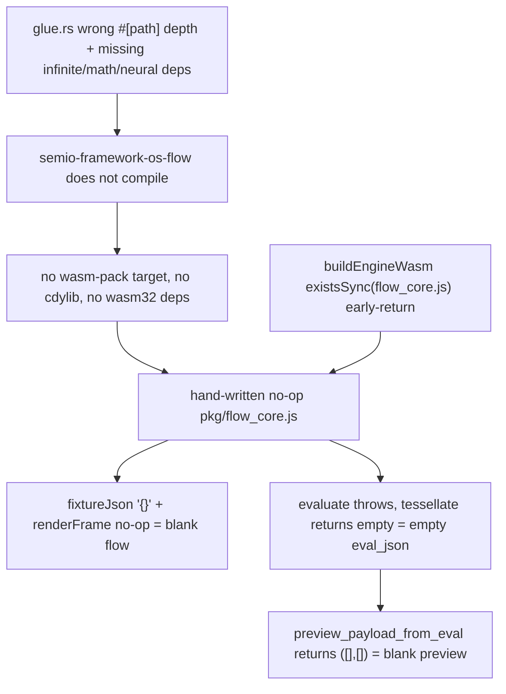

## Root cause (verified, not assumed)

The blank flow window and blank preview share a single cause chain:

1. `semio-framework-os-flow` **does not compile**. Its glue has a wrong relative `#[path]` depth for every extension:

```
error: couldn't read `🌊️flow/📦️packages/🦀️rust/./../../../🧩️extensions/📃️list/🦀️component.rs`:
       No such file or directory (os error 2)
  --> 🌊️flow/📦️packages/🦀️rust/📦️glue.rs:16:3
```

Because `pub mod extensions` carries `#[path = "."]`, its children resolve relative to `📦️packages/🦀️rust/`, so they need `../../🧩️extensions/...` (which exists), not `../../../` (which does not). Same class as the existing `SHAPE-V2-RETROFIT-PATH-PREFIX-BUG-AUDIT` ticket.

1. The crate is also missing the dependencies its mounted source needs. [🦀️component.rs](🧰️framework/🛍️products/💻️os/🔨️modules/🌊️flow/🫀️core/🦀️component.rs) lines 3-5 use `crate::infinite::...`, `math::...` and `neural_engine`, but [Cargo.toml](🧰️framework/🛍️products/💻️os/🔨️modules/🌊️flow/📦️packages/🦀️rust/Cargo.toml) declares no `infinite`, no `math`, and no `neural_engine` alias, and [📦️glue.rs](🧰️framework/🛍️products/💻️os/🔨️modules/🌊️flow/📦️packages/🦀️rust/📦️glue.rs) adds no `extern crate ... as ...` aliases for them.
2. Consequently there is **no wasm build** for flow core: no `📜️script.ts` with a `wasm` target anywhere under `🌊️flow`, no `crate-type = ["cdylib"]`, no `[target.'cfg(target_arch = "wasm32")'.dependencies]`. The real `FlowSession` (123 `#[wasm_bindgen]` items, all behind `#[cfg(target_arch = "wasm32")]`) is therefore never compiled.
3. In its place, [pkg/flow_core.js](🧰️framework/🛍️products/💻️os/🔨️modules/🌊️flow/🫀️core/pkg/flow_core.js) is a hand-written no-op stub (written Aug 6 19:38). There is no `flow_core_bg.wasm` in the repo. The stub returns exactly what the user sees:

```js
export class FlowSession { renderFrame() {} fixtureJson() { return "{}"; } applyEvalOutputsJson() {} ... }
export const tessellate = async () => JSON.stringify({ positions: [], normals: [], index: [], edges: [], points: [], faceGroups: [] });
export const evaluate = wasmMissing;
```

`fixtureJson() -> "{}"` and `renderFrame()` as a no-op give an empty flow canvas. `tessellate` returning empty arrays and `evaluate` throwing give an empty `eval_json`, and `preview_payload_from_eval` maps empty eval to `("[]", "[]")` meshes — an empty preview. Both the standalone playground and the demonstrator import the same `@semio-tech/flow-core` workspace package, which is why both are broken.

1. Two things hide the breakage: `buildEngineWasm` in [os-dev 📜️script.ts](🧰️framework/🛍️products/💻️os/🔨️modules/🧑️‍💻️dev/📦️packages/🟦️typescript/📜️script.ts) early-returns when `flow_core.js` merely *exists*, so the stub counts as "built"; and the Vite `playgroundFlowWasmDevStubPlugin` correctly resolves the workspace entry, so it never falls back to its own diagnostic stub. The Aug 2 fix in that plugin is intact — this is a different regression.




Note: `cargo check -p semio-s-plugin-procedural --target wasm32-wasip2` currently exits 0 only from a stale `target/` cache — it depends on the crate that cannot compile. Expect real errors to surface once flow is fixed.

## Blocker requiring you

Native `cargo test` and any fresh build script cannot link on this machine:

```
$ cc /tmp/t.c -o /tmp/t
You have not agreed to the Xcode license agreements.
Please run 'sudo xcodebuild -license' from within a Terminal window
```

`cargo test` dies linking `semio-framework-os-kernel`, and `cargo check --target wasm32-unknown-unknown` dies building `serde_core`'s build script. wasm-pack will fail the same way. **Please run `sudo xcodebuild -license` and accept**, otherwise I cannot compile the restored wasm engine or run a single test, and I will not be able to claim anything passes.

## Ticket

Read goals from `.🦑️repo/🎯️goals/` (repo MCP namespace is absent this session, as recorded in the FIX-DEMONSTRATOR-FOCUS-TRANSITION-FLICKER ticket). Reopen `2026/08/03/FEATURE-COMPLETE-PROCEDURAL-3D-ENGINE-AND-BREP-KERNEL` under goal `R26-02/RUNNING-SKETCHPAD` — it covers exactly this scope. All scratch files, probe output and screenshots go in that ticket folder.

## Phase 1 - Make the flow engine real

- Fix the `#[path]` depths in [📦️glue.rs](🧰️framework/🛍️products/💻️os/🔨️modules/🌊️flow/📦️packages/🦀️rust/📦️glue.rs) (`../../../🧩️extensions/...` to `../../🧩️extensions/...`), and add the missing crate aliases following the established convention in [os host glue](🧰️framework/🛍️products/💻️os/🖥️host/📦️packages/🦀️rust/📦️glue.rs) (`extern crate semio_framework_os_infinite as infinite;` etc.) plus the matching `Cargo.toml` dependencies for `infinite`, `math` and `neural_engine`.
- Audit every other Shape-V2 glue for the same `#[path = "."]` off-by-one, since the same retrofit produced them all. Do not fix flow in isolation and leave siblings latent.
- Give flow core its own wasm-bindgen package at `🌊️flow/🫀️core/📦️packages/🦀️rust`, mirroring [surface's script](🧰️framework/🔨️modules/🗺️surface/📦️packages/🦀️rust/📜️script.ts): `crate-type = ["rlib", "cdylib"]`, `[target.'cfg(target_arch = "wasm32")'.dependencies]` with `wasm-bindgen`, `wasm-bindgen-futures`, `web-sys`, `js-sys`, `serde-wasm-bindgen`, and a `📜️script.ts` calling `runWasmPackWebBuild` with `wasmBaseName: "flow_core"`. This is also the path `buildEngineWasm` already expects (`🫀️core/📦️packages/🦀️rust/📜️script.ts`) and the workspace path `index.test.ts` already asserts.
- Delete the hand-written `pkg/flow_core.js` stub and let wasm-pack emit the real `pkg/` (`flow_core.js`, `flow_core_bg.wasm`, `.d.ts`). Point the bun workspace and `node_modules` symlink at the new pkg location.
- Register the new wasm target in `project.json`, `package.json` and `launch.json` per the repo's existing grouping.

## Phase 2 - Close the escape hatches that hid this

- Change the `buildEngineWasm` freshness check to require `flow_core_bg.wasm`, not `flow_core.js`, so a hand-written JS file can never again satisfy "already built".
- Repoint the dangling flow-core imports in [◻2d/📦️index.ts](✏️s/🔨️modules/◻2d/📦️packages/🟦️typescript/📦️index.ts) (they reference `pkg/⚡️implementations/🦀️rust/flow_core.js` and a pre-restructure `framework/product/os/module/flow/core/rs/pkg/flow_core_bg.wasm`, neither of which exists) and the stale skip-list entries in the os-dev script.
- Rebuild the demonstrator's staged plugin modules. `🔌️plugin-modules/demonstrator/` is from Aug 4 17:41, predating the restructure, while `process` and `sourcing` were rebuilt today; the reuse path logs `[DEBUG] reusing staged demonstrator plugin-modules`.

## Phase 3 - Verify at runtime, not by inspection

- `bun run dev:procedural:3d` (:6018) and the demonstrator Generator pane (:6029).
- Reuse the existing probes rather than writing new ones: `procedural-3d-runtime-probe.mts` in the `FEATURE-COMPLETE-AND-BATTLE-TESTED-PROCEDURAL-3D` ticket folder, and `hex-column-status-probe.mts` in `CONVERGING-FLOW-EVALUATION-AND-EXPLICIT-NODE-STATUS`. Extend the first one: it scrapes a `data-fixture-json` attribute that `NodeGraphHost` never sets.
- Acceptance: a non-empty `fixtureJson` in the flow canvas, non-zero mesh and instance counts in `World3dHost`, and every one of procedural 3D's eight examples rendering geometry. Capture screenshots into the ticket folder.

## Phase 4 - Complete the BREP kernel

You chose the full kernel, so nothing reachable from procedural 3D stays an approximation. All work is in `✏️s/🔨️modules/🧊️3d/📐️brep/`, added inside the existing `#region` structure of each module's `🦀️component.rs`, with tests extended in the existing `#region 🧪️Tests` blocks (no new files).

Wave A - sweeps and tessellation (unblocks the node catalogue)

- Implement `revolve_face`, `loft_profiles`, `sweep_along_path`, `pipe`, `helical_sweep` in `➡️sweep`. All five currently return `Err("... not implemented yet")`, and `revolve_face_is_stub_error` asserts the stub — that test gets inverted.
- Replace ear-clip-only triangulation in `🧩tessellate` with a constrained Delaunay triangulation so faces with holes stop erroring at the `"faces with holes require CDT"` branch.
- Replace the convex-hull-of-bbox-corners proxy for `translate`/`rotate`/`scale`/`mirror` in `🧰️kernel` with true topology-preserving B-rep transforms.

Wave B - exact intersection and booleans

- Complete `✂️int-ss` beyond the plane/plane and plane/cylinder analytic cases (currently `IntersectError::Unresolved("surface pair has no analytic SSI path yet")`), and stop dropping the results: `🧰️kernel` computes SSI then returns `Ok(Vec::new())`.
- Replace the mesh-centroid-plus-convex-hull `mesh_boolean` fallback in `🔀boolean` with real imprint, stitch and classify for general contact, keeping the existing analytic fast paths.
- Implement `section_solid_by_plane`, which currently returns `Ok(Vec::new())`, and resolve the `"unsupported"` double-boundary-hit case in `🖋️imprint`.

Wave C - features, healing, and API truthfulness

- Real rolling-ball fillet and chamfer topology in `🎨️blend`, replacing the MVP hull approximations, plus honest `chamfer_asymmetric` (currently ignores `d2`) and `shell` (currently ignores `open_faces`).
- Real `heal_solid` in `🩹heal` (currently validate-only) and a real watertightness check in `🔮️oracle` (currently `watertightness_stub_unchecked()` always returns `NotChecked`).
- Fix the remaining silently-wrong facade behaviour in `🧰️kernel`: `arc_curve` ignoring start/end angles, `interpolate_curve` and `approximate_curve` degrading to polylines, `nurbs_surface_from_grid` and `coons_patch` degrading to hulls, `curve_curvature` always returning `0.0`, `deconstruct` returning faces only, `solid_face_loops_sync` returning empty loops, `validate` returning an issue-count string instead of a structured report.
- Implement `BrepDocumentOpEngine::compute` in `⚙️engine/🖥️host`, which currently always returns a compute error.
- Complete the STEP `Unsupported` branches in `📄step` and rational degree elevation in `🎢️bezier`.

Each wave ends with `cargo test` green for `semio-s-3d` and `semio-s-plugin-procedural`, and a procedural 3D example exercising the new operations end to end through the flow graph into the preview.

## Phase 5 - Close out

Close the reopened ticket with a summary and the full list of touched files. Leave all probe scripts, logs and screenshots in the ticket folder.