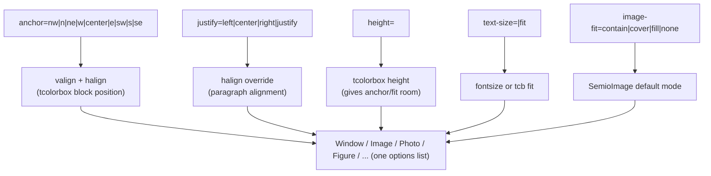

# Composable Window Content Layout

## Current state (why this needs rework)

`print/tex/semio-window.sty` already declares a 9-point `anchor` key (`nw, n, ne, w, center, e, sw, s, se`) under `keys_define:nn { semio / window / kind }` (lines 490-505) that sets `l_semio_window_valign_tl` / `l_semio_window_halign_tl`, but it is **only wired into the row variant** `\semio_window_begin_row:n` (line 874-880). The normal window path `\semio_window_kind_begin:nnn` (used by `Image`, `Photo`, `Figure`, `Table`, `Theorem`, `Blockquote`, ... — line 580-622) and the generic non-row `\semio_window_generic_begin:n` (line 882-898) never pass `valign`/`halign` to `\begin{tcolorbox}[...]`, so `anchor=` is silently ignored outside of rows. There is also no way to give a window an explicit `height` (a prerequisite for anchor/fit to have any visible effect), no text-size control, and no image-fit concept — images are inserted by hand with raw `\includegraphics[...,keepaspectratio]` (e.g. `print/tex/semio-components.sty` line 109, Arbeitsprobe cover block).

Additionally `\semio_window_kind_begin:nnn` never calls `\semio_window_anchor_reset:`, so anchor state can leak between successive kind-windows (only the generic `Window` env resets it, line 883).

## Design

Keep everything on the single existing key module `semio / window / kind` (already the funnel for every `[...]` option on `Window`/`Image`/`Photo`/`Figure`/... ) so one option list stays the single source of truth, and make the underlying mechanisms fully orthogonal so any combination composes:

- `**anchor**` (existing 9-point choice) → maps to tcolorbox's native `valign` (`top|center|bottom`) + `halign` (`left|center|right`). This is the *block position* of content inside a window whose `height` exceeds its natural content height.
- `**justify**` (new choice: `left|center|right|justify`) → overrides only the `halign` component. Independent of `anchor`, so `anchor=s, justify=justify` is valid: block pinned to the bottom, paragraph text fully justified rather than following the compass's implied alignment. Because keys are processed in call order, whichever of `anchor`/`justify` appears later in the option list wins for `halign` — standard, predictable l3keys/tcolorbox semantics.
- `**height**` (new, dim) → forwarded as tcolorbox's own `height=` on the box. Without it, `anchor`'s vertical component and any image `cover`/`fill` sizing have nothing to work against, so this is the key that "gives space" for the others to use.
- `**text-size**` (new: a dimension, or the literal `fit`) → `text-size=14pt` issues `\fontsize{14pt}{14pt}\selectfont` (matches this file's existing tight chrome-typography convention, e.g. `\semio@panel@font`) right after the box opens. `text-size=fit` instead adds tcolorbox's `fit` key (from the already-loaded `fitting` library, `\tcbuselibrary{skins,breakable,fitting}` at line 17) so the box's font size auto-scales to fill its dimensions — this requires a fixed `height`, so `text-size=fit` without `height=` raises a `\PackageError` (no silent fallback, per repo conventions). `fit` also forces `breakable=false` on that box (the fitting library cannot break boxes).
- `**image-fit**` (new choice: `contain` default | `cover` | `fill` | `none`) → sets the *default* fit mode that `\SemioImage` (new command) uses inside that window; `\SemioImage` also accepts a local override so a single window/row can mix fit modes across multiple images.

All four new/reworked keys reset to safe no-op defaults (`valign=top`, `halign=justify` — matching current native tcolorbox/LaTeX defaults, **not** `left`, to avoid silently de-justifying every existing window's body text) at the start of every window, in both the kind-path and the generic path.




## Implementation

### 1. `print/tex/semio-window.sty` — state variables and reset

Near the existing declarations (lines 31-38), add:

- `\dim_new:N \l_semio_window_height_dim`, `\bool_new:N \l_semio_window_height_set_bool`
- `\dim_new:N \l_semio_window_textsize_dim`, `\bool_new:N \l_semio_window_textsize_set_bool`
- `\bool_new:N \l_semio_window_textfit_bool`
- `\tl_new:N \l_semio_window_imagefit_tl`
- Change the initial default of `\l_semio_window_halign_tl` from `left` to `justify`.

Rename/broaden `semio_window_anchor_reset:` (line 507) into `semio_window_content_state_reset:` that resets `valign=top`, `halign=justify`, clears `height_set_bool`/`textsize_set_bool`/`textfit_bool`, sets `imagefit_tl=contain`, and mirrors the plain-TeX globals (`\gdef\semio@window@valign{top}`, `\gdef\semio@window@halign{justify}`, `\gdef\semio@window@height@dim{}`, `\gdef\semio@window@imagefit{contain}`) used by `\SemioImage` later. Call it from **both**:

- `\semio_window_generic_begin:n` (line 882, replacing the current `\semio_window_anchor_reset:` call)
- `\semio_window_kind_begin:nnn` (line 580 — currently missing entirely; this fixes the state-leak bug)

### 2. Extend the `semio / window / kind` key module (lines 490-505)

Add:

```
justify .choice:,
justify / left .code:n = { \tl_set:Nn \l_semio_window_halign_tl { left } },
justify / center .code:n = { \tl_set:Nn \l_semio_window_halign_tl { center } },
justify / right .code:n = { \tl_set:Nn \l_semio_window_halign_tl { right } },
justify / justify .code:n = { \tl_set:Nn \l_semio_window_halign_tl { justify } },
height .code:n = {
  \dim_set:Nn \l_semio_window_height_dim {#1}
  \bool_set_true:N \l_semio_window_height_set_bool
},
text-size .code:n = {
  \str_if_eq:nnTF {#1} { fit }
    { \bool_set_true:N \l_semio_window_textfit_bool }
    {
      \dim_set:Nn \l_semio_window_textsize_dim {#1}
      \bool_set_true:N \l_semio_window_textsize_set_bool
    }
},
image-fit .choice:,
image-fit / contain .code:n = { \tl_set:Nn \l_semio_window_imagefit_tl { contain } },
image-fit / cover .code:n = { \tl_set:Nn \l_semio_window_imagefit_tl { cover } },
image-fit / fill .code:n = { \tl_set:Nn \l_semio_window_imagefit_tl { fill } },
image-fit / none .code:n = { \tl_set:Nn \l_semio_window_imagefit_tl { none } },
```

`\semio_window_anchor_set:nn` (line 519) already mirrors valign/halign into the plain-TeX globals `\semio@window@valign`/`\semio@window@halign` — extend it (and add the mirroring for `height`/`imagefit`) so the globals always match, since `\SemioImage` (step 5) is a plain-macro command that needs to read them.

### 3. Wire `valign`/`halign`/`height`/`fit` into every box-open call

Add one helper that both the kind-path and the generic path call, instead of duplicating branches:

```
\cs_new_protected:Npn \semio_window_tcb_open:n #1 {
  \bool_if:NTF \l_semio_window_textfit_bool {
    \begin{tcolorbox}[#1, breakable=false, fit, height=\dim_use:N \l_semio_window_height_dim, valign=\tl_use:N \l_semio_window_valign_tl, halign=\tl_use:N \l_semio_window_halign_tl]
  } {
    \bool_if:NTF \l_semio_window_height_set_bool {
      \begin{tcolorbox}[#1, height=\dim_use:N \l_semio_window_height_dim, valign=\tl_use:N \l_semio_window_valign_tl, halign=\tl_use:N \l_semio_window_halign_tl]
    } {
      \begin{tcolorbox}[#1, valign=\tl_use:N \l_semio_window_valign_tl, halign=\tl_use:N \l_semio_window_halign_tl]
    }
  }
}
```

(`text-size=fit` without `height=` must `\PackageError` before reaching here — add that check where `text-size=fit` is parsed in step 2, by checking `\l_semio_window_height_set_bool` — since key order in a single `keys_set:nn` call isn't guaranteed, do this check once at the end of `\semio_window_kind_begin:nnn`/`\semio_window_generic_begin:n`, right after `\keys_set:nn`.)

Replace the three literal `\begin{tcolorbox}[...]` calls with this helper:

- Line 620: `\semio_window_tcb_open:n { semio~window~tier~#2, semio~window~table }`
- Line 621: `\semio_window_tcb_open:n { semio~window~tier~#2 }`
- Line 896: `\semio_window_tcb_open:n { semio~window~tier~structural, breakable=false }`

(Leave `\semio_window_begin_row:n`, lines 874-880, as-is — it already threads `valign`/`halign` and has its own height source via `\SemioWindowStretchHeightValue`; just make sure the row path also resets/consults the new state via `\semio_window_content_state_reset:` where appropriate so `justify`/`image-fit` still work inside rows.)

### 4. Apply `text-size=<dim>` to content

Right after `\semio_window_tcb_open:n` returns (content cursor is now inside the box, before the user's `#1`/environment body), emit, when `\l_semio_window_textsize_set_bool` is true:

```
\fontsize{\the\dimexpr\l_semio_window_textsize_dim\relax}{\the\dimexpr\l_semio_window_textsize_dim\relax}\selectfont
```

matching the existing tight-leading convention used throughout this file (`\semio@panel@font`, `\semio@heading@chip@font`, etc.).

### 5. New `\SemioImage` command (composable `image-fit`)

Add a new `%region Images` block in `semio-window.sty` defining:

```
\NewDocumentCommand{\SemioImage}{O{} m}{...}
```

parsing a small local keys set (`fit`, `width`, `height`) that fall back to the ambient window's `\semio@window@imagefit` / `\linewidth` / `\semio@window@height@dim` (minus known chrome overhead: `2*\semio@chrome@padding + \semio@stroke@hairline`, since `toprule=0pt`, `bottomrule=\semio@stroke@hairline`, `top=bottom=\semio@chrome@padding`, `boxsep=0pt`) when not given locally. Four branches:

- `contain` (default): `\includegraphics[width=W,height=H,keepaspectratio]{#2}` if `H` known, else width-only — this is exactly today's Arbeitsprobe idiom, so it's a pure refactor for existing usage.
- `fill`: `\includegraphics[width=W,height=H,keepaspectratio=false]{#2}` — the exact idiom already used by the frosted-glass panel shipout (`\semio@panel@shipout@glass`, line ~1101), reused here as documented behavior rather than copied ad hoc.
- `none`: `\includegraphics{#2}` (natural size; positioning then comes for free from the ambient `anchor`, since the surrounding tcolorbox already carries `valign`/`halign`).
- `cover`: measure natural size with the standard, public `\settowidth`/`\settototalheight` technique (no reliance on graphicx-internal `\Gin@...` registers), then crop via `trim`+`clip` before scaling by whichever axis is the binding one:
  - if `natW/natH > W/H`: `nativeTrim = natW - (W*natH/H)`, emit `\includegraphics[trim=<nativeTrim/2> 0 <nativeTrim/2> 0, clip, height=H]{#2}`
  - else: `nativeTrim = natH - (H*natW/W)`, emit `\includegraphics[trim=0 <nativeTrim/2> 0 <nativeTrim/2>, clip, width=W]{#2}`
  - the ratio arithmetic uses `\fp_eval:n` on dimensions normalized by `/1pt`, mirroring the existing `\semio_panel_dim_pt:n` pattern (line 726) already in this file.
  - `cover`/`fill` with no resolvable `H` (no ambient or local `height`) is a `\PackageError` — cropping/filling without a bounded box is meaningless, so fail loudly instead of silently degrading to `contain`.

`anchor` continues to control placement for `contain`/`none` for free (smaller-than-box content is positioned by the box's own `valign`/`halign`); for `cover`/`fill` the image always exactly fills `W×H` so anchor has nothing left to do (matches CSS `object-fit` semantics).

### 6. Dogfood the new primitive

Replace the manual Arbeitsprobe block in `print/tex/semio-components.sty` (`\semio_maketitle:`/`\makecoverpages`, lines 106-112):

```
\tl_if_blank:eF { \semio@cover@arbeitsprobe@image } {
  \begin{Window}[title=Arbeitsprobe, row, anchor=center, height=10.8cm]
    \SemioImage{\semio@cover@arbeitsprobe@image}
  \end{Window}\par
}
```

dropping the now-redundant manual `\semio@window@row@body@h@set{10.8cm}`/`\semio@window@row@body@h@reset` pair (the new `height=` key replaces that mechanism for this call site) and the hardcoded `10.1cm` fudge — `\SemioImage` derives its own content height from the window's declared height automatically. Visual output is unchanged (`contain` ≡ previous `keepaspectratio`).

Leave `\semio@logo@slot` (`print/tex/semio-logo.sty`) untouched — it is a distinct, simpler "centered logo in a minipage" primitive for institutional logos with bespoke widths, not part of this generalized system.

## Verification

Open a ticket via the repo MCP once tool access is restored (currently `project-0-semio-repo` reports `serverStatus: error` — retry at execution start) associated with the appropriate print goal, per `AGENTS.md`.

Compile `print/template/report/report.tex` (and at least one other template, e.g. `flyer`) via `bun ./script.ts` (see `print/project.json`/`print/script.ts`), and add a small demonstration into the existing `Figure` block in `print/template/report/report.content.tex` exercising `anchor`, `justify`, `text-size`, `height`, and an `Image`/`Photo` block using `\SemioImage` with `image-fit=cover` against one of the existing logo assets (e.g. `udk-logo.png`) at a mismatched aspect ratio to visually prove cropping — screenshot the rendered PDF page(s) into the ticket folder as the verify artifact, matching the convention seen in sibling tickets under `.repo/🎫/26/07/10/`.