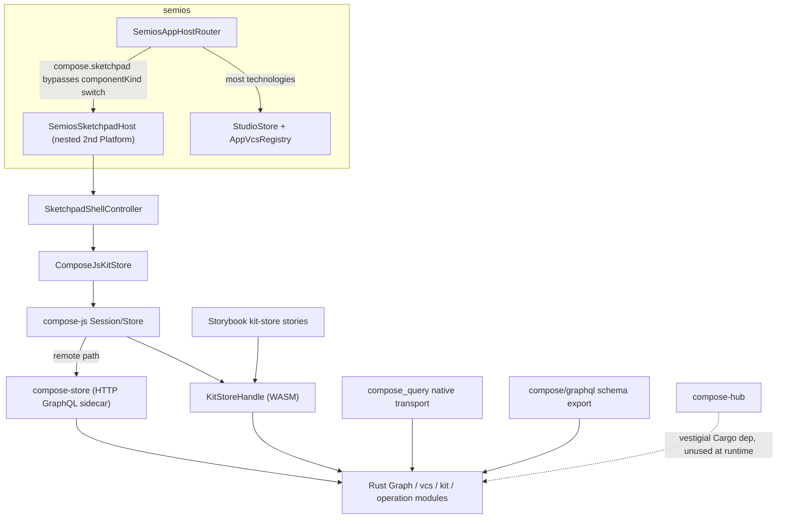
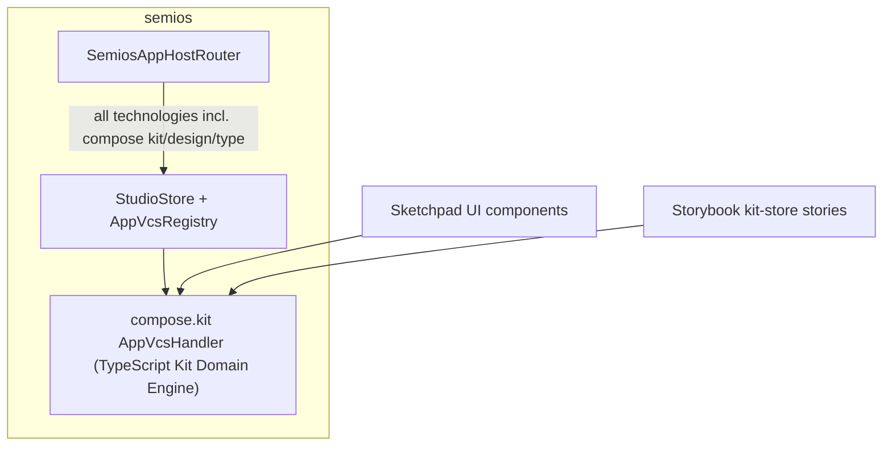

# Compose Rust Removal + Full Semios Technology Testing

## Why this is two very different sized efforts

**Part 1 (small, safe):** Extending test coverage so every semios-hosted technology is verified to actually materialize (not just spawn). The scaffolding already exists (`materializeAppInstanceProjection`, the `"spawns every technology plugin id"` test in [semios/core/index.ts](semios/core/index.ts)) and only `draw`/`flow` currently assert real projection content.

**Part 2 (very large, high risk):** `compose/client/lib/rs/lib.rs` is a ~21,000-line Rust crate that is the authoritative domain engine for the entire `compose` product — not just the sketchpad-in-semios integration. It implements the Kit/Design/Piece/Port/Connection entity graph, diff/apply semantics, port-compatibility computation, blueprint/transitive-reference resolution, VFS derivation, checkpoint/alternative persistence, and the GraphQL schema that serves all of it. Four other things depend on it purely because it exists: `compose-store` (HTTP GraphQL sidecar), `compose-hub`'s Cargo manifest (vestigial — hub's runtime code doesn't call into it), `compose_query`'s native transport, and the `compose/graphql` schema-export pipeline. Deleting it means porting all of that domain logic into TypeScript and rewiring every consumer, not just adding a semios `AppVcsHandler`.

## Current architecture

## Target architecture

`compose-store`, `compose_query` native transport, `compose/graphql` export, and `compose/client/lib/rs` are deleted. `compose-hub` keeps existing (its runtime never used the crate) minus the stray Cargo dependency.

## Part 1 — Verify every technology inside semios (do first, low risk)

- Extend `"spawns every technology plugin id"` in [semios/core/index.ts](semios/core/index.ts) (currently only asserts `appInstances.length`) to call `materializeAppInstanceProjection` for every spawned instance and assert it returns a sane, non-throwing projection for every format — following the pattern already used for `flow` (`materializeAppInstanceProjection(updated).flow.id === "patched"`) and `draw` (fixture-level assertion in [semios/play/index.ts](semios/play/index.ts)).
- Add at least one fixture/round-trip assertion per handler style: typed-operation handlers (`draw`, `writer`, `raster`, `forms`) and JSON-replace handlers (`flow`, `dag`, `procedural.2d/3d`, `shooting`, `trinity`, `gis.map`, `presentation`, `puzzle.2d/3d/5d`, `cad`, `compose.sketchpad`/home).
- Fix the `forms.dictionary/v1` vs `forms.form/v1` mismatch found during the audit: the `forms` plugin's registry entry declares `sourceFormat: "forms.dictionary"` ([semios/core/index.ts:275](semios/core/index.ts)) but the typed handler `createFormsAppVcsHandler` is registered for `forms.form/v1` ([forms/core/index.ts:1092](forms/core/index.ts)) — align these so `forms` actually exercises its typed handler end-to-end instead of silently falling back to a JSON-replace stub.

## Part 2 — Port the Rust kit domain engine to TypeScript

### B. Build the TypeScript Kit Domain Engine

- New region (in `semios/core/index.ts`, or a new package if warranted) implementing the Kit entity model (`Type`, `Design`, `Piece`, `Port`, `Connection`, tags/attributes) matching the DTO shape sketchpad already consumes (`SketchpadKitSnapshot`).
- Typed `KitOperation` union (createDesign, renamePiece, connectPorts, createType, ...), replacing Rust's `Operation`/`KitDiff`/`apply_diff`, dispatched through `framework/core`'s existing `DocumentVcsStore` (no new VCS mechanism needed — that generalization is already done).
- Port compatibility algorithm (from `Port::compatible_with`, `compose/client/lib/rs/lib.rs` ~3288-3340).
- Blueprint and transitive-reference resolution (from `Piece::blueprint`, `referencesTypesTransitive`, lib.rs ~4283-5359).
- VFS derivation (from the `file_system_children` macros, lib.rs ~210-346/14320+).
- Register `createComposeKitAppVcsHandler` for `compose.kit/v1`, replacing the current empty JSON-replace stub ([semios/core/index.ts:512](semios/core/index.ts)).

### C. Rewire sketchpad and other JS consumers off compose-js/WASM

- Replace `ComposeJsKitStore`'s backend ([compose/client/lib/sketchpad/js/index.ts:10993](compose/client/lib/sketchpad/js/index.ts)) with a store backed directly by the new TS engine's `DocumentVcsStore`, dropping `jsStore`/GraphQL. Keep the `ComposeKitStore` snapshot contract so UI (`SketchpadRoutedComponent`, wires, VFS) changes stay minimal.
- Replace `sketchpadFetchKitWiresReferences`, `fetchComposeFileSystemChildren`, and port-compat merge helpers with direct, synchronous calls into the new engine.
- Update `importKit`, `sketchpadBrowserFileKitFactory`/`FolderKitFactory`, `SketchpadShellController.createTemporaryKit` to build the new TS-backed store instead of `Session.openInMemory()`.
- Decide the fate of the remote path (`sketchpadOpenRemoteKitStore`/`ComposeSession.openHttp`): drop it, or point it at a new minimal sync endpoint reusing semios's `RemoteJsonBackbone` pattern.
- Remove the nested `Platform` boot in `SemiosSketchpadHost` ([framework/product/playground/renderer/react/index.tsx:10215-10235](framework/product/playground/renderer/react/index.tsx)); route compose kit/design/type instances through the standard `SemiosAppHostRouter` `componentKind` switch backed by the new `AppVcsHandler`, eliminating the duplicate store.
- Update `compose/client/ui/desktop/renderer.tsx` and any other `compose-js` consumers, or retire them if they exist solely to front the Rust engine.

### D. Retire Rust-only consumers of the crate

- Delete `compose/client/bin/store` (`compose-store`) — a pure HTTP wrapper with no purpose once the crate is gone.
- Remove the vestigial `compose = { path = "../../client/lib/rs" }` dependency from `compose/server/hub/Cargo.toml` (hub's runtime never references `compose::` anything).
- Drop or rework `compose/client/lib/query`'s native `ComposeTransport` (no shipped consumer today); decide whether the WASM `architect_compile`/`architect_run` surface survives without a Rust-backed transport.
- Retire the `compose/graphql` schema-export pipeline ([compose/client/schema/graphql/script.ts](compose/client/schema/graphql/script.ts), `schema.graphql`, `schema.golden.graphql`).
- Rewrite `.storybook/compose/algorithm/kit-store/composeWasm.ts` and `KitStore.stories.tsx` to exercise the new TS engine directly instead of WASM `KitStoreHandle`.

### E. Delete the crate and clean up build wiring

- Delete `compose/client/lib/rs/` entirely (`lib.rs`, `Cargo.toml`, `project.json`, `script.ts`, `pkg/`).
- Remove it from the root `Cargo.toml` workspace members.
- Remove all `@semio-tech/compose-rs-wasm` / `../rs/pkg` aliases from vite configs, tsconfigs, and `pw-loader.mjs` across sketchpad/js, sketchpad/play, engine, algorithm dev, and `.storybook/main.ts`.
- Remove dead `.vscode/launch.json` entries and Nx `dependsOn` edges referencing `@semio-tech/compose-rs`.

### F. Regression pass

- Run `semios/core`, `semios/play`, `compose/client/lib/sketchpad/js`, and `framework/product/playground/renderer/react` test suites.
- Boot `dev:semios` and manually exercise every technology plus sketchpad's kit/design/type apps (create/rename, port connect, VFS browse, checkpoints/alternatives, undo/redo) to confirm behavioral parity.

## Execution note

Given the size of Part 2 (reimplementing a 21k-line domain engine with full fidelity across 10+ consumers), it will be executed phase-by-phase (B through F as separate passes) rather than as one atomic change, with tests run after each phase before moving to the next.
