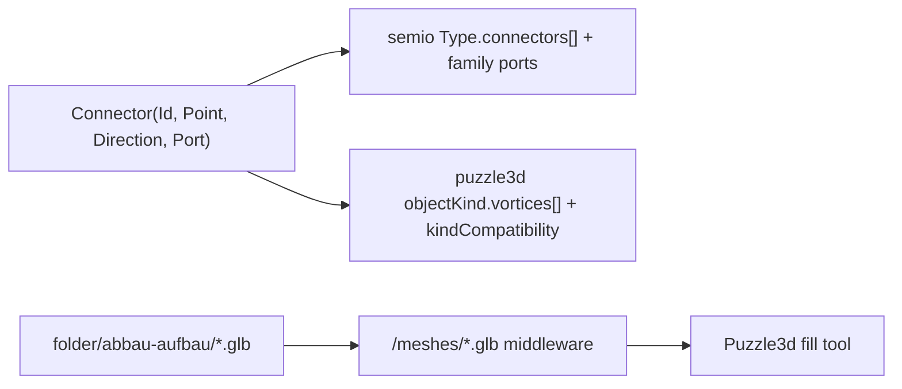

# Concrete Forest Kit + Puzzle 3D Fixture

## Context (what exists today)

- Binary geometry already exists in `semio/fixtures/kit/folder/abbau-aufbau/`: `hexagonal-cut-concrete-forest-{left,right}.glb`, `…-{left,right}.3dm`, `stockwerk.3dm`, the `.gh`. These cannot be edited and are the source meshes.
- The dev kit placeholders are **empty**: [kit.semio.json](semio/fixtures/kit/dev/abbau-aufbau/wip/initialKit/kit.semio.json), [types/hexagonal-cut-concrete-forest-left.json](semio/fixtures/kit/dev/abbau-aufbau/wip/initialKit/types/hexagonal-cut-concrete-forest-left.json), [types/hexagonal-cut-concrete-forest-right.json](semio/fixtures/kit/dev/abbau-aufbau/wip/initialKit/types/hexagonal-cut-concrete-forest-right.json). There is no `index.semio.json`.
- Reference formats: metabolism dev kit ([kit.semio.json](semio/fixtures/kit/dev/metabolism/wip/initialKit/kit.semio.json) + `types/*.type.semio.json` + [index.semio.json](semio/fixtures/kit/dev/metabolism/wip/initialKit/index.semio.json)); puzzle 3d fixture [nakagin-capsule-tower.3d.json](puzzle/3d/fixture/nakagin-capsule-tower.3d.json).
- The 3D play hardcodes the nakagin fixture and exposes a fixture switcher: [puzzle/3d/play/index.ts](puzzle/3d/play/index.ts) lines 121-123 (`PUZZLE_3D_PLAY_FIXTURE_OPTIONS`), `loadFixtureById` (~1178), constructor default (1014).
- Meshes are served at `/meshes/<name>.glb` only from the metabolism representations dir: `puzzle3dMetabolismMeshRoots` / `createPuzzle3dMeshesMiddleware` in [ui/styling/vite-elements-assets.ts](ui/styling/vite-elements-assets.ts) (108-180).

## Data mapping (given connectors → both formats)

The 4 ports are `b-l`, `b-l-m`, `b-s`, `b-s-m`, and per the user **all ports are mutually compatible**. Connector → semio uses `point`/`direction`/`t` + `port` ref; connector → puzzle3d uses a vortex (`vortexKind` = port id, `position` = point, `direction` = direction, `radius` 0.36).

## Part A - semio kit (typology "Concrete Forest")

1. Write [kit.semio.json](semio/fixtures/kit/dev/abbau-aufbau/wip/initialKit/kit.semio.json) shell modeled on metabolism but standalone: kit id/name ("Abbau-Aufbau"), unit `m`, `tags` (gltf-binary, vnd.3dm), one `families` entry "Concrete Forest" containing 4 ports (`b-l`, `b-l-m`, `b-s`, `b-s-m`) where every port's `compatiblePorts` lists the other three plus itself (all mutually compatible), and a `typologies` item "Concrete Forest" with two type stubs referencing the two type ids.
2. Replace the two empty `.json` placeholders with split-format files named `…-left.type.semio.json` and `…-right.type.semio.json` (the assembler in [semio/fixtures/script.ts](semio/fixtures/script.ts) only merges `*.type.semio.json`). Each type: 2 `representations` (the `.glb` tagged gltf-binary + the `.3dm` tagged vnd.3dm), and 7 `connectors` from the user's data (id/name, `point`, `direction`, `t` default 0, `port` ref by id).
3. Add `index.semio.json` listing the two types (mirrors metabolism's index).

Left connectors: `b-p1-t-t1-c3-l`(b-l), `b-p1-t-t1-c3-r`(b-l-m), `b-p1-t-t2-c3-l`(b-l), `b-p1-b-t1-c2-l`(b-s-m), `b-p1-b-t1-c1-r`(b-s), `b-p1-b-t1-c1-l`(b-s-m), `b-p1-t-t2-c1-l`(b-s). Right: the 7 given for `-right` analogously.

## Part B - Puzzle 3D fixture

1. Create `puzzle/3d/fixture/concrete-forest.3d.json` (schema `puzzle.3d.fixture/v1`) with:
  - `meta.kindCatalogs.vortices`: `b-l`, `b-l-m`, `b-s`, `b-s-m` (distinct colors, `defaultCableKind: cable.link`).
  - `meta.kindCatalogs.objects`: `Hexagonal Cut Concrete Forest Left` / `… Right`, each with the 7 vortices (position=point, direction, radius 0.36) and `meshUrl: /meshes/hexagonal-cut-concrete-forest-{left,right}.glb`.
  - `meta.kindCatalogs.cables` + `attractions`: reuse `cable.link` / `puzzle3d.attraction.link`.
  - `meta.kindCompatibility`: all bidirectional pairs among the 4 vortex kinds (incl. self-pairs) so fill can attach any port to any port.
  - top-level `objects`: one seed Left object at origin (with its vortices) so fill has a starting piece; empty `attractions`/`cables`; a sensible `camera`.

## Part C - wire into play + mesh serving

1. In [puzzle/3d/play/index.ts](puzzle/3d/play/index.ts): import the new fixture, add `PUZZLE_3D_PLAY_FIXTURE_CONCRETE_FOREST_ID`, add it to `PUZZLE_3D_PLAY_FIXTURE_OPTIONS`, handle it in `loadFixtureById`, and set it as the default `activeFixtureId` + constructor `this.fixture` so the play boots into Concrete Forest (Nakagin stays selectable). Use existing `//#region` structure.
2. Generalize mesh serving in [ui/styling/vite-elements-assets.ts](ui/styling/vite-elements-assets.ts): make the `/meshes/` middleware resolve from multiple kit representation roots (add `semio/fixtures/kit/folder/abbau-aufbau`) with fallback lookup, and copy that root in the build step. Rename `puzzle3dMetabolismMeshRoots` to a kit-neutral name and update its callers/tests.

## Part D - verify (with fill)

1. Update the related test in `vite-elements-assets` test block to assert a concrete-forest glb resolves.
2. Run the puzzle 3d play dev server, confirm the Concrete Forest fixture boots, meshes load, and the fill tool places compatible pieces (confirm via console/log, per repo rules on validating runtime behavior). Run `puzzle/3d` vitest.

## Conventions / process

- Open a repo MCP ticket first (read `repo://goals`, associate, `ticket_open`); keep any temp logs under the ticket folder; close with summary when done.
- Follow repo rules: edit existing files, no tech mixing beyond the deliberate mesh-root generalization, concise code, region structuring, emoji-prefixed docstrings.

## Open assumptions (adjust if wrong)

- "Add to puzzle 3d fixture" = a new selectable fixture that becomes the booted default (Nakagin retained). If you instead want Concrete Forest objectKinds merged into the Nakagin fixture, say so.
- Both the semio dev kit JSON (Part A) and the puzzle 3d fixture (Part B/C) are authored. If you only want the puzzle 3d fixture, Part A can be dropped.
- No `designs/*.design.semio.json` are created (none requested).

