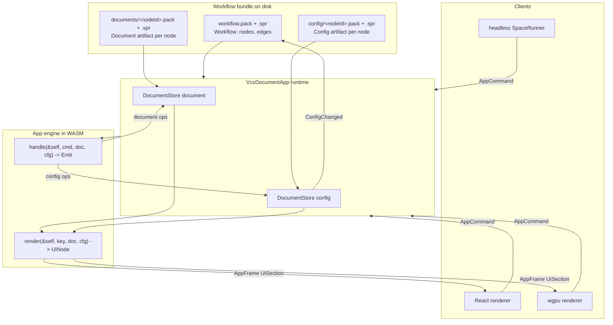

even# Configured Node Apps: Non-Destructive, Config-Driven, Headless-Rendered, Workflow-Instantiable

## Context

This continues the program in `/Users/ueli/.claude/plans/every-single-app-must-joyful-pudding.md` (Waves 0-1 and 2 landed; Wave 3 engine-offenders open as ticket `26/08/01/ENGINE-SLOT-HEADLESS-LAW-AND-OFFENDER-FIXES`). The transport is already unified: one `exchange(instance_id, commands)` WIT call carrying `protocol_channel::AppCommand`/`AppFrame`.

What is *not* yet true, and is what this plan delivers:

- **Config is destructive today.** `DocumentApp::apply_config_bytes` is documented verbatim as *"NOT a document operation, not undoable, not routed through the `DocumentStore`"*, and `OsAppInstance.config` is an untyped `Option<serde_json::Value>`.
- **App state is scattered across seven places.** Document store (VCS'd), app-struct fields behind `&mut self`, host-pushed `ViewState`, the `view_state: Vec<u8>` field on `AppCommand::Command`, `ConfigSpec`/`apply_config_bytes`, `OsAppInstance.config`, and real React state in the renderer (`draftDoc`, workflow diagram `nodes`/`edges`, `viewportCamera`, staged command args, slider/label overlays).
- **A completed sweep pushed state the wrong way.** Tickets `26/07/31/NOTE-CAMERA-AS-SESSION-ONLY-VIEW-ACTION`, `MOVE-DRAW-PLUGIN-CAMERA-TO-RUNTIME-STATE`, `PUZZLE-3D-CAMERA-BECOMES-PER-WINDOW-SESSION-ONLY-VIEW-ACTION`, `TRINITY-…`, `RASTER-…` and ~10 siblings deliberately moved camera *out* of documents into volatile app-struct runtime state. This plan reverses that direction: camera and friends become **configuration**, which is persisted and non-destructive. Those tickets' outcomes are superseded, not re-litigated.
- **`🔁️workflow` is squatting the name.** That module's package is `semio-framework-os-kernel-workflow` but its lib is `playbook` and it models a Blockly-style step/block form editor. The real workflow graph (`OsWorkflow`, `OsWorkflowNode`, `OsAppInstance`) is buried in the 5k-line os `📦️lib.rs`.

Confirmed decisions: **two VCS'd artifacts per node** (Config = all options plus interaction/view state; Document = content), and **grain = every semantic interaction plus every settled view change**, with intra-gesture pointermove coalescing into one amended config edit.

## The law (three axioms, each mechanically enforced)

1. **Purity.** An app engine is a pure function. `fn handle(&self, command, document, config) -> Emit`. No `&mut self` anywhere on the app trait. App structs become unit structs. The compiler enforces this fleet-wide the moment `&mut self` is removed.
2. **Totality.** Every interaction lands in exactly one of the two artifacts. There is no third place. `ViewState`, `AppCommand::Command.view_state`, `apply_config_bytes`, and `OsAppInstance.config` are deleted outright.
3. **Non-destruction.** Both artifacts are `DocumentStore`s: append-only `Edit`s with real `backwards`, checkpoints, and alternatives. Config edits carry `StateClass`/`UndoPolicy` so config undo is a separate stack from content undo while still being a real inverse, never a mutation.

## Target architecture



Three graph layers get explicit, non-overlapping roles (no more bridging one into another):

- **`Workflow`** (kernel, in `🔁️workflow`) is *the* persisted app-node graph. A node is `{ id, plugin_id, app_id, document_ref, config_ref, inputs, outputs, position }`.
- **node-graph surface / DAG kernel** is the shared *renderer* board. `DagNodeKind::AppInstance` becomes the only node kind used for app nodes.
- **flow's neural `Tree`** is an *app's internal* compute graph. Flow is itself a workflow node. The `os_workflow_to_flow_fixture` bridge in os `📦️lib.rs` (~3769) is deleted as a cross-model leak.

## What moves where

`<App>Config` (new, in each app's `⚙️engine` slot) absorbs:

- **From app-struct runtime fields:** `selected_ids`, `hovered_id`, `camera` (keyed per window instance), gesture scratch/drafts, LOD, grid/snap toggles, catalogue expansion, eval-driver cursor, `GenerationPlayState`.
- **From host-pushed `ViewState`** (`🧰️framework/⚡️implementations/🦀️rust/📦️lib.rs` ~5938): `active_mode_id`, `active_window_kind_id`, `active_utility_id`, `active_utility_by_window_id`, `active_tool_id`, `selection_json`, `panel_json`, `window_id`, `window_instances`, `locale`, `terminology`.
- **From React renderer state:** `draftDoc`, workflow diagram `nodes`/`edges` layout, `viewportCamera`, staged command args, `sliderStateJson`/`labelStateJson` overlays.

Stays *out* of config (host-transient only, never persisted): raw intra-gesture pointer coordinates, marquee rubber-band points, menu open/close, in-flight WASM session handles. These coalesce via `ActionEmit::amend` into one config edit at gesture end.

Deleted mechanisms: `ViewState` struct, `AppCommand::Command.view_state`, `DocumentApp::apply_config_bytes`, `OsAppInstance.config` + `OsOperation::SetAppInstanceConfig` (os `📦️lib.rs` ~397/505/581), `HostEffect::ReplayShellCommand` and `InverseAction` (a config op *is* the inverse now), `os_workflow_to_flow_fixture`.

## Waves

Rules for every wave: work inside a repo-MCP ticket; packages within a wave are file-disjoint by crate/directory; a wave starts only when the prior wave's acceptance is green; `🤖️generated/*` only written by running the owning generator; no git-modifying commands; no worktrees. Note: the repo MCP server currently fails live tool discovery, so `mcp_auth` must be run before ticketing.

### Wave A - Kernel foundations (3 parallel, file-disjoint)

- **WP-A1 - Free the workflow name.** Move the playbook domain from `🧰️framework/🛍️products/💻️os/🔨️modules/🔁️workflow/⚡️implementations/🦀️rust/📦️lib.rs` to a new module `🔨️modules/📖️playbook/⚡️implementations/🦀️rust/📦️lib.rs`, package `semio-framework-os-kernel-playbook`, lib stays `playbook`. Update `Cargo.toml` workspace members, `📋️project.json`, dependents (playbook plugin, forms plugin). Then extract the workflow graph out of os `📦️lib.rs` (module at ~3328) into `🔁️workflow` as `Workflow`, `WorkflowNode`, `WorkflowEdge`, `WorkflowOperation` (dropping the `Os` prefix), plus `workflow_node_for_app(&AppDefinition) -> WorkflowNode` so *any* app is instantiable as a node from its manifest alone.
- **WP-A2 - Config artifact in store.** In `🔨️modules/🏪️store/⚡️implementations/🦀️rust/📦️lib.rs`, add a `🔖️Config` region: `ConfigEnvelope<C, ConfigOperation>` and `ConfigStore` as type aliases over the existing `DocumentEnvelope`/`DocumentStore` (same append-only machinery, no parallel implementation), plus `create_config_envelope`. Add `store::test_support::assert_config_round_trip`. In `🧰️framework/⚡️implementations/🦀️rust/📦️lib.rs`, extend `ConfigSpec` so it can be derived from a `dsl::DslRecord` config type and validated against a config projection.
- **WP-A3 - Channel frames.** In `🔨️modules/📡️protocol/🧵️channel/⚡️implementations/🦀️rust/📦️lib.rs`: bump `CHANNEL_VERSION` to 2; delete `view_state` from `AppCommand::Command`; replace `AppCommand::Configure` with `AppCommand::ConfigCommand { seq, command: Vec<u8> }` (a `store::DocumentCommand` over the config store, so undo/redo/checkpoint work on config); add `AppCommand::LoadConfig { seq, pack, spr }`, `AppCommand::ReadConfig { seq }`; add `AppFrame::Config { in_reply_to, pack, spr, ops }` and `AppFrame::ConfigChanged { envelopes, origin }`. Extend the hex fixture corpus.

Accept: `cargo test -p semio-framework-os-kernel-playbook -p semio-framework-os-kernel-workflow -p semio-framework-os-kernel-store -p protocol-channel -p protocol`.

### Wave B - The trait flip (serial spine, then 30-package parallel fan-out, then serial closer)

This is a hard cutover with no compatibility layer, per repo rules. Nothing compiles until B2 completes; that is acceptable and is exactly what a workforce is for.

- **WP-B1 (serial spine)** - `🔨️modules/🔌️plugin/⚡️implementations/🦀️rust/📦️lib.rs`:
  - `DocumentApp` becomes pure. New associated types `Config: ConfigRecord` and `ConfigOperation: protocol::Operation<Self::Config> + OpText + OpBinary`. Signature change:
    ```rust
    fn handle(
        &self,
        command: &Self::Command,
        doc: &DocumentView<'_, Self::Projection>,
        cfg: &ConfigView<'_, Self::Config>,
    ) -> Emit<Self::Operation, Self::ConfigOperation>;
    fn render(&self, body_key: &str, doc: &DocumentView<'_, Self::Projection>, cfg: &ConfigView<'_, Self::Config>) -> UiNode;
    ```
  - `ActionEmit` becomes `Emit { document_operations, config_operations, description, coalesce_key, effects, events, ui_scope }`. Delete `inverse`/`InverseAction` (a config op has a real `backwards`). Keep `amend`/`commit` constructors, now able to target either store.
  - Delete from the trait: `handle_action`, `handle_command`, `handle_typed_command`, `apply_config_bytes`, and every `&mut self` method (`copy_fragment`, `cut_operations`, `paste_operations`, `pending_effects`, `import_media` become `&self` and emit config ops instead of mutating).
  - `VcsDocumentApp<A>` owns two stores; `PluginApp` gains `config_pack`/`load_config_pack`/`dispatch_config_command`; `plugin_runtime::plugin_exchange` routes the new frames.
  - Delete `ViewState` and `ViewWindowInstance` from `🧰️framework/⚡️implementations/🦀️rust/📦️lib.rs`; delete `AppDefinition`'s now-redundant surfaces that duplicated config (`ArtifactKindSpec`, `MediaKindDescriptor`, `OsParameterFieldSpec`) as scheduled by the parent plan's Wave 5.
  - Update WIT doc comments in `📜️wit/📜️world.wit` (the 5-function surface is unchanged; only frame semantics move).
  - Pilot: convert `🎥️shooting` (already the parent program's pilot) in the same package as the compile fixture.
- **WP-B2 (parallel fan-out, ~30 packages)** - all 52 apps under `✏️s/🔌️plugins/*/🎛️apps/*/`. One agent per plugin directory; `📕️norm`'s 15 near-clone apps are one package; `🧩️puzzle`/`🧱️block` (3 apps each) and `🌀️procedural`/`🌍️gis`/`🏗️fem`/`🔱️trinity`/`🪐️space` (2 each) are one package per plugin. Per-app recipe is in the section below.
- **WP-B3 (serial closer)** - regenerate the plugin registry (`🔨️modules/🔌️plugin/⚡️implementations/🟦️typescript/📇️registry/📜️script.ts`), rebuild all plugin wasm, run `cargo test --workspace` and `bun nx run-many -t test`.

Accept: workspace compiles and tests green; every app's `assert_app_contract` passes.

### Wave C - UI becomes a pure projection (2 parallel)

- **WP-C1 - React renderer** `🔨️modules/📺️renderer/🧑️‍🎨️engine/⚛️react/⚡️implementations/🟦️typescript/📦️index.tsx`. Delete the `ViewState` construction sites (~5663, ~5760, ~6521, ~6545, ~6647, ~7789) and the `injectActiveUtility`/`injectActiveTool` helpers - the engine owns this now. Delete the client-side tree patchers `patchWorld3dChromeOntoNode` and `patchDocumentTreeSelectedIds` (~4931-4953): selection chrome comes from the engine's `UiNode`. Convert ink `draftDoc` (~23631), workflow diagram `nodes`/`edges` (~17586), `viewportCamera` (~15502), and staged command args to config commands dispatched immediately with a `coalesce_key`, rendering from the returned frames only. Resolve `ExternalSlot` server-side in `plugin_exchange` rather than by a renderer fetch.
- **WP-C2 - wgpu renderer** `🔨️modules/📺️renderer/🧑️‍🎨️engine/🧊️wgpu/⚡️implementations/🦀️rust/📦️lib.rs` plus `🟦️typescript/🟦️boot.ts`. Retire `boot.ts`'s pre-channel `render`/`handleAction` API onto `AppChannelClient`. `ui_wgpu`'s retained `Ui` keeps only frame-local layout/focus; per-window options move to config.

Accept: dev-shell `SpaceE2eVerify` plus the react-vs-wgpu parity sweep green; the enforcement lint from Wave E passes.

### Wave D - Workflow node instantiation end to end (3 parallel)

- **WP-D1 - Bundle and runner.** `🔨️modules/🏃️run/⚡️implementations/🦀️rust/{📦️lib.rs,📦️bin.rs}`: `SpaceBundle` gains `config/<nodeId>.pack|.spr`. Per-node frame script becomes `Hello -> LoadConfig -> LoadDocument -> MediaIn* -> MediaOut/MediaFingerprint* -> ReadDocument -> ReadConfig`, persisting both artifacts back. `NodeRunRecord.config_fingerprint` now hashes the config artifact head edit id rather than a JSON blob.
- **WP-D2 - OS studio and node graph.** os `📦️lib.rs`: delete `OsAppInstance.config` and `OsOperation::SetAppInstanceConfig`; nodes reference `config_ref`. Open-node flow binds the live app instance to that node's config artifact so UI interaction writes straight through. Delete `os_workflow_to_flow_fixture`. `🧰️framework/🔨️modules/🗺️surface/🕸️node-graph/⚡️implementations/🦀️rust/📦️lib.rs` + the DAG kernel: `AppInstance` is the sole app node kind; a palette entry is generated for every `AppDefinition` in the registry so **every app is instantiable**.
- **WP-D3 - Scripts and launch targets.** Root `📜️script.ts` `os` region: `os workflow new|add-node|run` subcommands; register every new runnable in `.vscode/launch.json` following existing grouping and naming.

Accept: `cargo test -p semio-framework-os-run -p semio-framework-os`; `bun ./script.ts os run … --dry` then a real run.

### Wave E - Laws and conformance harness (1 package, then always-on)

Extend the testkit at `🔨️modules/🔌️plugin/⚡️implementations/🦀️rust/📦️lib.rs` (`assert_constitutional_crates`, ~1907):

- `assert_app_is_pure::<A>()` - the app type is a unit struct (`size_of::<A>() == 0`) and `A::Config::default()` round-trips dsl-to-pack byte-identically.
- `assert_config_totality::<A>(manifest_fn)` - every manifest action, view-action, shell-action and command maps to a `<App>Command` variant, and every variant emits at least one document *or* config operation. A command that emits nothing is a hard error.
- `assert_ui_is_projection::<A>()` - `render` called twice on the same `(document, config)` returns byte-identical `UiNode`; a command followed by `render` differs only where the config diff says it should.
- `assert_headless_ui_parity::<A>()` - replaying a command list through `PluginApp` directly and through `exchange` yields frame-for-frame identical results.
- `assert_engine_headless` - carried over from the open Wave 3 ticket.
- Renderer lint: extend `eslint.config.mjs` and `.dependency-cruiser.cjs` to forbid `useState`/`useReducer` holding app state in the renderer outside a named allowlist of pointer-transient hooks, and to forbid any renderer import of a plugin app crate.

### Wave F - End-to-end proof (3 parallel)

- **WP-F1** Fixture workflow bundle wiring three real apps across a media edge; headless run recomputes in topological order, media crosses edges, re-run is fully clean, a config change dirties exactly the bound node.
- **WP-F2** Parity law: playwright drives the identical command frames through the browser worker path; assert the final Document *and* Config DSL are byte-identical to the headless run. This is the proof that the UI is only a display.
- **WP-F3** Non-destruction law: for every app, a randomized command sequence followed by full config undo restores the initial config projection exactly; the same for the document; checkpoints and alternatives round-trip.

### Carried-over waves (unchanged scope, now sequenced)

- **Wave 3 (existing open ticket)** engine-slot headless law and the four offenders (puzzle `◻2d`, puzzle `🧊️3d`, trinity `✏️rewrite`, `📜️imperative`) - runs in parallel with Wave A, file-disjoint.
- **Wave 7** outliers `🏛️architect` (spine split into the 6 slots) and `🔋️energy` (build the app) - both currently have zero apps and so cannot participate in Wave B's fan-out; they enter at Wave B2 grain once constitutionalized.

## Per-app recipe for Wave B2 (hand to each agent verbatim)

Given an app at `✏️s/🔌️plugins/<plugin>/🎛️apps/<app>/` with slots `⚡️implementations` (root), `🔨️modules/{⚙️engine,🔧️op,🗣️dsl,🎒️pack,📡️protocol,🖱️ui}`:

1. **`⚙️engine`** - define `<App>Config` with `#[derive(Clone, Debug, PartialEq, Default, Serialize, Deserialize, dsl::DslRecord)]`. Populate it by moving *every* field off the app struct in `🖱️ui` plus every `view_state.*` read in that crate. Camera, selection, and per-window options are keyed by window-instance id (`BTreeMap<String, _>`), never by window kind.
2. **`🔧️op`** - define `<App>ConfigOperation` with `#[derive(… dsl::DslOps)]` and `impl protocol::Operation<<App>Config>`, with a real `backwards` for every variant. One variant per settled interaction (`SetCamera`, `SetSelection`, `SetHover`, `SetActiveUtility`, `SetPanel`, `SetDraft`, …).
3. **`🗣️dsl` / `🎒️pack`** - add `store::test_support::assert_dsl_round_trip` and `assert_dsl_pack_equivalence` for `<App>Config`, and `assert_op_line_round_trip` for every `<App>ConfigOperation` variant.
4. **`📡️protocol`** - ensure `<App>Command` has one variant per manifest action, including the ones that previously only mutated runtime state.
5. **`🖱️ui`** - make the app struct a unit struct (`pub struct <App>PlayApp;`). Rewrite `handle` as a pure match returning `Emit`; every former `self.field = x` becomes a config operation. Every `render`/scene builder reads from `cfg` instead of `self`. Manifest: `.config::<<App>Config>()`.
6. **Tests** - add `assert_app_is_pure`, `assert_config_totality`, `assert_ui_is_projection`, `assert_headless_ui_parity` alongside the existing `assert_app_contract`. Extend existing test files; do not create new ones.
7. `cargo check --all-targets` and `cargo test --lib` on every touched crate; hand-fix every fixture and example under `📚️examples/` and `🧫️fixtures/`.

## Verification summary

- Laws: purity (unit struct), totality (no command emits nothing), non-destruction (undo restores exactly, both artifacts), UI-is-projection (render is deterministic), headless-UI parity (frame-identical), engine-headless (no wasm/web/gpu deps in `⚙️engine`), renderer lint (no app state in React).
- Suites: `cargo test --workspace` and `bun nx run-many -t test` at each wave boundary; dev `SpaceE2eVerify` plus react-vs-wgpu parity after Waves B, C; run-crate e2e plus playwright parity in Wave F.
- Runtime confirmation is mandatory before any wave is called done: dev shell boots, a node is opened, an interaction is performed, and `[DEBUG] ` logs confirm a config operation reached the store and the workflow bundle on disk. Scratch files live in the ticket folder as `.txt`.

## Critical files

- `🧰️framework/🛍️products/💻️os/🔨️modules/🔌️plugin/⚡️implementations/🦀️rust/📦️lib.rs` - the `DocumentApp`/`PluginApp`/`VcsDocumentApp`/`Emit` spine and the testkit laws
- `🧰️framework/⚡️implementations/🦀️rust/📦️lib.rs` - delete `ViewState`; `AppDefinition`, `ConfigSpec`, `PluginManifest`
- `🧰️framework/🛍️products/💻️os/🔨️modules/📡️protocol/🧵️channel/⚡️implementations/🦀️rust/📦️lib.rs` - config frames
- `🧰️framework/🛍️products/💻️os/🔨️modules/🏪️store/⚡️implementations/🦀️rust/📦️lib.rs` - `ConfigStore`
- `🧰️framework/🛍️products/💻️os/🔨️modules/🔁️workflow/⚡️implementations/🦀️rust/📦️lib.rs` - becomes the real workflow kernel
- `🧰️framework/🛍️products/💻️os/⚡️implementations/🦀️rust/📦️lib.rs` - workflow extraction, delete `SetAppInstanceConfig` and the flow bridge
- `🧰️framework/🛍️products/💻️os/🔨️modules/🏃️run/⚡️implementations/🦀️rust/{📦️lib.rs,📦️bin.rs}` - config artifacts in the bundle
- `🧰️framework/🛍️products/💻️os/🔨️modules/📺️renderer/🧑️‍🎨️engine/⚛️react/⚡️implementations/🟦️typescript/📦️index.tsx` - the largest UI-purity surface
- `🧰️framework/🔨️modules/🗺️surface/🕸️node-graph/⚡️implementations/🦀️rust/📦️lib.rs` - app-node palette from the registry
- `✏️s/🔌️plugins/*/🎛️apps/*/` - 52 apps, the Wave B2 fan-out
