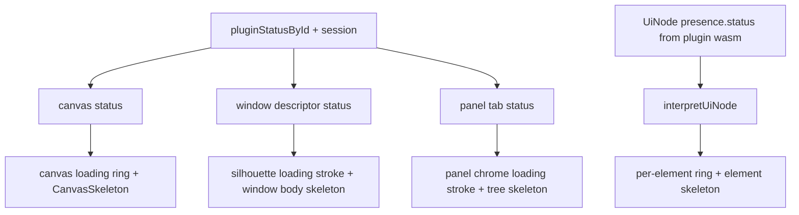

## Findings

The loading design language already exists but is only half-wired:

- Rust `ui_wgpu` has the unified model: every one of the 19 `UiNode` variants carries a mandatory `presence: UiPresence` (`state` x `status` x `hover` x `selected`), and `presence_overlay` in [🧰️framework/🔨️modules/🖱️ui/🧊️wgpu/⚡️implementations/🦀️rust/📦️lib.rs](🧰️framework/🔨️modules/🖱️ui/🧊️wgpu/⚡️implementations/🦀️rust/📦️lib.rs) already paints loading/waiting/finished rings from it.
- The TS mirror in [🧰️framework/⚡️implementations/🟦️typescript/📦️index.ts](🧰️framework/⚡️implementations/🟦️typescript/📦️index.ts) still has ad-hoc `loading?`/`waiting?` booleans on only 6 of 19 node types and no `presence` at all, so **plugin-declared loading status is silently dropped by the React renderer**.
- `UiElementStateProps` / `useElementState` exist in [🧰️framework/🔨️modules/🖱️ui/⚛️react/⚡️implementations/🟦️typescript/📦️index.tsx](🧰️framework/🔨️modules/🖱️ui/⚛️react/⚡️implementations/🟦️typescript/📦️index.tsx) (line 11260) but **no component consumes them**; `elementStateAttributes` has zero call sites outside its own test. This is exactly deferred item (4) of ticket `26/07/23/UNIFIED-COMPILE-TIME-ENFORCED-UI-ELEMENT-STATE-MODEL`.
- Skeletons exist for only 4 things: `LoadingRow`, `DiagramSkeleton`, `SceneSkeleton`, `TableSkeleton`.
- `Window` already supports `loading`/`waiting`/`skeleton` and the dock silhouette SVG already resolves a `loading` stroke via `resolveWindowSilhouetteBorderKind` (MutationObserver-backed, so a class flip re-paints) — the shell simply never sets those flags on `ModeWindowDescriptor`.
- The shell instead emits text placeholders: `{ type: "text", value: "Loading" }` for panel tabs and window bodies (lines 3461, 6637, 6664, 6742) and `
Loading plugins…
` (line 9749). That paragraph is the "wrong small row" the demonstrator shows.
- WGPU dock chrome (`render_stack` / `push_window_silhouette_border` in the OS wgpu renderer) draws a solid outline only, and window chrome structs (`WindowMeasure::Slider { loading, waiting }`) still use booleans — deferred item (1) of the same ticket.

## Phase 1 - One status axis in TS

- In [🧰️framework/⚡️implementations/🟦️typescript/📦️index.ts](🧰️framework/⚡️implementations/🟦️typescript/📦️index.ts): add `UiPresence`/`UiState`/`UiStatus` mirrors and `readonly presence?: UiPresence` to all 19 `UiNode` types plus `UiTreeItemNode`/`UiTreeSectionNode`/`UiControlNode`. Delete the ad-hoc `loading?`/`waiting?`/`disabled?`/`selected?` fields that `presence` supersedes (stack, section, button, tree, tree item, tree section, ring) - no compat shim.
- In ui-react: make every element actually consume `UiElementStateProps` via `useElementState`, replacing the `loading`/`waiting` boolean props on `Action`, `Button`, `Slider`, `TreeItem`, `TreeSection`, `Window`, `WindowMeasureTreeRow`, `LoadingRow`, and the skeletons. Keep `loadingBorderStateClass`/`waitingBorderStateClass` as the internal class helpers, driven from `status`.
- Add the compile-time `UI_ELEMENTS` registry + anti-dodge in-source test promised by the prior ticket, so a component that does not declare all four axes fails typecheck.

## Phase 2 - A skeleton for every element (React)

- New `🐹️Skeletons` subregion in ui-react built on one primitive, `SkeletonBlock` (pulse fill, `prefers-reduced-motion` safe), with one skeleton per element kind: text, button/action, separator, image, input, select, toggle, keyValue, slider, numberStepper, ring, iconSelect, field, group, section, stack, tree (rows via `LoadingRow`), componentScene (reusing `SceneSkeleton`/`DiagramSkeleton`/`TableSkeleton`), externalSlot.
- Chrome skeletons for the shell levels: `CanvasSkeleton` (dock cap + body silhouette mimic), `WindowBodySkeleton`, `PanelTreeSkeleton`, `PaneSkeleton`, `NavbarSkeleton`, `FooterSkeleton`.
- One dispatcher `elementSkeleton(kind)` so the interpreter can pick a skeleton for any node type.
- Rule applied uniformly: `status === "loading"` or `"waiting"` renders the skeleton **instead of** content and keeps the ring (spinning vs dashed); `"finished"` shows content with the solid ring.
- Extend the existing [.storybook/stories/ui/Skeletons.stories.tsx](.storybook/stories/ui/Skeletons.stories.tsx) with the full matrix (no new story files).

## Phase 3 - Shell chrome wiring (fixes the demonstrator row)

In [🧰️framework/🛍️products/💻️os/🔨️modules/📺️renderer/🧑️‍🎨️engine/⚛️react/⚡️implementations/🟦️typescript/📦️index.tsx](🧰️framework/🛍️products/💻️os/🔨️modules/📺️renderer/🧑️‍🎨️engine/⚛️react/⚡️implementations/🟦️typescript/📦️index.tsx):

- Derive one `shellStatus` from `pluginStatusById` / `pluginSupervisorById` / `session`: any `installing`/`reloading` or missing session means the canvas is loading.
- Replace line 9749's paragraph with `<CanvasSkeleton>` inside a canvas-level loading ring. Add `canvasStatus` (and `canvasSkeleton`) to `Layout` in ui-react, applied to the canvas wrapper `
{canvas}
` (line ~11773), plus the same `status` prop on the exported `Canvas` component.
- `modeWindows` (line 9517): set `status: "loading"` + `skeleton: <WindowBodySkeleton/>` on descriptors whose UI has not arrived, and while their owning plugin is reloading. `ModeWindowDescriptor` already extends `WindowConfig`, and `ModeDockStack` already spreads into `Window` (line 28937), so the silhouette turns into the loading dash with no plumbing.
- Delete every `ui.common.loading` text placeholder (lines 3461, 6637, 6664, 6742) in favour of status flags; keep the label only as an `aria-label`/`role="status"` on the skeleton so screen readers still hear it.
- Give `Panel` a `status` prop that forwards `borderKind="loading"` to its `WindowChrome` and renders `PanelTreeSkeleton` instead of the tree while pending; wire the plugin panel rows (`buildPluginsTree`, line 12455) to the same axis.
- Fold the chrome structs off booleans onto `UiStatus`: `WindowMeasure*`, `WindowEngagement*`, `UtilityNode` (deferred item 1 of the prior ticket), in both the TS mirror and the Rust definitions.
- [♻️mit-bestand/🧺️demonstrator/📦️index.tsx](♻️mit-bestand/🧺️demonstrator/📦️index.tsx) line 408-411: keep the brand logo, drop the `wird vorbereitet …` text row, and use the same canvas skeleton + loading ring so pre-mount and post-mount look identical.

## Phase 4 - WGPU parity

- [🧰️framework/🔨️modules/🖱️ui/🧊️wgpu/⚡️implementations/🦀️rust/📦️lib.rs](🧰️framework/🔨️modules/🖱️ui/🧊️wgpu/⚡️implementations/🦀️rust/📦️lib.rs): add `KIND_SKELETON` (pulsing fill, clock from the existing `globals._pad.x`) next to `KIND_LOADING_BORDER`, plus `DrawList::push_skeleton`. In `paint_node` (line 11394), when `presence.status` is `Loading`/`Waiting`, paint a per-variant skeleton instead of dispatching the widget's own paint, then let `presence_overlay` add the ring - one central switch, matching the React rule.
- Add `KIND_MARCHING_DASH` so silhouette segments can animate: extend `push_window_silhouette_border` to take a `UiStatus` and emit dash-marching segments for `Loading` (28/20) and `Waiting` (10/14), matching `.window-silhouette-border-loading`/`-waiting` in [🎨️ui.css](🧰️framework/🔨️modules/🖱️ui/🎨️styling/⚡️implementations/🟦️typescript/🎨️ui.css).
- [OS wgpu renderer](🧰️framework/🛍️products/💻️os/🔨️modules/📺️renderer/🧑️‍🎨️engine/🧊️wgpu/⚡️implementations/🦀️rust/📦️lib.rs): pass window status into `render_stack` (line 1037) so a loading window gets the dashed silhouette, and draw a canvas-level loading ring + dock skeleton while `session` is `None` or a plugin reload is in flight.

## Phase 5 - Tests and runtime proof

- Extend existing test files only: ui-react in-source vitest (status matrix, skeleton-instead-of-content, silhouette kind), [🧰️framework/🔨️modules/🖱️ui/🎨️styling/⚡️implementations/🟦️typescript/🧪️index.test.ts](🧰️framework/🔨️modules/🖱️ui/🎨️styling/⚡️implementations/🟦️typescript/🧪️index.test.ts) (CSS utilities present), the OS renderer `🧪️index.test.ts` (no `ui.common.loading` text nodes, descriptors carry status), and the in-file `ui_wgpu` tests (`KIND_SKELETON` and marching-dash instances emitted).
- Runtime verification in the ticket folder, following the existing [probe-six-panes.mts](.🦑️repo/🎫️tickets/🎆️26/🌙️08/☀️04/FIX-DEMONSTRATOR-SOURCING-PANE/probe-six-panes.mts) pattern: boot the demonstrator, capture console logs plus screenshots during plugin load and during a hot-swap reload, and assert `[data-ui-status="loading"]` and `[data-window-silhouette-border][data-kind="loading"]` are present with no text placeholder row. Same for the wgpu playground screenshot, plus `cargo test -p ui_wgpu --features engine` and `cargo check` on the wgpu renderer.

## Ticket

The repo MCP server was unreachable during planning (`repo://goals` returned "Server not found"). On execution, retry it, read `repo://goals`, and open a new ticket under goal `🎯️r2602` (e.g. "Consistent Loading Skeletons and Borders Across the Ui"), referencing `26/07/14/SPINNING-LOADING-BORDER-FOR-LOADABLE-UI-ELEMENTS` and `26/07/23/UNIFIED-COMPILE-TIME-ENFORCED-UI-ELEMENT-STATE-MODEL` (whose deferred items 1 and 4 this closes). All probes, logs, and screenshots go inside that ticket folder.