## Problem

Flow builds its menu inside `render()` and ships it as `context_menu_json` on the scene, then emits every selection-scoped row unconditionally with `disabled: !has_selection`:

```203:211:✏️s/🔌️plugin/🌊️flow/🎛️app/🌊️flow/🔨️module/🖱️ui/⚡️implementation/🦀️rust/📦️lib.rs
    items.push(json!({
        "id": "delete-selection",
        "label": labels.delete_selection,
        "icon": "trash",
        "action": "nodeGraphEdit",
        "args": { "operations": [{ "operation": "deleteSelection" }] },
        "destructive": true,
        "disabled": !has_selection,
    }));
```

Three consequences: the menu is always one frame stale, inapplicable rows are present, and no row can mention what is selected. Additionally:

- `DagHost` exposes only `selected_node_ids()` while the board engine tracks `selection.edge_ids`/`handle_ids`, so the flow plugin never learns about selected edges. Its `deleteSelection` handler calls `sync_host_selection(host, &selected)` with node ids only, so right-click delete silently spares selected edges.
- `Delete`/`Backspace` is hardcoded per canvas (e.g. [react renderer:18811](🧰️framework/🛍️product/💻️os/🔨️module/📺️renderer/🧑️‍🎨️engine/⚛️react/⚡️implementation/🟦️typescript/📦️index.tsx)) instead of being an app keybinding, so `mapContextMenuSpecs` has no shortcut to display for `deleteSelection`.
- The on-demand path already exists end-to-end in Rust (`DocumentApp::context_menu`, `Menu` builder, `plugin_context_menu`, `AppCommand::ContextMenu` tag 5 / `AppFrame::ContextMenu` tag 10, wire codecs in TS), but `AppChannelClient` has no `contextMenu()` method, so nothing ever calls it and no app implements the trait hook.

## Target flow

```mermaid
flowchart LR
  RC[right click on surface] --> HIT[host collects hit stack + live selection from wasm session]
  HIT --> REQ[PluginContextMenuRequest: menu ref, surface target, hits, selection, point, viewState]
  REQ --> CH[AppChannelClient.contextMenu / ProgramBridge.context_menu]
  CH --> EX[exchange: AppCommand::ContextMenu]
  EX --> APP[DocumentApp::context_menu builds only applicable rows]
  APP --> RESP[AppFrame::ContextMenu items]
  RESP --> MAP[mapContextMenuSpecs adds shortcuts from manifest keybindings]
  MAP --> OPEN[ContextMenuController / wgpu render_context_menu]
```




## 1. Request contract (typed, no free-form JSON)

In [ui-wgpu lib.rs](🧰️framework/🔨️module/🖱️ui/🧊️wgpu/⚡️implementation/🦀️rust/📦️lib.rs) and its TS twin [framework core index.ts](🧰️framework/⚡️implementation/🟦️typescript/📦️index.ts), replace `ContextMenuSurfaceTarget.target_json: Option<String>` with typed context reusing the existing pick-target grammar (`node`, `edge`, `handle`, `object`, `feature`, `row`, `word`):

```rust
pub struct ContextMenuSurfaceTarget {
    pub surface_id: String,
    pub kind: String,
    pub hits: Vec<ContextMenuHit>,
    pub selection: Vec<ContextMenuSelectionGroup>,
    pub text: Option<ContextMenuTextContext>,
}
pub struct ContextMenuHit { pub domain: String, pub id: String, pub label: Option<String> }
pub struct ContextMenuSelectionGroup { pub domain: String, pub ids: Vec<String> }
pub struct ContextMenuTextContext { pub caret: usize, pub has_selection: bool, pub word: Option<String>, pub can_rename: bool, pub has_completions: bool }
```

Empty `hits` means the click landed on empty canvas — that is the signal apps use to emit the canvas menu instead of the target menu.

Add a localized count-phrase helper next to the `Menu` builder in [plugin lib.rs](🧰️framework/🛍️product/💻️os/🔨️module/🔌️plugin/⚡️implementation/🦀️rust/📦️lib.rs) so every app formats counts identically:

```rust
pub fn selection_count_phrase(is_de: bool, counts: &[(usize, &str, &str)]) -> String
// selection_count_phrase(false, &[(8, "node", "nodes"), (13, "edge", "edges")]) == "8 nodes and 13 edges"
// selection_count_phrase(true,  &[(8, "Knoten", "Knoten"), (13, "Kante", "Kanten")]) == "8 Knoten und 13 Kanten"
```

Row labels become `format!("{} ({})", labels.delete_selection, phrase)`, e.g. `Delete Selection (8 nodes and 13 edges)`, `Delete Selection (1 node)`, and the row is omitted when the selection is empty.

## 2. Channel plumbing

- [os index.ts](🧰️framework/🛍️product/💻️os/⚡️implementation/🟦️typescript/📦️index.ts): add `AppChannelClient.contextMenu(request)` next to `refreshUi`, encoding `ContextMenu: { seq: this.nextSeq(), request: Array.from(encodePackValue(request)) }` and decoding the `ContextMenu` frame whose `in_reply_to` matches.
- Add `contextMenu` to `PluginWasmHandle` in framework core TS and implement `performContextMenu` in `adaptPluginHandle` in the React renderer, mirroring `performRefreshUi`.
- wgpu: add `ProgramBridgeEntry::context_menu(instance_id, request)` beside `handle_action` (wgpu lib.rs ~7598) for both backends, encoding the same `AppCommand::ContextMenu` over `exchange`; add the matching helper on `WasmPluginRuntime` in [plugin host lib.rs](🧰️framework/🛍️product/💻️os/🔨️module/🔌️plugin/🖥️host/⚡️implementation/🦀️rust/📦️lib.rs) if the native arm needs it.

## 3. Selection truth: nodes, edges, handles

- `DagHost`: add `selected_edge_ids()` / `selected_handle_ids()` (map `EdgeId` through `edge_id_map`, handles through `decode_channel_ref`) and make `set_selection` accept all three domains; same for the normal-graph host.
- `FlowHost`: structured `selection_json()` / `set_selection_json()` carrying `{ nodes, edges, handles }`; expose `selectedEdgeIds` etc. through the wasm bindings so the React host can read them at right-click.
- Flow plugin runtime gains `selected_edge_ids`; `setSelection`/`nodeGraphSelect`/`selectAll`/`clearSelection`/`contextMenuAt` maintain it, and `deleteSelection` / `nodeGraphEdit`'s `deleteSelection` sync edges into the host so selected synapses are actually deleted.
- Board 2d and world 3d already carry their selection JSON; surface it as `ContextMenuSelectionGroup`s.

## 4. App-side menus (delete every `context_menu_json` producer)

Implement `DocumentApp::context_menu` with `Menu::of(registry)` and remove the render-time builders in: flow (`build_node_graph_context_menu_json`), space workflow, puzzle 3d, puzzle 5d, dag, sequence, trinity jack, trinity rewrite, procedural 2d, procedural 3d. Drop `context_menu_json` from the scene structs.

Flow's menu becomes context-exact:

- empty canvas: Add Node, Select All, Reorganize, Grid toggle
- node hit: Rename, Replace Image (image nodes only), Hide/Show Preview, Zoom to Node, Delete Node
- edge hit: Disconnect, Delete Edge
- handle hit: Connect Ports, Disconnect
- multi-selection: Hide/Show Preview, Zoom to Selection, Clear Selection, `Delete Selection (8 nodes and 13 edges)`

Also move the three renderer-owned technology menus into their apps so no technology leaks into the shell: `buildPuzzle2dSelectionMenuItems` into puzzle 2d, `buildTiledMapContextMenuItems` into the gis map app (hit feature vs empty map), `buildTextEditorContextMenuItems` into the writer app (driven by `ContextMenuTextContext`).

## 5. Keybindings as the single hotkey source

Each app declares the bindings its menu rows reference, e.g. in `create_flow_app`: `.keybinding("delete,backspace", "deleteSelection")` alongside the existing `mod+z`, `mod+shift+z`, `mod+a`. Then remove the hardcoded `Delete`/`Backspace`, `mod+a`, `mod+z` handlers in the canvas hosts (react renderer 17276, 18786-18817, 22604) so the shell dispatcher at 7583 is the only path — text editor `Backspace`/`Delete` at 19822/19830 stay, they are text edits. `formatKeybindingShortcut` already renders `⌫️`/`⌦️`, and `mapContextMenuSpecs` already fills `shortcut` from `keysByActionId`, so rows show hotkeys once the bindings exist.

## 6. React renderer wiring

Every `onContextMenu` becomes: `preventDefault` → collect hits via `pickTargetsAtScreenJson` (or the surface's hit-test) plus live selection → `await program.contextMenu(...)` → `mapContextMenuSpecs` → open `ContextMenuController` at the point. Touches world 3d (16626), WASM graph (17536), diagram fallback (17696), flow (19004-19052), text editor (19566-19647), tiled map (21653), board 2d (22626). Delete `enrichNodeGraphContextMenuItems` and the local builders. Additionally mount the currently dead `shellContextMenu` state on a `ContextMenuController`, and route window chrome, panel tab, and tree row menus through their `UiMenuRef` so those surfaces get app-authored menus too.

## 7. wgpu renderer parity

Shell `ContextMenuItem` gains `shortcut`, `separator`, `checked`, `disabled`; `render_context_menu` (28202) measures width from label plus shortcut and draws a right-aligned dim shortcut column, renders separators as thin rules, and skips hit registration for disabled rows. Right-click (18910) requests the menu through the bridge with the same typed request instead of draining the render-time sink; delete `push_graph_context_menu`, `push_tiled_map_context_menu`, `open_board2d_context_menu`, and the `push_context_menu_item` sink.

## 8. Validation

- Extend the existing test regions (no new files): flow ui `context_menu_items` tests for empty canvas / node / edge / multi-select counts and shortcut-free specs; plugin crate tests for `selection_count_phrase` and the `ContextMenu` exchange round trip; os TS codec tests for `AppChannelClient.contextMenu`; react renderer vitest for `mapContextMenuSpecs` shortcut enrichment; the existing `ContextMenu` storybook story for the shortcut column.
- Runtime confirmation with `[DEBUG]` logs on menu open (target domain, row ids, counts, shortcuts) for: right-click empty flow canvas shows no delete row; select 8 nodes and 13 edges by marquee and confirm the row reads `Delete Selection (8 nodes and 13 edges)` with `⌫️`; invoke it and confirm both widgets and synapses disappear from the fixture.
- Run `cargo test` for the touched crates plus the TS/react vitest suites, and check the wgpu shell menu visually.

## Process

Read the `repo://goals` MCP resource first, then open a ticket (or reopen a matching existing one) and keep all scratch logs inside the ticket folder; close it with a summary and the file list when done.