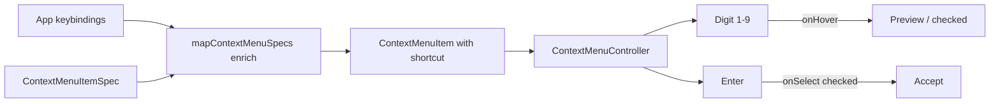

# Context Menu Hotkeys and Numbered Suggestions

## Goal association

`🎯️r2602/🎯️runningsketchpad` (same as other Puzzle 3D context-menu / suggestion tickets). Open a new ticket on implementation (no existing ticket covers numbered shortcuts + always-show hotkeys).

## Current state

- UI already right-aligns `shortcut` via `ms-auto` in `[ui/js/react/index.tsx](ui/js/react/index.tsx)` (`renderContextMenuItems` / `renderFixedContextMenuItems`).
- Plugin menus (Puzzle 3D/2D, Flow) omit `shortcut`; only Storybook and the text-editor menu set it.
- Puzzle 3D suggestions (`[suggestionMenuItems](framework/renderer/react/index.tsx)`) support hover-preview / click-accept, but no numbers, no digit preview, no Enter select.
- `[ContextMenuController](ui/js/react/index.tsx)` only handles Escape.

## Approach

### 1. Format and auto-fill shortcuts from keybindings

In `[framework/renderer/react/index.tsx](framework/renderer/react/index.tsx)`:

- Add `formatKeybindingShortcut(keys: string): string` that takes the first chord of a binding and maps tokens to display symbols (`backspace` → `⌫️`, `delete` → `⌦️`, `mod` → `⌘️` on Apple / `Ctrl` elsewhere, `shift` → `⇧️`, etc.).
- Extend `mapContextMenuSpecs` with an optional `keysByActionId: ReadonlyMap<string, string>`. When `spec.shortcut` is missing and `spec.action` has a binding, set `shortcut` from the formatter. Explicit `shortcut` always wins.
- Provide a thin `AppKeybindingsContext` from the app shell (where `session.app.keybindings` already exists for the palette) and a `useAppKeybindingsByActionId()` helper. Scene hosts call `mapContextMenuSpecs(specs, dispatch, keysByActionId)` so Puzzle 3D delete shows `⌫️` (last binding for `deleteSelection` is `backspace`), duplicate shows `⌘️D` / `Ctrl+D`, etc.

No Rust menu JSON changes required for static hotkeys — they stay single-sourced from `.keybinding(...)`.

### 2. Number dynamic suggestion rows

In `suggestionMenuItems`:

- Assign `shortcut: String(n)` for the first 9 candidates (`1`…`9`).
- Candidates beyond 9 stay mouse-only (no shortcut).

### 3. Keyboard behavior in `ContextMenuController`

Extend the existing window `keydown` handler in `[ui/js/react/index.tsx](ui/js/react/index.tsx)`:

- **Digit `1`–`9`**: find a non-disabled item whose `shortcut` equals that digit.
  - If it has `onHover`, call `onHover` (preview; for suggestions this dispatches `hoverSuggestion` and updates `checked` via `brushCandidateIndex`).
  - Else call `onSelect` (accelerator for non-preview rows).
- **Enter**: find the `checked` enabled item and call `onSelect` (accept currently previewed suggestion). If none checked, no-op.
- **Escape**: unchanged (dismiss).
- `preventDefault` / `stopPropagation` on handled keys so the canvas does not steal them.

This keeps preview-vs-select semantics for suggestions (number = preview, Enter = place) while making digit shortcuts a generic menu feature.

### 4. Tests and stories

- Extend `[framework/renderer/react/index.test.ts](framework/renderer/react/index.test.ts)`: `formatKeybindingShortcut`, shortcut enrichment in `mapContextMenuSpecs`, numbered `suggestionMenuItems`.
- Extend existing ContextMenuController tests in `[ui/js/react/index.tsx](ui/js/react/index.tsx)`: digit → `onHover`, Enter → `onSelect` of checked item.
- Update `[.storybook/stories/ui/ContextMenu.stories.tsx](.storybook/stories/ui/ContextMenu.stories.tsx)` controller demo with numbered preview rows so the interaction is visible.

## Out of scope

- Arrow-key navigation.
- Numbering menus other than suggestion candidate lists (mechanism is generic via `shortcut`; only suggestions get auto-numbers in this pass).
- WGPU-native context menus (React host path only).

