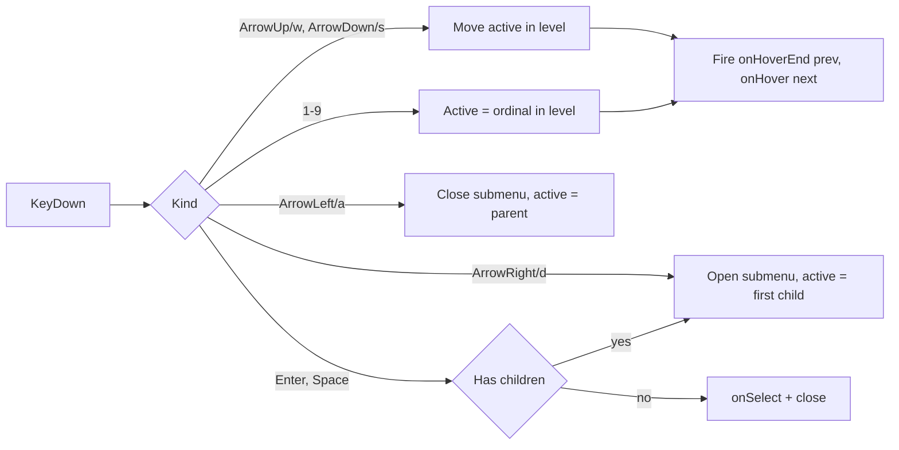

# Context Menu Keyboard Navigation

## Behavior contract (identical in both renderers)

- Every non-separator row at a level gets a 1-based ordinal; the first 9 render a leading number badge (left of the color swatch / icon). Rows past 9 are unnumbered but still reachable by arrows/wasd.
- Ordinals restart at 1 inside each submenu.
- One shared "active row" highlight, driven by both pointer hover and keyboard.
- Keys while the menu is open:
  - `ArrowDown` / `s` -> next enabled row (wrap), `ArrowUp` / `w` -> previous enabled row (wrap)
  - `1`-`9` -> make that ordinal active at the currently focused level (hover only, never activates)
  - `Enter` / `Space` -> activate the active row (same as clicking); on a parent row it opens the submenu instead
  - `ArrowRight` / `d` -> open the active row's submenu and make its first enabled child active
  - `ArrowLeft` / `a` -> close the current submenu, active returns to the parent row
  - `Escape` -> close the deepest open submenu, or the whole menu when at top level
- Making a row active fires its hover preview (`onHover` / `hoverAction`) and `onHoverEnd` on the previous row, so the existing suggestion-preview flow keeps working from the keyboard.
- Initial active row = first enabled `checked` row if any, else none. This preserves today's "Enter accepts the previewed suggestion".

## React renderer

Main file: [🧰️framework/🔨️module/🖱️ui/⚛️react/⚡️implementation/🟦️typescript/📦️index.tsx](🧰️framework/🔨️module/🖱️ui/⚛️react/⚡️implementation/🟦️typescript/📦️index.tsx), region `// #region 🖱️ContextMenu` (1571-2182).

- Lift submenu open state out of `FixedContextMenuSubmenu` (local `useState` at 1817-1835) into `ContextMenuController`. The controller owns a single `activePath: number[]` (index per level); the open submenu is the prefix of that path whose row has `children`. Pointer enter/leave now sets `activePath` instead of a private `open` flag, so mouse and keyboard share one highlight.
- Add pure, exported helpers next to the existing `contextMenuDigitFromKey` (1881-1894) so they are unit-testable:
  - `contextMenuOrdinals(items)` - id -> 1-based ordinal, skipping separators
  - `contextMenuNavigationFromKey(key)` - maps `ArrowUp`/`w`, `ArrowDown`/`s`, `ArrowLeft`/`a`, `ArrowRight`/`d`, `Enter`/`" "` to a direction, case-insensitive
  - `moveContextMenuActivePath(items, path, direction)` - next path, skipping separators and `disabled`, wrapping within the level
  - Replace `findContextMenuItemByShortcut` (now unused: numbering is automatic, not `shortcut`-driven) with `contextMenuPathForOrdinal(items, path, ordinal)`. Keep `findCheckedContextMenuItem` for the initial active row.
- Rewrite the `keydown` handler (1920-1950) around these helpers. Guard: ignore keys when `event.target` is an `input`/`textarea`/`contenteditable` so wasd cannot swallow typing elsewhere; `preventDefault` on `Space` to stop page scroll.
- Row rendering in `renderFixedContextMenuItems` (1837-1874): prepend the number badge (`` styled like `contextMenuShortcutClassName` but leading), and set `data-active="true"` on the active row. Add `data-[active=true]:bg-hover-interactive-fill data-[active=true]:text-emphasized` to `menuListItemClassName` (1664-1670) so the keyboard highlight reads exactly like hover and stays distinct from `checked`'s `bg-active-base`.
- The right-hand `shortcut` column keeps chords (`⌘️C`, `⌫️`) and `›` for submenus - unchanged.

Consumers:

- [🧰️framework/🛍️product/💻️os/🔨️module/📺️renderer/🧑️‍🎨️engine/⚛️react/⚡️implementation/🟦️typescript/📦️index.tsx](🧰️framework/🛍️product/💻️os/🔨️module/📺️renderer/🧑️‍🎨️engine/⚛️react/⚡️implementation/🟦️typescript/📦️index.tsx): drop the manual `shortcut: String(n)` digits from `suggestionMenuItems` (numbering is now automatic and would double-render). `mapContextMenuSpecs` (12927-12964) needs no change - it already recurses into `children`.

## wgpu renderer

Main file: [🧰️framework/🛍️product/💻️os/🔨️module/📺️renderer/🧑️‍🎨️engine/🧊️wgpu/⚡️implementation/🦀️rust/📦️lib.rs](🧰️framework/🛍️product/💻️os/🔨️module/📺️renderer/🧑️‍🎨️engine/🧊️wgpu/⚡️implementation/🦀️rust/📦️lib.rs). Today this menu is flat, unhighlighted and Escape-only, so it needs the whole feature.

- `ContextMenuItem` (16384-16390) gains `children: Vec<ContextMenuItem>`; `ContextMenuState` (16392-16397) gains `active: Vec<usize>`.
- `render_context_menu` (28204-28234): draw the ordinal badge, paint the active row with `theme.accent` / `theme.active_foreground` (same pairing the completions popup already uses at 15424-15428) instead of a uniform `theme.button`, and recursively draw the open submenu panel offset to the right, registering `HitKind::ContextMenu` hits for its rows too.
- Pointer move (the `update_hover` call at 19187) syncs `active` from `input.hovered_id`, and hovering a parent row opens its submenu - so mouse and keyboard agree.
- New `shell` helper `context_menu_handle_key(&mut self, action) -> ContextMenuKey` returning `Ignored` / `Consumed` / `Activate(ActionDescriptor)`, implementing the contract above over `ContextMenuState`.
  - Call it at the very top of `handle_keyboard_async` (20622), before the content-focus routing block - that block is gated on `idle`, which an open context menu does not currently clear, so keys would otherwise leak into the canvas. `Activate` awaits `dispatch_action` and clears the menu, matching `handle_shell_hit`'s click path (19800-19810).
  - `handle_keyboard`'s existing Escape arm (20419-20421) delegates to the same helper instead of hand-rolling `context_menu.take()`.
- Spacebar: `AppRuntime::handle_key` (30780-30784) currently swallows `KeyAction::Space` into `space_pressed` for canvas panning. Route `Space(true)` to the shell async path when `self.shell.context_menu.is_some()`.
- `GraphContextMenuItem` (13592-13607) gains `children` and `push_graph_context_menu` (13609+) maps them, so plugin-authored nested menus (the wire `ContextMenuItemSpec` already carries `children`) actually render here.

## Tests and stories

Extend existing files only:

- React UI tests in the same `📦️index.tsx` `describe("ContextMenu")` block (30902-31188): ordinal badges rendered 1-9 and restarting per submenu; ArrowDown/`s`/ArrowUp/`w` move the highlight and fire `onHover`/`onHoverEnd`; digit sets active without selecting; `Enter` and `" "` select the active row; `ArrowRight`/`d` opens a submenu and `ArrowLeft`/`a` returns; Escape closes submenu then menu. The existing digit+Enter test at 31156 keeps passing because the initial active row is the `checked` one.
- [🧰️framework/🛍️product/💻️os/🔨️module/📺️renderer/🧑️‍🎨️engine/⚛️react/⚡️implementation/🟦️typescript/🧪️index.test.ts](🧰️framework/🛍️product/💻️os/🔨️module/📺️renderer/🧑️‍🎨️engine/⚛️react/⚡️implementation/🟦️typescript/🧪️index.test.ts): update the `suggestionMenuItems` digit-shortcut test (1941-1958) for automatic numbering.
- wgpu tests in the `//#region ContextMenuItems` test region (15963+) plus a render assertion alongside `context_menu_draws_a_border_stroke_around_the_flat_panel` (16207): navigation state machine, ordinal badges, active-row fill, submenu open/close.
- [.storybook/stories/ui/ContextMenu.stories.tsx](.storybook/stories/ui/ContextMenu.stories.tsx): remove the manual `shortcut: "1"`/`"2"` digits, and make the nested `transform` item the keyboard-submenu demo.

## Process

- Repo MCP is currently reporting a discovery error; run `mcp_auth` for `project-0-semio-repo`, then read `repo://goals` and open a ticket (no existing ticket covers this) under `R26-02/RUNNING-SKETCHPAD`, slug `CONTEXT-MENU-KEYBOARD-NAVIGATION`. All scratch output goes in the ticket folder.
- Validate at runtime, not just by unit test: launch the React shell (`SEMIO_RENDERER=react`) and the wgpu shell (`SEMIO_RENDERER=wgpu`) from `launch.json`, drive the menu with digits/arrows/wasd/Enter/Space, confirm via `[DEBUG]`-prefixed logs of the active path and dispatched action, then strip those logs.
- Close the ticket with a summary and the touched-file list.

