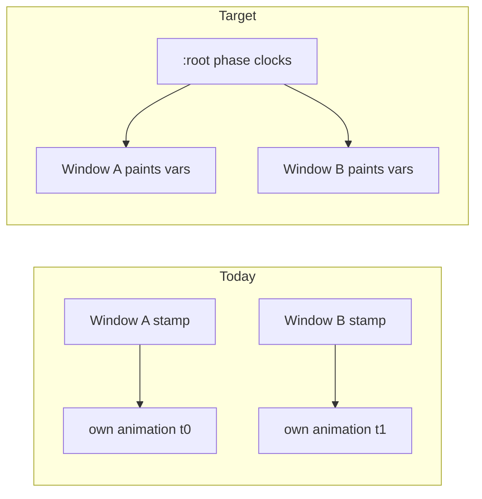

# Coordinate Window Border Effect Cycles

## Problem

Border effects in [`ui/styling/js/ui.css`](ui/styling/js/ui.css) each start an independent CSS animation when a class/`data-*` stamp appears. Two windows that enter loading (or introduced/celebrating) at different times pulse and spin out of phase, even though they share the same duration tokens.

Celebrate already sets `@property --celebrate-border-angle { inherits: true }`, but every host still resets `--celebrate-border-angle: 0deg` and runs its own `celebrate-border-spin`, so inheritance never phase-locks siblings.

## Approach

Drive one document-level clock per effect family on unlayered `:root`. Consumers only **read** inherited phase tokens for paint; they never start their own phase animation.

Effect families keep their existing durations (not cross-synced):

- loading: `1.6s`
- waiting: `3.2s`
- introduced: `1.6s`
- celebrate: `1.2s`

## Changes

### 1. Register inheritable phase tokens in [`ui/styling/js/ui.css`](ui/styling/js/ui.css)

Flip / add `@property` registrations with `inherits: true`:

- Angles: `--loading-border-angle`, `--waiting-border-angle`, `--celebrate-border-angle` (already true)
- Pulse paint tokens (new): e.g. `--loading-border-pulse-opacity`, `--waiting-border-pulse-opacity`, `--introduced-border-width`, `--celebrate-border-padding`
- Dash offsets for silhouette marches (new): e.g. `--loading-border-dashoffset`, `--waiting-border-dashoffset`

Keep duration `@property`s as today (pruning insurance). Add `--celebrate-border-duration: 1.2s` next to the other duration tokens in `@layer base :root`.

### 2. Own all clocks on unlayered `:root`

Extend the existing unlayered `:root` block (top of `ui.css`, already used to defeat Tailwind pruning) with a multi-animation clock that writes only those phase tokens. Mirror reduced-motion: disable the root clocks under `prefers-reduced-motion`.

### 3. Convert every consumer to paint-only

Strip local phase animations and local angle/pulse resets from:

- `@utility border-loading` / `border-waiting` (`::after` uses inherited angle + opacity)
- `[data-introduced="true"]` (inset shadow uses inherited `--introduced-border-width`)
- `[data-celebrated="true"]` + `::after` (conic from inherited angle; padding from inherited burst token; **no** host spin)
- `.window-silhouette-border-{introduced,loading,waiting}` and celebrate mask/fill
- CelebrateContent tree `:has()` branch spin (keep `--celebrate-conic` definition; drop local `celebrate-border-spin`)

Silhouette dash marches read `--*-border-dashoffset` instead of local `@keyframes` on each SVG path.

### 4. Sync 3D celebrate to the same timeline

In [`framework/renderer/react/index.tsx`](framework/renderer/react/index.tsx), replace per-material delta accumulation in `CelebratingConicMaterial` / mesh celebrate `useFrame` with absolute document time:

`uAngle = 2π * (document.timeline.currentTime ?? performance.now()) / 1000 / CELEBRATE_CONIC_SPIN_SECONDS`

so late-mounted meshes match the CSS root clock.

### 5. Tests

Extend the existing CSS contract vitest in [`ui/js/react/index.tsx`](ui/js/react/index.tsx) (celebrate / intro / silhouette suites already read `ui.css` as text):

- Phase `@property`s declare `inherits: true`
- Unlayered `:root` owns the clock `animation:` list for loading/waiting/introduced/celebrate
- Element utilities / `[data-introduced]` / `[data-celebrated]` / silhouette classes do **not** declare spin/pulse/dash phase animations
- Durations still match across element + silhouette consumers

### 6. Ticket

Open under `🎯️r2602/🎯️runningsketchpad` (same goal as recent intro/celebrate border tickets). Keep logs/notes in the ticket folder; close with summary + files when done.

## Out of scope

- Changing visual recipes (colors, dash patterns, burst amplitudes)
- Cross-family phase locking (loading need not share phase with celebrate)
- Introduction demo cursor/ripple timing (not window border effects)
