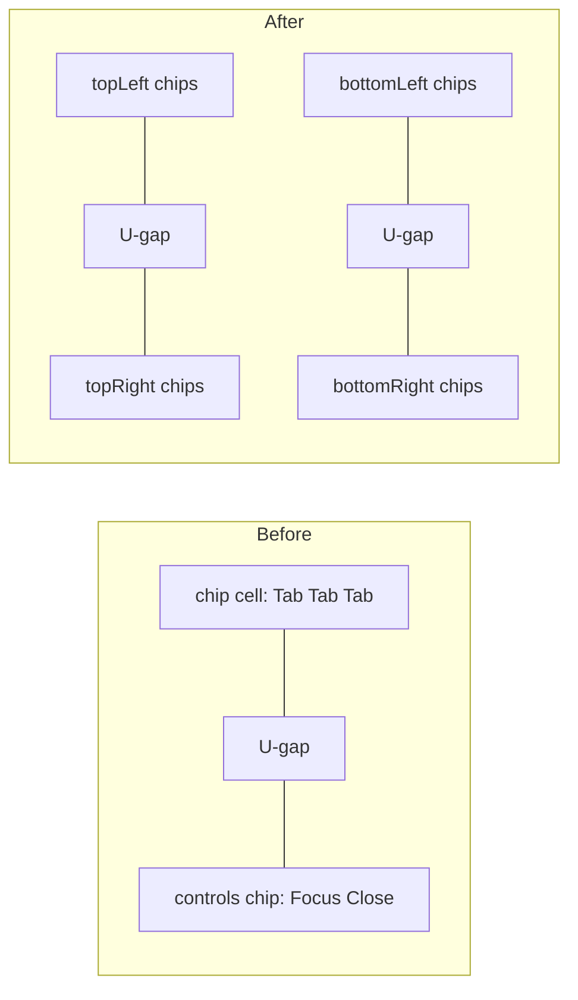

*Ticket: open `Corner Window Chips With Inline Actions` via repo MCP `ticket_open` against goal `R26-02/RUNNING-SKETCHPAD/RUNNING-SKETCHPAD-APPS` (the goal recent OS-shell tickets use). The `repo` MCP server is not currently connected — reconnect it before starting; all reports/logs go in the ticket folder.*

# Corner Window Chips With Inline Actions

## What changes conceptually

Today a stack's chrome is one row: a top-left chip cell holding all tabs, a transparent U-gap, and a top-right chip cell holding `Focus` + `Close` for the whole stack.

Each chip becomes `icon + name + [focus] [new window] [close] + drag handle`. Every window in a stack carries a `corner`; `activeId` stays a single field on the stack, so exactly one tab is active no matter which corner it sits in.

## Schema (single source of truth first)

Add an optional per-window corner, defaulting to `topLeft`, so the 350 plugin files that call `create_default_layout` / `.default_layout(...)` need no edits.

- [🧰️framework/🔨️modules/🖱️ui/📦️packages/🦀️rust/🎯️targets/🧊️wgpu/🦀️.rs](🧰️framework/🔨️modules/🖱️ui/📦️packages/🦀️rust/🎯️targets/🧊️wgpu/🦀️.rs) — new `WindowStackCorner` serde enum (`camelCase`, `Default = TopLeft`, `ts_rs`) and `WindowLayoutWindowNode.corner: Option<WindowStackCorner>` with `#[serde(default, skip_serializing_if = "Option::is_none")]`; thread it through `create_window_layout`, `create_stack_layout`, `create_default_layout`, `create_tab_stack_layout`, `even_window_layout`.
- [🧰️framework/🔨️modules/🛂️manifest/🟦️.ts](🧰️framework/🔨️modules/🛂️manifest/🟦️.ts) — mirror `WindowStackCorner` + `readonly corner?: WindowStackCorner` on the hand-refined `WindowLayoutWindowNode`.
- [🧰️framework/🔨️modules/🖱️ui/📦️packages/🟦️typescript/🎯️targets/⚛️react/📦️index.tsx](🧰️framework/🔨️modules/🖱️ui/📦️packages/🟦️typescript/🎯️targets/⚛️react/📦️index.tsx) — add `corner?: WindowStackCorner` to the runtime `WindowLayoutWindowNode`.
- [ShellHelpers/🟦️.tsx](🧰️framework/🛍️products/💻️os/🔨️modules/📺️renderer/🧑️‍🎨️engine/🧱️elements/ShellHelpers/🟦️.tsx) — carry `corner` through `collectFrameworkLayoutWindowSeeds` and `convertFrameworkLayoutNodeToModeLayout`, and include it in `windowLayoutSkeleton` so `classifyWindowLayoutChange` reports a corner move as `"rearrange"`.

## React chrome: four corner chip cells

[🧰️framework/🔨️modules/🖱️ui/📦️packages/🟦️typescript/🎯️targets/⚛️react/📦️index.tsx](🧰️framework/🔨️modules/🖱️ui/📦️packages/🟦️typescript/🎯️targets/⚛️react/📦️index.tsx) — `WindowChrome` keeps its `enlarge`/`close` right-cap controls, which panels, panes, `Window` and the introduction chrome all still use. Two small additions:

- make `titleChips` optional and render the top-left chip cell only when it has content (so a stack with no top-left tabs keeps a flat top-left edge);
- add `capRightChips`, rendered inside the existing controls cell ahead of `enlarge`/`close`, so the cell now appears when any of the three is present.

The footer already provides conditional bottom-left/bottom-right chip cells with a gap, so no new bottom plumbing is needed. The silhouette math needs no change at all — `windowSilhouetteEdgePoints` and `normalizeWindowSilhouetteChips` already handle N gapped chip spans per edge, and `measureWindowSilhouetteMetrics` already collects every `[data-window-silhouette-chip][data-dock=…]`.

## React dock: chips, actions, corners, drag

[🧰️framework/🔨️modules/🖱️ui/🧱️elements/🎨️Canvas/🟦️.tsx](🧰️framework/🔨️modules/🖱️ui/🧱️elements/🎨️Canvas/🟦️.tsx)

**Chip markup.** A chip can no longer be a `<button>` (nested buttons are invalid). Restructure to a wrapper `
` holding an inner `role="tab"` activate button (icon + name), then icon-only action buttons `mode-dock-tab-focus` / `mode-dock-tab-new-window` / `mode-dock-tab-close`, then the existing `DragHandle`. `role="tablist"` moves to each corner group; arrow/Home/End keyboard nav walks the activate buttons. `listModeDockTabElements` keeps working because it still queries `[data-slot="mode-dock-tab"]`.

**Actions.** Every chip gets all three; each acts on *its own* window, not the stack's active one — focus activates the window then toggles `toggleMaximize(stackPath)`, close calls `closeWindow(tab.id)`, new window calls a new `ModeProps.onWindowOpenInNewWindow`. On `mobile` only close renders. `ModeDockStack` stops passing `enlarge`/`close` and instead renders four `ModeDockTabBar` instances into `titleChips`, `capRightChips`, `footerLeftChips`, `footerRightChips`.

**Corner grouping.** Keep `stack.children` a single ordered list and derive groups by `corner` (default `topLeft`), which preserves insert indices and keeps `activeId` a single field. New helpers: `modeStackTabsByCorner`, `insertWindowAsTabAtCorner` (maps a corner-local index to a flat `children` index), and `setWindowCornerInLayout`.

**Drag between corners.** `ModeDropZone`'s tab variant gains `corner`; `ModeStackDropTargets` becomes per-corner tab-bar rects plus the body rect; `registerStackDropTargets` takes a corner; `computeModeDropZone` hit-tests all four corner bars before falling back to body/root splits; `applyModeDrop`'s tab branch sets the corner and inserts at the corner-local index. `ModeTabInsertPreview` and `modeDockTabsWithInsertPreview` gain `corner` so the ghost tab lands in the right group. An empty corner has no rect, so while a drag is active each empty corner renders a small `mode-dock-corner-drop-pad` inside its chip cell — the cutout opening up is the drop affordance.

## Tooltips with hotkeys

- [📚️I18n/🟦️.tsx](🧰️framework/🔨️modules/🖱️ui/🧱️elements/📚️I18n/🟦️.tsx) + the `de`/`en` `uiChromeTranslationBundles`: reuse `ui.common.close` / `focus` / `unfocus` / `newWindow`; add `ui.common.dockCorner*` labels only if the drop pads need visible names.
- [⌨️control-keybinding-context/🟦️.tsx](🧰️framework/🔨️modules/🖱️ui/🔨️modules/⌨️control-keybinding-context/🟦️.tsx): add `"ui.window.close": "mod+shift+w"`, `"ui.window.focus": "mod+shift+enter"`, `"ui.window.newWindow": "mod+shift+n"` to `SHELL_KEYBINDINGS`, and make `useControlHotkey` also fall back to `SHELL_KEYBINDINGS[resolveControlLabelId(id)]` so hierarchical element ids resolve outside a provider.
- [🚗️UiDriver/🟦️.tsx](🧰️framework/🔨️modules/🖱️ui/🧱️elements/🚗️UiDriver/🟦️.tsx): extend `resolveControlLabelId` with `framework.modeDock.*.close|focus|newWindow` → `ui.window.*`, following the existing `ui.ribbon.group.*` → `ui.ribbon.parent.*` pattern.
- Wrap each chip action button in `ChromeControlHint`, which yields `Close (⇧⌘W)` via `useControlTooltipText` → `formatControlTooltipText`. Bind the three chords in `Mode` with `useActionHotkey` against `activeWindowId` so an advertised hotkey actually works.

## Shell wiring

[ShellHost/🟦️.tsx](🧰️framework/🛍️products/💻️os/🔨️modules/📺️renderer/🧑️‍🎨️engine/🧱️elements/ShellHost/🟦️.tsx) — pass `onWindowOpenInNewWindow`, implemented on the existing extra-instance machinery: mint a new `ExtraWindowInstance` for the window's kind via `SET_EXTRA_WINDOW_INSTANCES` / `extraWindowCounterRef`, split it into a new stack beside the source, and note a `shell.windowOpenInNewWindow` command. There is no native multi-window path in the shell today, so "New Window" means a second live instance of that window kind in its own stack.

## wgpu renderer

[Dock/🧊️component.rs](🧰️framework/🛍️products/💻️os/🔨️modules/📺️renderer/🧑️‍🎨️engine/🧱️elements/Dock/🧊️component.rs) — `DockNode::Stack` carries per-tab corners (`windows: Vec<DockStackTab { window_id, corner }>`, `active` unchanged), which ripples through `insert_tab(s)`, `remove_window`, `reorder_tab`, `apply_drop`, `to_window_layout`, `apply_layout_diff`, `stack_windows_at_path`. `render_stack` paints four corner chip groups with per-tab inline action buttons instead of `render_cap_action_group`'s single controls chip; `layout_stack_cap` returns four span groups and `WindowSilhouette::from_measured_top` generalizes to `from_measured_edges(bounds, top_spans, bottom_spans, depth)` (`WindowSilhouetteEdge`/`Span` are already N-span). Hit targets become `dock.tab.{path}.{window}.close|focus|new`; drop `dock.focus.{path}` / `dock.close.{path}` and update `shell_command_for_control` plus the pointer handlers in [Shell/🧊️component.rs](🧰️framework/🛍️products/💻️os/🔨️modules/📺️renderer/🧑️‍🎨️engine/🧱️elements/Shell/🧊️component.rs). `compute_dock_drop_zone` gains per-corner tab bars, fed by `dock_tab_bars_for_drop`.

## TUI renderer

[⌨️tui/🦀️.rs](🧰️framework/🔨️modules/🖱️ui/⌨️tui/🦀️.rs) + [🪟️Window/⌨️component.rs](🧰️framework/🔨️modules/🖱️ui/🧱️elements/🪟️Window/⌨️component.rs) — `WindowState.stack_tabs` becomes corner-aware; `WindowChipLayout` returns four corner chip groups (each a `WindowTab` box with per-tab glyph offsets `⤢ ⧉ ✕`) instead of `title` + `controls` + a flat tab strip. `paint_window` paints two top and two bottom corner tab boxes bending into the body edges; `window_hit` resolves per-tab glyph offsets per corner. `window_chip_layout` must stay the single source of truth for both paint and hit-test, and `window_control_at` folds into `window_hit`.

## Validation

- React vitest in the `⚛️react` package `📦️index.tsx` suite: corner round-trip through `applyModeDrop`, `computeModeDropZone` returning a corner, one-active-tab-per-stack across corners, silhouette metrics for a rendered stack with two top and two bottom chip cells, chip actions firing their callbacks, and tooltips containing the formatted hotkey.
- `resolveFrameworkLayoutSeed` / `classifyWindowLayoutChange` corner tests in the renderer's [🧪️index.test.ts](🧰️framework/🛍️products/💻️os/🔨️modules/📺️renderer/🧑️‍🎨️engine/📦️packages/🟦️typescript/🎯️targets/⚛️react/🧪️index.test.ts).
- Rust: Dock `apply_drop` corner moves, layout round-trip, hit-id and silhouette-span tests; TUI exact-shape paint tests and per-glyph hit tests (the existing `window_chrome_recesses_tabs_into_the_top_corners…` assertions will need rewriting).
- Update [⚙️Mode.stories.tsx](.storybook/stories/ui/⚙️Mode.stories.tsx) (it asserts chip counts), [.storybook/ui-new-stories.spec.ts](.storybook/ui-new-stories.spec.ts), and re-run the styling suite [🎨️styling/📦️packages/🟦️typescript/🧪️index.test.ts](🧰️framework/🔨️modules/🖱️ui/🎨️styling/📦️packages/🟦️typescript/🧪️index.test.ts).
- Register any new executable commands in `launch.json`; confirm runtime behaviour with `[DEBUG]`  logs before declaring anything working.

