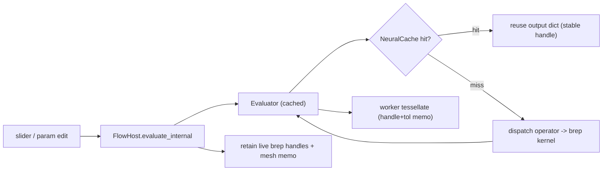

# Solid CAS Caching for Neural / Flow / Procedural

## Why this design

Branches are independent, so a node's full state is captured by `Hash(kind + merged_input)`, where `merged_input` already contains the resolved upstream outputs (collected via synapses in `collect_neuron_input`). That makes the hash naturally **Merkle**: changing an input on branch A changes A's node hashes and the merge node, while branch B's hashes stay identical and hit the cache. Because brep handles are deterministically reused from cache (the cached output dictionary carries the same handle string), stable handles propagate down untouched branches and tessellation memo hits too.

Procedural is a flow editor (`procedural/play/index.ts` drives the same `FlowHost`), so flow + procedural are both covered by the FlowHost work; no procedural-specific cache is needed.

## Phase 1 - Neural CAS cache (`neural/engine/lib.rs`)

- Add a `// #region 🔖Cache` with a thread-safe `NeuralCache`:
  - `pub struct NeuralCache { entries: Mutex<HashMap<u64, (u64 /*epoch*/, Dictionary)>>, epoch: AtomicU64 }` (Mutex/Atomic keep it `Send + Sync` for the rayon path; no external deps, per the no-direct-deps rule).
  - `begin_epoch()`, `get_or_insert_with(key, f)` (marks entry epoch = current), and `sweep()` (drops entries older than current epoch) for automatic bounding.
- Deterministic content hash: implement a small `fn node_hash(kind: &str, input: &Dictionary) -> u64` using `std::hash` with manual hashing of `Dictionary`/`Value`/`Atom` (BTreeMap order is stable; hash `f64` via `to_bits()`).
- Wire the cache into both evaluation paths, keyed by `node_hash(kind, merged_input)`:
  - Parallel `evaluate_channels_with` (`compute_jobs` -> `par_iter`): wrap each job with a cache lookup before `dispatch`.
  - Sequential `evaluate_channels_sequential_with`: same wrap before `dispatch`.
- Keep existing public methods (`evaluate`, `evaluate_with`, `evaluate_channels`) working by giving them an ephemeral `NeuralCache::new()` internally; add cache-taking variants `evaluate_channels_cached(...)` / `evaluate_channels_sequential_cached(...)` used by FlowHost.
- Extend the existing `// #region 🔖Tests` to assert a second evaluate with an unchanged branch does not re-invoke the dispatch closure (hit), and that changing one branch only recomputes that branch.

## Phase 2 - Persist cache in FlowHost (flow + procedural)

- In [flow/core/lib.rs](flow/core/lib.rs) `FlowHost`, add `neural_cache: NeuralCache`, initialized in `from_fixture`.
- `evaluate_internal` (currently rebuilds tree + seeds and runs the full evaluator every edit): call `self.neural_cache.begin_epoch()`, run the `*_cached` evaluator variants with `&self.neural_cache`, then `self.neural_cache.sweep()`. Self-invalidating (changed input -> new hash -> miss); sweep bounds memory to the current graph.
- Both the bridge path and the in-registry path in `evaluate_internal` use the cached variants.

## Phase 3 - Brep handle GC + tessellation memo (`flow/module/brep/lib.rs`, `geometry/brep/brepkit/lib.rs`)

- Add `BrepkitKernel::retain(&self, live: &HashSet<String>)` in [geometry/brep/brepkit/lib.rs](geometry/brep/brepkit/lib.rs) that removes `registry` entries whose handle is not live (reuses the existing `Entry`/`registry` map and `dispose` semantics).
- In [flow/module/brep/lib.rs](flow/module/brep/lib.rs):
  - Add `pub fn retain_geometry_handles(live: &[String])` -> locks `kernel()` and calls `retain`.
  - Add a mesh memo `static MESH_CACHE: OnceLock<Mutex<HashMap<(String, u64), String>>>` keyed by `(handle, tolerance.to_bits())`; check/fill it in `tessellate_geometry_json`. Evict entries for disposed handles inside `retain_geometry_handles` / `dispose_geometry` so memo invalidation is unified with handle GC.
- In `FlowHost::evaluate_internal` (after outputs are computed): collect all live geometry handles by recursively scanning `self.outputs` dictionaries for `$schema == "geometry"` -> `handle` (Rust mirror of `collectGeometryHandles` in [flow/worker.ts](flow/worker.ts)), then call `flow_module_brep::retain_geometry_handles(&live)`.
- Because both [flow/worker.ts](flow/worker.ts) (`tessellate` from `flow_core`) and [geometry/brep/js/tessellate.worker.ts](geometry/brep/js/tessellate.worker.ts) (`tessellate` from `flow_module_brep`) call into the same Rust `tessellate`, the Rust-side mesh memo serves both workers automatically; no JS-side cache needed.

## Phase 4 - Tests / validation

- Extend existing test regions only (no new test files): neural cache hit/miss tests in `neural/engine/lib.rs`; `BrepkitKernel::retain` + mesh-memo + `retain_geometry_handles` tests in the brep crates; a FlowHost test that re-evaluates after a single slider change and asserts only the dependent branch recomputes and orphaned handles are swept.
- Validation: `cargo test -p neural_engine -p flow_core -p flow_module_brep -p geometry_brep_brepkit`; run the existing procedural/flow vitest via nx. Confirm at runtime with a temporary `[DEBUG]` log of cache hit/miss + retained handle count while dragging a slider on a boolean-on-solids graph (unchanged branch logs hits; handle count stays bounded).

## Notes / out of scope

- The distributed/two-tier/speculative-prefetch ideas (Redis/S3, prefetch) target multi-machine build systems and do not apply to this single-process WASM worker; the in-process CAS cache + GC + mesh memo is the equivalent realistic win.
- All edits stay in existing files using regions/subregions; no new files, no migrations.
