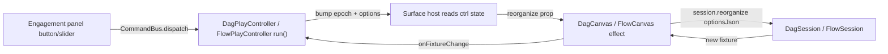

## DAG Reorganize Engagement (Left-to-Right Tree Layout)

### Context

- DAG layout already exists: `apply_dag_layout_to_fixture_v1_value()` runs a Buchheim tidy tree, currently mapping depth -> Y (top-to-bottom), sibling -> X. See [mathematical/graph/port/directed/dag/lib.rs](mathematical/graph/port/directed/dag/lib.rs) lines 115-257.
- "Engagement" is the floating command panel attached to a window kind (`WindowKindRuntime.engagement`), converted to UI via `windowEngagementToGolden()` and rendered as overlay chrome. DAG and Flow play currently set `engagement = undefined`, so no panel shows.
- The layout must run inside WASM (`DagSession` / `FlowSession`), which is owned by the React canvas, not the controller. So the engagement command must travel: engagement -> CommandBus -> controller state -> canvas prop -> WASM `reorganize()`.

### Command flow

### 1. Rust: orientation + reorganize (DAG)

In [mathematical/graph/port/directed/dag/lib.rs](mathematical/graph/port/directed/dag/lib.rs), `#region Layout`:

- Add `orientation: DagLayoutOrientation` (`LeftRight` | `TopBottom`) to `DagLayoutOptions`, defaulting to `LeftRight` (the requested tree direction). Keep `layer_spacing` (distance between depth layers) and `sibling_gap` (distance between siblings) as the spacing knobs.
- In `apply_dag_layout_to_fixture_v1_value`, when `LeftRight`, assign depth -> X (`by * layer_spacing`) and sibling -> Y (`bx * sibling_gap`); when `TopBottom`, keep current mapping. Adjust the centering offsets accordingly.
- Add `DagHost::reorganize(&mut self, opts: &DagLayoutOptions)`: serialize current fixture, run `apply_dag_layout_to_fixture_v1_value` with opts, deserialize back, then `rebuild_engine_with_layout(false)` (positions already set).
- In `#region WasmSession`, add `DagSession.reorganize(optionsJson: &str)` parsing `DagLayoutOptions` (defaults on empty/invalid) and calling `host.reorganize`.
- Extend `#region Tests` to assert left-to-right ordering (root min-X, leaf max-X) and that spacing options scale coordinates.

### 2. Rust: reorganize (Flow)

In [flow/core/lib.rs](flow/core/lib.rs):

- Add `FlowHost::reorganize(&mut self, opts_json: &str)`: build the dag fixture, run the DAG layout (`DagHost::from_fixture` path / `apply_dag_layout_to_fixture_v1_value`), then `sync_from_dag()` so `fixture.layout` is overwritten with the fresh positions (this is the key difference from `rebuild_dag`, which preserves saved layout). Re-evaluate not required.
- Add WASM `FlowSession.reorganize(optionsJson)` in the `#region WasmSession`.
- Extend Flow core tests to assert all widgets get repositioned left-to-right after reorganize even when `layout` was fully populated.

### 3. React canvases: reorganize trigger

- [mathematical/graph/port/directed/dag/react/index.tsx](mathematical/graph/port/directed/dag/react/index.tsx): add to `DagCanvasProps` a `reorganize?: { epoch: number; optionsJson: string }` and `onFixtureChange?: (json: string) => void`. Add a `useEffect` keyed on `reorganize?.epoch` that (when session exists and epoch > 0) calls `session.reorganize(optionsJson)`, `renderFrame()`, then `onFixtureChange?.(session.fixtureJson())`. Do NOT add these to the session-creation effect deps (avoid rebuilding the session).
- [flow/react/index.tsx](flow/react/index.tsx): add the same `reorganize` prop to `FlowCanvasProps`; in an epoch effect call `session.reorganize(optionsJson)`, then existing `evaluate()`, `persistFixture()`, `renderFrame()`.

### 4. Play controllers: engagement + state

- [mathematical/graph/port/directed/dag/play/index.ts](mathematical/graph/port/directed/dag/play/index.ts): give `DagPlayController` state `layerSpacing`, `siblingGap`, `orientation`, `engagementInput`, `reorganizeEpoch`, `reorganizeOptionsJson`. Add `windowEngagement()` building: required command `input` (submit "reorganize" / "lr" / "tb"), `possibleEngagements` for "Reorganize", "Left to Right", "Top to Bottom", and two slider `controls` for "Layer spacing" and "Sibling gap". Add `rebuildShellMode()` (set `mainMode.windowKinds[0].engagement`) called from constructor and after each change. Add `run(command, args)` handling `engagementInput`, `engagementSubmit`, `setSpacing`/control `onChange`, `setOrientation`, and `reorganize` (bumps epoch, rebuilds optionsJson, `emit()`). Add getters `getReorganize()` / `getReorganizeOptionsJson()` and `setFixtureJson` handling.
- [flow/play/index.ts](flow/play/index.ts): mirror the same on `FlowPlayController` (it already has a `run()` with `setFixtureJson`/`setPreviewText`/`setCatalogueSections`; extend it). Add the same engagement + reorganize state and getters.

### 5. Wire surface hosts to pass props

In [framework/product/playground/renderer/react/index.tsx](framework/product/playground/renderer/react/index.tsx):

- `DagPlayPaneSurfaceHost` (around line 6146): read `ctrl.getReorganize()` and pass `reorganize` + an `onFixtureChange` that calls `ctrl.run("setFixtureJson", { json })` into `<DagCanvas>`.
- `FlowPlayPaneSurfaceHost` (around line 6037): pass `reorganize={ctrl?.getReorganize()}` into the existing `<FlowCanvas>`.

No changes needed to `windowEngagementToGolden` / `windowKindsToGolden` (already generic). Engagement reactivity rides on the existing `shellDataGeneration` recompute (same mechanism presentation play uses).

### 6. Ticket + validation

- Start by reading `repo://goals` and opening a new ticket (e.g. "Reorganize DAG Nodes with Left-to-Right Tree Layout") via the repo MCP; place any temp logs/scripts under the ticket folder.
- Rebuild WASM for both crates (`bun ./script.ts wasm` in the dag crate and flow core, invoked by their `test` targets) and run vitest for `@dag/*` and `@flow/*`.
- Extend the existing runtime validators `validate-dag-runtime.mjs` and `validate-flow-runtime.mjs` in the `26/06/07` tickets (or the new ticket) to click the Reorganize engagement and assert nodes become left-to-right ordered. Confirm via the `[DEBUG]` fixture logs already emitted on the canvases.

### Decisions made (opinionated)

- Default orientation is Left-to-Right everywhere (greenfield, matches the requested tree direction); Top-to-Bottom remains available via the engagement toggle.
- Reorganize in Flow overwrites the persisted `layout` (auto-arrange is an explicit user action), unlike normal rebuilds which preserve manual positions.

