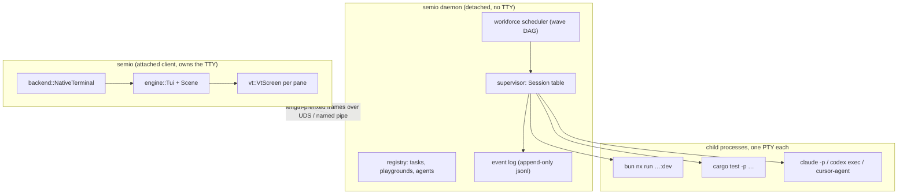

### Immediate cause of your error

`.vscode/launch.json:74` (and its source `.vscode/🧩️launch.seed.jsonc:74`) still point at `⌨️cli/⚡️implementations/🦀️rust/` — that folder was renamed to `📦️packages/🦀️rust/`. Three more stale `⚡️implementations` paths exist: `launch.json:1926`, `launch.json:1944` (both the Go MCP client), `launch.json:3556` (assets cwd), plus `.vscode/settings.json:30`. Working command today:

```bash
bun ./🧰️framework/🛍️products/🦑️repo/🔨️modules/⌨️cli/📦️packages/🦀️rust/📜️script.ts run
```

---

## What exists today

- `semio` (crate `semio-framework-repo-cli`) already opens a TUI when argv is empty: navbar + two windows (`dev`, `build`), a plugin catalog `Table`, a 500-line `Log`, and one `Session` per window that spawns `bun nx run …:dev|build` with **piped** stdout/stderr. Source: [📦️glue.rs](🧰️framework/🛍️products/🦑️repo/🔨️modules/⌨️cli/📦️packages/🦀️rust/📦️glue.rs) module `tui_dashboard`.
- The TUI stack is fully handcrafted (no ratatui/crossterm) in [🦀️.rs](🧰️framework/🔨️modules/🖱️ui/⌨️tui/🦀️.rs), organised in `#region` blocks: `Geometry, Theme, Text, Cell, Ansi, Event, Scene, Layout, Widget, Chrome, Engine, Backend, WasmHost, Tests`. It already has `CellBuffer` + damage `diff` + truecolor `emit_runs`, a `WindowLayout` with axis/stack/**tabs**, `WindowState` with close/maximize chips, and `NativeTerminal` raw-mode/alt-screen over `libc` + `windows-sys`.
- Gaps that block the goal: **no PTY**, **no VT/terminal emulator** (`ansi::AnsiParser` decodes *input* keys/mouse only), **no daemon/detach**, **no clipboard**, **no IPC** anywhere (only the unrelated `🌎️hub` axum WebSocket), **no task registry** beyond the playground catalog, **no agent spawning**.
- `bunx nx show projects` currently **fails**: `@semio-tech/infinite-world-r3f` is reported twice from an NFC vs NFD normalisation of the `🔨️modules` path segment on macOS. Any nx-graph-derived registry must fix this first.

## Target architecture

Same binary, three roles. The daemon owns processes so sessions survive the dashboard closing.



- **Commands** flow client to daemon (`Attach`, `Spawn`, `Input`, `Resize`, `Kill`, `Split`, `Move`, `RunWorkflow`).
- **Events** fan out daemon to every attached client (`SessionStarted`, `Output`, `Exited`, `LayoutChanged`, `TaskStateChanged`). Session lifecycle is event-sourced to disk; PTY bytes are ephemeral shared state kept in a bounded scrollback ring.
- No async runtime is added: the repo CLI stays blocking + threads, matching the handcrafted stack.

## Where the code lands

Everything extends existing files as new `#region` blocks; no new source files.

**[🦀️.rs](🧰️framework/🔨️modules/🖱️ui/⌨️tui/🦀️.rs)** — domain-neutral terminal capability:
- new region `Vt`: `VtScreen` (primary + alt `CellBuffer`, scrollback `VecDeque`, cursor, SGR, `DECSTBM` scroll region, modes, OSC title) and `VtParser` (ground/ESC/CSI/OSC/DCS machine covering printable+UTF-8+wide, CR/LF/BS/TAB, CUU/CUD/CUF/CUB/CUP, ED/EL, IL/DL/ICH/DCH/ECH, SU/SD, DECSTBM, full SGR incl. `38;2`/`48;2`, DECSET/DECRST 1049/25/7/1000/1002/1006/2004, DECSC/DECRC, RIS). Composites into the existing `CellBuffer`, so panes cost one blit.
- new region `Pty`, gated on `tui-terminal`: `Pty::spawn(cmd, args, env, cwd, size)` returning reader/writer/`resize`/`signal`/`wait`. Unix uses `libc::openpty` + `Command::pre_exec` (`setsid`, `TIOCSCTTY`, `dup2`); Windows uses ConPTY (`CreatePseudoConsole` + `PROC_THREAD_ATTRIBUTE_PSEUDOCONSOLE`), which needs `Win32_System_Pipes` and `Win32_Security` added to the existing `windows-sys` features in [Cargo.toml](🧰️framework/🔨️modules/🖱️ui/📦️packages/🦀️rust/Cargo.toml).
- extend `Widget`: `WidgetState::Terminal(TerminalState)` wrapping a `VtScreen` — scroll, search, selection, follow/pin, `on_key` passthrough.
- extend `Backend`: `Clipboard` trait; OSC 52 write through the attached terminal (survives SSH/devcontainer) with `pbcopy`/`clip.exe`/`wl-copy` fallback.
- extend `Layout`/`Chrome`: split/resize/move/zoom mutations on `WindowLayout`, tab strips per stack, per-window number badges.
- extend `Tests` with a VT conformance suite (cursor motion, wrap, scroll region, SGR, alt screen, resize) and a PTY round-trip test.

**[📦️glue.rs](🧰️framework/🛍️products/🦑️repo/🔨️modules/⌨️cli/📦️packages/🦀️rust/📦️glue.rs)** — repo-specific product:
- new region `Ipc`: `DashboardTransport` trait + Unix-socket and named-pipe impls, frames as `u32 len | u8 kind | payload` (control payloads via the existing `serde_json`, output payloads raw). Socket at `.🦑️repo/⚡️cache/🎛️dashboard/`.
- new region `Registry`: generated task catalog merging all 180 `📋️project.json` targets, root `📜️script.ts` verbs, the existing `load_playground_catalog`, and available agent runners. Emitted as `🤖️generated/🎛️dashboard.json` by the existing `@semio-tech/plugin-registry:generate` pipeline; the file-scan is the offline fallback for the broken nx graph.
- new region `Daemon`: supervisor + event log + `semio daemon start|stop|status|attach|detach`.
- new region `Workforce`: `WorkflowSpec` = waves of tasks with model, prompt, path-scope claim, verify command, retries; bounded-concurrency scheduler; overlapping scope claims serialise. A workflow lives as `🌊️workflow.json` **inside its ticket folder**, so the ticket mechanism stays the single source of truth.
- new region `AgentRunner`: adapters for `cursor-agent`, `claude -p`, `codex exec`, selected by PATH detection (`cursor-agent` is not installed on this machine; `claude` and `codex` are).
- rewrite `Tui` into the real dashboard: leader key `Ctrl-Space` (palette `p`, split `-`/`|`, zoom `z`, utilities `u`, detach `d`), always-live `Alt-1..9` window jump and `Alt-h/j/k/l` directional focus, everything else passed through to the focused PTY. Per-window utilities: copy last output / selection / full scrollback, save scrollback into the active ticket folder, search, restart, stop, clear, toggle follow.
- Window kinds: `Task`, `Shell`, `Agent`, and internal views (`Catalog`, `Workforce board`, `Event log`, `Help`).

**[📜️script.ts](🧰️framework/🛍️products/🦑️repo/🔨️modules/⌨️cli/📦️packages/🦀️rust/📜️script.ts)** and [📋️project.json](🧰️framework/🛍️products/🦑️repo/🔨️modules/⌨️cli/📦️packages/🦀️rust/📋️project.json): add `daemon` and `workflow` commands. `.vscode/🧩️launch.seed.jsonc` keeps its existing entries (your choice) with the four stale paths fixed, and gains dashboard/daemon/workflow entries in the existing `3_dev` group.

## Execution: parallel agent workforce

Six waves. Only `cursor-grok-4.5-high` (deep/systemic work) and `composer-2.5` (mechanical/wide work) are used; no fast variants. Agents within a wave run in parallel on disjoint file scopes; each wave ends with a verification gate before the next starts.

- **W0 (composer-2.5, 1 agent)** — unblock: fix the four `⚡️implementations` paths in the seed, regenerate `launch.json`, fix `settings.json:30`, and fix the NFC/NFD duplicate that breaks `bunx nx show projects`.
- **W1 (cursor-grok-4.5-high, 2 agents)** — `Vt` region + VT conformance tests (agent A); `Pty` region + `windows-sys` features + spawn/resize/wait tests (agent B). Disjoint regions of the same file, so they land sequentially in one file but are authored in parallel.
- **W2 (cursor-grok-4.5-high, 1 agent; composer-2.5, 1 agent)** — `TerminalState` widget + layout split/resize/move/zoom + tab strips (grok); `Clipboard` trait with OSC 52 and native fallbacks (composer).
- **W3 (cursor-grok-4.5-high, 2 agents)** — `Ipc` + `Daemon` regions, event log, attach/detach lifecycle (agent A); dashboard client rewrite with leader keys, palette, utilities menu (agent B).
- **W4 (composer-2.5, 2 agents)** — `Registry` generation wired into `@semio-tech/plugin-registry:generate` (agent A); `📜️script.ts`/`📋️project.json`/launch seed entries and docs (agent B).
- **W5 (cursor-grok-4.5-high, 2 agents)** — `Workforce` scheduler + scope claims + `🌊️workflow.json` schema (agent A); `AgentRunner` adapters + workforce board window (agent B).

## Verification

Each wave must show real output, not assertions: `cargo test -p semio-framework-ui`, `cargo test -p semio-framework-repo-cli`, a scripted PTY smoke run of `semio` capturing frames, `semio daemon start` then kill the client and re-`attach` to prove survival, and a two-task workflow executed end to end with both models.

## Notes

- The repo MCP server is **not** reachable from this session (only `cursor-app-control` is registered), so ticket open/close must go through the Go client CLI or be re-checked when implementation starts. Best-fit goal: `AI-OPTIMIZED-REPO/REPO-CLIENT/REPO-BINARY/REPO-CLI`.
- Your prompts file says the repo CLI stays Go while the dashboard is Rust; you chose Rust-owns-everything, so the Go `client` keeps tickets/hooks/MCP and the Rust dashboard shells out to it rather than duplicating it.