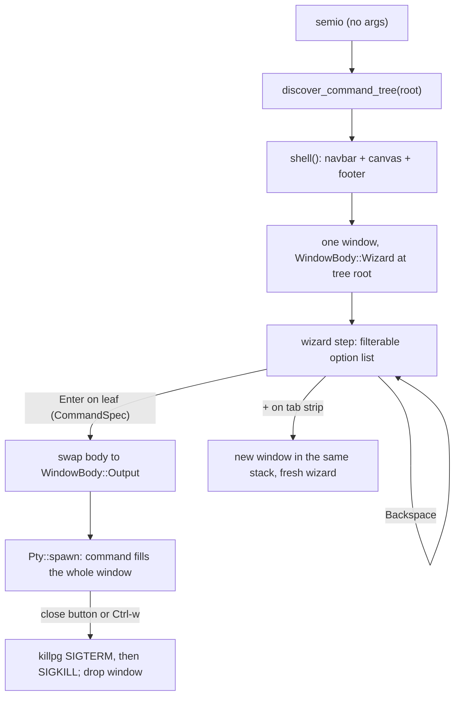

## Goal

`semio` (no args) becomes the single interactive entry point for every runnable thing in the repo. It is a tiling window manager where each window is either a wizard (building a command by walking a runtime-discovered taxonomy tree) or a live PTY showing that command's output.

Per the answered questions: the command tree is discovered live in Rust on each start (no generated manifest), and `.vscode/launch.json` plus `🧩️launch.seed.jsonc` stay untouched in this ticket.

## Current state (what is wrong)

- `tui_dashboard` in [glue.rs](🧰️framework/🛍️products/🦑️repo/🔨️modules/⌨️cli/📦️packages/🦀️rust/📦️glue.rs) hardcodes exactly two windows (`even_window_layout(&["dev","build"])`, L1051) each with a fixed catalog `Table` + `Terminal` split. No wizard, no product/instance/artifact axes.
- `WidgetSignal::WindowClose` / `WindowMaximize` are produced by `chrome::window_control_at` and returned by `Tui::dispatch`, but the dashboard **throws the returned signals away** (L1115-1137) — clicking `✕` or `⤢` does nothing.
- `Ctrl-Space z` / `-` / `|` mutate `layout` but nothing ever re-applies it to the scene, so zoom and split are silent no-ops.
- `engine::Tui::dispatch` sets `self.focus = Some(id)` for *any* hit node including non-focusable window chrome (L3248), so a click on the titlebar leaves focus on chrome and subsequent arrow keys behave unpredictably.
- `x` kills only the piped `bun nx` child (`Session::stop`, L900) and `ClientMsg::Kill` uses `focused_window` while spawn used `{kind}-pty` — the id never matches. `Pty::kill` is `child.kill()` (SIGKILL to the session leader only), so `bun`/`nx`/`vite` grandchildren survive.
- Stack tabs are painted only when `stack_tabs.len() > 1` ([Window/⌨️component.rs](🧰️framework/🔨️modules/🖱️ui/🧱️elements/🪟️Window/⌨️component.rs) L95) and are not clickable at all; there is no `+`.

## Target flow




## Framework changes (`🧰️framework/🔨️modules/🖱️ui`)

All in [⌨️tui/🦀️component.rs](🧰️framework/🔨️modules/🖱️ui/⌨️tui/🦀️component.rs) plus element files.

1. `scene` mod: add `Scene::reparent(&mut self, id: NodeId, new_parent: NodeId)` (retarget the child vecs, set `parent`, mark both dirty). Needed so window nodes — and their retained `TerminalState` scrollback — survive layout remounts.
2. `chrome` mod: replace `Shell::apply_layout` (which sets `Cells(w)`/`Cells(h)` on a flat child list and is wrong for nested tiling) with

```rust
pub fn mount_window_layout(scene: &mut Scene, canvas: NodeId, layout: &WindowLayout, windows: &mut Vec<(String, NodeId)>)
```

   It mirrors the `WindowLayout` tree into nested `NodeContent::Box` nodes (`Direction::Row`/`Column` with `Dimension::Weight` from each node's `size`), makes each stack a `Direction::Stack` box, reparents the existing window chrome node for each `WindowLayoutWindowNode` into its stack, and sets `visible` only on the stack's active tab. Honours `layout.zoomed` by mounting just that window. This reuses `layout::solve` unchanged.
3. `WidgetSignal` gains `WindowNewTab` and `WindowTabActivated(usize)`; `window_control_at` becomes `window_hit(&self, rect, pos) -> Option<WidgetSignal>` covering close, maximize, tab activation and `+`.
4. `window_chip_layout` gains the tab-strip geometry (per-tab x ranges plus the `+` cell on the body's top hairline) so paint and hit-testing share one source of truth, as the existing doc comment on that fn demands.
5. [Window/⌨️component.rs](🧰️framework/🔨️modules/🖱️ui/🧱️elements/🪟️Window/⌨️component.rs): render the strip whenever `stack_tabs.len() >= 1` and always append a `+` to the right of the last tab.
6. `engine::Tui::dispatch`: on mouse down, walk up from the hit node to the nearest focusable widget for focus (never park focus on chrome), while still emitting the chrome signal.
7. New element `🧱️elements/🧙️Wizard/⌨️component.rs` + `WidgetState::Wizard(WizardState)` in `widget`. Domain-neutral: `steps: Vec<(String,String)>` breadcrumb, `options: Vec<String>`, `selected`, `offset`, `filter`. Keys: `↑/↓`/`j/k` move, printable chars filter, `Backspace` pops filter then emits `NavigateBack`, `Enter` emits `Activated(index_into_unfiltered_options)`, `Esc` clears the filter. Add `WidgetSignal::NavigateBack`.
8. `pty` mod: expose `Pty::pid()` and change `kill()` to terminate the whole process group — `killpg(pid, SIGTERM)`, poll `try_wait` for ~1.5s, then `killpg(pid, SIGKILL)`. The child already calls `setsid()` (L3863) so it leads its own group; this is what makes `✕` actually stop `bun nx`/`vite`. Mirror with `TerminateJobObject` on the Windows `ConPTY` path.

## Repo product changes (`🧰️framework/🛍️products/🦑️repo`)

`glue.rs` is already a ~1500-line godfile; the new logic goes into two new commands rather than growing it.

1. New `🎮️commands/🧭️command-tree-discovery/🦀️component.rs`:

```rust
pub struct CommandSpec { pub cmd: String, pub args: Vec<String>, pub cwd: PathBuf, pub env: Vec<(String, String)> }
pub struct CommandNode { pub key: String, pub label: String, pub children: Vec<CommandNode>, pub spec: Option<CommandSpec> }
pub fn discover(root: &Path) -> CommandNode
```

   Pure filesystem walk, no `bun`, no generated manifest:

- Every `📋️project.json` yields `{ name, targets }`; each target becomes a leaf `bun nx run <name>:<target>` inserted at trie path `[target, ...taxonomy_segments(dir)]`.
- `taxonomy_segments` strips the leading emoji from each meaningful path component and drops container dirs (`🛍️products`, `🔨️modules`, `📦️packages`, `🔌️plugins`, `🗿️artifacts`, ...), so `🧰️framework/🛍️products/💻️os/🔨️modules/🌊️flow/📦️packages/🦀️rust` becomes `["framework","os","flow","rust"]` and `✏️s/🔌️plugins/🌊️flow/...` becomes `["s","flow",...]`. The original emoji name is kept as the display `label`.
- Artifact facets extend a plugin branch by walking `<owner>/🗿️artifacts/*/🏅️standards/🔖️*/🪆️subsets/*`, forwarding the narrowed selection as extra args to the owning package target.
- The existing `catalog::load_playground_catalog` + `env_contract::build_dev_env` feed the `dev` branch with plugin, variant and renderer (`react` / `wgpu-wasm` / `wgpu-native`) levels, reusing today's `@semio-tech/framework-os-dev:dev` invocation.
- Verb ordering is fixed at the first level: `dev`, `build`, `test`, `verify`, `gate`, `lint`, `format`, `generate`, `publish`, then the remainder alphabetically — this is what makes the first wizard question read "dev, build, test, publish, ...".

1. New `🎮️commands/🎛️terminal-dashboard/🦀️component.rs`: the dashboard app itself.
  - `struct DashboardWindow { id: String, node: NodeId, body: WindowBody, title: String }` with `enum WindowBody { Wizard { node: NodeId, cursor: Vec<usize> }, Output { node: NodeId, session: Option<PtySession> } }`.
    - Boots `create_default_layout(&["w1".into()], "row", None, None)` — **one** window — whose body is a wizard at the tree root.
    - Leaf activation removes the wizard node and adds a `Terminal` node with `Dimension::Weight(1)` as the window's only child, then spawns the `CommandSpec` through `pty::Pty` sized to that window's inner rect; PTY bytes are fed into `TerminalState` and PTY resize follows window resize.
    - Handles the chrome signals: `WindowClose` terminates the session's process group and drops the window from the layout (quitting cleanly when it was the last one), `WindowMaximize` toggles `zoom_window` and remounts, `WindowNewTab` appends a fresh wizard window to that stack, `WindowTabActivated` calls `activate_stack_tab`.
    - Every layout mutation (split, zoom, close, new tab) is followed by `mount_window_layout` so it is actually visible.
    - Keys are scoped: `↑/↓/←/→` and `j/k/h/l` go to the focused window's body only; window management lives on the `Ctrl-Space` leader (`z` zoom, `-`/`|` split, `x` close, `t` terminal passthrough, `n` new tab) plus `Ctrl-w` close; `Alt+<n>`/`Tab` switch windows. Footer hints are rebuilt from the active window's mode.
    - On quit, all sessions are group-terminated and the terminal is restored via `term.leave()`.
2. `glue.rs`: delete the `tui_dashboard` mod, add `#[path]` module declarations for the two new commands, and point `run()`'s no-args branch at `terminal_dashboard::run(&root)`. `terminal_dashboard_daemon`'s `attach` also routes there. Keep `ipc`, `daemon`, `catalog`, `env_contract` as-is.
3. Add both new commands to [🎮️commands/🔣️component.json](🧰️framework/🛍️products/🦑️repo/🎮️commands/🔣️component.json) following the existing member shape, and extend [🧭️cli-usage-presentation](🧰️framework/🛍️products/🦑️repo/🎮️commands/🧭️cli-usage-presentation/🦀️component.rs) usage text.

## Verification

- Unit tests in `⌨️tui/🦀️component.rs` next to the existing `window_control_clicks_resolve_to_close_and_maximize_signals` (L4562): `+` and tab hit-testing, `mount_window_layout` nesting and reparent-preserves-widget-state, wizard key handling, and frame assertions via `Tui::frame()`.
- Tests for `discover` against a temporary fixture tree (taxonomy segment derivation, verb ordering, leaf `CommandSpec` shape).
- Runtime check per AGENTS.md: run the real binary, drive the wizard to a `dev` leaf, confirm with `[DEBUG]` logs plus `ps` that the `bun nx` process group exists, then click `✕` and confirm the group is gone. Logs and captures go into the ticket folder.

## Ticket

The repo MCP server is not currently connected in this session, so `repo://goals` and `ticket_open` are unavailable. Step one of implementation is to enable it, read `repo://goals`, and open (or reopen) the ticket that all logs, captures and reports will be written into.