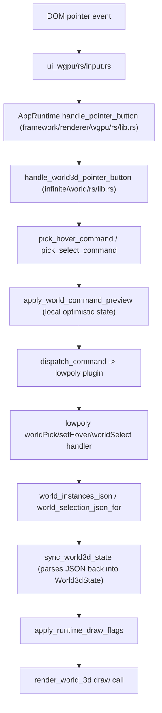

## Why another round of blind fixes is not the right move

The user has now reported "still no hover or selection" four times despite three rounds of code changes (wire-format fixes, click-vs-drag/marquee fixes, and an `apply_world_command_preview` optimistic-state fix), all of which passed `cargo test`/`vitest`. Per the repo rule, I must not claim something works without confirming runtime behaviour with console logs — that step has never actually been done for this feature. I verified with the live dev server (`bun run dev:lowpoly` on `http://127.0.0.1:6178/`, confirmed via the terminal log and `ps`) that:

- WebGPU is fully supported and the canvas does render the lowpoly mesh.
- There is currently **zero** runtime console output anywhere in the interaction path — no `[DEBUG]` logs exist today in `handle_world3d_pointer_button`, `pick_hover_command`, `pick_select_command`, `apply_world_command_preview`, `sync_world3d_state`, or the lowpoly plugin's command handlers.
- Clicking on the mesh via automated pointer events produced an ambiguous, inconclusive visual change (could be a real selection highlight, or just initial shader/load settling) — screenshots alone cannot distinguish this.

I also found one concrete, plausible architectural bug while reading the code (not yet verified at runtime):

```1200:1223:infinite/world/rs/lib.rs
fn apply_runtime_draw_flags(state: &mut World3dState) {
    let mut index_map = HashMap::new();
    let mut index = 0u32;
    for draw in &state.draws {
        for instance in &draw.instances {
            index_map.insert(instance.id.clone(), index);
            index += 1;
        }
    }
    for draw in &mut state.draws {
        for instance in &mut draw.instances {
            instance.hovered = state.local_hover_id.as_deref() == Some(instance.id.as_str())
                || state.hovered_component_object_id.as_deref() == Some(instance.id.as_str());
            let mesh_selected = state.granularity == "mesh"
                && index_map.get(&instance.id).is_some_and(|object_index| {
                    state
                        .component_ids
                        .iter()
                        .any(|id| id == &object_index.to_string())
                });
            instance.selected = state.selected_ids.iter().any(|id| id == &instance.id) || mesh_selected;
        }
    }
}
```

This runs on **every** frame after `sync_world3d_state` and unconditionally recomputes `instance.selected`/`instance.hovered`, discarding whatever `sync_world3d_state` just parsed from the plugin's authoritative `instances_json` (`world_instances_json` in `lowpoly/plugin/rs/lib.rs`, which already computes the same flags correctly, including `fixture.selection.mode == "mesh"` object-index matching). Its own `index_map` is built by flattening `state.draws` (grouped **by mesh key**, see `grouped.entry(mesh_id).or_default().push(...)` around line 1173), which is not guaranteed to match the plugin's `fixture.objects.iter().enumerate()` ordering whenever more than one distinct mesh is present. This is real duplicated/divergent logic and should be removed or corrected, but I cannot yet prove it's *the* cause of a total failure (it wouldn't explain vertex/edge/face component overlays failing, since those go through a separate code path, `append_component_overlays`, driven directly by `state.hovered_component_id`/`state.component_ids`).

## Plan: instrument, observe, then fix




I will add temporary `[DEBUG]`  prefixed `web_sys::console::log_1` calls (WGPU/infinite-world side) and equivalent plugin-side logging at each numbered node above, rebuild the wasm, then drive the already-confirmed-working browser automation (Cursor's browser MCP: navigate to `http://127.0.0.1:6178/`, inject a persistent `Page.addScriptToEvaluateOnNewDocument` console-capture shim, then use `browser_mouse_click_xy`) against the live lowpoly scene to capture real evidence for:

1. Hovering/clicking a vertex, an edge, a face, and the whole mesh (each granularity toggle).
2. Confirming whether `handle_world3d_pointer_button`/`pick_hover_command` even fire, what command they produce, whether `apply_world_command_preview` mutates state as expected, whether the plugin handler receives and processes the command, and what `world_instances_json`/`world_selection_json_for` emit back.
3. Confirming whether `apply_runtime_draw_flags` ends up agreeing or disagreeing with the plugin-provided flags.

## Fixes to apply once root cause(s) are confirmed

- Remove or correct `apply_runtime_draw_flags`'s independent index/flag recomputation in [infinite/world/rs/lib.rs](infinite/world/rs/lib.rs) — most likely fix is to stop fully replacing `instance.selected`/`instance.hovered` and instead only OR in the local optimistic overrides on top of what `sync_world3d_state` already parsed from the plugin JSON, removing the divergent index-map entirely.
- Fix whatever the instrumentation reveals as the actual blocker (e.g. pointer events not reaching the world3d handler, `controller_id` mismatch preventing `apply_world_command_preview`/dispatch from targeting the right `World3dState`, a guard/early-return silently no-op'ing, or `state.granularity` not matching the plugin's default `fixture.selection.mode` on first frame).
- Apply the equivalent verified fix to the React renderer path in [framework/renderer/react/components/world-3d-host.tsx](framework/renderer/react/components/world-3d-host.tsx), verified the same way against the React dev server for this plugin.
- Remove all temporary `[DEBUG]` instrumentation once behavior is confirmed correct via console evidence and screenshots.

## Verification

- `cargo test` for `infinite_world` and `lowpoly-plugin`, `vitest` for the React renderer.
- Rebuild the WGPU wasm module and manually verify in the live browser (screenshots + console evidence) that hovering and selecting each of vertex/edge/face/mesh produces the correct overlay/highlight, that the "Show Edges" toggle works, and that clicking empty space clears selection — for both the WGPU and React renderers.

