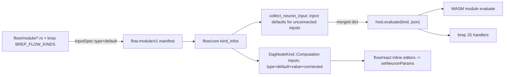

## Context

- Neuron kinds today declare inputs as bare port-name strings (`inputs: Vec<String>`) in [`neural/engine/lib.rs`](neural/engine/lib.rs); there is no per-input type or default, no native boolean (logic uses `0/1` numbers), and defaults are scattered as `unwrap_or(...)` in Rust handlers and `parseNumber(input.x, fallback)` in brep JS handlers ([`procedural/react/index.tsx`](procedural/react/index.tsx) lines 413+).
- Evaluation runs topologically in the Rust WASM core (`session.evaluate()` in [`flow/core/lib.rs`](flow/core/lib.rs)), which calls back into JS `host.evaluate(kind, inputJson)` per neuron. `collect_neuron_input` (in [`neural/engine/lib.rs`](neural/engine/lib.rs)) builds each neuron's input dict and already receives `kind_info`. The core holds all kind infos (incl. brep) via `set_neuron_kind_infos_json`.
- Therefore one default-injection point in Rust `collect_neuron_input` covers BOTH flow WASM modules and brep JS handlers.

## Data flow

## Design

- New `InputSpec { id, type, default?, label? }` replaces input strings. `type` is a free-form string tag (`number`, `integer`, `text`, `boolean`, `list`, `dictionary`, `value`, plus domain tags like `geometry`/`point`/`vector` used by brep) so the engine stays technology-agnostic. `default` is an optional `Value`.
- Add `Atom::Boolean(bool)` (first untagged serde variant so JSON `true`/`false` deserialize correctly; `1` still matches `Integer`) + `as_bool()`.
- Defaults are injected in `collect_neuron_input`: for each declared input with a `default`, if the key is absent after wiring synapses, insert the default. Inline `neuron.params` still override (existing `input.merge(&neuron.params)`).
- UI surfacing: computation nodes render inline editors (number field / text field / boolean checkbox) for unconnected primitive inputs, writing to `neuron.params` via the existing `setNeuronParams` op.

## Key edits

- [`neural/engine/lib.rs`](neural/engine/lib.rs): add `Atom::Boolean`, `InputSpec` + builder ctors, change `NeuronKindInfo.inputs` to `Vec<InputSpec>`, inject defaults in `collect_neuron_input`, update `variadic`/`"*"` handling and tests.
- [`flow/module/wasm/lib.rs`](flow/module/wasm/lib.rs): no schema change needed (serde serializes `InputSpec`); fix the `test.echo` fixtures to new input shape.
- [`flow/module/math/lib.rs`](flow/module/math/lib.rs), [`list/lib.rs`](flow/module/list/lib.rs), [`text/lib.rs`](flow/module/text/lib.rs), [`logic/lib.rs`](flow/module/logic/lib.rs), [`dictionary/lib.rs`](flow/module/dictionary/lib.rs): convert every registration to typed `InputSpec` with sensible defaults; simplify `evaluate` to rely on injected defaults; add new options. Canonical example in `list.get`: `index` default `0` and a new `wrap: boolean` default `false` (wrap-around + negative indexing when true).
- [`flow/core/lib.rs`](flow/core/lib.rs): `default_neuron_input_ports` / `neuron_io_layout` read `spec.id`; extend the computation node to carry per-input `type` + `default` + current param `value` + `connected` flag.
- [`mathematical/graph/port/directed/dag/lib.rs`](mathematical/graph/port/directed/dag/lib.rs): extend `IoPortSpec` (or `Computation.inputs`) with optional `value_type`, `default`, `value`, `connected`; adjust node height for inline fields.
- [`flow/react/index.tsx`](flow/react/index.tsx): change `FlowModuleNeuronKind.inputs` to `readonly InputSpecV1[]`, add `InputSpecV1` interface, render inline default editors dispatching `setNeuronParams`, fix manifest fixtures/tests using `inputs: [...]`.
- [`procedural/react/index.tsx`](procedural/react/index.tsx): widen `brepKind` to accept typed inputs with defaults; convert all ~106 `BREP_FLOW_KINDS` to declare input `type` + `default` (moving the literals currently in handlers into the manifest as the single source of truth); refactor `BREP_EVAL_HANDLERS` to read injected values (drop duplicated fallbacks) and add sensible new options; extend the in-file tests.

## Tests / validation

- `cargo test` for `neural/engine`, the five flow modules, and `flow/core` (incl. wasm-target build of modules).
- `nx`/`bun` vitest for `flow/react` and `procedural/react`.
- Runtime check via the procedural/flow `play` harness with `[DEBUG]` logs confirming an unconnected `list.get` returns index 0 and `wrap=true` wraps an out-of-range index.

## Process

- Open a new repo-mcp ticket (after reading `repo://goals`) for this work before editing; keep any temp logs/scripts inside the ticket folder. Structure all new code with regions/subregions in the existing files.
